# 开发者指南

<cite>
**本文档引用的文件**
- [category_config.py](file://category_config.py)
- [assets/categories/nutrition/config.json](file://assets/categories/nutrition/config.json)
- [assets/categories/singing/config.json](file://assets/categories/singing/config.json)
- [assets/categories/nutrition/generate_prompt.md](file://assets/categories/nutrition/generate_prompt.md)
- [assets/categories/singing/generate_prompt.md](file://assets/categories/singing/generate_prompt.md)
- [analyze.py](file://analyze.py)
- [generate.py](file://generate.py)
- [generate_image.py](file://generate_image.py)
- [transcribe.py](file://transcribe.py)
- [run.sh](file://run.sh)
- [requirements.txt](file://requirements.txt)
- [config.env](file://config.env)
- [README.md](file://README.md)
</cite>

## 更新摘要
**变更内容**
- 新增多类别架构支持，包括营养健康和唱歌两个品类的完整配置体系
- 新增category_config.py模块，提供品类感知的路径解析和配置加载功能
- 更新配置管理最佳实践，支持环境变量驱动的动态品类切换
- 新增营养健康类别的专用提示词模板和设计指导
- 扩展资产管理系统，支持品类特定的资源文件组织

## 目录
1. [简介](#简介)
2. [项目结构](#项目结构)
3. [核心组件](#核心组件)
4. [架构概览](#架构概览)
5. [详细组件分析](#详细组件分析)
6. [多类别架构](#多类别架构)
7. [配置管理最佳实践](#配置管理最佳实践)
8. [依赖关系分析](#依赖关系分析)
9. [性能考虑](#性能考虑)
10. [故障排除指南](#故障排除指南)
11. [测试策略](#测试策略)
12. [代码规范](#代码规范)
13. [版本管理指南](#版本管理指南)
14. [贡献指南](#贡献指南)
15. [结论](#结论)

## 简介

这是一个基于多模态AI的落地页设计方案生成系统，现已支持多类别架构。该系统能够自动分析视频广告素材，提取关键信息并生成高质量的落地页Hero区域设计方案。系统采用端到端的工作流，从视频处理到最终设计方案输出，涵盖了现代AI驱动的创意工作流程的完整链路。

**更新** 新增多类别架构支持，包括营养健康和唱歌两个品类的完整配置体系。系统现在支持通过环境变量动态切换不同的品类配置，每个品类都有专门的提示词模板、配置文件和设计指导。

## 项目结构

项目采用多类别分层架构，每个核心功能模块都有独立的脚本文件，并支持品类特定的资源配置：

```mermaid
graph TB
subgraph "项目根目录"
A[run.sh] --> B[analyze.py]
A --> C[transcribe.py]
A --> D[generate.py]
A --> E[generate_image.py]
subgraph "配置文件"
F[config.env]
G[requirements.txt]
H[category_config.py]
end
subgraph "提示词模板"
I[assets/categories/{category}/analyze_prompt.md]
J[assets/categories/{category}/generate_prompt.md]
K[assets/categories/]
L[K + "singing/generate_prompt.md"]
M[M + "nutrition/generate_prompt.md"]
end
subgraph "资产配置"
N[assets/]
O[N + "categories/"]
P[O + "singing/"]
Q[O + "nutrition/"]
R[P + "config.json"]
S[Q + "config.json"]
T[P + "examples/"]
U[Q + "examples/"]
end
subgraph "输出目录"
V[output/]
W[V + "frames/"]
X[V + "transcript.txt"]
Y[V + "analysis.json"]
Z[V + "landing_page_design.md"]
AA[V + "landing_page_design.html"]
BB[V + "design_refer/"]
CC[BB + "pageN/"]
DD[CC + "prompt.md"]
EE[CC + "teacher_ref.jpg"]
end
end
```

**图表来源**
- [run.sh:1-197](file://run.sh#L1-L197)
- [category_config.py:1-169](file://category_config.py#L1-L169)
- [assets/categories/singing/config.json:1-10](file://assets/categories/singing/config.json#L1-L10)
- [assets/categories/nutrition/config.json:1-14](file://assets/categories/nutrition/config.json#L1-L14)

**章节来源**
- [run.sh:1-197](file://run.sh#L1-L197)
- [category_config.py:1-169](file://category_config.py#L1-L169)
- [config.env:1-22](file://config.env#L1-L22)

## 核心组件

系统由七个核心组件构成，每个组件负责特定的功能领域，并支持多类别架构：

### 1. 视频处理组件
- **功能**：从视频中提取关键帧和音频片段
- **实现**：使用FFmpeg进行精确的时间戳截取
- **输出**：15张关键帧图片和15秒音频文件

### 2. 语音转写组件
- **功能**：使用Whisper模型进行本地语音识别
- **实现**：支持多种模型大小配置
- **输出**：标准化的转写文本文件

### 3. 多模态分析组件
- **功能**：结合视觉和语音信息进行深度分析
- **实现**：调用OpenAI兼容的多模态API
- **输出**：结构化的JSON分析结果

### 4. 设计生成组件
- **功能**：将分析结果转换为落地页设计方案
- **实现**：生成Markdown和HTML两种格式
- **输出**：完整的Hero区域设计方案

### 5. 图像生成组件
- **功能**：基于生图Prompt生成落地页图片
- **实现**：调用gpt-image-2 API进行图片生成
- **输出**：高质量的落地页图片文件

### 6. 智能缩放组件
- **功能**：提供高质量的图片缩放和尺寸适配
- **实现**：基于Pillow库的resize_to_target函数
- **输出**：符合750x1200移动端显示标准的图片

### 7. 多类别配置组件
- **功能**：提供品类感知的路径解析和配置加载
- **实现**：支持环境变量驱动的动态品类切换
- **输出**：品类特定的配置信息和资源路径

**更新** 新增多类别配置组件，支持通过环境变量动态切换不同的品类配置，每个品类都有专门的配置文件和资源管理。

**章节来源**
- [transcribe.py:1-67](file://transcribe.py#L1-L67)
- [analyze.py:1-177](file://analyze.py#L1-L177)
- [generate.py:1-377](file://generate.py#L1-L377)
- [generate_image.py:1-448](file://generate_image.py#L1-L448)
- [category_config.py:1-169](file://category_config.py#L1-L169)

## 架构概览

系统采用流水线式架构，支持多类别扩展，每个阶段都产生明确的中间产物，便于调试和验证：

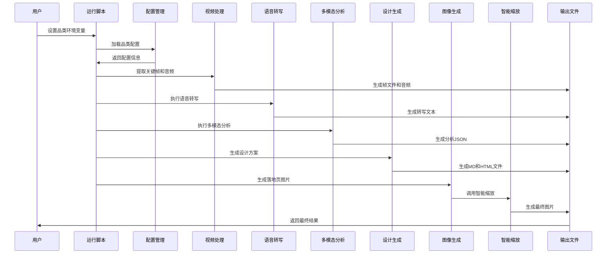

**图表来源**
- [run.sh:108-173](file://run.sh#L108-L173)
- [category_config.py:26-54](file://category_config.py#L26-L54)
- [transcribe.py:21-62](file://transcribe.py#L21-L62)
- [analyze.py:128-172](file://analyze.py#L128-L172)
- [generate.py:325-372](file://generate.py#L325-L372)
- [generate_image.py:311-448](file://generate_image.py#L311-L448)

## 详细组件分析

### 视频处理组件分析

视频处理组件负责从输入视频中提取关键帧和音频片段，为后续分析提供基础素材。

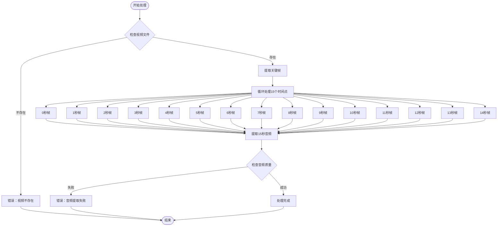

**图表来源**
- [run.sh:108-145](file://run.sh#L108-L145)

**章节来源**
- [run.sh:108-145](file://run.sh#L108-L145)

### 语音转写组件分析

语音转写组件使用Whisper模型进行本地语音识别，支持多种模型配置。

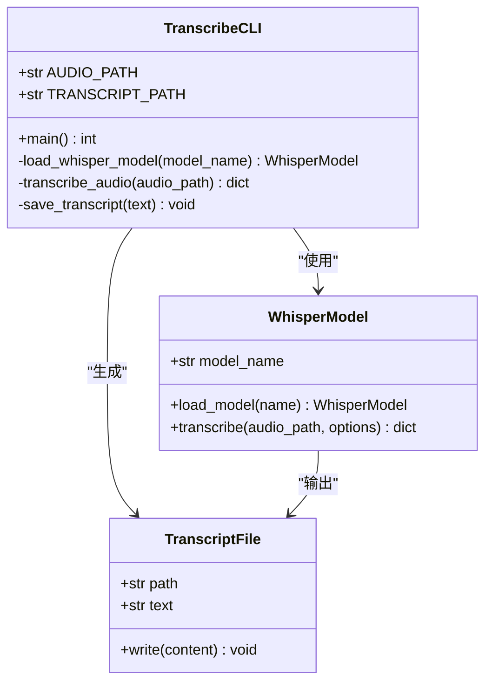

**图表来源**
- [transcribe.py:21-62](file://transcribe.py#L21-L62)

**章节来源**
- [transcribe.py:1-67](file://transcribe.py#L1-L67)

### 多模态分析组件分析

多模态分析组件是整个系统的核心，负责整合视觉和语音信息生成结构化分析结果。

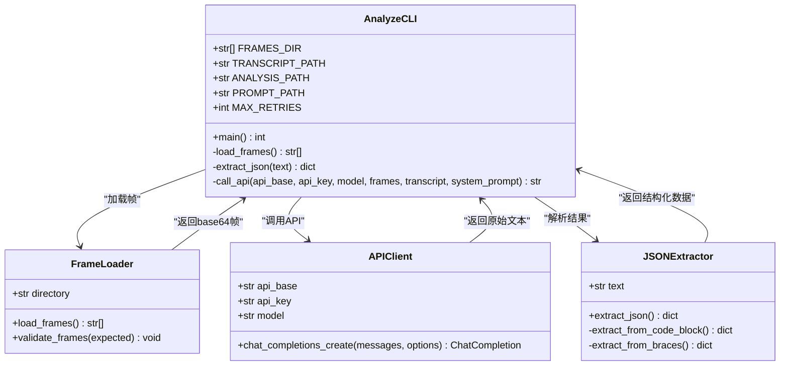

**图表来源**
- [analyze.py:33-126](file://analyze.py#L33-L126)

**章节来源**
- [analyze.py:1-177](file://analyze.py#L1-L177)

### 设计生成组件分析

设计生成组件将分析结果转换为可用的落地页设计方案，并提供多种输出格式。

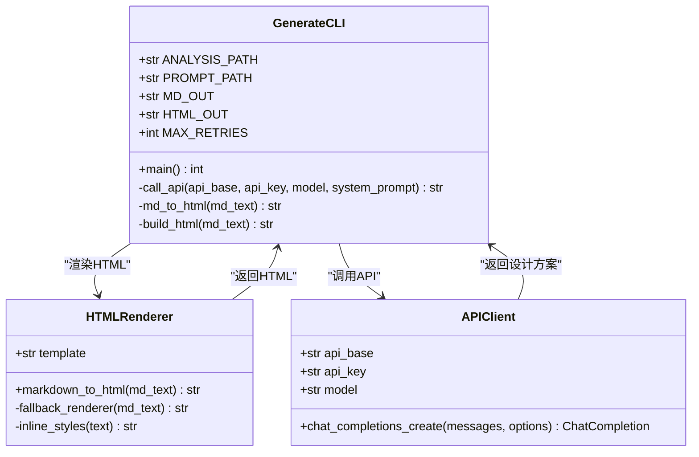

**图表来源**
- [generate.py:38-321](file://generate.py#L38-L321)

**章节来源**
- [generate.py:1-377](file://generate.py#L1-L377)

### 图像生成组件分析

图像生成组件基于生图Prompt生成高质量的落地页图片，支持批量处理和灵活配置。新增的智能缩放功能确保输出图片符合移动端显示标准。

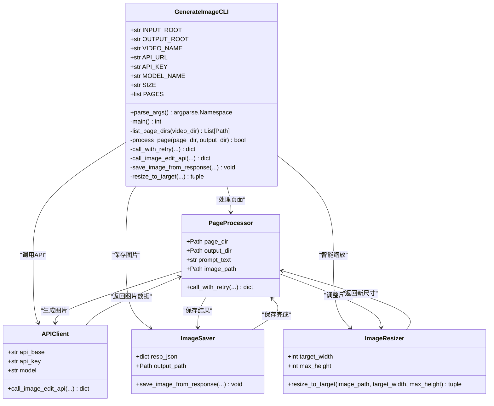

**图表来源**
- [generate_image.py:263-448](file://generate_image.py#L263-L448)

**章节来源**
- [generate_image.py:1-448](file://generate_image.py#L1-L448)

### 智能缩放组件分析

智能缩放组件提供高质量的图片缩放功能，确保输出图片符合750x1200的移动端显示标准。

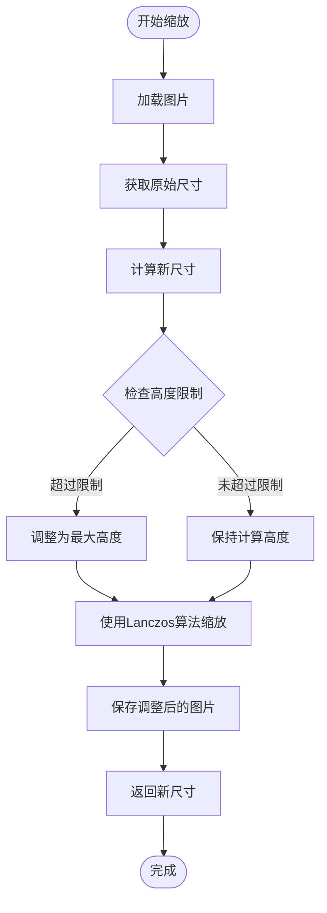

**图表来源**
- [generate_image.py:136-152](file://generate_image.py#L136-L152)

**章节来源**
- [generate_image.py:136-152](file://generate_image.py#L136-L152)

### 多类别配置组件分析

多类别配置组件提供品类感知的路径解析和配置加载功能，支持环境变量驱动的动态品类切换。

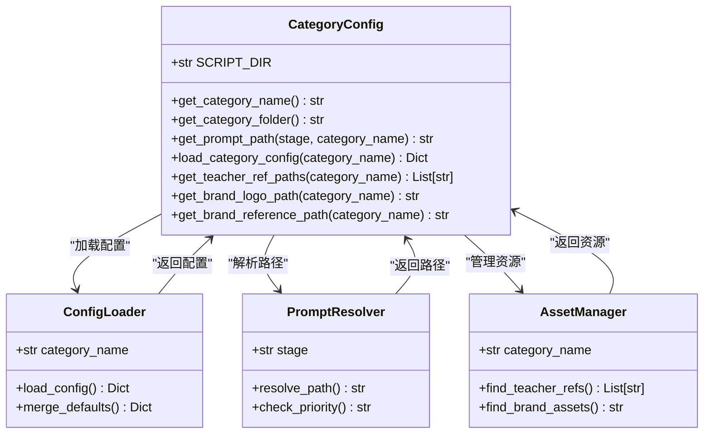

**图表来源**
- [category_config.py:16-169](file://category_config.py#L16-L169)

**章节来源**
- [category_config.py:1-169](file://category_config.py#L1-L169)

## 多类别架构

系统现已支持多类别架构，通过category_config.py模块实现品类感知的配置管理：

### 品类配置结构

每个品类都有独立的配置文件，包含特定的设计指导和资源管理：

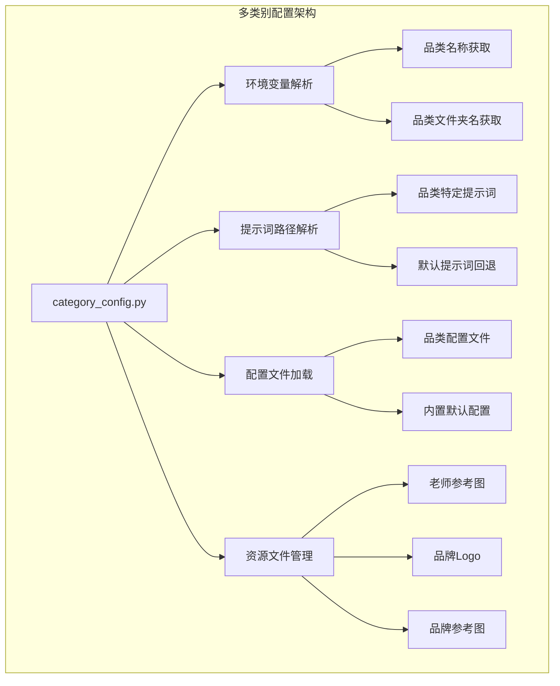

**图表来源**
- [category_config.py:26-169](file://category_config.py#L26-L169)

### 品类特定配置

#### 唱歌品类配置
- **display_name**: "唱歌"
- **description**: 中老年唱歌教学课程，强调音乐表达、歌曲演唱、呼吸技巧等
- **title_pool**: ["兴趣岛唱歌训练营首席讲师", "身体唱歌法创始人"]
- **content_list_name**: "课程曲目"
- **decoration_elements**: "音符♪、麦克风图标、舞台光效、金色光晕"

#### 营养健康品类配置
- **display_name**: "健康营养"
- **description**: 中老年健康营养教学课程，强调营养知识、食疗方案、健康管理等
- **title_pool**: ["兴趣岛健康膳食营养首席讲师"]
- **content_list_name**: "课程内容"
- **decoration_elements**: "蔬果图标🥦🍎、健康心形❤️、绿叶元素🌿、阳光光晕"
- **pain_points**: 指标异常、体质变差、体重增加、作息不规律等12种痛点
- **selling_points**: 针对管理精准改善、正常指标强身健体等5个卖点

**章节来源**
- [assets/categories/singing/config.json:1-10](file://assets/categories/singing/config.json#L1-L10)
- [assets/categories/nutrition/config.json:1-14](file://assets/categories/nutrition/config.json#L1-L14)

### 品类提示词模板

每个品类都有专门的提示词模板，提供针对性的设计指导：

#### 唱歌品类提示词特点
- 强调音乐元素和表演场景
- 包含歌曲列表和音乐播放器UI设计
- 适合音乐教学和表演类课程

#### 营养健康品类提示词特点
- 强调健康元素和营养主题
- 包含食材卡片和健康图标列表
- 适合健康教育和营养指导类课程

**章节来源**
- [assets/categories/singing/generate_prompt.md:1-244](file://assets/categories/singing/generate_prompt.md#L1-L244)
- [assets/categories/nutrition/generate_prompt.md:1-272](file://assets/categories/nutrition/generate_prompt.md#L1-L272)

## 配置管理最佳实践

### 环境变量配置

系统通过环境变量实现动态品类切换：

```bash
# 设置品类名称（默认：singing）
export CATEGORY_NAME="nutrition"

# 设置品类文件夹名（默认：唱歌）
export CATEGORY_FOLDER_NAME="健康营养"

# 设置API配置
export OPENAI_API_BASE="https://api.openai.com/v1"
export OPENAI_API_KEY="your-api-key"
```

### 配置文件组织

每个品类都有独立的配置文件和资源目录：

```
assets/
├── categories/
│   ├── singing/
│   │   ├── config.json          # 唱歌品类配置
│   │   └── examples/
│   ├── nutrition/
│   │   ├── config.json          # 营养健康配置
│   │   └── examples/
├── teacher_face_ref_*.jpg      # 默认老师参考图
├── brand_logo.png              # 默认品牌Logo
└── brand_reference.png         # 默认品牌参考图
```

### 资源文件管理

系统支持品类特定的资源文件管理：

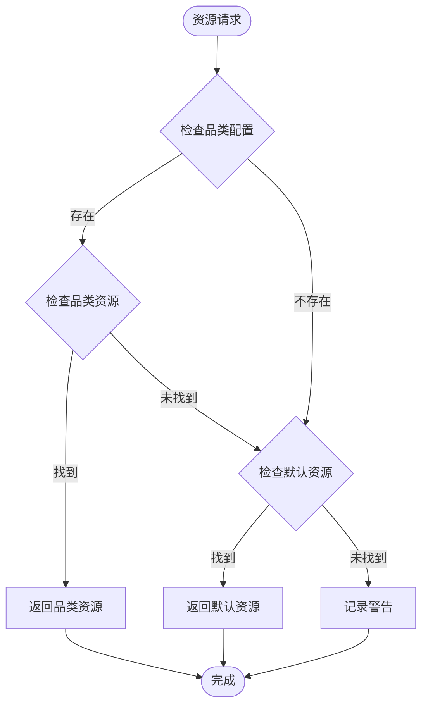

**图表来源**
- [category_config.py:102-169](file://category_config.py#L102-L169)

**章节来源**
- [category_config.py:16-169](file://category_config.py#L16-L169)

## 依赖关系分析

系统依赖关系清晰明确，主要依赖于外部服务和Python包：

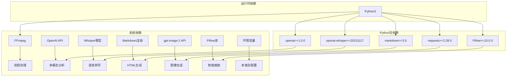

**图表来源**
- [requirements.txt:1-6](file://requirements.txt#L1-L6)
- [run.sh:64-72](file://run.sh#L64-L72)
- [config.env:18-22](file://config.env#L18-L22)

**章节来源**
- [requirements.txt:1-6](file://requirements.txt#L1-L6)
- [run.sh:64-72](file://run.sh#L64-L72)
- [config.env:18-22](file://config.env#L18-L22)

## 性能考虑

### 并发处理策略
- **批处理优化**：关键帧提取采用并行处理，但考虑到FFmpeg的特性，实际按顺序处理
- **API调用重试**：多模态分析、设计生成和图像生成都实现了指数退避重试机制
- **内存管理**：关键帧以base64形式在内存中处理，避免磁盘I/O瓶颈
- **图像生成优化**：支持批量处理多个页面，每个页面独立处理，提高整体效率
- **智能缩放优化**：使用Lanczos算法进行高质量重采样，平衡质量和性能
- **配置缓存优化**：品类配置文件加载后缓存，避免重复I/O操作

### 缓存和中间结果
- **中间文件缓存**：每个处理步骤的输出都会保存到output目录
- **错误恢复**：支持从任意步骤重新开始处理
- **进度跟踪**：详细的日志输出帮助监控处理进度
- **图像生成缓存**：生成的图片结果会保存到指定输出目录
- **缩放结果缓存**：智能缩放后的图片会覆盖原始文件，避免重复处理
- **配置文件缓存**：品类配置文件加载后缓存，提高后续访问性能

### 资源优化
- **模型选择**：Whisper模型支持多种大小配置，可根据需求平衡速度和精度
- **API调优**：温度参数设置为0.3（分析）和0.6（生成），平衡确定性和创造性
- **输出格式**：同时生成Markdown和HTML，满足不同使用场景
- **图像尺寸优化**：默认使用1024x1536的竖版尺寸，生成后缩放到750宽，确保移动端显示效果
- **缩放算法优化**：使用Lanczos算法进行高质量重采样，保持图片清晰度
- **资源文件优化**：支持品类特定资源文件，减少不必要的文件传输

**更新** 新增多类别架构的性能考虑，包括配置缓存和资源文件优化策略。

## 故障排除指南

### 常见问题及解决方案

#### 环境配置问题
- **问题**：缺少必要的环境变量
- **解决方案**：检查config.env文件中的API配置
- **验证方法**：运行`./run.sh --help`查看配置要求

#### 依赖缺失问题
- **问题**：FFmpeg未安装或不在PATH中
- **解决方案**：安装FFmpeg并确保在PATH中
- **验证方法**：运行`ffmpeg -version`

#### API调用失败
- **问题**：多模态分析、设计生成或图像生成API调用失败
- **解决方案**：检查网络连接和API密钥配置
- **验证方法**：查看相应输出文件获取原始响应

#### 模型加载失败
- **问题**：Whisper模型无法加载
- **解决方案**：检查模型名称和磁盘空间
- **验证方法**：查看模型下载日志

#### 图像生成失败
- **问题**：生图API调用失败或图片保存失败
- **解决方案**：检查API密钥、网络连接和磁盘空间
- **验证方法**：查看图像生成的日志输出和错误信息

#### 智能缩放失败
- **问题**：图片缩放过程中出现异常
- **解决方案**：检查图片文件完整性，确认Pillow库正常工作
- **验证方法**：查看缩放过程的日志输出，确认图片路径正确

#### 品类配置问题
- **问题**：品类配置文件加载失败或找不到
- **解决方案**：检查assets/categories/目录结构和config.json格式
- **验证方法**：查看category_config.py的错误输出和日志

#### 资源文件缺失
- **问题**：老师参考图或品牌Logo找不到
- **解决方案**：检查assets/categories/目录下的资源文件
- **验证方法**：确认资源文件命名规范和路径正确性

**更新** 新增多类别架构相关的故障排除指南，包括配置文件和资源文件的问题排查。

**章节来源**
- [run.sh:64-72](file://run.sh#L64-L72)
- [transcribe.py:29-40](file://transcribe.py#L29-L40)
- [analyze.py:128-135](file://analyze.py#L128-L135)
- [generate_image.py:333-348](file://generate_image.py#L333-L348)
- [category_config.py:67-75](file://category_config.py#L67-L75)

## 测试策略

### 单元测试策略

由于系统主要是脚本驱动，建议采用以下测试方法：

#### 功能测试
- **视频处理测试**：验证关键帧提取的准确性和完整性
- **转写测试**：检查语音转写的准确度和边界情况
- **API集成测试**：验证多模态分析、设计生成和图像生成的正确性
- **图像生成测试**：验证生图Prompt的生成和图片输出的正确性
- **智能缩放测试**：验证resize_to_target函数的缩放准确性和质量
- **配置管理测试**：验证多类别配置的加载和切换功能
- **资源文件测试**：验证品类特定资源文件的查找和使用

#### 性能测试
- **批量处理测试**：测试大量视频的处理性能
- **内存使用测试**：监控关键帧处理的内存占用
- **并发测试**：评估多实例运行的稳定性
- **图像生成性能测试**：测试多页面批量生成的性能
- **缩放算法性能测试**：评估不同图片尺寸的缩放速度
- **配置加载性能测试**：测试配置文件缓存和加载性能

#### 回归测试
- **版本升级测试**：确保新版本不破坏现有功能
- **配置变更测试**：验证不同配置组合的兼容性
- **错误处理测试**：测试各种异常情况的处理
- **图像生成测试**：验证图像生成功能的稳定性
- **智能缩放回归测试**：验证缩放功能的向后兼容性
- **多类别架构测试**：验证不同品类配置的独立性和兼容性

### 测试自动化

建议建立CI/CD流水线，包含以下步骤：
1. 代码静态分析
2. 单元测试执行
3. 集成测试验证
4. 性能基准测试
5. 安全扫描
6. 多品类配置测试

**更新** 新增多类别架构的测试策略和自动化建议，包括配置管理和资源文件的测试。

## 代码规范

### Python编码规范

#### 导入组织
- 标准库导入在最前面
- 第三方库导入在标准库之后
- 本地模块导入在最后面
- 每组导入之间用空行分隔

#### 函数设计
- 函数长度控制在50行以内
- 参数数量不超过5个
- 返回值类型明确
- 错误处理完整

#### 变量命名
- 变量使用下划线命名法
- 常量使用大写字母和下划线
- 类名使用帕斯卡命名法
- 模块名使用小写

#### 注释规范
- 函数和类必须有文档字符串
- 复杂逻辑需要注释说明
- 配置参数需要详细说明
- 错误处理需要说明原因

### 项目结构规范

#### 文件命名
- Python脚本使用小写加下划线
- 配置文件使用小写
- 模板文件使用小写
- 输出文件按用途命名

#### 目录结构
- 源代码文件按功能分类
- 配置文件集中管理
- 模板文件单独存放
- 输出文件统一管理
- 品类特定资源文件按品类组织

**更新** 新增多类别架构相关的代码规范和最佳实践，包括配置文件和资源文件的命名约定。

## 版本管理指南

### Git工作流程

#### 分支策略
- **主分支**：master/main，用于发布稳定版本
- **开发分支**：develop，用于日常开发
- **功能分支**：feature/*，用于新功能开发
- **修复分支**：fix/*，用于bug修复
- **发布分支**：release/*，用于版本发布
- **品类分支**：category/*，用于多品类功能开发

#### 提交规范
- **类型**：feat, fix, docs, style, refactor, test, chore, category
- **范围**：指定受影响的模块或品类
- **描述**：简洁明了的描述变更内容
- **关联**：引用相关的issue编号

#### 标签管理
- **语义化版本**：遵循MAJOR.MINOR.PATCH规则
- **发布标签**：v1.2.3格式
- **预发布版本**：v1.2.3-alpha.1格式
- **品类标签**：v1.2.3-nutrition格式

### 发布流程

#### 版本发布步骤
1. 更新版本号和CHANGELOG
2. 运行完整测试套件
3. 构建发布包
4. 创建Git标签
5. 推送到远程仓库
6. 发布到包管理平台

#### 向后兼容性
- 保持API向后兼容
- 标记废弃功能
- 提供迁移指南
- 维护多个版本支持
- 确保多品类配置的向后兼容

**更新** 新增多类别架构的版本管理和发布流程指导，包括配置文件和资源文件的版本管理策略。

## 贡献指南

### 如何贡献代码

#### 开发环境搭建
1. **克隆仓库**：`git clone <repository-url>`
2. **创建虚拟环境**：`python -m venv venv`
3. **激活环境**：`source venv/bin/activate`
4. **安装依赖**：`pip install -r requirements.txt`
5. **安装FFmpeg**：根据操作系统安装指南安装

#### 代码提交流程
1. **创建功能分支**：`git checkout -b feature/your-feature`
2. **编写代码**：遵循代码规范
3. **添加测试**：为新功能编写测试
4. **运行测试**：确保所有测试通过
5. **提交代码**：`git commit -am "feat: add new feature"`
6. **推送分支**：`git push origin feature/your-feature`
7. **创建PR**：在GitHub上创建Pull Request

#### 代码审查流程
1. **自动检查**：运行静态分析和测试
2. **人工审查**：至少一名维护者审查
3. **修改反馈**：根据审查意见修改代码
4. **合并批准**：获得足够的批准后合并

### 报告问题

#### Bug报告
1. **重现步骤**：详细描述如何重现问题
2. **预期行为**：描述期望的结果
3. **实际行为**：描述实际发生的情况
4. **环境信息**：操作系统、Python版本、依赖版本
5. **日志输出**：包含相关错误日志
6. **品类信息**：如果涉及多品类问题，说明具体品类

#### 功能请求
1. **使用场景**：描述具体的使用场景
2. **期望功能**：详细描述功能需求
3. **实现方案**：提供可能的实现方案
4. **影响分析**：分析对现有功能的影响
5. **品类支持**：说明是否需要支持特定品类

### 提出改进建议

#### 架构改进
- **性能优化**：提供性能分析和优化建议
- **架构重构**：提出架构改进方案
- **技术升级**：建议使用新技术或工具
- **多品类扩展**：优化多品类架构设计

#### 功能扩展
- **新功能**：描述新功能的需求和价值
- **现有功能增强**：提供现有功能的改进方案
- **用户体验改善**：优化用户交互体验
- **配置管理优化**：改进配置文件和资源管理

#### 品类扩展
- **新品类支持**：添加新的品类配置和模板
- **配置文件优化**：改进配置文件结构和管理
- **资源文件管理**：优化品类特定资源文件的组织
- **提示词模板扩展**：为新品类创建专门的提示词模板

**更新** 新增多类别架构的贡献指南和改进建议，包括配置管理和资源文件的扩展指导。

## 结论

本开发者指南提供了完整的项目理解和扩展指导。系统采用模块化设计，每个组件职责明确，便于维护和扩展。通过合理的架构设计和完善的配置管理，系统能够在不同环境下稳定运行。

**更新** 新增多类别架构支持，包括营养健康和唱歌两个品类的完整配置体系。系统现已支持通过环境变量动态切换不同的品类配置，每个品类都有专门的配置文件、提示词模板和设计指导。

对于想要扩展系统的开发者，建议从以下方面入手：
1. **理解现有架构**：深入学习当前的处理流程和数据流
2. **完善测试覆盖**：为新功能添加充分的测试
3. **保持向后兼容**：确保新功能不影响现有用户
4. **文档同步更新**：及时更新相关文档和示例
5. **智能缩放优化**：利用新增的智能缩放功能提升图片质量
6. **性能监控**：关注缩放算法的性能表现
7. **多品类扩展**：基于category_config.py框架添加新的品类支持
8. **配置管理最佳实践**：遵循新增的配置管理规范和资源文件组织原则

通过遵循这些指导原则，开发者可以有效地扩展系统功能，同时保持代码质量和系统稳定性。多类别架构为系统的长期发展奠定了坚实的基础，支持更多品类和应用场景的扩展。