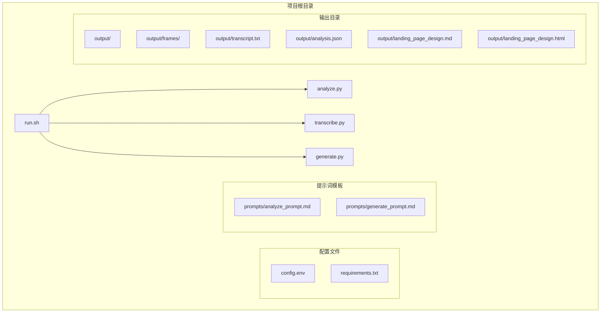
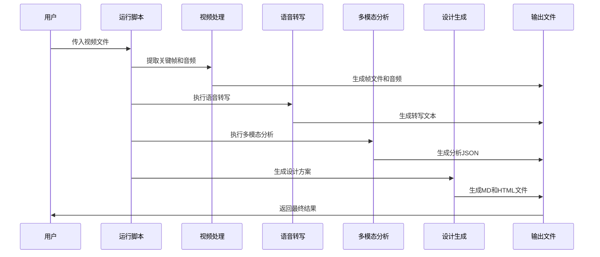
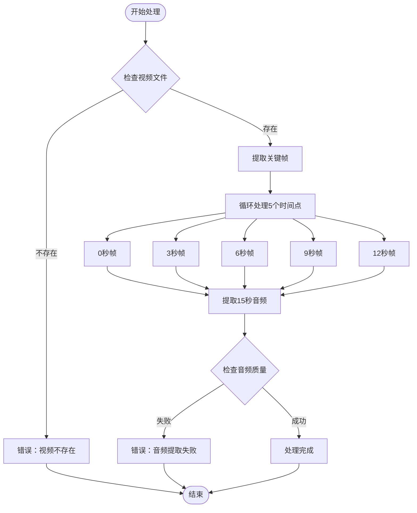
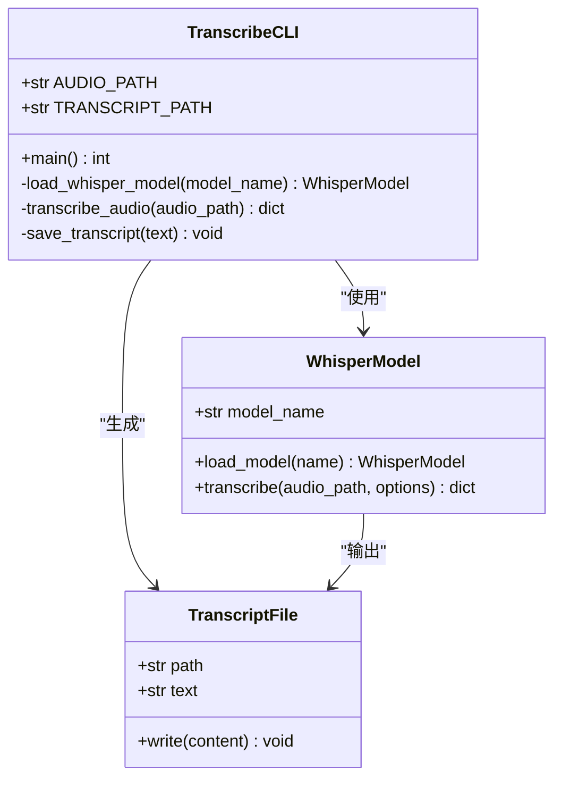
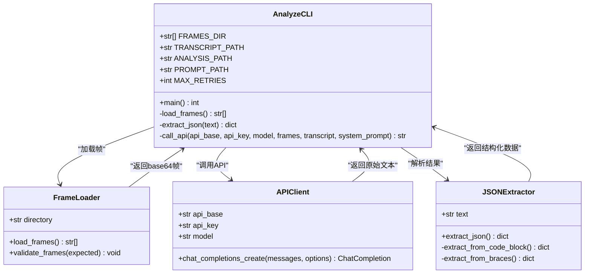
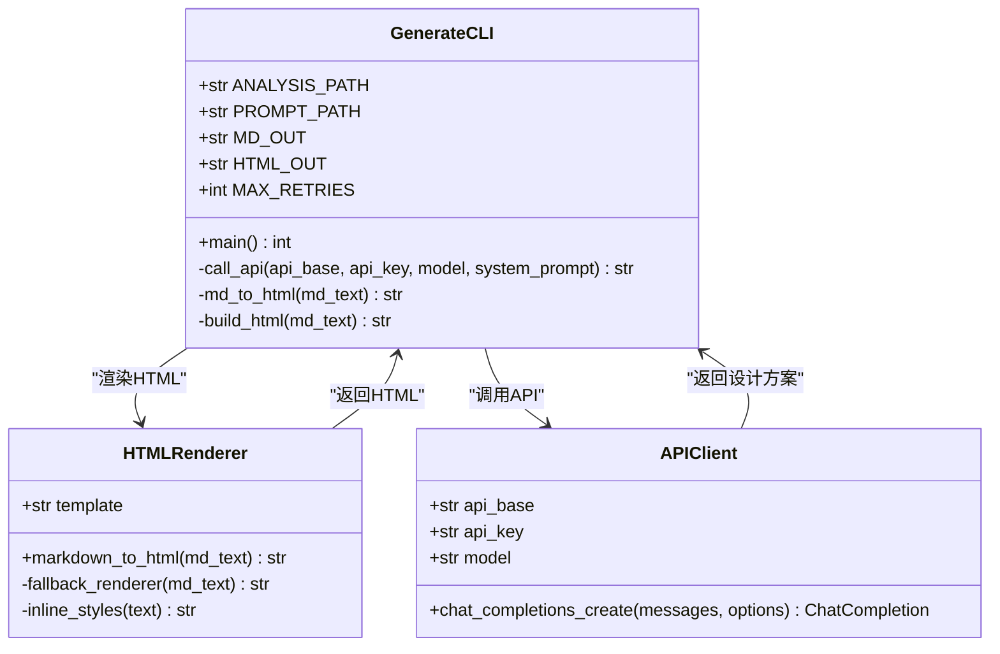
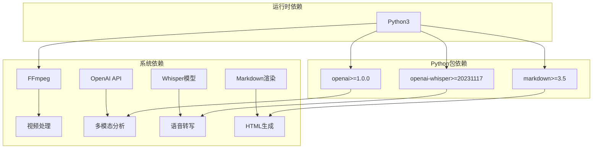

# 开发者指南

<cite>
**本文档引用的文件**
- [analyze.py](file://analyze.py)
- [generate.py](file://generate.py)
- [transcribe.py](file://transcribe.py)
- [run.sh](file://run.sh)
- [requirements.txt](file://requirements.txt)
- [config.env](file://config.env)
- [prompts/analyze_prompt.md](file://prompts/analyze_prompt.md)
- [prompts/generate_prompt.md](file://prompts/generate_prompt.md)
</cite>

## 目录
1. [简介](#简介)
2. [项目结构](#项目结构)
3. [核心组件](#核心组件)
4. [架构概览](#架构概览)
5. [详细组件分析](#详细组件分析)
6. [依赖关系分析](#依赖关系分析)
7. [性能考虑](#性能考虑)
8. [故障排除指南](#故障排除指南)
9. [测试策略](#测试策略)
10. [代码规范](#代码规范)
11. [版本管理指南](#版本管理指南)
12. [贡献指南](#贡献指南)
13. [结论](#结论)

## 简介

这是一个基于多模态AI的落地页设计方案生成系统。该系统能够自动分析视频广告素材，提取关键信息并生成高质量的落地页Hero区域设计方案。系统采用端到端的工作流，从视频处理到最终设计方案输出，涵盖了现代AI驱动的创意工作流程的完整链路。

该系统特别适用于需要快速生成营销落地页设计方案的团队，能够显著提升创意产出效率并保持设计一致性。

## 项目结构

项目采用简洁明了的分层结构，每个核心功能模块都有独立的脚本文件：

**图表来源**
- [run.sh:1-138](file://run.sh#L1-L138)
- [analyze.py:1-177](file://analyze.py#L1-L177)
- [generate.py:1-377](file://generate.py#L1-L377)
- [transcribe.py:1-67](file://transcribe.py#L1-L67)

**章节来源**
- [run.sh:1-138](file://run.sh#L1-L138)
- [config.env:1-13](file://config.env#L1-L13)

## 核心组件

系统由四个核心组件构成，每个组件负责特定的功能领域：

### 1. 视频处理组件
- **功能**：从视频中提取关键帧和音频片段
- **实现**：使用FFmpeg进行精确的时间戳截取
- **输出**：5张关键帧图片和15秒音频文件

### 2. 语音转写组件
- **功能**：使用Whisper模型进行本地语音识别
- **实现**：支持多种模型大小配置
- **输出**：标准化的转写文本文件

### 3. 多模态分析组件
- **功能**：结合视觉和语音信息进行深度分析
- **实现**：调用OpenAI兼容的多模态API
- **输出**：结构化的JSON分析结果

### 4. 设计生成组件
- **功能**：将分析结果转换为落地页设计方案
- **实现**：生成Markdown和HTML两种格式
- **输出**：完整的Hero区域设计方案

**章节来源**
- [transcribe.py:1-67](file://transcribe.py#L1-L67)
- [analyze.py:1-177](file://analyze.py#L1-L177)
- [generate.py:1-377](file://generate.py#L1-L377)

## 架构概览

系统采用流水线式架构，每个阶段都产生明确的中间产物，便于调试和验证：

**图表来源**
- [run.sh:72-129](file://run.sh#L72-L129)
- [transcribe.py:21-62](file://transcribe.py#L21-L62)
- [analyze.py:128-172](file://analyze.py#L128-L172)
- [generate.py:325-372](file://generate.py#L325-L372)

## 详细组件分析

### 视频处理组件分析

视频处理组件负责从输入视频中提取关键帧和音频片段，为后续分析提供基础素材。

**图表来源**
- [run.sh:72-100](file://run.sh#L72-L100)

**章节来源**
- [run.sh:72-100](file://run.sh#L72-L100)

### 语音转写组件分析

语音转写组件使用Whisper模型进行本地语音识别，支持多种模型配置。

**图表来源**
- [transcribe.py:21-62](file://transcribe.py#L21-L62)

**章节来源**
- [transcribe.py:1-67](file://transcribe.py#L1-L67)

### 多模态分析组件分析

多模态分析组件是整个系统的核心，负责整合视觉和语音信息生成结构化分析结果。

**图表来源**
- [analyze.py:33-126](file://analyze.py#L33-L126)

**章节来源**
- [analyze.py:1-177](file://analyze.py#L1-L177)

### 设计生成组件分析

设计生成组件将分析结果转换为可用的落地页设计方案，并提供多种输出格式。

**图表来源**
- [generate.py:38-321](file://generate.py#L38-L321)

**章节来源**
- [generate.py:1-377](file://generate.py#L1-L377)

## 依赖关系分析

系统依赖关系清晰明确，主要依赖于外部服务和Python包：

**图表来源**
- [requirements.txt:1-4](file://requirements.txt#L1-L4)
- [run.sh:54-62](file://run.sh#L54-L62)

**章节来源**
- [requirements.txt:1-4](file://requirements.txt#L1-L4)
- [run.sh:54-62](file://run.sh#L54-L62)

## 性能考虑

### 并发处理策略
- **批处理优化**：关键帧提取采用并行处理，但考虑到FFmpeg的特性，实际按顺序处理
- **API调用重试**：多模态分析和设计生成都实现了指数退避重试机制
- **内存管理**：关键帧以base64形式在内存中处理，避免磁盘I/O瓶颈

### 缓存和中间结果
- **中间文件缓存**：每个处理步骤的输出都会保存到output目录
- **错误恢复**：支持从任意步骤重新开始处理
- **进度跟踪**：详细的日志输出帮助监控处理进度

### 资源优化
- **模型选择**：Whisper模型支持多种大小配置，可根据需求平衡速度和精度
- **API调优**：温度参数设置为0.3（分析）和0.6（生成），平衡确定性和创造性
- **输出格式**：同时生成Markdown和HTML，满足不同使用场景

## 故障排除指南

### 常见问题及解决方案

#### 环境配置问题
- **问题**：缺少必要的环境变量
- **解决方案**：检查config.env文件中的API配置
- **验证方法**：运行`./run.sh --help`查看配置要求

#### 依赖缺失问题
- **问题**：FFmpeg未安装或不在PATH中
- **解决方案**：安装FFmpeg并确保在PATH中
- **验证方法**：运行`ffmpeg -version`

#### API调用失败
- **问题**：多模态分析或设计生成API调用失败
- **解决方案**：检查网络连接和API密钥配置
- **验证方法**：查看output/analysis_raw.txt获取原始响应

#### 模型加载失败
- **问题**：Whisper模型无法加载
- **解决方案**：检查模型名称和磁盘空间
- **验证方法**：查看模型下载日志

**章节来源**
- [run.sh:42-52](file://run.sh#L42-L52)
- [transcribe.py:29-40](file://transcribe.py#L29-L40)
- [analyze.py:128-135](file://analyze.py#L128-L135)

## 测试策略

### 单元测试策略

由于系统主要是脚本驱动，建议采用以下测试方法：

#### 功能测试
- **视频处理测试**：验证关键帧提取的准确性和完整性
- **转写测试**：检查语音转写的准确度和边界情况
- **API集成测试**：验证多模态分析和设计生成的正确性

#### 性能测试
- **批量处理测试**：测试大量视频的处理性能
- **内存使用测试**：监控关键帧处理的内存占用
- **并发测试**：评估多实例运行的稳定性

#### 回归测试
- **版本升级测试**：确保新版本不破坏现有功能
- **配置变更测试**：验证不同配置组合的兼容性
- **错误处理测试**：测试各种异常情况的处理

### 测试自动化

建议建立CI/CD流水线，包含以下步骤：
1. 代码静态分析
2. 单元测试执行
3. 集成测试验证
4. 性能基准测试
5. 安全扫描

## 代码规范

### Python编码规范

#### 导入组织
- 标准库导入在最前面
- 第三方库导入在标准库之后
- 本地模块导入在最后面
- 每组导入之间用空行分隔

#### 函数设计
- 函数长度控制在50行以内
- 参数数量不超过5个
- 返回值类型明确
- 错误处理完整

#### 变量命名
- 变量使用下划线命名法
- 常量使用大写字母和下划线
- 类名使用帕斯卡命名法
- 模块名使用小写

#### 注释规范
- 函数和类必须有文档字符串
- 复杂逻辑需要注释说明
- 配置参数需要详细说明
- 错误处理需要说明原因

### 项目结构规范

#### 文件命名
- Python脚本使用小写加下划线
- 配置文件使用小写
- 模板文件使用小写
- 输出文件按用途命名

#### 目录结构
- 源代码文件按功能分类
- 配置文件集中管理
- 模板文件单独存放
- 输出文件统一管理

## 版本管理指南

### Git工作流程

#### 分支策略
- **主分支**：master/main，用于发布稳定版本
- **开发分支**：develop，用于日常开发
- **功能分支**：feature/*，用于新功能开发
- **修复分支**：fix/*，用于bug修复
- **发布分支**：release/*，用于版本发布

#### 提交规范
- **类型**：feat, fix, docs, style, refactor, test, chore
- **范围**：指定受影响的模块
- **描述**：简洁明了的描述变更内容
- **关联**：引用相关的issue编号

#### 标签管理
- **语义化版本**：遵循MAJOR.MINOR.PATCH规则
- **发布标签**：v1.2.3格式
- **预发布版本**：v1.2.3-alpha.1格式

### 发布流程

#### 版本发布步骤
1. 更新版本号和CHANGELOG
2. 运行完整测试套件
3. 构建发布包
4. 创建Git标签
5. 推送到远程仓库
6. 发布到包管理平台

#### 向后兼容性
- 保持API向后兼容
- 标记废弃功能
- 提供迁移指南
- 维护多个版本支持

## 贡献指南

### 如何贡献代码

#### 开发环境搭建
1. **克隆仓库**：`git clone <repository-url>`
2. **创建虚拟环境**：`python -m venv venv`
3. **激活环境**：`source venv/bin/activate`
4. **安装依赖**：`pip install -r requirements.txt`
5. **安装FFmpeg**：根据操作系统安装指南安装

#### 代码提交流程
1. **创建功能分支**：`git checkout -b feature/your-feature`
2. **编写代码**：遵循代码规范
3. **添加测试**：为新功能编写测试
4. **运行测试**：确保所有测试通过
5. **提交代码**：`git commit -am "feat: add new feature"`
6. **推送分支**：`git push origin feature/your-feature`
7. **创建PR**：在GitHub上创建Pull Request

#### 代码审查流程
1. **自动检查**：运行静态分析和测试
2. **人工审查**：至少一名维护者审查
3. **修改反馈**：根据审查意见修改代码
4. **合并批准**：获得足够的批准后合并

### 报告问题

#### Bug报告
1. **重现步骤**：详细描述如何重现问题
2. **预期行为**：描述期望的结果
3. **实际行为**：描述实际发生的情况
4. **环境信息**：操作系统、Python版本、依赖版本
5. **日志输出**：包含相关错误日志

#### 功能请求
1. **使用场景**：描述具体的使用场景
2. **期望功能**：详细描述功能需求
3. **实现方案**：提供可能的实现方案
4. **影响分析**：分析对现有功能的影响

### 提出改进建议

#### 架构改进
- **性能优化**：提供性能分析和优化建议
- **架构重构**：提出架构改进方案
- **技术升级**：建议使用新技术或工具

#### 功能扩展
- **新功能**：描述新功能的需求和价值
- **现有功能增强**：提供现有功能的改进方案
- **用户体验改善**：优化用户交互体验

## 结论

本开发者指南提供了完整的项目理解和扩展指导。系统采用模块化设计，每个组件职责明确，便于维护和扩展。通过合理的架构设计和完善的配置管理，系统能够在不同环境下稳定运行。

对于想要扩展系统的开发者，建议从以下方面入手：
1. **理解现有架构**：深入学习当前的处理流程和数据流
2. **完善测试覆盖**：为新功能添加充分的测试
3. **保持向后兼容**：确保新功能不影响现有用户
4. **文档同步更新**：及时更新相关文档和示例

通过遵循这些指导原则，开发者可以有效地扩展系统功能，同时保持代码质量和系统稳定性。