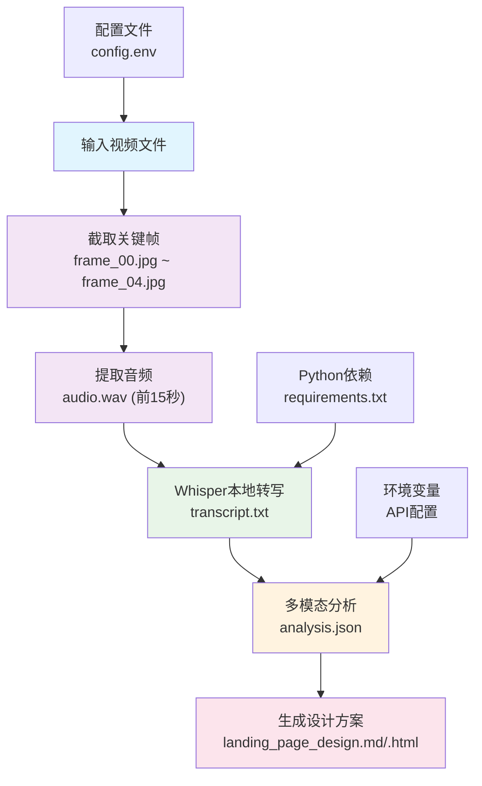

# 快速开始

<cite>
**本文引用的文件**
- [run.sh](file://run.sh)
- [config.env](file://config.env)
- [requirements.txt](file://requirements.txt)
- [transcribe.py](file://transcribe.py)
- [analyze.py](file://analyze.py)
- [generate.py](file://generate.py)
- [prompts/analyze_prompt.md](file://prompts/analyze_prompt.md)
- [prompts/generate_prompt.md](file://prompts/generate_prompt.md)
</cite>

## 目录
1. [简介](#简介)
2. [系统要求](#系统要求)
3. [安装步骤](#安装步骤)
4. [环境配置](#环境配置)
5. [API密钥配置](#api密钥配置)
6. [使用示例](#使用示例)
7. [完整工作流程](#完整工作流程)
8. [常见问题解决](#常见问题解决)
9. [故障排除](#故障排除)
10. [总结](#总结)

## 简介

这是一个基于多模态分析的视频内容处理工具，能够自动从视频广告中提取关键信息并生成落地页Hero区域设计方案。该工具支持完整的端到端工作流程，从视频分析到设计方案生成，帮助用户在30分钟内完成第一个视频分析任务。

## 系统要求

### 硬件要求
- 通用个人电脑（推荐至少8GB内存）
- 足够的磁盘空间（视频文件大小的数倍）

### 软件依赖

#### FFmpeg（必须）
- 用途：视频处理、音频提取、关键帧截取
- 安装方式：
  - macOS: `brew install ffmpeg`
  - Ubuntu/Debian: `sudo apt update && sudo apt install ffmpeg`
  - Windows: 从官网下载预编译版本

#### Python环境（必须）
- Python版本：3.7或更高版本
- 包管理：pip（随Python安装）

#### Python包依赖（自动安装）
- openai>=1.0.0（OpenAI兼容API客户端）
- openai-whisper>=20231117（本地语音识别）
- markdown>=3.5（HTML渲染）

**章节来源**
- [run.sh:11-13](file://run.sh#L11-L13)
- [requirements.txt:1-4](file://requirements.txt#L1-L4)

## 安装步骤

### 第一步：克隆项目
```bash
git clone <仓库地址>
cd landingpage-test-hero-page
```

### 第二步：安装系统依赖
```bash
# macOS
brew install ffmpeg

# Ubuntu/Debian
sudo apt update && sudo apt install ffmpeg

# CentOS/RHEL
sudo yum install ffmpeg
```

### 第三步：安装Python依赖
```bash
pip install -r requirements.txt
```

### 第四步：验证安装
```bash
# 检查FFmpeg
ffmpeg -version

# 检查Python
python3 --version

# 检查依赖包
pip list | grep -E "(openai|whisper|markdown)"
```

**章节来源**
- [run.sh:55-62](file://run.sh#L55-L62)
- [requirements.txt:1-4](file://requirements.txt#L1-L4)

## 环境配置

### 配置文件位置
项目使用`.env`风格的配置文件进行环境变量管理：

```bash
# 配置文件路径
./config.env
```

### 配置文件结构
```bash
# 多模态分析API配置
API_BASE_URL=https://your-api-endpoint.com/v1
API_KEY=your-api-key-here
MODEL_NAME=your-model-name

# 落地页生成API配置（可选，默认使用上面的配置）
# GENERATE_API_BASE_URL=
# GENERATE_API_KEY=
# GENERATE_MODEL_NAME=

# Whisper模型配置
WHISPER_MODEL=small
```

### 环境变量设置方法

#### 方法一：使用配置文件（推荐）
```bash
# 直接运行脚本时自动加载
./run.sh ./sample.mp4

# 或者手动加载
set -a
. ./config.env
set +a
```

#### 方法二：直接设置环境变量
```bash
export API_BASE_URL="https://your-api-endpoint.com/v1"
export API_KEY="your-api-key-here"
export MODEL_NAME="your-model-name"
export WHISPER_MODEL="small"
```

**章节来源**
- [config.env:1-13](file://config.env#L1-L13)
- [run.sh:42-52](file://run.sh#L42-L52)

## API密钥配置

### 获取API密钥
1. 访问OpenAI兼容服务提供商网站
2. 注册开发者账号
3. 创建新项目或选择现有项目
4. 生成API密钥
5. 复制并安全保存API密钥

### 配置API参数
在`config.env`文件中设置以下参数：

| 参数名称 | 描述 | 默认值 |
|---------|------|--------|
| `API_BASE_URL` | API基础URL | `https://your-api-endpoint.com/v1` |
| `API_KEY` | API访问密钥 | `your-api-key-here` |
| `MODEL_NAME` | 模型名称 | `your-model-name` |
| `WHISPER_MODEL` | Whisper模型大小 | `small` |

### API兼容性
该工具支持以下类型的API服务：
- OpenAI官方API
- Azure OpenAI Service
- 其他OpenAI兼容的服务

**章节来源**
- [config.env:2-4](file://config.env#L2-L4)
- [analyze.py:10-14](file://analyze.py#L10-L14)
- [generate.py:12-15](file://generate.py#L12-L15)

## 使用示例

### 基本使用方法
```bash
# 设置环境变量
export API_BASE_URL="https://your-api-endpoint.com/v1"
export API_KEY="your-api-key-here"
export MODEL_NAME="your-model-name"

# 运行完整流程
./run.sh ./sample.mp4
```

### 单文件处理示例
```bash
# 处理单个视频文件
./run.sh ./videos/advertisement.mp4

# 输出文件将在output/目录下生成
ls -la output/
```

### 自定义配置示例
```bash
# 使用不同的Whisper模型
export WHISPER_MODEL="medium"
./run.sh ./sample.mp4

# 使用不同的API配置
export API_BASE_URL="https://api.openai.com/v1"
export API_KEY="sk-your-openai-key"
./run.sh ./sample.mp4
```

**章节来源**
- [run.sh:5-10](file://run.sh#L5-L10)
- [run.sh:30-41](file://run.sh#L30-L41)

## 完整工作流程

### 五个阶段的处理流程



**图表来源**
- [run.sh:72-128](file://run.sh#L72-L128)
- [transcribe.py:17-18](file://transcribe.py#L17-L18)
- [analyze.py:25-28](file://analyze.py#L25-L28)
- [generate.py:25-28](file://generate.py#L25-L28)

### 详细处理步骤

#### 阶段1：关键帧提取
- 截取时间点：0s, 3s, 6s, 9s, 12s
- 输出格式：JPG，质量设置为2
- 作用：提供视频内容的静态分析样本

#### 阶段2：音频提取
- 时间范围：前15秒
- 音频格式：单声道，16kHz，PCM 16-bit
- 作用：为语音识别提供高质量音频

#### 阶段3：语音转写
- 模型类型：可配置（small/medium/large）
- 输出：纯文本转写结果
- 作用：将语音内容转换为可分析的文本

#### 阶段4：多模态分析
- 输入：5张关键帧 + 转写文本
- 输出：结构化JSON分析结果
- 作用：提取营销信息和视觉元素

#### 阶段5：设计方案生成
- 输入：分析结果JSON
- 输出：Markdown + HTML设计方案
- 作用：生成可直接使用的落地页Hero区域设计

**章节来源**
- [run.sh:72-128](file://run.sh#L72-L128)
- [transcribe.py:21-62](file://transcribe.py#L21-L62)
- [analyze.py:128-172](file://analyze.py#L128-L172)
- [generate.py:325-372](file://generate.py#L325-L372)

## 常见问题解决

### FFmpeg相关问题

#### 问题：找不到ffmpeg命令
**症状**：`未找到 ffmpeg，请先安装`
**解决方案**：
```bash
# macOS
brew install ffmpeg

# Ubuntu/Debian
sudo apt update && sudo apt install ffmpeg

# CentOS/RHEL
sudo yum install ffmpeg
```

#### 问题：FFmpeg版本过低
**症状**：某些功能不可用或报错
**解决方案**：
```bash
# 更新到最新版本
brew upgrade ffmpeg  # macOS
sudo apt update && sudo apt install ffmpeg  # Ubuntu
```

### Python依赖问题

#### 问题：openai库导入失败
**症状**：`未安装 openai 库`
**解决方案**：
```bash
pip install openai>=1.0.0
```

#### 问题：whisper模型加载失败
**症状**：`加载模型失败`
**解决方案**：
```bash
# 删除缓存的模型文件
rm -rf ~/.cache/whisper/

# 重新安装
pip uninstall openai-whisper
pip install openai-whisper>=20231117
```

### API配置问题

#### 问题：API调用失败
**症状**：`API 调用多次失败`
**解决方案**：
```bash
# 检查网络连接
ping $(echo $API_BASE_URL | sed 's|https://||' | cut -d'/' -f1)

# 验证API密钥
echo $API_KEY | wc -c  # 应该大于10

# 检查模型名称
echo $MODEL_NAME
```

#### 问题：JSON解析错误
**症状**：`JSON 解析失败`
**解决方案**：
```bash
# 查看原始响应
cat output/analysis_raw.txt

# 检查API返回格式
# 确保API返回的是标准的JSON格式
```

### 文件权限问题

#### 问题：无法创建输出文件
**症状**：权限不足导致文件创建失败
**解决方案**：
```bash
# 检查当前目录权限
ls -la

# 修改权限
chmod +w .

# 或者在有权限的目录运行
cp -r . /tmp/video-analyzer
cd /tmp/video-analyzer
./run.sh ./sample.mp4
```

**章节来源**
- [run.sh:55-62](file://run.sh#L55-L62)
- [transcribe.py:31-34](file://transcribe.py#L31-L34)
- [analyze.py:79-80](file://analyze.py#L79-L80)
- [analyze.py:158-163](file://analyze.py#L158-L163)

## 故障排除

### 调试模式启动

#### 启用详细日志
```bash
# 设置调试级别
export DEBUG=1

# 运行单个组件进行调试
python3 transcribe.py
python3 analyze.py
python3 generate.py
```

#### 检查中间文件
```bash
# 验证关键帧
ls -la output/frames/

# 验证音频文件
file output/audio.wav

# 验证转写结果
cat output/transcript.txt

# 验证分析结果
cat output/analysis.json
```

### 性能优化建议

#### 内存使用优化
```bash
# 对于大视频文件，考虑降低分辨率
export WHISPER_MODEL="small"  # 更快但精度较低
# 或
export WHISPER_MODEL="medium"  # 平衡选择
```

#### 并行处理
```bash
# 批量处理多个视频
for video in videos/*.mp4; do
    echo "Processing $video"
    ./run.sh "$video"
done
```

### 错误码参考

| 错误码 | 类型 | 描述 | 解决方案 |
|-------|------|------|----------|
| 1 | 参数错误 | 缺少视频文件参数 | 检查命令行参数 |
| 2 | 截帧失败 | FFmpeg执行失败 | 检查视频文件完整性 |
| 3 | 音频提取失败 | FFmpeg音频提取失败 | 检查音频编码格式 |
| 4 | 转写失败 | Whisper转写异常 | 检查模型文件和音频质量 |
| 5 | 分析失败 | API调用或JSON解析失败 | 检查API配置和网络连接 |
| 6 | 方案生成失败 | Markdown渲染失败 | 检查Markdown依赖 |
| 9 | 通用错误 | 其他未分类错误 | 查看详细错误信息 |

### 环境诊断脚本
```bash
#!/bin/bash
echo "=== 环境诊断 ==="
echo "Python版本: $(python3 --version)"
echo "FFmpeg版本: $(ffmpeg -version 2>&1 | head -1)"
echo "依赖包: $(pip list | grep -E '(openai|whisper|markdown)' | wc -l) 个"
echo "配置文件: $(test -f config.env && echo '存在' || echo '缺失')"
echo "输出目录: $(test -d output && echo '可写' || echo '权限不足')"
```

**章节来源**
- [run.sh:130-138](file://run.sh#L130-L138)
- [analyze.py:170-172](file://analyze.py#L170-L172)
- [generate.py:370-372](file://generate.py#L370-L372)

## 总结

通过以上步骤，您应该能够在30分钟内成功运行第一个视频分析任务。整个流程的关键在于：

1. **正确安装系统依赖**（特别是FFmpeg）
2. **准确配置API密钥和服务端点**
3. **准备合适的测试视频文件**
4. **监控处理进度和输出文件**

如果遇到问题，建议按照故障排除章节的步骤逐一检查。该工具提供了完整的错误处理和日志输出，有助于快速定位和解决问题。

**章节来源**
- [run.sh:1-23](file://run.sh#L1-L23)
- [run.sh:130-138](file://run.sh#L130-L138)