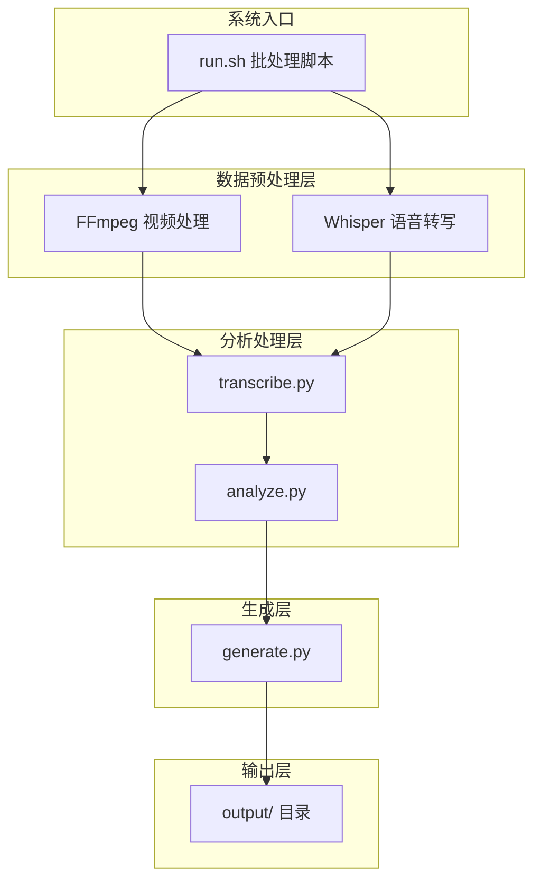
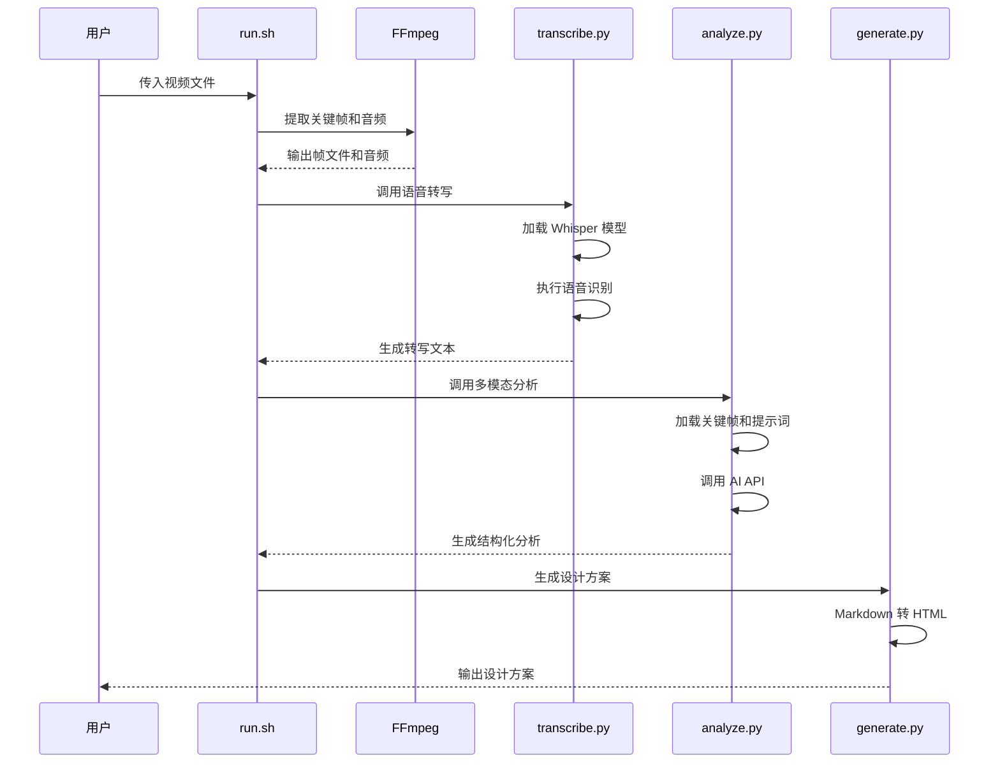
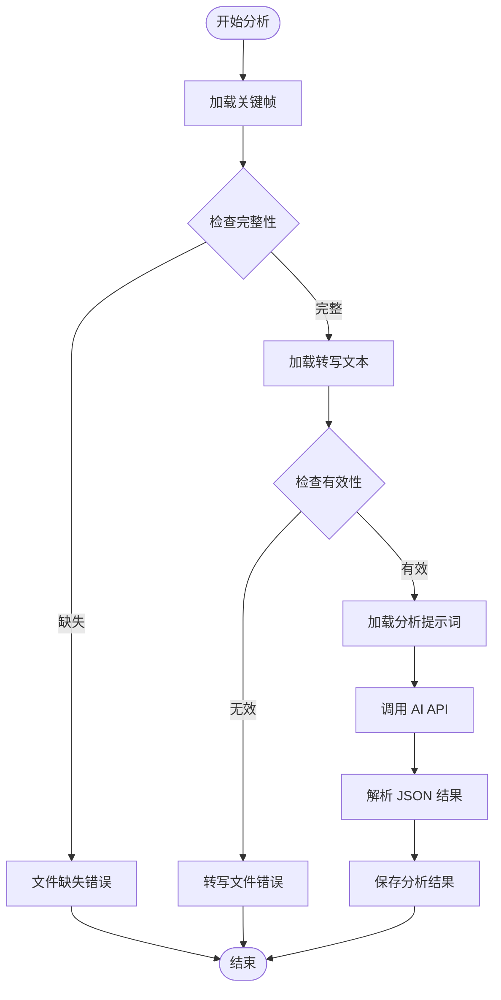
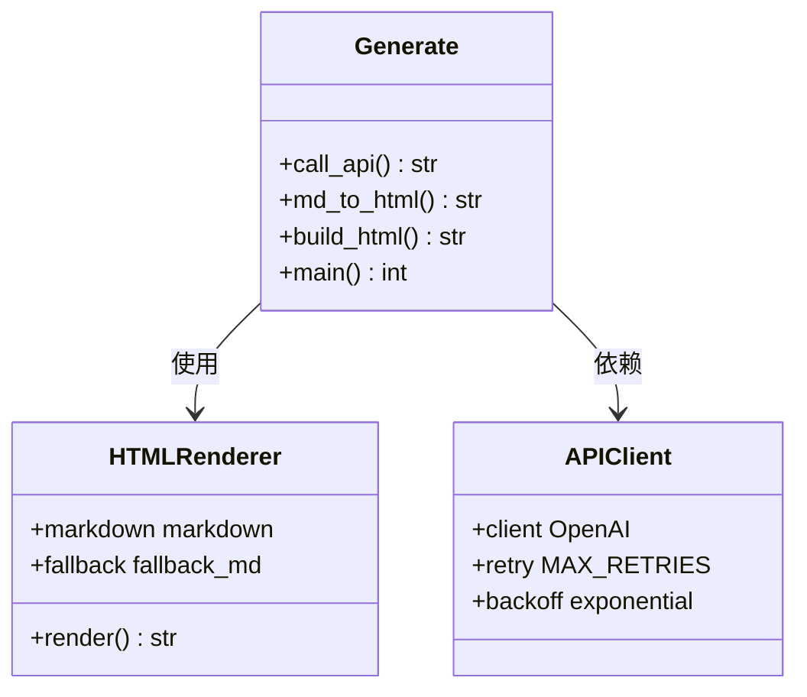
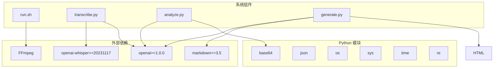

# 故障排除和调试

<cite>
**本文档引用的文件**
- [analyze.py](file://analyze.py)
- [generate.py](file://generate.py)
- [transcribe.py](file://transcribe.py)
- [run.sh](file://run.sh)
- [requirements.txt](file://requirements.txt)
- [config.env](file://config.env)
- [prompts/analyze_prompt.md](file://prompts/analyze_prompt.md)
- [prompts/generate_prompt.md](file://prompts/generate_prompt.md)
</cite>

## 目录
1. [简介](#简介)
2. [项目结构](#项目结构)
3. [核心组件](#核心组件)
4. [架构概览](#架构概览)
5. [详细组件分析](#详细组件分析)
6. [依赖分析](#依赖分析)
7. [性能考虑](#性能考虑)
8. [故障排除指南](#故障排除指南)
9. [结论](#结论)
10. [附录](#附录)

## 简介

这是一个基于多模态分析的落地页设计方案生成系统。该系统能够自动从视频广告中提取关键信息，生成高质量的落地页 Hero 区域设计方案。系统采用模块化设计，包含视频处理、语音转写、多模态分析和设计方案生成四个主要组件。

## 项目结构

系统采用分层架构设计，包含以下核心组件：



**图表来源**
- [run.sh:1-138](file://run.sh#L1-L138)
- [transcribe.py:1-67](file://transcribe.py#L1-L67)
- [analyze.py:1-177](file://analyze.py#L1-L177)
- [generate.py:1-377](file://generate.py#L1-L377)

**章节来源**
- [run.sh:1-138](file://run.sh#L1-L138)
- [requirements.txt:1-4](file://requirements.txt#L1-L4)

## 核心组件

系统包含四个核心组件，每个组件都有特定的功能和错误处理机制：

### 组件职责

1. **视频处理组件** (`run.sh`)
   - 视频关键帧提取（0s/3s/6s/9s/12s）
   - 前15秒音频提取
   - 自动化的批处理流程控制

2. **语音转写组件** (`transcribe.py`)
   - Whisper 模型加载和管理
   - 语音识别和文本转写
   - 错误恢复和重试机制

3. **多模态分析组件** (`analyze.py`)
   - 关键帧图像处理和编码
   - 结构化数据分析
   - API 调用和结果解析

4. **设计方案生成组件** (`generate.py`)
   - Markdown 到 HTML 转换
   - 设计方案生成和渲染
   - 多种输出格式支持

**章节来源**
- [run.sh:1-138](file://run.sh#L1-L138)
- [transcribe.py:1-67](file://transcribe.py#L1-L67)
- [analyze.py:1-177](file://analyze.py#L1-L177)
- [generate.py:1-377](file://generate.py#L1-L377)

## 架构概览

系统采用流水线架构，数据在各个组件间单向流动：



**图表来源**
- [run.sh:72-128](file://run.sh#L72-L128)
- [transcribe.py:21-62](file://transcribe.py#L21-L62)
- [analyze.py:128-172](file://analyze.py#L128-L172)
- [generate.py:325-372](file://generate.py#L325-L372)

## 详细组件分析

### 视频处理组件 (run.sh)

视频处理组件负责将输入视频转换为系统所需的中间文件：

#### 关键功能
- **关键帧提取**：精确时间戳提取（0/3/6/9/12秒）
- **音频提取**：前15秒音频，16kHz采样率，单声道
- **依赖检查**：FFmpeg 和 Python 环境验证
- **配置管理**：支持 config.env 配置文件

#### 错误处理机制
- 文件存在性检查
- 进程退出码管理
- 详细的错误信息输出

**章节来源**
- [run.sh:72-128](file://run.sh#L72-L128)
- [run.sh:42-52](file://run.sh#L42-L52)

### 语音转写组件 (transcribe.py)

语音转写组件使用 Whisper 模型进行本地语音识别：

#### 核心特性
- **模型加载**：支持多种 Whisper 模型大小
- **转写执行**：批量语音识别处理
- **结果保存**：标准化文本输出

#### 性能优化
- 模型缓存机制
- 异常情况下的降级处理
- 进度和性能监控

**章节来源**
- [transcribe.py:21-62](file://transcribe.py#L21-L62)

### 多模态分析组件 (analyze.py)

多模态分析组件是系统的核心处理单元：

#### 数据处理流程


**图表来源**
- [analyze.py:33-74](file://analyze.py#L33-L74)
- [analyze.py:76-126](file://analyze.py#L76-L126)
- [analyze.py:128-172](file://analyze.py#L128-L172)

#### 错误恢复策略
- **重试机制**：最多3次API调用重试
- **指数退避**：每次重试等待时间翻倍
- **JSON解析容错**：多种解析策略保证结果提取

**章节来源**
- [analyze.py:33-74](file://analyze.py#L33-L74)
- [analyze.py:76-126](file://analyze.py#L76-L126)

### 方案生成组件 (generate.py)

设计方案生成组件负责将分析结果转换为可用的设计方案：

#### 多格式输出
- **Markdown 格式**：便于版本控制和编辑
- **HTML 格式**：独立可打开的可视化页面
- **内联样式**：完整的CSS样式嵌入

#### 渲染策略


**图表来源**
- [generate.py:38-68](file://generate.py#L38-L68)
- [generate.py:73-146](file://generate.py#L73-L146)

**章节来源**
- [generate.py:38-68](file://generate.py#L38-L68)
- [generate.py:73-146](file://generate.py#L73-L146)

## 依赖分析

系统依赖关系清晰，采用分层依赖模式：



**图表来源**
- [requirements.txt:1-4](file://requirements.txt#L1-L4)
- [run.sh:54-62](file://run.sh#L54-L62)

**章节来源**
- [requirements.txt:1-4](file://requirements.txt#L1-L4)
- [run.sh:54-62](file://run.sh#L54-L62)

## 性能考虑

### 内存使用优化

系统在处理大型视频文件时采用流式处理策略：

1. **渐进式处理**：每个步骤完成后才进行下一步
2. **资源清理**：及时释放中间文件占用的空间
3. **模型缓存**：Whisper 模型只加载一次

### 并发处理

- **异步API调用**：AI API调用具有内置重试机制
- **批处理优化**：关键帧和音频同时处理
- **进度监控**：详细的处理进度输出

### 缓存策略

- **模型缓存**：Whisper 模型加载后缓存
- **中间结果**：生成的中间文件便于调试和重用

## 故障排除指南

### 常见错误诊断

#### 1. 环境配置问题

**症状**：启动时立即报错，显示缺少配置

**诊断步骤**：
1. 检查 config.env 文件是否存在
2. 验证 API 配置参数是否正确
3. 确认环境变量是否正确设置

**解决方案**：
```bash
# 创建配置文件
cp config.env.example config.env
# 编辑配置文件
vim config.env
```

**章节来源**
- [run.sh:42-52](file://run.sh#L42-L52)
- [config.env:1-13](file://config.env#L1-L13)

#### 2. 依赖缺失问题

**症状**：导入模块时报错，显示模块不存在

**诊断步骤**：
1. 检查 requirements.txt 是否正确
2. 验证 Python 环境是否激活
3. 确认 pip 安装状态

**解决方案**：
```bash
# 安装所有依赖
pip install -r requirements.txt
# 验证安装
pip list | grep -E "(openai|whisper|markdown)"
```

**章节来源**
- [requirements.txt:1-4](file://requirements.txt#L1-L4)

#### 3. FFmpeg 问题

**症状**：视频处理阶段报错，显示找不到 FFmpeg

**诊断步骤**：
1. 检查 FFmpeg 是否已安装
2. 验证 FFmpeg 是否在 PATH 中
3. 确认 FFmpeg 版本兼容性

**解决方案**：
```bash
# macOS 安装
brew install ffmpeg

# Ubuntu/Debian 安装
sudo apt update
sudo apt install ffmpeg

# 验证安装
ffmpeg -version
```

**章节来源**
- [run.sh:54-58](file://run.sh#L54-L58)

#### 4. Whisper 模型加载失败

**症状**：转写阶段报错，显示模型加载失败

**诊断步骤**：
1. 检查网络连接状态
2. 验证模型大小设置
3. 确认磁盘空间充足

**解决方案**：
```bash
# 更换模型大小
export WHISPER_MODEL=base
# 或者
export WHISPER_MODEL=tiny

# 清理缓存重新下载
rm -rf ~/.cache/whisper
```

**章节来源**
- [transcribe.py:26-41](file://transcribe.py#L26-L41)

#### 5. API 调用失败

**症状**：分析或生成阶段报错，显示 API 调用失败

**诊断步骤**：
1. 检查 API 密钥是否正确
2. 验证 API 基础URL是否可达
3. 确认模型名称是否正确

**解决方案**：
```bash
# 检查环境变量
echo $API_BASE_URL
echo $API_KEY
echo $MODEL_NAME

# 测试 API 连接
curl -X GET "$API_BASE_URL/models" \
  -H "Authorization: Bearer $API_KEY"
```

**章节来源**
- [analyze.py:128-135](file://analyze.py#L128-L135)
- [generate.py:325-332](file://generate.py#L325-L332)

#### 6. 文件权限问题

**症状**：输出文件无法生成，显示权限错误

**诊断步骤**：
1. 检查 output 目录权限
2. 验证磁盘空间是否充足
3. 确认文件系统是否只读

**解决方案**：
```bash
# 创建输出目录
mkdir -p output

# 设置正确的权限
chmod 755 output
chmod 644 output/*

# 检查磁盘空间
df -h
```

**章节来源**
- [run.sh:64-68](file://run.sh#L64-L68)

### 日志分析方法

#### 系统日志解读

系统采用统一的日志格式，便于问题定位：

**日志格式**：`[组件名] 消息内容`

**常见日志类型**：
- `[run]` - 批处理脚本日志
- `[transcribe]` - 语音转写日志  
- `[analyze]` - 多模态分析日志
- `[generate]` - 方案生成日志

#### 调试技巧

1. **启用详细模式**：
```bash
# 设置调试级别
export DEBUG=1
```

2. **查看中间结果**：
```bash
# 检查关键帧
ls -la output/frames/

# 查看转写结果
cat output/transcript.txt

# 检查分析结果
cat output/analysis.json
```

3. **逐步执行**：
```bash
# 只运行转写
python transcribe.py

# 只运行分析
python analyze.py

# 只运行生成
python generate.py
```

### 性能优化建议

#### 内存优化

1. **模型选择**：
   - 小型模型：适合测试和开发
   - 中型模型：平衡质量和性能
   - 大型模型：高质量但需要更多内存

2. **批处理优化**：
```bash
# 调整 Whisper 模型大小
export WHISPER_MODEL=small

# 减少关键帧数量
# 修改 run.sh 中的 TIMES 数组
```

#### 网络优化

1. **API 调优**：
```bash
# 设置超时时间
export REQUEST_TIMEOUT=60

# 配置代理
export http_proxy=http://proxy:port
export https_proxy=https://proxy:port
```

2. **缓存策略**：
```bash
# 启用模型缓存
export WHISPER_CACHE_DIR=~/.cache/whisper

# 清理缓存
rm -rf ~/.cache/whisper
```

### 错误代码对照表

| 错误码 | 组件 | 错误类型 | 可能原因 | 解决方案 |
|--------|------|----------|----------|----------|
| 1 | run.sh | 参数错误 | 缺少视频文件参数 | 提供有效的视频文件路径 |
| 2 | run.sh | 截帧失败 | FFmpeg 处理错误 | 检查视频文件格式和完整性 |
| 3 | run.sh | 音频提取失败 | FFmpeg 配置错误 | 验证音频参数设置 |
| 4 | run.sh | 转写文件为空 | Whisper 模型加载失败 | 检查网络连接和模型缓存 |
| 5 | run.sh | 分析结果为空 | API 调用失败 | 验证 API 配置和网络连接 |
| 6 | run.sh | Markdown 未生成 | 生成器错误 | 检查分析结果格式 |
| 7 | run.sh | HTML 未生成 | 渲染器错误 | 验证 Markdown 格式 |
| 1 | transcribe.py | 文件不存在 | 输入音频缺失 | 确认音频文件路径 |
| 2 | transcribe.py | 依赖缺失 | Whisper 未安装 | 运行 pip install -r requirements.txt |
| 3 | transcribe.py | 模型加载失败 | 网络或磁盘问题 | 检查网络连接和缓存目录 |
| 4 | transcribe.py | 转写失败 | 模型或音频问题 | 验证模型大小和音频质量 |
| 1 | analyze.py | 环境变量缺失 | 配置不完整 | 检查 config.env 文件 |
| 2 | analyze.py | 转写文件缺失 | 前一步骤失败 | 验证转写步骤执行 |
| 3 | analyze.py | 提示词文件缺失 | 模板文件损坏 | 检查 prompts 目录 |
| 4 | analyze.py | JSON 解析失败 | API 返回格式异常 | 检查 API 响应和保存原始结果 |
| 5 | analyze.py | API 调用失败 | 网络或认证问题 | 验证 API 配置和网络连接 |
| 1 | generate.py | 环境变量缺失 | 配置不完整 | 检查 API 配置覆盖 |
| 2 | generate.py | 分析结果缺失 | 分析步骤失败 | 验证分析文件生成 |
| 3 | generate.py | 提示词文件缺失 | 模板文件损坏 | 检查 prompts 目录 |
| 4 | generate.py | JSON 解析失败 | 分析结果格式错误 | 检查分析输出格式 |
| 5 | generate.py | API 调用失败 | 网络或认证问题 | 验证 API 配置和网络连接 |
| 6 | generate.py | HTML 渲染失败 | Markdown 格式问题 | 检查 Markdown 语法 |

### 性能监控方法

#### 系统资源监控

```bash
# 监控 CPU 和内存使用
top -p $(pgrep -f python)

# 监控磁盘使用
df -h

# 监控网络连接
netstat -an | grep :80

# 监控进程状态
ps aux | grep -E "(python|ffmpeg)"
```

#### 性能指标收集

1. **时间统计**：
```bash
# 添加时间戳到日志
date >> timing.log
python transcribe.py >> timing.log 2>&1
date >> timing.log
```

2. **内存使用监控**：
```bash
# 监控 Python 进程内存
watch -n 1 'ps -p $(pgrep -f python) -o pid,ppid,cmd,rss,vsz'
```

3. **API 性能监控**：
```bash
# 记录 API 调用时间
python analyze.py 2>&1 | tee api_timing.log
```

### 调试最佳实践

#### 1. 分阶段调试

```bash
# 1. 验证输入文件
echo "检查视频文件"
ls -la "$VIDEO"

# 2. 验证环境配置
echo "检查环境变量"
env | grep -E "(API_|WHISPER)"

# 3. 验证依赖安装
echo "检查 Python 依赖"
pip list | grep -E "(openai|whisper|markdown)"

# 4. 验证 FFmpeg 安装
echo "检查 FFmpeg"
which ffmpeg
```

#### 2. 错误隔离

```bash
# 只运行特定组件
python -m cProfile -o profile.prof transcribe.py
python -m cProfile -o profile.prof analyze.py
python -m cProfile -o profile.prof generate.py

# 分析性能瓶颈
snakeviz profile.prof
```

#### 3. 日志轮转

```bash
# 设置日志轮转
logrotate << EOF
/var/log/landingpage/*.log {
    daily
    rotate 7
    compress
    missingok
    notifempty
}
EOF
```

## 结论

本故障排除和调试指南提供了系统化的错误诊断和解决方法。通过理解系统的架构设计和各组件的错误处理机制，用户可以快速定位和解决常见问题。

关键要点：
- **预防性检查**：在运行前验证所有依赖和配置
- **分阶段调试**：逐个组件验证功能正常
- **详细日志**：利用系统提供的日志信息进行问题定位
- **性能监控**：持续监控系统性能和资源使用情况

对于复杂问题，建议：
1. 逐步缩小问题范围
2. 检查最近的变更记录
3. 查阅相关组件的错误处理代码
4. 参考社区文档和问题反馈渠道

## 附录

### 社区支持和问题反馈

#### 获取帮助的渠道

1. **GitHub Issues**
   - 项目仓库：https://github.com/your-repo/landingpage-test-hero-page
   - 提交问题时请包含：
     - 系统信息和版本
     - 完整的错误日志
     - 复现步骤
     - 相关配置文件内容

2. **邮件支持**
   - 支持邮箱：support@landingpage.com
   - 请提供详细的错误描述和系统环境信息

3. **文档参考**
   - 官方文档：https://docs.landingpage.com
   - API 文档：https://api.landingpage.com/docs

#### 问题报告模板

```markdown
## 问题报告

### 基本信息
- 系统版本：[操作系统版本]
- Python 版本：[Python 版本]
- FFmpeg 版本：[FFmpeg 版本]
- 依赖版本：[相关依赖版本]

### 重现步骤
1. [第一步]
2. [第二步]
3. [第三步]

### 预期行为
[描述期望的结果]

### 实际行为
[描述实际发生的情况]

### 日志内容
```
[粘贴相关的错误日志]
```

### 配置信息
```
[粘贴 config.env 内容]
```
```