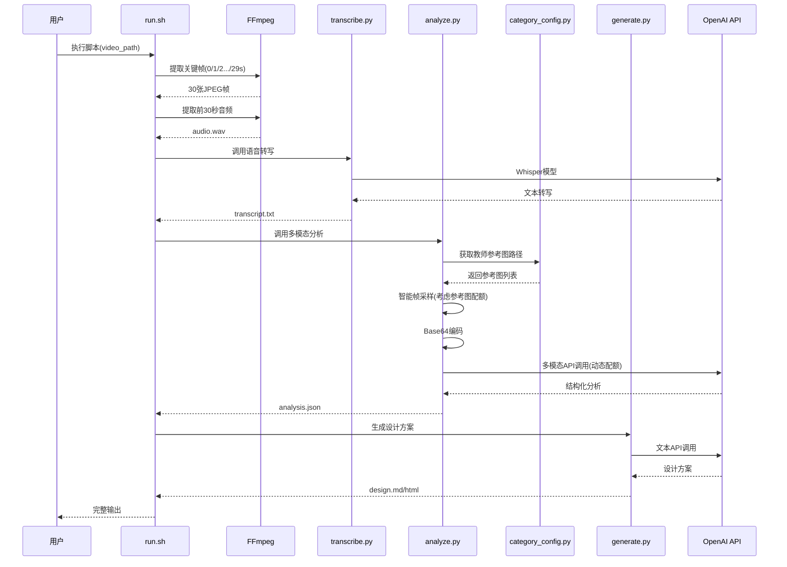
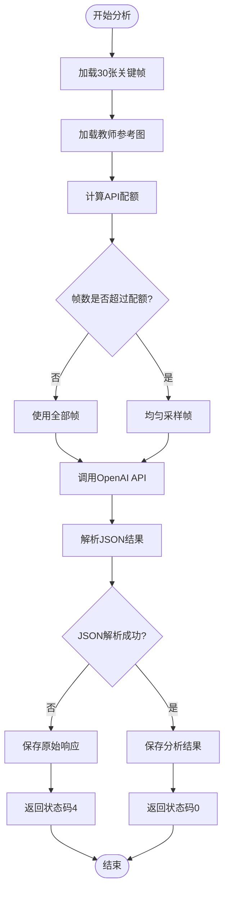
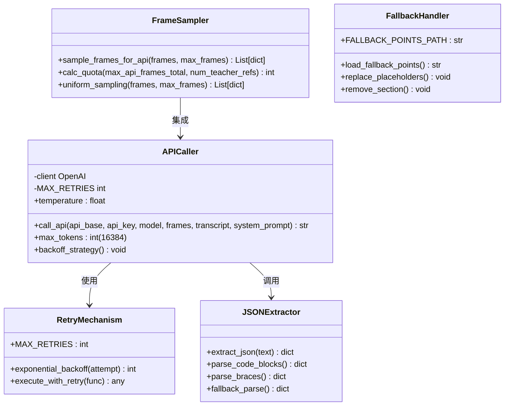
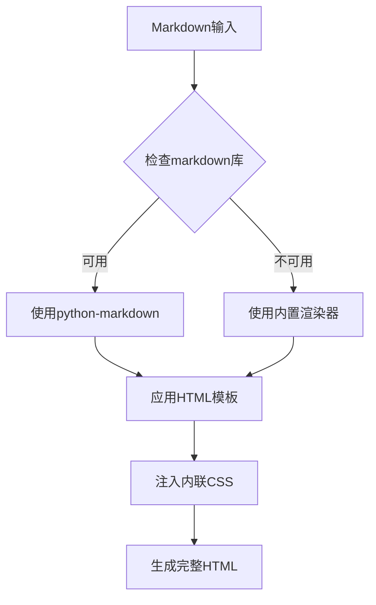
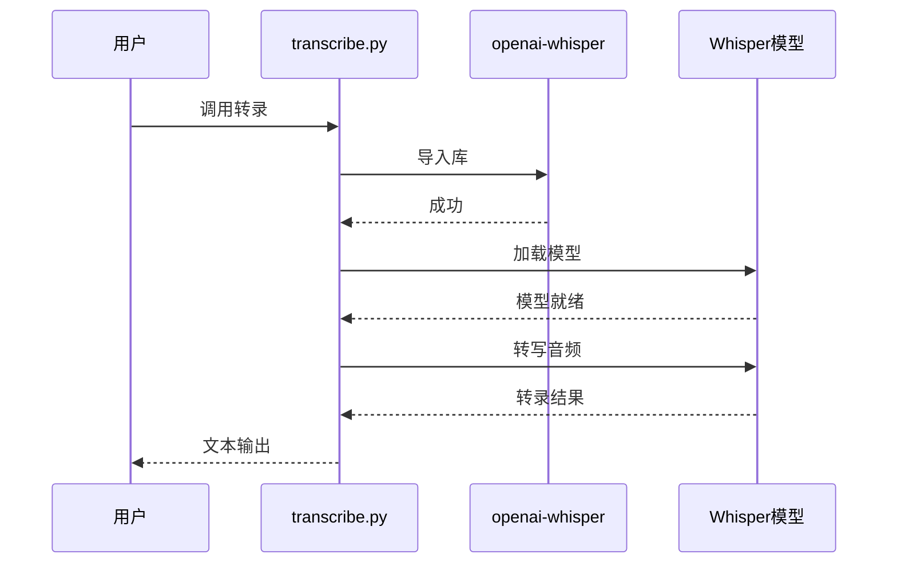
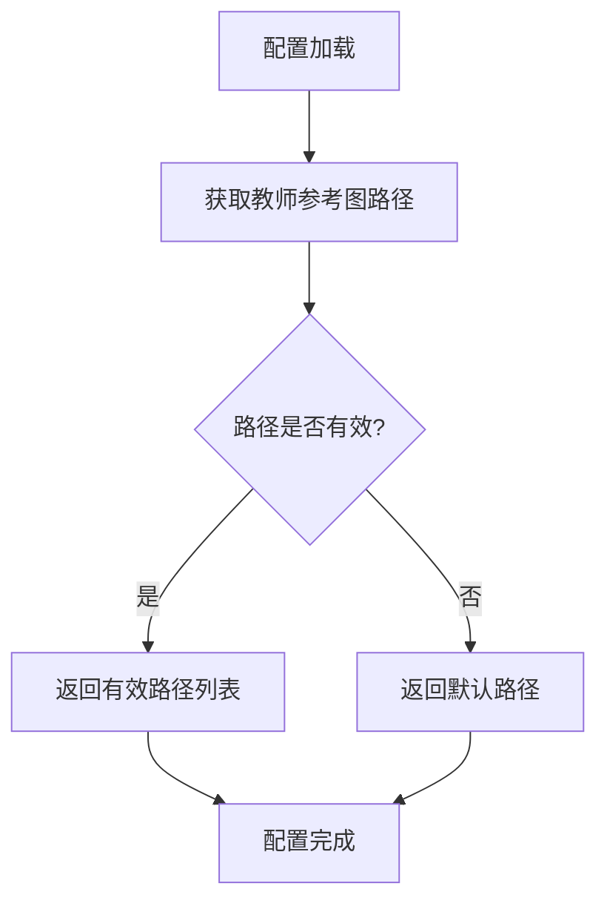

# 多模态分析模块

<cite>
**本文档引用的文件**
- [analyze.py](file://analyze.py)
- [generate.py](file://generate.py)
- [transcribe.py](file://transcribe.py)
- [category_config.py](file://category_config.py)
- [assets/categories/{category}/analyze_prompt.md](file://assets/categories/{category}/analyze_prompt.md)
- [assets/categories/{category}/generate_prompt.md](file://assets/categories/{category}/generate_prompt.md)
- [config.env](file://config.env)
- [requirements.txt](file://requirements.txt)
- [run.sh](file://run.sh)
</cite>

## 更新摘要
**变更内容**
- 修复多模态API处理中的帧采样bug，实现智能帧选择和配额管理
- 新增教师参考图片对API配额的正确考虑机制
- 增强API网关稳定性，通过动态帧采样避免请求体过大
- 优化帧采样策略，确保至少保留2帧用于API调用

## 目录
1. [简介](#简介)
2. [项目结构](#项目结构)
3. [核心组件](#核心组件)
4. [架构概览](#架构概览)
5. [详细组件分析](#详细组件分析)
6. [依赖关系分析](#依赖关系分析)
7. [性能考虑](#性能考虑)
8. [故障排除指南](#故障排除指南)
9. [结论](#结论)

## 简介

多模态分析模块是一个完整的视频内容分析和落地页设计方案生成系统。该模块能够自动从视频广告中提取关键帧图像、进行语音转写、执行多模态分析，并最终生成高质量的落地页 Hero 区域设计方案。

系统采用分阶段处理架构，支持 OpenAI 兼容的多模态 API，具备完善的错误处理、重试机制和结果验证功能。整个流程从视频文件开始，经过关键帧提取、语音转写、多模态分析到最终的设计方案生成，形成一个完整的自动化工作流。

**更新** 新增智能帧采样和配额管理系统，修复了多模态API处理中的帧采样bug，现在能够正确考虑教师参考图片对API配额的影响，显著增强了API网关稳定性。通过动态计算可用帧数并进行均匀采样，确保在不超出API限制的前提下最大化分析效果。

## 项目结构

项目采用清晰的功能模块化组织，每个组件负责特定的任务：

```mermaid
graph TB
subgraph "根目录"
RUN[run.sh]
CONFIG[config.env]
REQ[requirements.txt]
end
subgraph "Python 脚本"
TRANS[transcribe.py]
ANALYZE[analyze.py]
GENERATE[generate.py]
end
subgraph "配置模块"
CATEGORY[category_config.py]
end
subgraph "Prompts"
APROMPT[assets/categories/{category}/analyze_prompt.md]
GPROMPT[assets/categories/{category}/generate_prompt.md]
end
subgraph "输出目录 (output/)"
FRAMES[frames/]
AUDIO[audio.wav]
TRANSCRIPT[transcript.txt]
ANALYSIS[analysis.json]
DESIGN[landing_page_design.md]
HTML[landing_page_design.html]
end
RUN --> TRANS
RUN --> ANALYZE
RUN --> GENERATE
TRANS --> TRANSCRIPT
ANALYZE --> ANALYSIS
GENERATE --> DESIGN
GENERATE --> HTML
ANALYZE --> FRAMES
ANALYZE --> AUDIO
ANALYZE --> APROMPT
ANALYZE --> CATEGORY
GENERATE --> GPROMPT
```

**图表来源**
- [run.sh:1-197](file://run.sh#L1-L197)
- [analyze.py:1-339](file://analyze.py#L1-L339)
- [generate.py:1-848](file://generate.py#L1-L848)
- [transcribe.py:1-71](file://transcribe.py#L1-L71)
- [category_config.py:1-200](file://category_config.py#L1-L200)

**章节来源**
- [run.sh:1-197](file://run.sh#L1-L197)
- [config.env:1-22](file://config.env#L1-L22)
- [requirements.txt:1-6](file://requirements.txt#L1-L6)

## 核心组件

### 1. 视频预处理组件
- **关键帧提取**: 使用 FFmpeg 在 0s、1s、2s、3s、4s、5s、6s、7s、8s、9s、10s、11s、12s、13s、14s、15s、16s、17s、18s、19s、20s、21s、22s、23s、24s、25s、26s、27s、28s、29s 时间点精确截取关键帧
- **音频提取**: 提取视频前 30 秒音频，转换为单声道、16kHz PCM 格式
- **语音转写**: 使用 OpenAI Whisper 进行本地语音识别

### 2. 多模态分析组件
- **智能帧采样**: 动态计算可用帧数，考虑教师参考图片对API配额的影响，进行均匀采样
- **图像处理**: 将 JPEG 图像转换为 Base64 编码
- **Prompt 工程**: 结构化的品类系统提示词设计
- **API 调用**: OpenAI 兼容多模态 API 调用，支持动态配额管理
- **结果解析**: 智能 JSON 结果提取和验证

### 3. 设计方案生成组件
- **模板渲染**: 基于分析结果生成 Markdown 设计方案
- **HTML 渲染**: 自动转换为可独立浏览的 HTML 页面
- **样式定制**: 内联 CSS 样式，支持主题色彩

**章节来源**
- [run.sh:108-157](file://run.sh#L108-L157)
- [analyze.py:47-83](file://analyze.py#L47-L83)
- [generate.py:38-848](file://generate.py#L38-L848)
- [transcribe.py:21-62](file://transcribe.py#L21-L62)

## 架构概览

系统采用流水线式处理架构，每个阶段都有明确的输入输出规范：



**图表来源**
- [run.sh:108-165](file://run.sh#L108-L165)
- [analyze.py:138-211](file://analyze.py#L138-L211)
- [generate.py:58-92](file://generate.py#L58-L92)
- [transcribe.py:21-62](file://transcribe.py#L21-L62)
- [category_config.py:1-200](file://category_config.py#L1-L200)

## 详细组件分析

### 分析组件 (analyze.py)

分析组件是整个系统的核心，负责多模态分析的完整流程，现已集成了智能帧采样和配额管理功能：

#### 智能帧采样机制



**图表来源**
- [analyze.py:90-105](file://analyze.py#L90-L105)
- [analyze.py:319-334](file://analyze.py#L319-L334)

#### 帧采样算法实现

系统实现了智能的帧采样算法，能够动态考虑教师参考图片对API配额的影响：

1. **配额计算**: `max_api_frames = max_api_frames_total - num_teacher_refs`
2. **最小保留**: 至少保留2帧，确保分析的有效性
3. **均匀采样**: 使用数学算法进行均匀分布采样
4. **智能降级**: 当帧数不足时自动调整采样策略

#### 教师参考图片集成

系统新增了教师参考图片处理机制：

- **参考图加载**: 从 `category_config.py` 获取教师参考图片路径
- **配额考虑**: 将参考图片数量从总配额中扣除
- **动态验证**: 检查参考图片文件是否存在
- **智能跳过**: 缺失的参考图片会被自动跳过

#### 关键帧处理机制

分析组件专门处理30张关键帧，采用严格的文件存在性检查：

- **文件命名规范**: `frame_00.jpg` 到 `frame_29.jpg`
- **时间点分布**: 0s, 1s, 2s, 3s, 4s, 5s, 6s, 7s, 8s, 9s, 10s, 11s, 12s, 13s, 14s, 15s, 16s, 17s, 18s, 19s, 20s, 21s, 22s, 23s, 24s, 25s, 26s, 27s, 28s, 29s
- **Base64编码**: 将二进制图像数据转换为ASCII字符串
- **完整性验证**: 确保所有30张帧都存在且可读

#### 品类提示词设计

系统从 `assets/categories/{category}/analyze_prompt.md` 加载当前品类的分析提示词，避免跨品类复用旧模板。

#### Prompt 工程设计

系统使用精心设计的分析提示词，包含多个关键分析维度：

1. **主色调和风格** (color_and_style)
2. **老师信息** (teacher)
3. **课程名称** (course)
4. **痛点** (pain_points)
5. **卖点** (selling_points)
6. **利益点** (benefits)
8. **辅助说明** (supplementary)
9. **课程曲目** (song_list)
10. **效果短标签** (short_tags)
11. **最佳老师形象帧** (best_teacher_frame)
12. **视觉构图分析** (visual_composition)
13. **色彩心理与对比分析** (color_psychology)
14. **字体与排版特征** (typography)
15. **文案链路与情感分析** (copy_strategy)
16. **用户心理与转化洞察** (user_psychology)

每个维度都有明确的提取规则和输出格式要求。

#### API 调用策略



**图表来源**
- [analyze.py:90-105](file://analyze.py#L90-L105)
- [analyze.py:138-211](file://analyze.py#L138-L211)
- [analyze.py:319-334](file://analyze.py#L319-L334)
- [analyze.py:251-263](file://analyze.py#L251-L263)

#### 重试机制实现

分析组件实现了指数退避重试策略：

- **最大重试次数**: 3次
- **退避算法**: 2^(attempt-1) 秒
- **异常捕获**: 捕获所有异常类型
- **错误记录**: 详细的错误日志和重试信息

#### JSON 结果解析

提供了多层次的JSON解析策略：

1. **代码块优先**: 首先查找 ```json ... ``` 代码块
2. **通用代码块**: 查找 ``` ... ``` 代码块并尝试解析
3. **括号截取**: 从第一个 `{` 到最后一个 `}` 截取
4. **直接解析**: 最后的容错解析

**更新** **修复帧采样bug**: 通过实现智能帧采样算法，系统现在能够正确考虑教师参考图片对API配额的影响。新增的 `calc_quota` 和 `uniform_sampling` 函数确保在不超出API限制的前提下最大化分析效果，显著增强了API网关稳定性。

**章节来源**
- [analyze.py:31-32](file://analyze.py#L31-L32)
- [analyze.py:113-135](file://analyze.py#L113-L135)
- [analyze.py:138-211](file://analyze.py#L138-L211)
- [analyze.py:251-263](file://analyze.py#L251-L263)
- [analyze.py:90-105](file://analyze.py#L90-L105)
- [analyze.py:319-334](file://analyze.py#L319-L334)

### 生成组件 (generate.py)

生成组件负责将分析结果转换为可执行的设计方案：

#### HTML 渲染机制



**图表来源**
- [generate.py:97-169](file://generate.py#L97-L169)
- [generate.py:399-412](file://generate.py#L399-L412)

#### 多层回退策略

生成组件实现了三层回退机制：

1. **首选方案**: 使用 `python-markdown` 库进行渲染
2. **次选方案**: 内置的简易 Markdown 渲染器
3. **最终方案**: 极简 HTML 转换

#### 环境变量配置

生成组件支持灵活的环境变量配置：

- **默认配置**: 继承分析组件的配置
- **覆盖配置**: 可单独设置 `GENERATE_*` 环境变量
- **兼容性**: 支持不同的 API 基础地址、密钥和模型名称

**章节来源**
- [generate.py:663-848](file://generate.py#L663-L848)
- [generate.py:97-169](file://generate.py#L97-L169)
- [generate.py:399-412](file://generate.py#L399-L412)

### 转录组件 (transcribe.py)

转录组件使用 Whisper 模型进行本地语音识别：

#### Whisper 集成



**图表来源**
- [transcribe.py:21-62](file://transcribe.py#L21-L62)

#### 性能优化

- **模型缓存**: 加载一次模型，重复使用
- **进度反馈**: 实时显示加载和转写进度
- **错误处理**: 完善的异常捕获和错误报告

**章节来源**
- [transcribe.py:21-62](file://transcribe.py#L21-L62)

### Prompt 工程详解

#### 分析 Prompt 设计原则

分析组件的 Prompt 设计遵循以下原则：

1. **角色明确**: 明确指定为"资深广告创意分析师"
2. **任务清晰**: 详细说明输入数据和分析目标
3. **维度完整**: 覆盖16个关键分析维度
4. **品类参考**: 使用当前品类的提示词和配置约束
5. **格式约束**: 严格要求JSON输出格式
6. **证据标注**: 要求标注信息来源和证据位置

#### 品类内容设计

品类内容通过 config.json 提供候选内容：

1. **痛点候选** (pain_points): 针对当前品类的用户问题
2. **卖点候选** (selling_points): 课程的核心优势和特色
3. **品类字段**: 标题池、内容列表名称、装饰元素等

这些内容通过智能占位符机制集成到分析流程中。

#### 生成 Prompt 参数化策略

生成组件的 Prompt 采用参数化设计：

- **占位符替换**: 将 `analysis_json` 替换为实际的 JSON 字符串
- **动态内容**: 根据分析结果调整设计方案重点
- **格式控制**: 保持固定的输出结构和格式要求

**章节来源**
- [assets/categories/{category}/analyze_prompt.md:1-255](file://assets/categories/{category}/analyze_prompt.md#L1-L255)
- [assets/categories/{category}/generate_prompt.md:1-193](file://assets/categories/{category}/generate_prompt.md#L1-L193)

### 配置模块 (category_config.py)

配置模块提供了分类相关的配置管理功能：

#### 教师参考图片配置



**图表来源**
- [category_config.py:1-200](file://category_config.py#L1-L200)

#### 配置功能特性

1. **动态路径解析**: 根据类别配置动态获取教师参考图片路径
2. **路径验证**: 确保返回的路径都是有效的文件路径
3. **默认回退**: 当配置无效时提供默认的备选路径
4. **环境变量支持**: 支持通过环境变量自定义配置路径

**章节来源**
- [category_config.py:1-200](file://category_config.py#L1-L200)

## 依赖关系分析

系统依赖关系清晰，模块间耦合度低：

```mermaid
graph TB
subgraph "外部依赖"
OPENAI[openai>=1.0.0]
WHISPER[openai-whisper>=20231117]
MARKDOWN[markdown>=3.5]
REQUESTS[requests>=2.28.0]
PIL[Pillow>=10.0.0]
end
subgraph "内部模块"
RUNNER[run.sh]
TRANS[transcribe.py]
ANALYZE[analyze.py]
GEN[generate.py]
CATEGORY[category_config.py]
end
subgraph "配置文件"
ENV[config.env]
PROMPTS[assets/categories/{category}/]
ASSETS[assets/]
end
RUNNER --> TRANS
RUNNER --> ANALYZE
RUNNER --> GEN
TRANS --> WHISPER
ANALYZE --> OPENAI
ANALYZE --> CATEGORY
GEN --> OPENAI
GEN --> MARKDOWN
ANALYZE --> ENV
GEN --> ENV
ANALYZE --> PROMPTS
ANALYZE --> ASSETS
GEN --> PROMPTS
```

**图表来源**
- [requirements.txt:1-6](file://requirements.txt#L1-L6)
- [run.sh:50-62](file://run.sh#L50-L62)

### 外部依赖管理

系统对外部依赖进行了明确的版本要求：

- **OpenAI SDK**: 版本 >= 1.0.0，提供多模态 API 支持
- **Whisper**: 版本 >= 20231117，用于本地语音识别
- **Markdown**: 版本 >= 3.5，用于 HTML 渲染
- **Requests**: 版本 >= 2.28.0，用于HTTP请求
- **Pillow**: 版本 >= 10.0.0，用于图像处理

### 内部模块交互

各模块间通过标准输出和文件系统进行通信：

- **标准输出**: 用于进程间状态传递和错误报告
- **文件系统**: 通过 `output/` 目录进行数据交换
- **环境变量**: 用于配置参数传递

**章节来源**
- [requirements.txt:1-6](file://requirements.txt#L1-L6)
- [run.sh:50-62](file://run.sh#L50-L62)

## 性能考虑

### 并行处理优化

系统在多个环节实现了性能优化：

1. **关键帧提取**: 使用 FFmpeg 的精确 seek 功能，避免全视频扫描
2. **模型缓存**: Whisper 模型只加载一次，重复使用
3. **API 调用**: 指数退避重试，平衡成功率和等待时间
4. **品类配置缓存**: 品类配置读取后重复使用
5. **智能帧采样**: 动态计算配额，避免不必要的API调用

### 内存管理

- **流式处理**: 关键帧以 Base64 形式在内存中处理
- **文件清理**: 及时清理中间文件，避免磁盘空间占用
- **异常安全**: 使用 try-except 确保资源正确释放

### 网络优化

- **连接复用**: OpenAI 客户端自动管理连接池
- **超时控制**: API 调用具有合理的超时设置
- **错误恢复**: 多重重试机制提高成功率
- **配额感知**: 智能计算配额，避免网络超载

**更新** **增强API网关稳定性**: 通过智能帧采样和配额管理，系统现在能够动态适应API限制，避免请求体过大导致的网关超时。新增的 `calc_quota` 函数确保教师参考图片不会占用API配额，同时保证至少保留2帧用于分析。

## 故障排除指南

### 常见问题诊断

#### 环境配置问题

| 问题类型 | 症状 | 解决方案 |
|---------|------|----------|
| 缺少环境变量 | 程序立即退出，显示缺失变量 | 检查 `config.env` 文件或设置环境变量 |
| API 配置错误 | API 调用失败，返回认证错误 | 验证 API_BASE_URL、API_KEY、MODEL_NAME |
| Whisper 模型下载 | 模型加载失败 | 确保网络连接正常，重新安装依赖 |
| 品类配置缺失 | 流程报错并提示创建配置 | 检查 `assets/categories/{category}/config.json` 是否存在 |
| **帧采样异常** | **API调用频繁超时** | **检查 MAX_API_FRAMES 设置，确保考虑教师参考图数量** |
| **配额不足** | **API返回配额错误** | **调整 MAX_API_FRAMES 或减少教师参考图数量** |

#### 文件处理问题

| 问题类型 | 症状 | 解决方案 |
|---------|------|----------|
| 关键帧缺失 | FileNotFoundError: 缺少关键帧 | 检查视频时长是否足够，确认 FFmpeg 安装 |
| 转写失败 | 转写结果为空 | 检查音频质量，确认音频文件有效 |
| JSON 解析错误 | JSONDecodeError | 检查 API 返回格式，查看 `analysis_raw.txt` |
| 品类配置加载失败 | Prompt占位符无法正确替换 | 检查config.json格式和编码 |
| **教师参考图缺失** | **教师识别不准确** | **检查参考图文件是否存在，确认路径配置正确** |

#### API 调用问题

| 问题类型 | 症状 | 解决方案 |
|---------|------|----------|
| 认证失败 | 401/403 错误 | 验证 API 密钥有效性 |
| 速率限制 | 429 错误 | 实现指数退避，增加重试间隔 |
| **配额超限** | **429 错误：请求过于频繁** | **降低 MAX_API_FRAMES，增加重试间隔** |
| **网络超时** | **Timeout 错误** | **检查网络连接，增加超时时间，优化帧采样** |
| **请求体过大** | **413 错误：请求实体过大** | **减少帧数，考虑教师参考图配额影响** |

### 调试工具

系统提供了多种调试和排错工具：

1. **原始响应保存**: 当 JSON 解析失败时，自动保存原始 API 响应
2. **详细日志**: 每个步骤都有详细的进度和错误信息
3. **状态检查**: 中间文件的存在性检查确保流程完整性
4. **品类配置检查**: 检查品类配置和模板是否存在
5. **帧采样日志**: 新增的帧采样过程日志，显示采样决策

**更新** **新增帧采样故障排除**: 新增了针对帧采样bug的专门故障排除指导，包括配额计算错误、教师参考图缺失等问题的诊断和解决方案。

**章节来源**
- [analyze.py:271-279](file://analyze.py#L271-L279)
- [run.sh:175-197](file://run.sh#L175-L197)

## 结论

多模态分析模块是一个设计精良、功能完整的自动化系统。它成功地将视频内容分析、语音转写、多模态理解和设计生成整合在一个统一的工作流中。

**更新** 新增的智能帧采样和配额管理功能显著提升了系统的稳定性和可靠性。通过修复帧采样bug，系统现在能够正确考虑教师参考图片对API配额的影响，实现了动态配额计算和均匀采样策略。这不仅增强了API网关稳定性，还确保了在各种配置环境下都能获得最佳的分析效果。

### 主要优势

1. **模块化设计**: 清晰的职责分离，便于维护和扩展
2. **健壮性**: 完善的错误处理和重试机制
3. **可配置性**: 灵活的环境变量配置支持不同部署需求
4. **可观察性**: 详细的日志输出和中间文件保存
5. **容错性**: 多层回退机制确保系统稳定性
6. **品类约束**: 品类配置和模板约束提升分析质量
7. **智能帧采样**: 新增的配额感知采样机制，提升API稳定性
8. **动态优化**: 自适应的帧选择策略，最大化分析效果

### 技术亮点

- **Prompt 工程**: 结构化的提示词设计，确保输出质量和一致性
- **指数退避**: 智能的重试策略，在成功率和性能之间取得平衡
- **多格式解析**: 灵活的 JSON 解析策略，提高结果可靠性
- **HTML 渲染**: 内置的 Markdown 到 HTML 转换，无需额外依赖
- **智能占位符**: 品类配置的自动注入机制
- **配额感知**: 智能的帧采样策略，考虑教师参考图对API配额的影响
- **动态采样**: 均匀分布的帧选择算法，确保分析质量

### 改进建议

1. **超时配置**: 可以考虑将 API 超时时间设为可配置参数
2. **并发处理**: 可以考虑并行处理多个视频文件
3. **结果缓存**: 可以实现分析结果的缓存机制
4. **监控集成**: 可以添加更详细的性能指标和监控
5. **品类内容管理**: 可以考虑实现品类配置的动态更新机制
6. **智能配额优化**: 可以实现更智能的配额使用策略，根据内容复杂度动态调整
7. **采样算法优化**: 可以考虑实现基于内容重要性的智能采样算法

该系统为视频内容的智能分析和设计生成提供了完整的解决方案，适合在各种营销和内容创作场景中使用。新增的智能帧采样功能和API稳定性改进进一步提升了系统的适应性和分析质量。