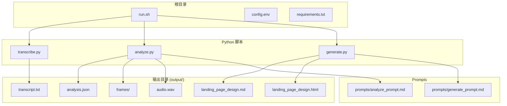
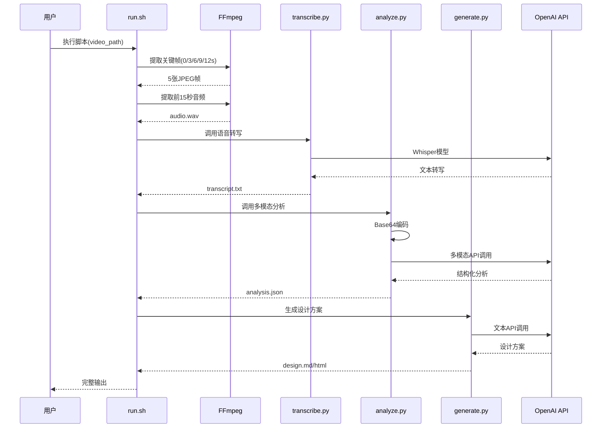
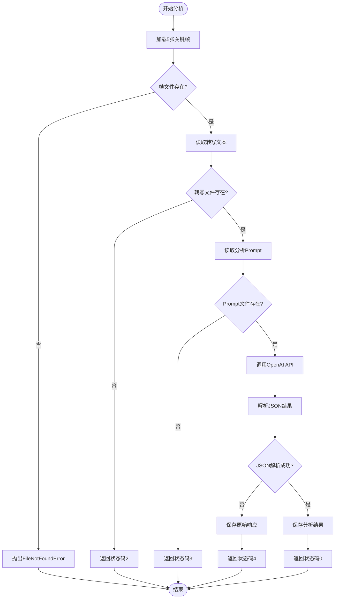
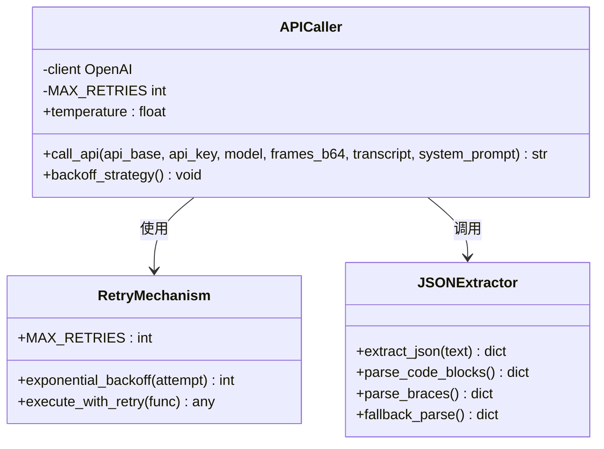
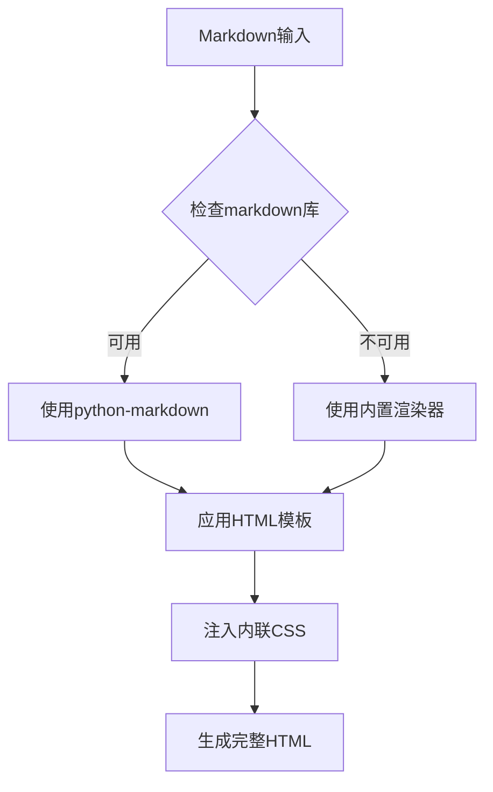
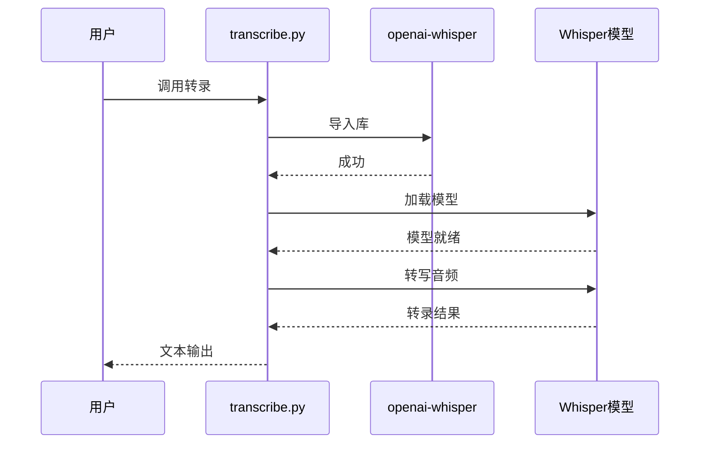
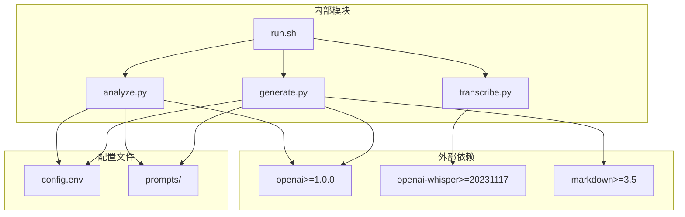

# 多模态分析模块

<cite>
**本文档引用的文件**
- [analyze.py](file://analyze.py)
- [generate.py](file://generate.py)
- [transcribe.py](file://transcribe.py)
- [prompts/analyze_prompt.md](file://prompts/analyze_prompt.md)
- [prompts/generate_prompt.md](file://prompts/generate_prompt.md)
- [config.env](file://config.env)
- [requirements.txt](file://requirements.txt)
- [run.sh](file://run.sh)
</cite>

## 目录
1. [简介](#简介)
2. [项目结构](#项目结构)
3. [核心组件](#核心组件)
4. [架构概览](#架构概览)
5. [详细组件分析](#详细组件分析)
6. [依赖关系分析](#依赖关系分析)
7. [性能考虑](#性能考虑)
8. [故障排除指南](#故障排除指南)
9. [结论](#结论)

## 简介

多模态分析模块是一个完整的视频内容分析和落地页设计方案生成系统。该模块能够自动从视频广告中提取关键帧图像、进行语音转写、执行多模态分析，并最终生成高质量的落地页 Hero 区域设计方案。

系统采用分阶段处理架构，支持 OpenAI 兼容的多模态 API，具备完善的错误处理、重试机制和结果验证功能。整个流程从视频文件开始，经过关键帧提取、语音转写、多模态分析到最终的设计方案生成，形成一个完整的自动化工作流。

## 项目结构

项目采用清晰的功能模块化组织，每个组件负责特定的任务：



**图表来源**
- [run.sh:1-138](file://run.sh#L1-L138)
- [analyze.py:1-177](file://analyze.py#L1-L177)
- [generate.py:1-377](file://generate.py#L1-L377)
- [transcribe.py:1-67](file://transcribe.py#L1-L67)

**章节来源**
- [run.sh:1-138](file://run.sh#L1-L138)
- [config.env:1-13](file://config.env#L1-L13)
- [requirements.txt:1-4](file://requirements.txt#L1-L4)

## 核心组件

### 1. 视频预处理组件
- **关键帧提取**: 使用 FFmpeg 在 0s、3s、6s、9s、12s 时间点精确截取关键帧
- **音频提取**: 提取视频前 15 秒音频，转换为单声道、16kHz PCM 格式
- **语音转写**: 使用 OpenAI Whisper 进行本地语音识别

### 2. 多模态分析组件
- **图像处理**: 将 JPEG 图像转换为 Base64 编码
- **Prompt 工程**: 结构化的系统提示词设计
- **API 调用**: OpenAI 兼容多模态 API 调用
- **结果解析**: 智能 JSON 结果提取和验证

### 3. 设计方案生成组件
- **模板渲染**: 基于分析结果生成 Markdown 设计方案
- **HTML 渲染**: 自动转换为可独立浏览的 HTML 页面
- **样式定制**: 内联 CSS 样式，支持主题色彩

**章节来源**
- [run.sh:72-128](file://run.sh#L72-L128)
- [analyze.py:33-176](file://analyze.py#L33-L176)
- [generate.py:38-372](file://generate.py#L38-L372)
- [transcribe.py:21-62](file://transcribe.py#L21-L62)

## 架构概览

系统采用流水线式处理架构，每个阶段都有明确的输入输出规范：



**图表来源**
- [run.sh:72-128](file://run.sh#L72-L128)
- [analyze.py:76-126](file://analyze.py#L76-L126)
- [generate.py:38-68](file://generate.py#L38-L68)
- [transcribe.py:21-62](file://transcribe.py#L21-L62)

## 详细组件分析

### 分析组件 (analyze.py)

分析组件是整个系统的核心，负责多模态分析的完整流程：

#### 数据处理流程



**图表来源**
- [analyze.py:128-172](file://analyze.py#L128-L172)

#### 关键帧处理机制

分析组件专门处理5张关键帧，采用严格的文件存在性检查：

- **文件命名规范**: `frame_00.jpg` 到 `frame_04.jpg`
- **时间点分布**: 0s, 3s, 6s, 9s, 12s
- **Base64编码**: 将二进制图像数据转换为ASCII字符串
- **完整性验证**: 确保所有5张帧都存在且可读

#### Prompt 工程设计

系统使用精心设计的分析提示词，包含7个关键分析维度：

1. **主色调和风格** (color_and_style)
2. **老师信息** (teacher)
3. **课程名称** (course)
4. **痛点** (pain_points)
5. **卖点** (selling_points)
6. **利益点** (benefits)
7. **辅助说明** (supplementary)

每个维度都有明确的提取规则和输出格式要求。

#### API 调用策略



**图表来源**
- [analyze.py:76-126](file://analyze.py#L76-L126)
- [analyze.py:53-74](file://analyze.py#L53-L74)

#### 重试机制实现

分析组件实现了指数退避重试策略：

- **最大重试次数**: 3次
- **退避算法**: 2^(attempt-1) 秒
- **异常捕获**: 捕获所有异常类型
- **错误记录**: 详细的错误日志和重试信息

#### JSON 结果解析

提供了多层次的JSON解析策略：

1. **代码块优先**: 首先查找 ```json ... ``` 代码块
2. **通用代码块**: 查找 ``` ... ``` 代码块并尝试解析
3. **括号截取**: 从第一个 `{` 到最后一个 `}` 截取
4. **直接解析**: 最后的容错解析

**章节来源**
- [analyze.py:33-45](file://analyze.py#L33-L45)
- [analyze.py:53-74](file://analyze.py#L53-L74)
- [analyze.py:76-126](file://analyze.py#L76-L126)
- [analyze.py:128-172](file://analyze.py#L128-L172)

### 生成组件 (generate.py)

生成组件负责将分析结果转换为可执行的设计方案：

#### HTML 渲染机制



**图表来源**
- [generate.py:73-146](file://generate.py#L73-L146)
- [generate.py:317-321](file://generate.py#L317-L321)

#### 多层回退策略

生成组件实现了三层回退机制：

1. **首选方案**: 使用 `python-markdown` 库进行渲染
2. **次选方案**: 内置的简易 Markdown 渲染器
3. **最终方案**: 极简 HTML 转换

#### 环境变量配置

生成组件支持灵活的环境变量配置：

- **默认配置**: 继承分析组件的配置
- **覆盖配置**: 可单独设置 `GENERATE_*` 环境变量
- **兼容性**: 支持不同的 API 基础地址、密钥和模型名称

**章节来源**
- [generate.py:38-68](file://generate.py#L38-L68)
- [generate.py:73-146](file://generate.py#L73-L146)
- [generate.py:325-372](file://generate.py#L325-L372)

### 转录组件 (transcribe.py)

转录组件使用 Whisper 模型进行本地语音识别：

#### Whisper 集成



**图表来源**
- [transcribe.py:21-62](file://transcribe.py#L21-L62)

#### 性能优化

- **模型缓存**: 加载一次模型，重复使用
- **进度反馈**: 实时显示加载和转写进度
- **错误处理**: 完善的异常捕获和错误报告

**章节来源**
- [transcribe.py:21-62](file://transcribe.py#L21-L62)

### Prompt 工程详解

#### 分析 Prompt 设计原则

分析组件的 Prompt 设计遵循以下原则：

1. **角色明确**: 明确指定为"资深广告创意分析师"
2. **任务清晰**: 详细说明输入数据和分析目标
3. **维度完整**: 覆盖7个关键分析维度
4. **格式约束**: 严格要求JSON输出格式
5. **证据标注**: 要求标注信息来源和证据位置

#### 生成 Prompt 参数化策略

生成组件的 Prompt 采用参数化设计：

- **占位符替换**: 将 `analysis_json` 替换为实际的 JSON 字符串
- **动态内容**: 根据分析结果调整设计方案重点
- **格式控制**: 保持固定的输出结构和格式要求

**章节来源**
- [prompts/analyze_prompt.md:1-111](file://prompts/analyze_prompt.md#L1-L111)
- [prompts/generate_prompt.md:1-69](file://prompts/generate_prompt.md#L1-L69)

## 依赖关系分析

系统依赖关系清晰，模块间耦合度低：



**图表来源**
- [requirements.txt:1-4](file://requirements.txt#L1-L4)
- [run.sh:42-52](file://run.sh#L42-L52)

### 外部依赖管理

系统对外部依赖进行了明确的版本要求：

- **OpenAI SDK**: 版本 >= 1.0.0，提供多模态 API 支持
- **Whisper**: 版本 >= 20231117，用于本地语音识别
- **Markdown**: 版本 >= 3.5，用于 HTML 渲染

### 内部模块交互

各模块间通过标准输出和文件系统进行通信：

- **标准输出**: 用于进程间状态传递和错误报告
- **文件系统**: 通过 `output/` 目录进行数据交换
- **环境变量**: 用于配置参数传递

**章节来源**
- [requirements.txt:1-4](file://requirements.txt#L1-L4)
- [run.sh:42-52](file://run.sh#L42-L52)

## 性能考虑

### 并行处理优化

系统在多个环节实现了性能优化：

1. **关键帧提取**: 使用 FFmpeg 的精确 seek 功能，避免全视频扫描
2. **模型缓存**: Whisper 模型只加载一次，重复使用
3. **API 调用**: 指数退避重试，平衡成功率和等待时间

### 内存管理

- **流式处理**: 关键帧以 Base64 形式在内存中处理
- **文件清理**: 及时清理中间文件，避免磁盘空间占用
- **异常安全**: 使用 try-except 确保资源正确释放

### 网络优化

- **连接复用**: OpenAI 客户端自动管理连接池
- **超时控制**: API 调用具有合理的超时设置
- **错误恢复**: 多重重试机制提高成功率

## 故障排除指南

### 常见问题诊断

#### 环境配置问题

| 问题类型 | 症状 | 解决方案 |
|---------|------|----------|
| 缺少环境变量 | 程序立即退出，显示缺失变量 | 检查 `config.env` 文件或设置环境变量 |
| API 配置错误 | API 调用失败，返回认证错误 | 验证 API_BASE_URL、API_KEY、MODEL_NAME |
| Whisper 模型下载 | 模型加载失败 | 确保网络连接正常，重新安装依赖 |

#### 文件处理问题

| 问题类型 | 症状 | 解决方案 |
|---------|------|----------|
| 关键帧缺失 | FileNotFoundError: 缺少关键帧 | 检查视频时长是否足够，确认 FFmpeg 安装 |
| 转写失败 | 转写结果为空 | 检查音频质量，确认音频文件有效 |
| JSON 解析错误 | JSONDecodeError | 检查 API 返回格式，查看 `analysis_raw.txt` |

#### API 调用问题

| 问题类型 | 症状 | 解决方案 |
|---------|------|----------|
| 认证失败 | 401/403 错误 | 验证 API 密钥有效性 |
| 速率限制 | 429 错误 | 实现指数退避，增加重试间隔 |
| 网络超时 | Timeout 错误 | 检查网络连接，增加超时时间 |

### 调试工具

系统提供了多种调试和排错工具：

1. **原始响应保存**: 当 JSON 解析失败时，自动保存原始 API 响应
2. **详细日志**: 每个步骤都有详细的进度和错误信息
3. **状态检查**: 中间文件的存在性检查确保流程完整性

**章节来源**
- [analyze.py:158-163](file://analyze.py#L158-L163)
- [run.sh:130-138](file://run.sh#L130-L138)

## 结论

多模态分析模块是一个设计精良、功能完整的自动化系统。它成功地将视频内容分析、语音转写、多模态理解和设计生成整合在一个统一的工作流中。

### 主要优势

1. **模块化设计**: 清晰的职责分离，便于维护和扩展
2. **健壮性**: 完善的错误处理和重试机制
3. **可配置性**: 灵活的环境变量配置支持不同部署需求
4. **可观察性**: 详细的日志输出和中间文件保存
5. **容错性**: 多层回退机制确保系统稳定性

### 技术亮点

- **Prompt 工程**: 结构化的提示词设计，确保输出质量和一致性
- **指数退避**: 智能的重试策略，在成功率和性能之间取得平衡
- **多格式解析**: 灵活的 JSON 解析策略，提高结果可靠性
- **HTML 渲染**: 内置的 Markdown 到 HTML 转换，无需额外依赖

### 改进建议

1. **超时配置**: 可以考虑将 API 超时时间设为可配置参数
2. **并发处理**: 可以考虑并行处理多个视频文件
3. **结果缓存**: 可以实现分析结果的缓存机制
4. **监控集成**: 可以添加更详细的性能指标和监控

该系统为视频内容的智能分析和设计生成提供了完整的解决方案，适合在各种营销和内容创作场景中使用。