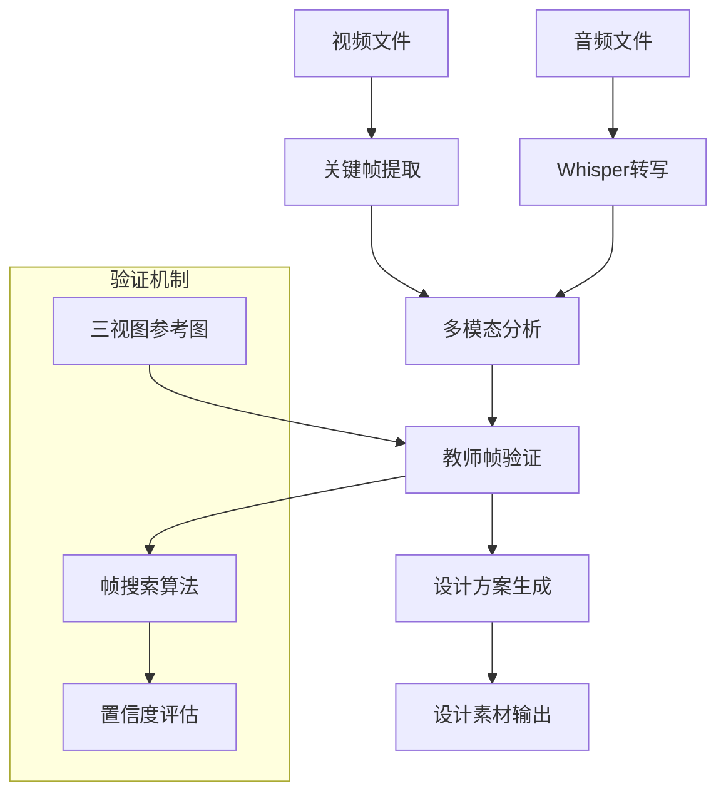
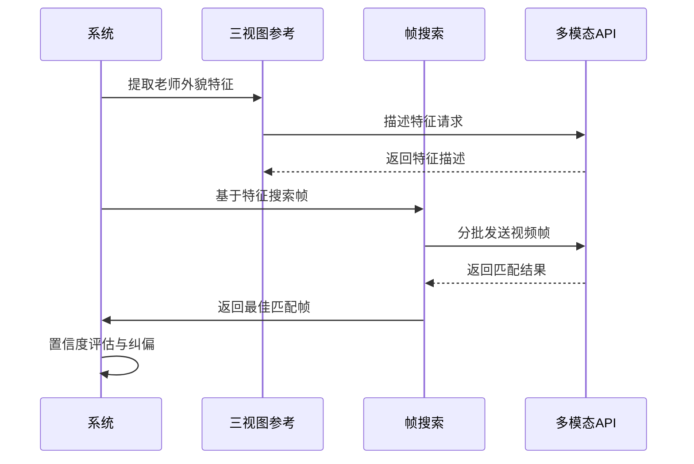
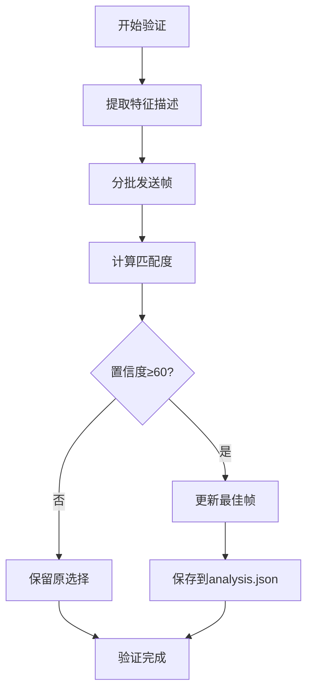
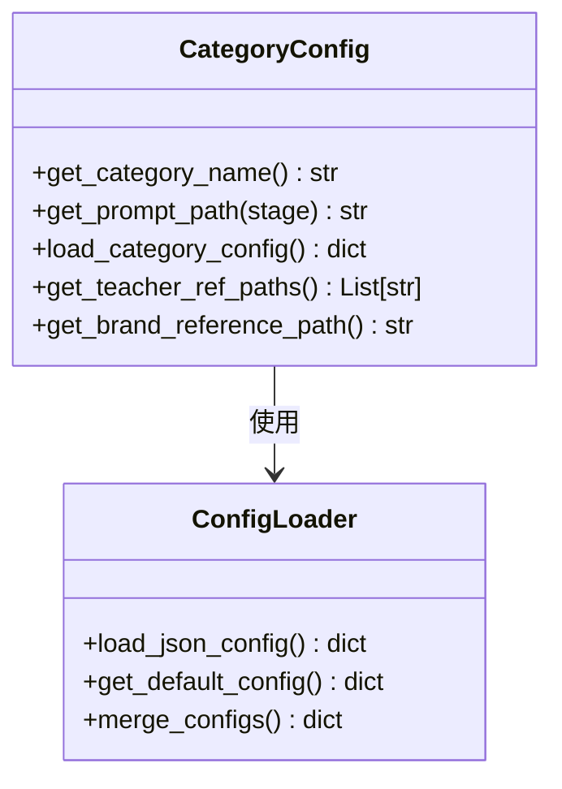
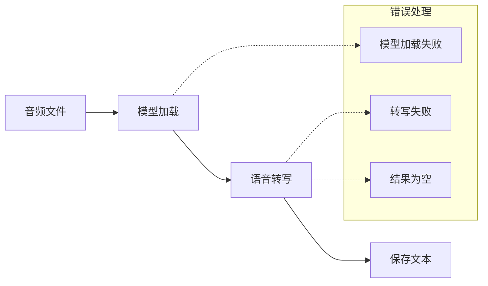
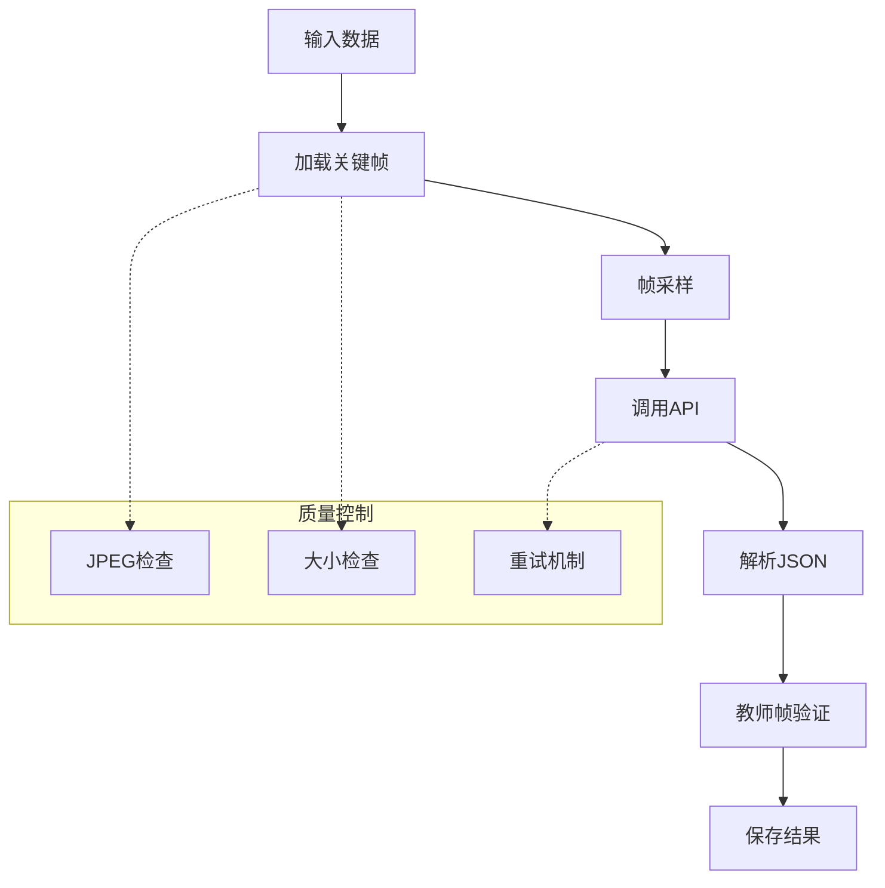
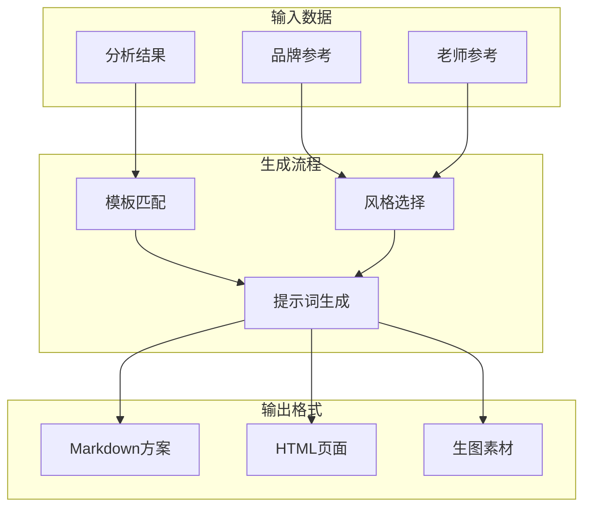
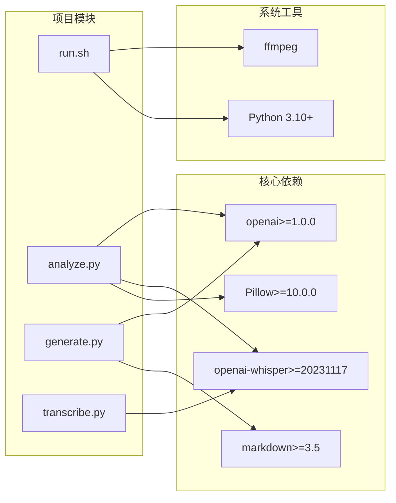
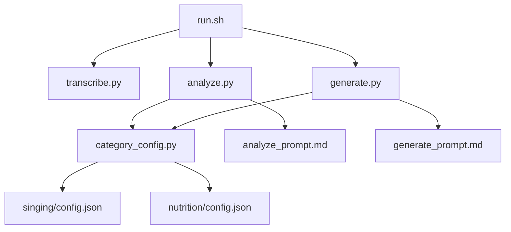
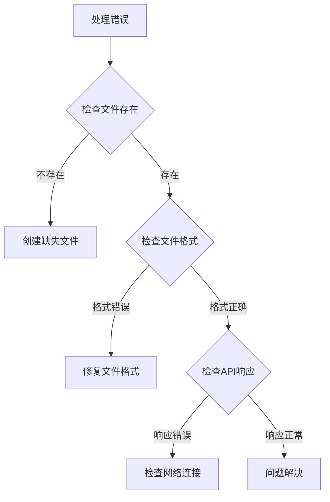

# 教师帧验证系统

<cite>
**本文档引用的文件**
- [README.md](file://README.md)
- [run.sh](file://run.sh)
- [transcribe.py](file://transcribe.py)
- [analyze.py](file://analyze.py)
- [generate.py](file://generate.py)
- [category_config.py](file://category_config.py)
- [assets/categories/{category}/analyze_prompt.md](file://assets/categories/{category}/analyze_prompt.md)
- [assets/categories/{category}/generate_prompt.md](file://assets/categories/{category}/generate_prompt.md)
- [requirements.txt](file://requirements.txt)
- [assets/categories/singing/config.json](file://assets/categories/singing/config.json)
- [assets/categories/nutrition/config.json](file://assets/categories/nutrition/config.json)
</cite>

## 目录
1. [简介](#简介)
2. [项目结构](#项目结构)
3. [核心组件](#核心组件)
4. [架构概览](#架构概览)
5. [详细组件分析](#详细组件分析)
6. [依赖关系分析](#依赖关系分析)
7. [性能考虑](#性能考虑)
8. [故障排除指南](#故障排除指南)
9. [结论](#结论)

## 简介

教师帧验证系统是一个专为中老年课程营销设计的AI自动化流水线，旨在将广告视频前30秒转换为落地页Hero区域的多套AI生图设计方案。该系统通过多模态分析技术，自动提取视频中的关键信息，包括老师形象、痛点卖点、课程内容等，并生成多种风格的落地页设计方案。

系统的核心特色在于其独特的"教师帧验证"机制，通过三视图参考图与视频帧的智能匹配，确保选中的老师形象帧真正代表视频中的主要老师，从而保证最终设计的一致性和准确性。

## 项目结构

该项目采用模块化的Python脚本架构，主要包含以下核心文件：

```mermaid
graph TB
subgraph "主程序入口"
RUN[run.sh]
end
subgraph "数据处理模块"
TRANS[transcribe.py]
ANALYZE[analyze.py]
GEN[generate.py]
end
subgraph "配置管理"
CATCFG[category_config.py]
PROMPTS[assets/categories/{category}/]
end
subgraph "资源文件"
ASSETS[assets/]
REQ[requirements.txt]
end
RUN --> TRANS
RUN --> ANALYZE
RUN --> GEN
ANALYZE --> CATCFG
GEN --> CATCFG
ANALYZE --> PROMPTS
GEN --> PROMPTS
CATCFG --> ASSETS
```

**图表来源**
- [run.sh:1-205](file://run.sh#L1-205)
- [analyze.py:1-618](file://analyze.py#L1-618)
- [generate.py:1-800](file://generate.py#L1-800)

**章节来源**
- [README.md:1-205](file://README.md#L1-L205)
- [run.sh:1-205](file://run.sh#L1-L205)

## 核心组件

### 数据采集与预处理层

系统通过ffmpeg进行视频处理，自动截取前30秒的关键帧，每秒一张，总共30张关键帧。同时提取对应的音频和转写文本。

### 多模态分析引擎

利用OpenAI兼容的多模态API，对关键帧图片和转写文本进行综合分析，提取结构化营销信息。

### 教师帧验证机制

这是系统的核心创新点，通过以下步骤确保老师形象的准确性：

1. **特征提取**：从三视图参考图中提取老师的外貌特征
2. **帧搜索**：在所有视频帧中搜索匹配的老师帧
3. **置信度评估**：计算匹配度评分，确保选择最合适的帧
4. **自动纠偏**：当置信度低于阈值时，保留原始选择

### 设计方案生成器

基于分析结果，生成多种风格的落地页设计方案，包括不同的布局、配色和文案策略。

**章节来源**
- [analyze.py:561-610](file://analyze.py#L561-L610)
- [generate.py:692-754](file://generate.py#L692-L754)

## 架构概览

系统采用端到端的流水线架构，从视频输入到最终设计输出：



**图表来源**
- [run.sh:108-174](file://run.sh#L108-L174)
- [analyze.py:561-610](file://analyze.py#L561-L610)

## 详细组件分析

### 教师帧验证系统

#### 核心算法流程



**图表来源**
- [analyze.py:241-425](file://analyze.py#L241-L425)

#### 验证机制详细流程



**图表来源**
- [analyze.py:311-425](file://analyze.py#L311-L425)

#### 配置管理系统

系统支持多品类配置，通过`category_config.py`实现：



**图表来源**
- [category_config.py:1-169](file://category_config.py#L1-L169)

**章节来源**
- [analyze.py:241-425](file://analyze.py#L241-L425)
- [category_config.py:1-169](file://category_config.py#L1-L169)

### 数据处理管道

#### 转写处理模块



**图表来源**
- [transcribe.py:22-66](file://transcribe.py#L22-L66)

#### 分析处理模块



**图表来源**
- [analyze.py:52-88](file://analyze.py#L52-L88)
- [analyze.py:143-238](file://analyze.py#L143-L238)

**章节来源**
- [transcribe.py:1-71](file://transcribe.py#L1-L71)
- [analyze.py:52-238](file://analyze.py#L52-L238)

### 设计生成系统

#### 多风格生成机制



**图表来源**
- [generate.py:644-754](file://generate.py#L644-L754)

**章节来源**
- [generate.py:644-754](file://generate.py#L644-L754)

## 依赖关系分析

### 外部依赖

系统依赖以下核心库：



**图表来源**
- [requirements.txt:1-6](file://requirements.txt#L1-L6)
- [run.sh:64-72](file://run.sh#L64-L72)

### 内部模块依赖



**图表来源**
- [run.sh:148-174](file://run.sh#L148-L174)
- [category_config.py:57-99](file://category_config.py#L57-L99)

**章节来源**
- [requirements.txt:1-6](file://requirements.txt#L1-L6)
- [run.sh:148-174](file://run.sh#L148-L174)

## 性能考虑

### 并发处理优化

系统采用分批处理策略来优化API调用性能：

- **帧采样**：当帧数超过限制时，使用均匀采样算法确保首尾帧都被保留
- **分批搜索**：在教师帧验证中，每批最多5帧，避免API限制
- **重试机制**：指数退避重试，最多3次尝试

### 内存管理

- **文件大小检查**：单张帧图片超过5MB时发出警告
- **总大小限制**：所有帧图片总计超过60MB时发出警告
- **临时文件清理**：截帧失败时自动清理空文件

### 网络优化

- **API Base URL规范化**：自动添加/v1后缀
- **连接复用**：同一会话内复用OpenAI客户端实例
- **超时控制**：合理的API调用超时设置

## 故障排除指南

### 常见问题诊断

#### 环境配置问题

| 问题类型 | 症状 | 解决方案 |
|---------|------|----------|
| ffmpeg缺失 | `ffmpeg: command not found` | 安装ffmpeg并加入PATH |
| Whisper模型下载 | 首次运行缓慢 | 使用`WHISPER_MODEL=tiny`加速 |
| API配置错误 | `model does not support images` | 确认MODEL_NAME支持图像输入 |

#### 数据处理问题



#### 性能问题

- **转写速度慢**：检查Whisper模型大小设置
- **API调用超时**：检查网络连接和代理设置
- **内存不足**：减少MAX_API_FRAMES参数

**章节来源**
- [README.md:179-200](file://README.md#L179-L200)

## 结论

教师帧验证系统通过创新的多模态分析技术和严格的验证机制，为中老年课程营销提供了高质量的落地页设计方案生成能力。系统的主要优势包括：

1. **准确性保证**：通过三视图参考图与视频帧的智能匹配，确保老师形象的准确性
2. **多风格生成**：基于分析结果自动生成多种风格的设计方案
3. **适老化设计**：严格遵循中老年用户的设计原则和可读性要求
4. **自动化程度高**：从视频输入到设计输出的完整自动化流程
5. **扩展性强**：支持多品类配置和自定义模板

该系统特别适用于营销设计团队，能够显著提高落地页Hero区域的设计效率和质量，为中老年课程的推广提供强有力的技术支持。