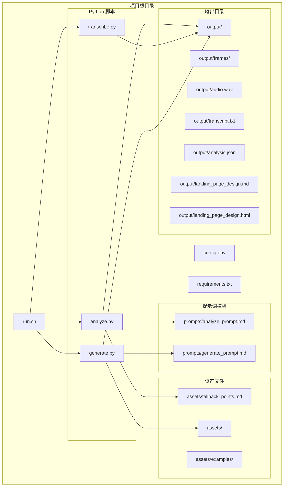
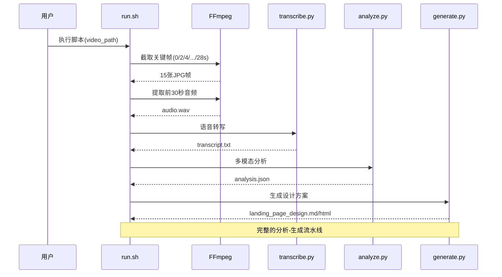
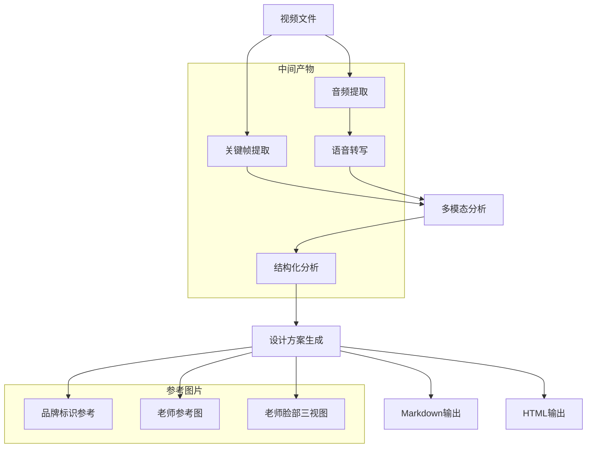
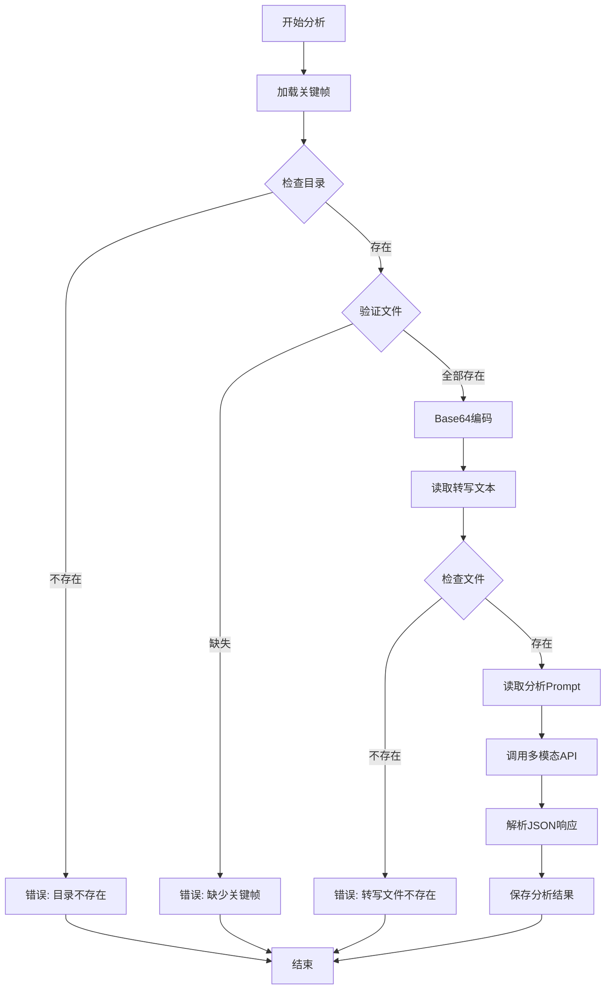
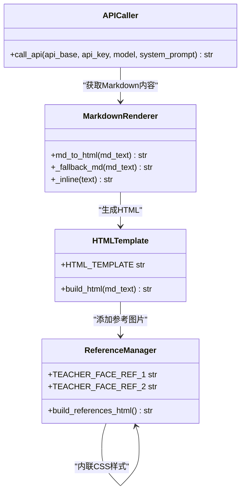
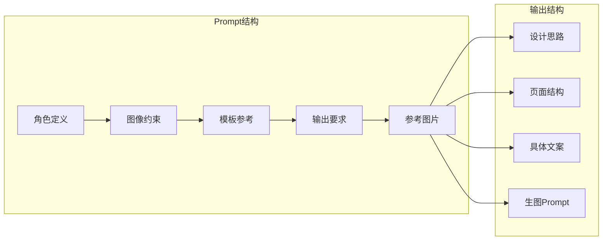
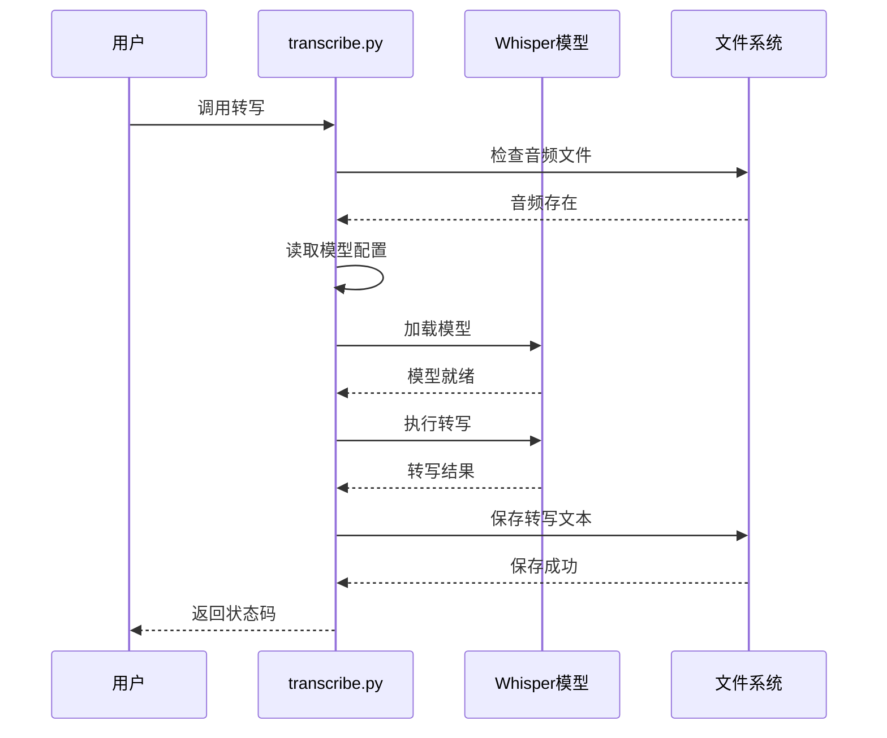
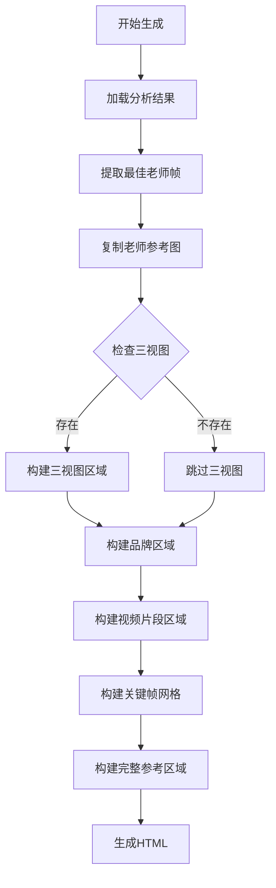

# 方案生成模块

<cite>
**本文档引用的文件**
- [analyze.py](file://analyze.py)
- [generate.py](file://generate.py)
- [transcribe.py](file://transcribe.py)
- [run.sh](file://run.sh)
- [config.env](file://config.env)
- [config.env.example](file://config.env.example)
- [prompts/analyze_prompt.md](file://prompts/analyze_prompt.md)
- [prompts/generate_prompt.md](file://prompts/generate_prompt.md)
- [requirements.txt](file://requirements.txt)
- [assets/fallback_points.md](file://assets/fallback_points.md)
</cite>

## 更新摘要
**变更内容**
- 新增老师脸部三视图参考系统，支持多角度面部特征一致性控制
- 更新教师图像约束，严格要求参照三视图保持面部五官一致性
- 改进提示词系统，增强生成质量控制和参考图片管理
- 新增HTML渲染中的参考图片区域，支持多维度素材展示

## 目录
1. [简介](#简介)
2. [项目结构](#项目结构)
3. [核心组件](#核心组件)
4. [架构概览](#架构概览)
5. [详细组件分析](#详细组件分析)
6. [依赖关系分析](#依赖关系分析)
7. [性能考虑](#性能考虑)
8. [故障排除指南](#故障排除指南)
9. [结论](#结论)

## 简介

方案生成模块是一个完整的多模态分析和落地页设计方案生成系统。该系统能够从视频广告中提取关键信息，生成结构化的分析报告，并基于分析结果自动生成落地页 Hero 区域的设计方案。系统采用模块化设计，支持多种输出格式，包括 Markdown 和 HTML，并提供了完善的错误处理和重试机制。

**重大更新**：新增老师脸部三视图参考系统，通过多角度面部特征参考确保生成内容的视觉一致性，显著提升了生成质量控制能力。

## 项目结构

项目采用清晰的功能模块化组织，每个核心功能都有独立的脚本文件：



**图表来源**
- [run.sh:1-197](file://run.sh#L1-L197)
- [analyze.py:1-293](file://analyze.py#L1-L293)
- [generate.py:1-761](file://generate.py#L1-L761)
- [transcribe.py:1-67](file://transcribe.py#L1-L67)

**章节来源**
- [run.sh:1-197](file://run.sh#L1-L197)
- [config.env:1-22](file://config.env#L1-L22)

## 核心组件

### 多模态分析组件 (analyze.py)

分析组件负责从视频中提取结构化信息，支持图像和文本的多模态分析：

- **关键帧处理**：自动截取视频前15秒的关键帧（0s, 3s, 6s, 9s, 12s）
- **JSON解析**：稳健的JSON提取算法，支持多种格式
- **API调用**：OpenAI兼容的多模态API集成
- **错误处理**：指数退避重试机制

### 落地页生成组件 (generate.py)

生成组件基于分析结果创建完整的落地页设计方案：

- **Markdown渲染**：支持python-markdown和降级渲染器
- **HTML模板系统**：内联CSS的完整HTML页面生成，包含多维度参考图片展示
- **Prompt工程**：专门设计的生成式Prompt模板，包含严格的教师图像约束
- **双格式输出**：同时生成Markdown和HTML格式
- **参考图片管理**：支持品牌标识、老师参考图、脸部三视图等多种素材

### 语音转写组件 (transcribe.py)

本地Whisper ASR转写服务：

- **模型管理**：支持不同大小的Whisper模型
- **音频处理**：标准化音频格式（16kHz, 单声道）
- **文本输出**：清理和格式化的转写文本

**章节来源**
- [analyze.py:1-293](file://analyze.py#L1-L293)
- [generate.py:1-761](file://generate.py#L1-L761)
- [transcribe.py:1-67](file://transcribe.py#L1-L67)

## 架构概览

系统采用流水线式架构，每个阶段都有明确的输入输出：



**图表来源**
- [run.sh:108-165](file://run.sh#L108-L165)
- [analyze.py:213-288](file://analyze.py#L213-L288)
- [generate.py:663-756](file://generate.py#L663-L756)
- [transcribe.py:21-67](file://transcribe.py#L21-L67)

### 数据流架构



**图表来源**
- [run.sh:108-165](file://run.sh#L108-L165)
- [analyze.py:222-285](file://analyze.py#L222-L285)
- [generate.py:445-471](file://generate.py#L445-L471)

## 详细组件分析

### 分析组件深度解析

#### 关键帧处理机制

分析组件实现了精确的关键帧截取和验证机制：



**图表来源**
- [analyze.py:222-285](file://analyze.py#L222-L285)

#### JSON解析算法

组件实现了多层次的JSON解析策略：

1. **代码块提取**：优先匹配```json...```格式
2. **通用代码块**：回退到```...```格式
3. **手动截取**：从第一个{到最后一个}进行截取
4. **直接解析**：最后尝试直接JSON解析

**章节来源**
- [analyze.py:113-135](file://analyze.py#L113-L135)
- [analyze.py:267-279](file://analyze.py#L267-L279)

### 生成组件深度解析

#### HTML渲染系统

生成组件提供了双重Markdown渲染机制：



**图表来源**
- [generate.py:97-169](file://generate.py#L97-L169)
- [generate.py:399-412](file://generate.py#L399-L412)
- [generate.py:423-545](file://generate.py#L423-L545)
- [generate.py:58-92](file://generate.py#L58-L92)

#### Prompt工程设计

生成组件使用精心设计的Prompt模板，包含严格的教师图像约束：



**图表来源**
- [prompts/generate_prompt.md:1-137](file://prompts/generate_prompt.md#L1-L137)

**章节来源**
- [generate.py:97-169](file://generate.py#L97-L169)
- [generate.py:399-412](file://generate.py#L399-L412)
- [generate.py:423-545](file://generate.py#L423-L545)
- [prompts/generate_prompt.md:53-56](file://prompts/generate_prompt.md#L53-L56)

### 转写组件深度解析

#### Whisper集成架构

转写组件提供了灵活的Whisper模型管理：



**图表来源**
- [transcribe.py:21-67](file://transcribe.py#L21-L67)

**章节来源**
- [transcribe.py:21-67](file://transcribe.py#L21-L67)

### 参考图片管理系统

#### 新增老师脸部三视图参考系统

生成组件新增了完整的参考图片管理系统：



**图表来源**
- [generate.py:423-545](file://generate.py#L423-L545)

**章节来源**
- [generate.py:445-471](file://generate.py#L445-L471)
- [generate.py:692-714](file://generate.py#L692-L714)

## 依赖关系分析

### Python依赖关系

```mermaid
graph TB
subgraph "运行时依赖"
OPENAI[openai>=1.0.0]
WHISPER[openai-whisper>=20231117]
MARKDOWN[markdown>=3.5]
END
subgraph "分析组件"
ANALYZE[analyze.py]
OPENAI
FALLBACK[assets/fallback_points.md]
end
subgraph "生成组件"
GENERATE[generate.py]
OPENAI
MARKDOWN
ASSETS[assets/]
TEACHER_FACE_REF_1[assets/teacher_face_ref_1.jpg]
TEACHER_FACE_REF_2[assets/teacher_face_ref_2.jpg]
end
subgraph "转写组件"
TRANSCRIBE[transcribe.py]
WHISPER
end
ANALYZE --> OPENAI
ANALYZE --> FALLBACK
GENERATE --> OPENAI
GENERATE --> MARKDOWN
GENERATE --> ASSETS
GENERATE --> TEACHER_FACE_REF_1
GENERATE --> TEACHER_FACE_REF_2
TRANSCRIBE --> WHISPER
```

**图表来源**
- [requirements.txt:1-4](file://requirements.txt#L1-L4)
- [analyze.py:140-142](file://analyze.py#L140-L142)
- [generate.py:59-62](file://generate.py#L59-L62)
- [transcribe.py:30-34](file://transcribe.py#L30-L34)

### 系统依赖

系统需要以下外部工具：

| 组件 | 依赖工具 | 版本要求 | 用途 |
|------|----------|----------|------|
| run.sh | ffmpeg | 最新版本 | 视频处理和音频提取 |
| Python | Python 3.x | 3.6+ | 脚本执行 |
| 分析组件 | OpenAI API | 1.0.0+ | 多模态分析 |
| 生成组件 | Python Markdown | 3.5+ | HTML渲染 |
| 转写组件 | Whisper | 20231117+ | 语音转写 |

**章节来源**
- [requirements.txt:1-4](file://requirements.txt#L1-L4)
- [run.sh:64-72](file://run.sh#L64-L72)

## 性能考虑

### 并发处理策略

系统采用串行流水线处理模式，每个阶段完成后才进入下一阶段，这种设计的优势在于：

- **资源控制**：避免同时占用大量内存和CPU资源
- **错误隔离**：单个阶段的失败不会影响其他阶段
- **调试友好**：每个阶段都有明确的中间产物

### 内存优化

- **流式处理**：音频和视频文件以流式方式处理
- **分块读取**：大文件分块读取，避免内存溢出
- **及时释放**：处理完成后及时释放内存

### 网络优化

- **指数退避**：API调用失败时采用指数退避重试
- **超时控制**：合理的超时设置避免长时间阻塞
- **连接复用**：同一会话内复用API连接

## 故障排除指南

### 常见问题及解决方案

#### 环境配置问题

| 问题类型 | 症状 | 解决方案 |
|----------|------|----------|
| 缺少环境变量 | 分析阶段报错：缺少API配置 | 在config.env中正确配置API信息 |
| 依赖缺失 | 导入错误：未安装相关库 | 运行pip install -r requirements.txt |
| ffmpeg缺失 | 截帧失败 | 安装ffmpeg并确保在PATH中 |

#### 数据处理问题

| 问题类型 | 症状 | 解决方案 |
|----------|------|----------|
| 关键帧缺失 | 分析报错：缺少关键帧 | 检查视频时长是否足够 |
| 转写失败 | 转写文本为空 | 检查音频质量，尝试更大模型 |
| JSON解析失败 | 分析报错：JSON解析失败 | 检查模型输出格式，查看analysis_raw.txt |
| 三视图缺失 | 生成警告：缺少老师脸部三视图 | 确保assets/teacher_face_ref_1.jpg和assets/teacher_face_ref_2.jpg存在 |

#### API调用问题

| 问题类型 | 症状 | 解决方案 |
|----------|------|----------|
| 认证失败 | API返回401 | 检查API_KEY配置 |
| 速率限制 | API返回429 | 降低请求频率或增加等待时间 |
| 网络超时 | 请求超时 | 检查网络连接，增加重试次数 |

**章节来源**
- [analyze.py:286-288](file://analyze.py#L286-L288)
- [generate.py:715-756](file://generate.py#L715-L756)
- [transcribe.py:21-67](file://transcribe.py#L21-L67)

### 调试技巧

1. **查看中间产物**：检查output目录中的中间文件
2. **启用详细日志**：观察脚本输出的详细信息
3. **验证配置**：确认config.env中的配置正确
4. **测试依赖**：单独运行各个组件验证功能
5. **检查参考图片**：确保assets目录中的参考图片完整

## 结论

方案生成模块是一个设计精良的多模态分析系统，具有以下特点：

### 技术优势

- **模块化设计**：每个功能都有独立的脚本文件，便于维护和扩展
- **健壮性**：完善的错误处理和重试机制
- **灵活性**：支持多种输出格式和配置选项
- **可扩展性**：清晰的架构便于添加新的分析维度
- **质量控制**：新增的三视图参考系统显著提升了生成质量一致性

### 应用价值

- **自动化程度高**：从视频到设计方案的完整自动化流程
- **质量稳定**：基于结构化分析的数据驱动设计
- **成本效益**：减少人工设计工作量，提高效率
- **一致性**：确保设计方案与原始视频内容保持一致
- **专业性**：严格的教师图像约束确保视觉专业性

### 改进建议

1. **并发处理**：可以考虑在不冲突的情况下并行处理某些阶段
2. **缓存机制**：为重复分析结果添加缓存功能
3. **监控系统**：添加详细的性能监控和日志记录
4. **配置管理**：提供更灵活的配置文件管理机制
5. **质量评估**：添加生成内容的质量评估和反馈机制

**重大更新总结**：新增的老师脸部三视图参考系统通过多角度面部特征参考，显著提升了生成内容的视觉一致性，这是系统质量控制能力的重要里程碑。严格的教师图像约束确保了最终生成内容的专业性和准确性，为后续的生图生成提供了可靠的基础。

该系统为视频内容的数字化转型提供了强有力的技术支撑，能够有效提升内容创作和设计工作的效率与质量。