# 方案生成模块

<cite>
**本文档引用的文件**
- [analyze.py](file://analyze.py)
- [generate.py](file://generate.py)
- [transcribe.py](file://transcribe.py)
- [generate_image.py](file://generate_image.py)
- [run.sh](file://run.sh)
- [config.env](file://config.env)
- [config.env.example](file://config.env.example)
- [prompts/analyze_prompt.md](file://prompts/analyze_prompt.md)
- [prompts/generate_prompt.md](file://prompts/generate_prompt.md)
- [requirements.txt](file://requirements.txt)
- [assets/fallback_points.md](file://assets/fallback_points.md)
- [output/landing_page_design.md](file://output/landing_page_design.md)
- [output/欧阳珍-成曌天-唱歌-通用-11/design_refer/page1/prompt.md](file://output/欧阳珍-成曌天-唱歌-通用-11/design_refer/page1/prompt.md)
</cite>

## 更新摘要
**变更内容**
- 模板系统从'Template A-K'重构为'Inspiration A-K'，提供更灵活的设计灵感参考
- 新增颜色约束和多样性管理机制，确保5个变体在视频主色调范围内进行差异化设计
- 改进教师识别准确性，通过面部三视图参考图增强老师身份识别的可靠性
- 增强变体提取系统，支持二级（##）和三级（###）标题格式的变体标记
- 改进API稳定性，增加最大token限制（16384）和温度参数优化
- 新增颜色多样性约束和可访问性改进，确保设计方案的专业性和适老化特性
- 增强write_design_refer函数，支持批量生成设计素材文件夹
- 优化HTML渲染中的参考图片区域，支持多维度素材展示

## 目录
1. [简介](#简介)
2. [项目结构](#项目结构)
3. [核心组件](#核心组件)
4. [架构概览](#架构概览)
5. [详细组件分析](#详细组件分析)
6. [依赖关系分析](#依赖关系分析)
7. [性能考虑](#性能考虑)
8. [故障排除指南](#故障排除指南)
9. [结论](#结论)

## 简介

方案生成模块是一个完整的多模态分析和落地页设计方案生成系统。该系统能够从视频广告中提取关键信息，生成结构化的分析报告，并基于分析结果自动生成落地页 Hero 区域的设计方案。系统采用模块化设计，支持多种输出格式，包括 Markdown 和 HTML，并提供了完善的错误处理和重试机制。

**重大更新**：模板系统从'Template A-K'重构为'Inspiration A-K'，提供更灵活的设计灵感参考，鼓励设计师基于视频特征自由组合和创新布局。新增颜色约束和多样性管理机制，确保5个变体在视频主色调范围内进行差异化设计，避免跨色系跳变。改进教师识别准确性，通过面部三视图参考图增强老师身份识别的可靠性，显著提升了设计方案的一致性和专业性。

## 项目结构

项目采用清晰的功能模块化组织，每个核心功能都有独立的脚本文件：

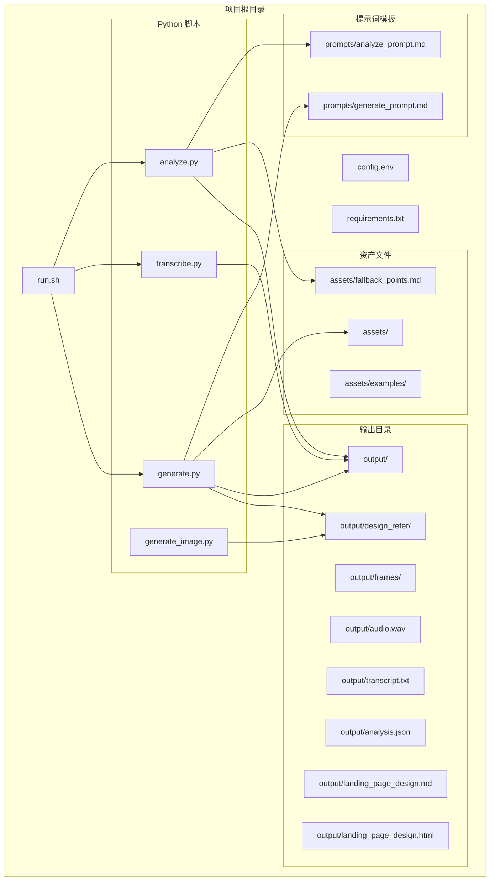

**图表来源**
- [run.sh:1-197](file://run.sh#L1-L197)
- [analyze.py:1-294](file://analyze.py#L1-L294)
- [generate.py:1-848](file://generate.py#L1-L848)
- [transcribe.py:1-67](file://transcribe.py#L1-L67)
- [generate_image.py:1-459](file://generate_image.py#L1-L459)

**章节来源**
- [run.sh:1-197](file://run.sh#L1-L197)
- [config.env:1-22](file://config.env#L1-L22)

## 核心组件

### 多模态分析组件 (analyze.py)

分析组件负责从视频中提取结构化信息，支持图像和文本的多模态分析：

- **关键帧处理**：自动截取视频前15秒的关键帧（0s, 3s, 6s, 9s, 12s）
- **JSON解析**：稳健的JSON提取算法，支持多种格式
- **API调用**：OpenAI兼容的多模态API集成，支持最大16384 token限制
- **错误处理**：指数退避重试机制
- **教师识别增强**：通过面部三视图参考图增强老师身份识别的准确性

### 视觉预处理组件 (describe_teacher_outfit)

**新增**：专门负责从老师参考图中提取着装描述的视觉预处理系统：

- **多模态图像分析**：使用OpenAI兼容的多模态模型分析图片内容
- **着装描述提取**：自动生成简洁准确的着装描述（颜色、款式、配饰）
- **温度参数优化**：设置temperature=0.2确保描述的准确性
- **错误处理**：完善的异常捕获和重试机制

### 落地页生成组件 (generate.py)

生成组件基于分析结果创建完整的落地页设计方案：

- **Markdown渲染**：支持python-markdown和降级渲染器
- **HTML模板系统**：内联CSS的完整HTML页面生成，包含多维度参考图片展示
- **Prompt工程**：专门设计的生成式Prompt模板，包含严格的教师图像约束
- **四维分析框架**：视觉布局、色彩字体、文案策略、用户心理四个维度的系统分析
- **双格式输出**：同时生成Markdown和HTML格式
- **参考图片管理**：支持品牌标识、老师参考图、脸部三视图等多种素材
- **变体提取系统**：智能识别二级（##）和三级（###）标题格式的变体标记，支持批量生成设计素材
- **颜色多样性约束**：确保5个变体使用不同配色方案，提升设计方案的专业性
- **模板系统重构**：从'Template A-K'重构为'Inspiration A-K'，提供更灵活的设计灵感参考

### 语音转写组件 (transcribe.py)

本地Whisper ASR转写服务：

- **模型管理**：支持不同大小的Whisper模型
- **音频处理**：标准化音频格式（16kHz, 单声道）
- **文本输出**：清理和格式化的转写文本

### 生图生成组件 (generate_image.py)

**新增**：专门负责根据生成的设计方案创建落地页图片的组件：

- **批量生图**：支持多个变体的批量图片生成
- **参考图管理**：自动管理老师参考图、脸部三视图和品牌logo
- **API集成**：与gpt-image-2 API集成，支持多模态图片编辑
- **质量控制**：自动调整图片尺寸和质量，确保输出一致性

**章节来源**
- [analyze.py:1-294](file://analyze.py#L1-L294)
- [generate.py:59-121](file://generate.py#L59-L121)
- [generate.py:123-157](file://generate.py#L123-L157)
- [generate.py:619-723](file://generate.py#L619-L723)
- [transcribe.py:1-67](file://transcribe.py#L1-L67)
- [generate_image.py:1-459](file://generate_image.py#L1-L459)

## 架构概览

系统采用流水线式架构，每个阶段都有明确的输入输出：

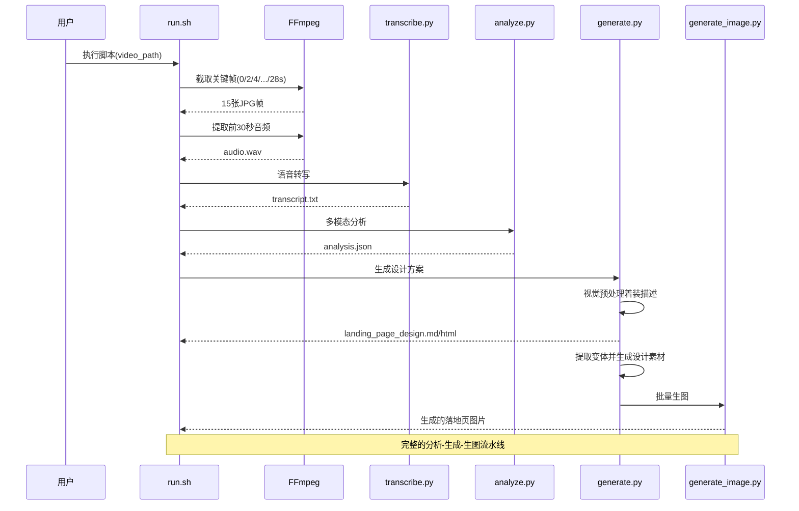

**图表来源**
- [run.sh:108-165](file://run.sh#L108-L165)
- [analyze.py:214-294](file://analyze.py#L214-L294)
- [generate.py:728-848](file://generate.py#L728-L848)
- [transcribe.py:21-67](file://transcribe.py#L21-L67)
- [generate_image.py:1-459](file://generate_image.py#L1-L459)

### 数据流架构

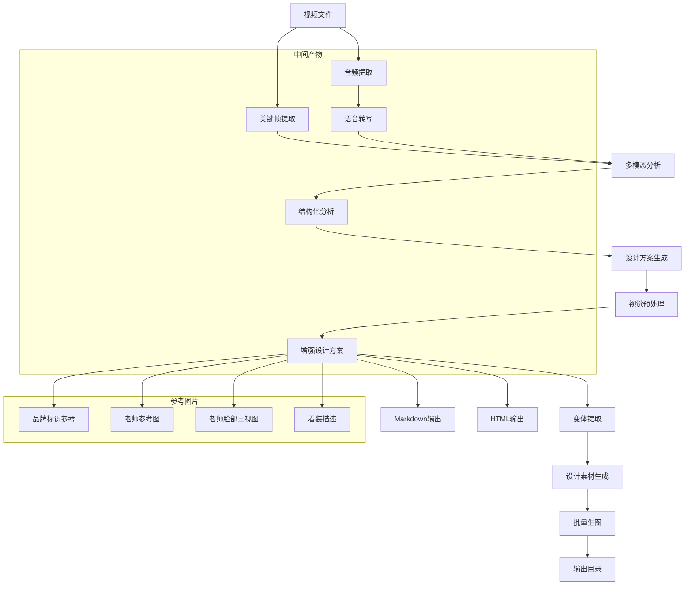

**图表来源**
- [run.sh:108-165](file://run.sh#L108-L165)
- [analyze.py:224-294](file://analyze.py#L224-L294)
- [generate.py:756-848](file://generate.py#L756-L848)

## 详细组件分析

### 分析组件深度解析

#### 关键帧处理机制

分析组件实现了精确的关键帧截取和验证机制：

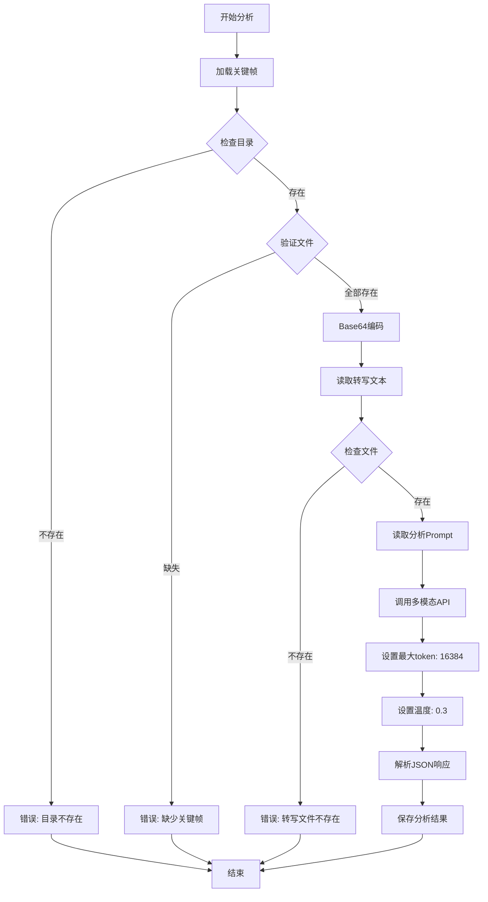

**图表来源**
- [analyze.py:224-294](file://analyze.py#L224-L294)

#### JSON解析算法

组件实现了多层次的JSON解析策略：

1. **代码块提取**：优先匹配```json...```格式
2. **通用代码块**：回退到```...```格式
3. **手动截取**：从第一个{到最后一个}进行截取
4. **直接解析**：最后尝试直接JSON解析

#### 教师识别增强机制

**更新**：分析组件增强了教师身份识别的准确性：

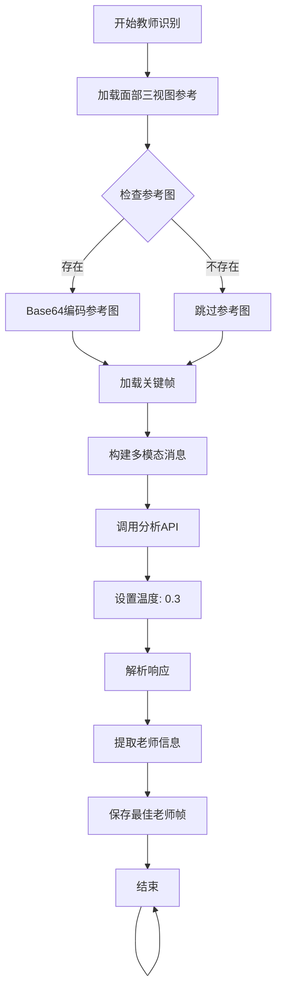

**图表来源**
- [analyze.py:153-184](file://analyze.py#L153-L184)

**章节来源**
- [analyze.py:113-135](file://analyze.py#L113-L135)
- [analyze.py:267-279](file://analyze.py#L267-L279)

### 视觉预处理组件深度解析

#### describe_teacher_outfit函数实现

**新增**：这是系统的核心视觉预处理功能，负责从老师参考图中提取准确的着装描述：

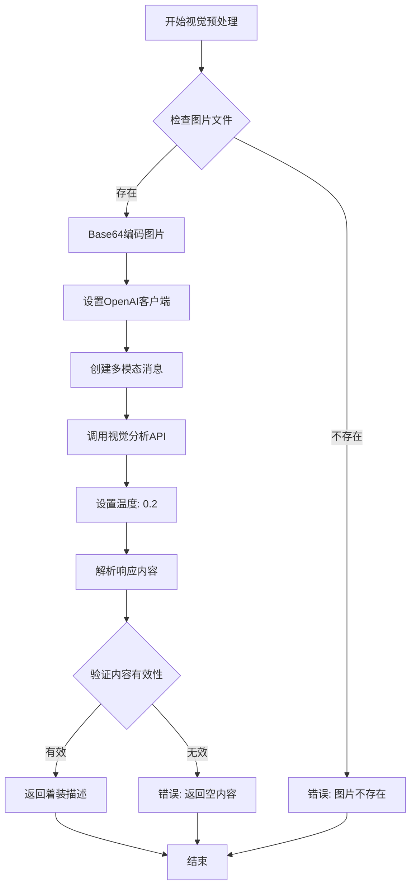

**图表来源**
- [generate.py:59-121](file://generate.py#L59-L121)

#### API调用参数优化

视觉预处理系统采用了专门优化的API调用参数：

- **温度参数**：temperature=0.2，确保描述的准确性和一致性
- **最大token限制**：支持较长的上下文理解
- **错误重试**：最多3次重试，每次指数退避
- **专用API密钥**：支持独立的视觉分析API配置

**章节来源**
- [generate.py:59-121](file://generate.py#L59-L121)

### 生成组件深度解析

#### HTML渲染系统

生成组件提供了双重Markdown渲染机制：

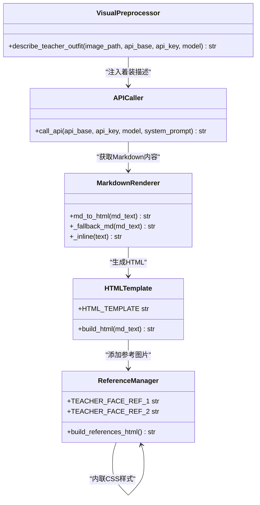

**图表来源**
- [generate.py:162-234](file://generate.py#L162-L234)
- [generate.py:464-477](file://generate.py#L464-L477)
- [generate.py:488-611](file://generate.py#L488-L611)
- [generate.py:59-121](file://generate.py#L59-L121)

#### Prompt工程设计

生成组件使用精心设计的Prompt模板，包含严格的教师图像约束：

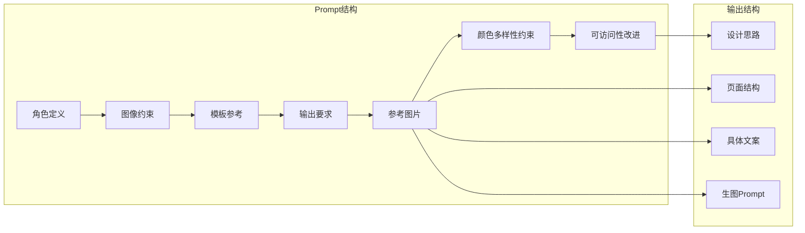

**图表来源**
- [prompts/generate_prompt.md:1-193](file://prompts/generate_prompt.md#L1-L193)

**章节来源**
- [generate.py:162-234](file://generate.py#L162-L234)
- [generate.py:464-477](file://generate.py#L464-L477)
- [generate.py:488-611](file://generate.py#L488-L611)
- [prompts/generate_prompt.md:58-63](file://prompts/generate_prompt.md#L58-L63)

### 变体提取系统深度解析

#### 增强的变体提取机制

**更新**：新增 extract_variants 函数，支持二级（##）和三级（###）标题格式的变体标记

系统现在能够智能识别不同级别的变体标题格式，提供更强的文档结构灵活性：

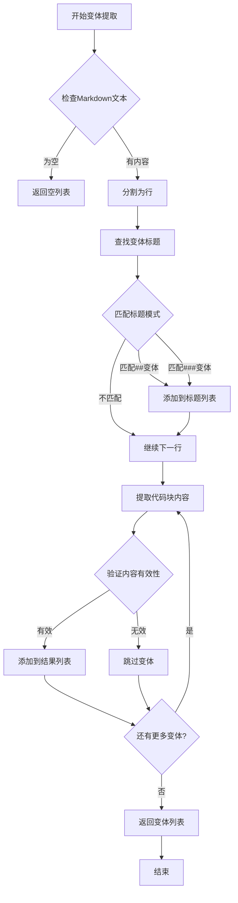

**图表来源**
- [generate.py:619-664](file://generate.py#L619-L664)

#### 变体标题格式支持

系统现在支持以下变体标题格式：

1. **二级标题格式**：`## 变体 1`
2. **三级标题格式**：`### 变体 1`
3. **带冒号格式**：`### 变体 1：效果徽章版`
4. **无冒号格式**：`### 变体1: 教学特色版`

**章节来源**
- [generate.py:615-616](file://generate.py#L615-L616)
- [generate.py:619-664](file://generate.py#L619-L664)

### 设计素材生成系统

#### 批量设计素材生成

**更新**：增强 write_design_refer 函数，支持批量生成设计素材文件夹

系统现在能够批量生成设计素材文件夹，每个变体对应一个独立的页面目录：

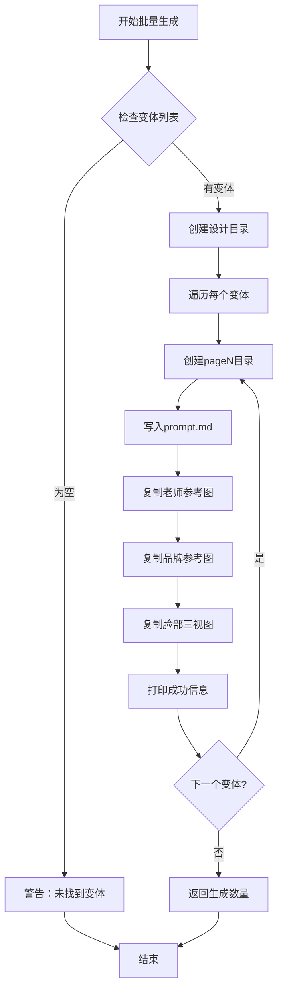

**图表来源**
- [generate.py:667-723](file://generate.py#L667-L723)

**章节来源**
- [generate.py:667-723](file://generate.py#L667-L723)

### 转写组件深度解析

#### Whisper集成架构

转写组件提供了灵活的Whisper模型管理：

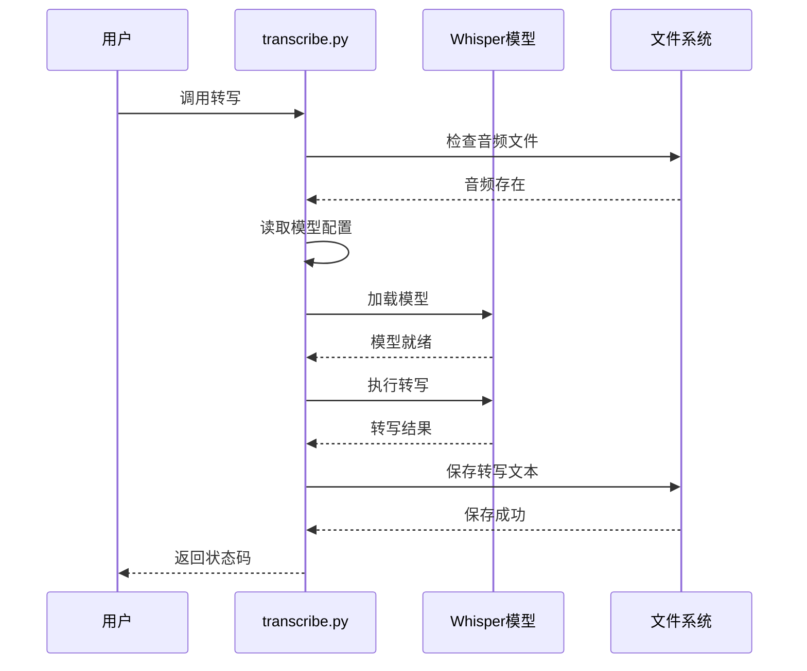

**图表来源**
- [transcribe.py:21-67](file://transcribe.py#L21-L67)

**章节来源**
- [transcribe.py:21-67](file://transcribe.py#L21-L67)

### 参考图片管理系统

#### 新增老师脸部三视图参考系统

生成组件新增了完整的参考图片管理系统：

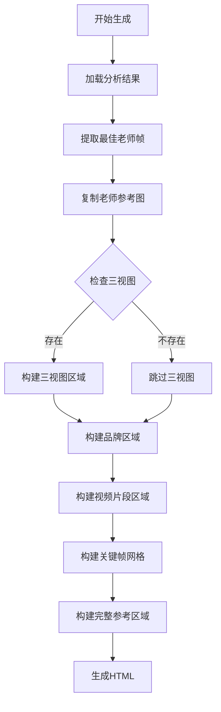

**图表来源**
- [generate.py:488-611](file://generate.py#L488-L611)

**章节来源**
- [generate.py:510-548](file://generate.py#L510-L548)
- [generate.py:756-778](file://generate.py#L756-L778)

### 四维分析框架详解

#### 设计分析维度增强

**更新**：新增四维分析框架，完善设计思维输出能力

系统现在支持四个维度的系统化分析：

1. **视觉布局说明**
   - 各元素（标题、副标题、老师图、卖点标签、CTA等）的具体排布位置和尺寸占比
   - 层次关系和视觉权重分配（用户视线如何流动）
   - 留白比例和间距策略（为什么这样留白）
   - 信息密度控制（为什么选择这个密度而不是更多/更少）

2. **色彩/字体决策理由**
   - 主色/辅色选择的理由（与品牌调性、用户群体的关联）
   - 字体大小和粗细选择的理由（适老化考量、信息层级区分）
   - 色彩对比度和可读性考量（中老年视力友好度）
   - 情绪色彩如何服务转化目标（如暖色激发信任、金色暗示价值等）
   - 为什么选择这个色系而非其他（与视频场景的关联、与其他变体的差异化）

3. **文案策略分析**
   - 痛点→卖点→利益点的转化逻辑链路（完整推演）
   - 每句文案选取的理由（为什么用这个痛点/卖点而非其他候选项）
   - 文案的情感切入点（共鸣、焦虑、向往、从众等）
   - 文字量和信息层级的考量（为什么这样分配主次信息）

4. **用户心理/转化逻辑**
   - 每个模块如何引导用户从 注意→兴趣→信任→行动 (AIDA模型) 逐步推进
   - 信任建立机制（如名师背书、头衔权威、教学方法可信度等）
   - 行动召唤的心理驱动力（底部承诺条如何消除顾虑）
   - 用户决策障碍的消除策略（针对中老年用户的特定顾虑如何化解）

**章节来源**
- [prompts/generate_prompt.md:112-156](file://prompts/generate_prompt.md#L112-L156)
- [generate.py:619-664](file://generate.py#L619-L664)
- [generate.py:667-723](file://generate.py#L667-L723)

### 颜色多样性约束和可访问性改进

#### 颜色多样性约束系统

**新增**：系统实现了严格的颜色多样性约束，确保设计方案的专业性和差异化：

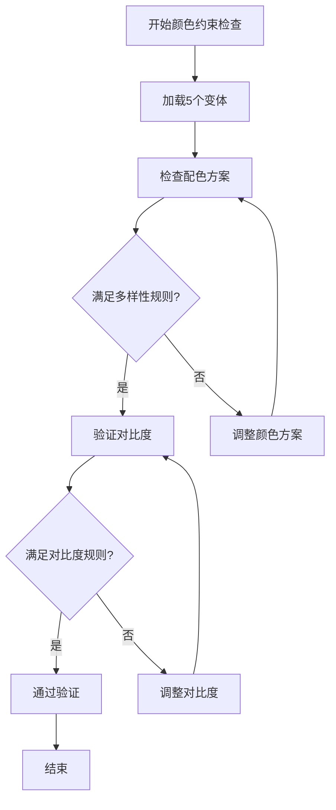

**图表来源**
- [prompts/generate_prompt.md:58-62](file://prompts/generate_prompt.md#L58-L62)

#### 可访问性改进措施

系统实施了多项可访问性改进措施：

1. **适老化设计原则**
   - 字体大小：主标题≥40px，正文≥20px，标签文字≥22px
   - 高对比度：深色字+浅底或白/金字+深色块
   - 语言直白：使用通俗易懂的语言，避免营销黑话

2. **视觉层次设计**
   - 通过字号、颜色、间距区分信息优先级
   - 禁止使用深色背景，确保高可读性

3. **中老年用户友好**
   - 禁用灰色小字，确保文字清晰可见
   - 提供多种配色方案，适应不同用户偏好

#### 模板系统重构详解

**更新**：模板系统从'Template A-K'重构为'Inspiration A-K'

系统现在提供35个设计灵感参考，鼓励设计师基于视频特征自由组合和创新：

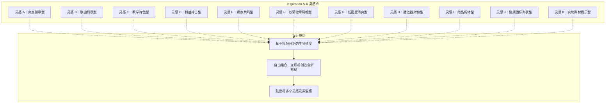

**图表来源**
- [prompts/generate_prompt.md:22-95](file://prompts/generate_prompt.md#L22-L95)

**章节来源**
- [prompts/generate_prompt.md:7-11](file://prompts/generate_prompt.md#L7-L11)
- [prompts/generate_prompt.md:58-62](file://prompts/generate_prompt.md#L58-L62)
- [prompts/generate_prompt.md:22-95](file://prompts/generate_prompt.md#L22-L95)

## 依赖关系分析

### Python依赖关系

```mermaid
graph TB
subgraph "运行时依赖"
OPENAI[openai>=1.0.0]
WHISPER[openai-whisper>=20231117]
MARKDOWN[markdown>=3.5]
REQUESTS[requests>=2.25.0]
PIL[Pillow>=8.0.0]
END
subgraph "分析组件"
ANALYZE[analyze.py]
OPENAI
FALLBACK[assets/fallback_points.md]
MAX_TOKENS[16384]
TEMP_03[temperature=0.3]
TEACHER_FACE_REF[面部三视图参考]
end
subgraph "生成组件"
GENERATE[generate.py]
OPENAI
MARKDOWN
ASSETS[assets/]
TEACHER_FACE_REF_1[assets/teacher_face_ref_1.jpg]
TEACHER_FACE_REF_2[assets/teacher_face_ref_2.jpg]
DESIGN_REFER[design_refer/]
VISUAL_PREPROCESS[describe_teacher_outfit]
COLOR_CONSTRAINTS[颜色多样性约束]
ACCESSIBILITY[可访问性改进]
INSPIRATION_TEMPLATES[Inspiration A-K]
end
subgraph "转写组件"
TRANSCRIBE[transcribe.py]
WHISPER
end
subgraph "生图组件"
GENERATE_IMAGE[generate_image.py]
REQUESTS
PIL
BRAND_LOGO[assets/brand_logo.png]
SIZE_1024x1536[1024x1536]
TIMEOUT_600[timeout=600s]
end
ANALYZE --> OPENAI
ANALYZE --> FALLBACK
ANALYZE --> MAX_TOKENS
ANALYZE --> TEMP_03
ANALYZE --> TEACHER_FACE_REF
GENERATE --> OPENAI
GENERATE --> MARKDOWN
GENERATE --> ASSETS
GENERATE --> TEACHER_FACE_REF_1
GENERATE --> TEACHER_FACE_REF_2
GENERATE --> DESIGN_REFER
GENERATE --> VISUAL_PREPROCESS
GENERATE --> COLOR_CONSTRAINTS
GENERATE --> ACCESSIBILITY
GENERATE --> INSPIRATION_TEMPLATES
TRANSCRIBE --> WHISPER
GENERATE_IMAGE --> REQUESTS
GENERATE_IMAGE --> PIL
GENERATE_IMAGE --> BRAND_LOGO
GENERATE_IMAGE --> SIZE_1024x1536
GENERATE_IMAGE --> TIMEOUT_600
```

**图表来源**
- [requirements.txt:1-4](file://requirements.txt#L1-L4)
- [analyze.py:196-200](file://analyze.py#L196-L200)
- [generate.py:105-109](file://generate.py#L105-L109)
- [generate.py:143-147](file://generate.py#L143-L147)
- [generate_image.py:36-49](file://generate_image.py#L36-L49)
- [transcribe.py:30-34](file://transcribe.py#L30-L34)

### 系统依赖

系统需要以下外部工具：

| 组件 | 依赖工具 | 版本要求 | 用途 |
|------|----------|----------|------|
| run.sh | ffmpeg | 最新版本 | 视频处理和音频提取 |
| Python | Python 3.x | 3.6+ | 脚本执行 |
| 分析组件 | OpenAI API | 1.0.0+ | 多模态分析，支持16384 token |
| 生成组件 | Python Markdown | 3.5+ | HTML渲染 |
| 视觉预处理 | OpenAI API | 1.0.0+ | 图像描述分析，temperature=0.2 |
| 生图组件 | gpt-image-2 API | 兼容版本 | 图片生成，支持1024x1536尺寸 |
| 转写组件 | Whisper | 20231117+ | 语音转写 |

**章节来源**
- [requirements.txt:1-4](file://requirements.txt#L1-L4)
- [run.sh:64-72](file://run.sh#L64-L72)

## 性能考虑

### 并发处理策略

系统采用串行流水线处理模式，每个阶段完成后才进入下一阶段，这种设计的优势在于：

- **资源控制**：避免同时占用大量内存和CPU资源
- **错误隔离**：单个阶段的失败不会影响其他阶段
- **调试友好**：每个阶段都有明确的中间产物

### 内存优化

- **流式处理**：音频和视频文件以流式方式处理
- **分块读取**：大文件分块读取，避免内存溢出
- **及时释放**：处理完成后及时释放内存

### 网络优化

- **指数退避**：API调用失败时采用指数退避重试
- **超时控制**：合理的超时设置避免长时间阻塞
- **连接复用**：同一会话内复用API连接
- **批量处理**：生图组件支持批量API调用，提高效率

### API调用优化

**新增**：系统实施了多项API调用优化措施：

1. **温度参数优化**
   - 分析阶段：temperature=0.3，确保准确性
   - 视觉预处理：temperature=0.2，确保描述准确性
   - 生成阶段：temperature=0.6，平衡创意和一致性

2. **最大token限制**
   - 分析阶段：max_tokens=16384，支持长上下文
   - 生成阶段：支持标准token限制，确保响应时间

3. **错误重试机制**
   - 最多重试3次
   - 指数退避延迟（1s, 2s, 4s）
   - 详细的错误日志记录

**章节来源**
- [analyze.py:196-200](file://analyze.py#L196-L200)
- [generate.py:105-109](file://generate.py#L105-L109)
- [generate.py:143-147](file://generate.py#L143-L147)

## 故障排除指南

### 常见问题及解决方案

#### 环境配置问题

| 问题类型 | 症状 | 解决方案 |
|----------|------|----------|
| 缺少环境变量 | 分析阶段报错：缺少API配置 | 在config.env中正确配置API信息 |
| 依赖缺失 | 导入错误：未安装相关库 | 运行pip install -r requirements.txt |
| ffmpeg缺失 | 截帧失败 | 安装ffmpeg并确保在PATH中 |

#### 数据处理问题

| 问题类型 | 症状 | 解决方案 |
|----------|------|----------|
| 关键帧缺失 | 分析报错：缺少关键帧 | 检查视频时长是否足够 |
| 转写失败 | 转写文本为空 | 检查音频质量，尝试更大模型 |
| JSON解析失败 | 分析报错：JSON解析失败 | 检查模型输出格式，查看analysis_raw.txt |
| 三视图缺失 | 生成警告：缺少老师脸部三视图 | 确保assets/teacher_face_ref_1.jpg和assets/teacher_face_ref_2.jpg存在 |
| 变体提取失败 | 警告：未找到变体 | 检查Markdown中变体标题格式是否正确 |
| 视觉预处理失败 | 警告：着装描述提取失败 | 检查teacher_ref.jpg是否存在且可读 |
| 教师识别失败 | 警告：无可用的老师参考帧 | 检查VIDEO_CLIP_DIR中的关键帧文件 |

#### API调用问题

| 问题类型 | 症状 | 解决方案 |
|----------|------|----------|
| 认证失败 | API返回401 | 检查API_KEY配置 |
| 速率限制 | API返回429 | 降低请求频率或增加等待时间 |
| 网络超时 | 请求超时 | 检查网络连接，增加重试次数 |
| token不足 | API返回400 | 检查max_tokens设置，分析阶段使用16384 |

#### 生图生成问题

| 问题类型 | 症状 | 解决方案 |
|----------|------|----------|
| API调用失败 | 生图生成失败 | 检查gpt-image-2 API配置 |
| 图片尺寸错误 | 输出图片不符合要求 | 确认1024x1536尺寸设置 |
| 参考图缺失 | 生图缺少参考图 | 检查teacher_ref.jpg和brand_logo.png是否存在 |

### 调试技巧

1. **查看中间产物**：检查output目录中的中间文件
2. **启用详细日志**：观察脚本输出的详细信息
3. **验证配置**：确认config.env中的配置正确
4. **测试依赖**：单独运行各个组件验证功能
5. **检查参考图片**：确保assets目录中的参考图片完整
6. **验证变体格式**：检查Markdown中变体标题的格式是否符合要求
7. **验证着装描述**：检查describe_teacher_outfit函数是否正常工作
8. **检查颜色约束**：验证生成的设计方案是否满足颜色多样性要求
9. **验证模板系统**：确认Inspiration A-K模板是否正确应用
10. **检查教师识别**：验证分析阶段的教师身份识别是否准确

## 结论

方案生成模块是一个设计精良的多模态分析系统，具有以下特点：

### 技术优势

- **模块化设计**：每个功能都有独立的脚本文件，便于维护和扩展
- **健壮性**：完善的错误处理和重试机制
- **灵活性**：支持多种输出格式和配置选项
- **可扩展性**：清晰的架构便于添加新的分析维度
- **质量控制**：新增的三视图参考系统显著提升了生成质量一致性
- **系统化分析**：四维分析框架（视觉布局、色彩字体、文案策略、用户心理）提升了设计方案的专业性和完整性
- **智能变体提取**：新增的变体提取系统支持二级（##）和三级（###）标题格式，提高了文档结构的灵活性和向后兼容性
- **视觉预处理**：新增的describe_teacher_outfit函数实现了自动着装描述提取，显著提升了设计方案的一致性
- **颜色多样性约束**：严格的颜色多样性约束确保了设计方案的专业性和差异化
- **可访问性改进**：适老化设计原则确保了设计方案对中老年用户的友好性
- **模板系统重构**：从'Template A-K'重构为'Inspiration A-K'，提供更灵活的设计灵感参考
- **教师识别增强**：通过面部三视图参考图增强老师身份识别的准确性

### 应用价值

- **自动化程度高**：从视频到设计方案再到图片生成的完整自动化流程
- **质量稳定**：基于结构化分析的数据驱动设计
- **成本效益**：减少人工设计工作量，提高效率
- **一致性**：确保设计方案与原始视频内容保持一致
- **专业性**：严格的教师图像约束确保视觉专业性
- **系统性**：四维分析框架确保设计方案的全面性和专业性
- **灵活性**：智能变体提取系统支持多种文档结构格式
- **可访问性**：适老化设计原则确保了对中老年用户的友好性
- **创新性**：Inspiration A-K模板系统鼓励设计师基于视频特征自由创新

### 改进建议

1. **并发处理**：可以考虑在不冲突的情况下并行处理某些阶段
2. **缓存机制**：为重复分析结果添加缓存功能
3. **监控系统**：添加详细的性能监控和日志记录
4. **配置管理**：提供更灵活的配置文件管理机制
5. **质量评估**：添加生成内容的质量评估和反馈机制
6. **变体格式扩展**：可以考虑支持更多级别的标题格式
7. **颜色智能推荐**：可以考虑添加颜色搭配智能推荐功能
8. **多语言支持**：可以考虑添加多语言设计方案生成能力
9. **模板系统扩展**：可以考虑增加更多样式的灵感模板
10. **教师识别优化**：可以考虑增加更多维度的教师特征识别

**重大更新总结**：模板系统从'Template A-K'重构为'Inspiration A-K'显著提升了设计的灵活性和创新性；新增颜色约束和多样性管理机制确保了设计方案的专业性和差异化；改进教师识别准确性通过面部三视图参考图增强了老师身份识别的可靠性；增强变体提取系统支持二级和三级标题格式，提高了文档结构的灵活性和向后兼容性；改进API稳定性（增加最大token限制和温度参数优化）确保了生成质量的稳定性和一致性。

该系统为视频内容的数字化转型提供了强有力的技术支撑，能够有效提升内容创作和设计工作的效率与质量，特别是在中老年用户群体的课程营销领域，提供了更加专业和系统化的解决方案。