# 核心模块详解

<cite>
**本文档引用的文件**
- [analyze.py](file://analyze.py)
- [transcribe.py](file://transcribe.py)
- [generate.py](file://generate.py)
- [run.sh](file://run.sh)
- [prompts/analyze_prompt.md](file://prompts/analyze_prompt.md)
- [prompts/generate_prompt.md](file://prompts/generate_prompt.md)
- [config.env](file://config.env)
- [requirements.txt](file://requirements.txt)
</cite>

## 目录
1. [项目概述](#项目概述)
2. [系统架构](#系统架构)
3. [核心模块详解](#核心模块详解)
4. [数据流分析](#数据流分析)
5. [配置管理](#配置管理)
6. [错误处理与调试](#错误处理与调试)
7. [性能优化建议](#性能优化建议)
8. [最佳实践指南](#最佳实践指南)
9. [故障排除](#故障排除)
10. [总结](#总结)

## 项目概述

这是一个完整的视频分析流水线系统，专门用于从广告视频中提取营销信息并生成落地页Hero区域设计方案。该系统采用模块化设计，包含四个核心处理阶段：视频处理、音频转写、多模态分析和方案生成。

系统支持OpenAI兼容的多模态API，能够同时处理图像和文本信息，通过精心设计的Prompt工程实现高质量的结构化分析结果。

## 系统架构

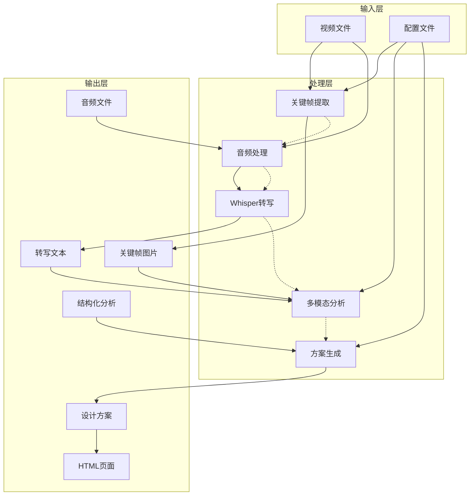

**图表来源**
- [run.sh:72-128](file://run.sh#L72-L128)
- [analyze.py:33-45](file://analyze.py#L33-L45)
- [transcribe.py:21-62](file://transcribe.py#L21-L62)

## 核心模块详解

### 视频处理模块

视频处理模块负责从输入视频中提取关键帧和音频片段，为后续分析提供基础数据。

#### 关键帧提取算法

系统采用定时采样的策略，在视频的特定时间点提取关键帧：

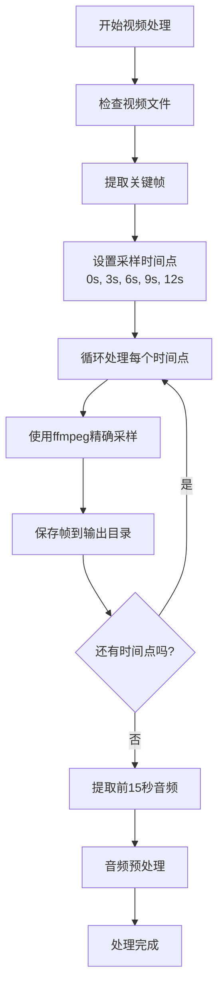

**图表来源**
- [run.sh:72-89](file://run.sh#L72-L89)
- [run.sh:91-100](file://run.sh#L91-L100)

#### 音频处理流程

音频处理采用标准化的参数配置：

- **采样频率**: 16kHz
- **声道数**: 单声道
- **编码格式**: PCM_S16LE
- **时长**: 前15秒

这种配置平衡了音频质量与处理效率，适合Whisper模型的转写需求。

**章节来源**
- [run.sh:72-100](file://run.sh#L72-L100)

### 音频转写模块

音频转写模块使用OpenAI Whisper进行本地语音识别，支持多种模型大小以适应不同的精度和性能需求。

#### Whisper模型配置

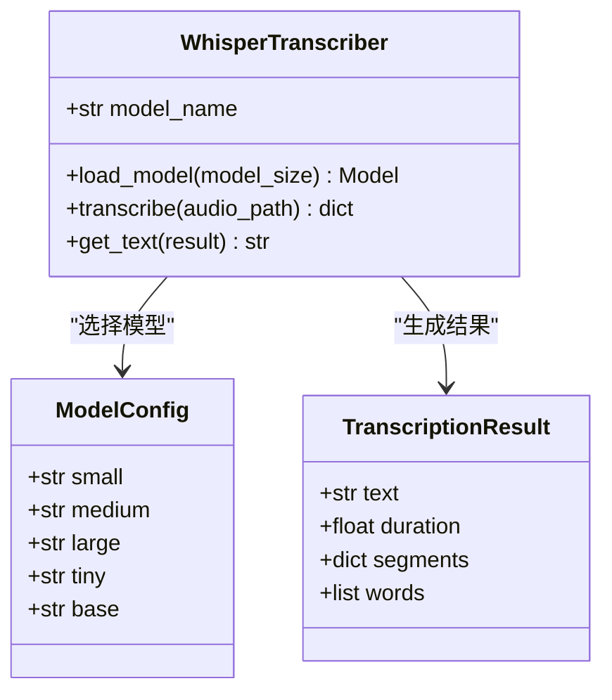

**图表来源**
- [transcribe.py:21-62](file://transcribe.py#L21-L62)

#### 转写流程

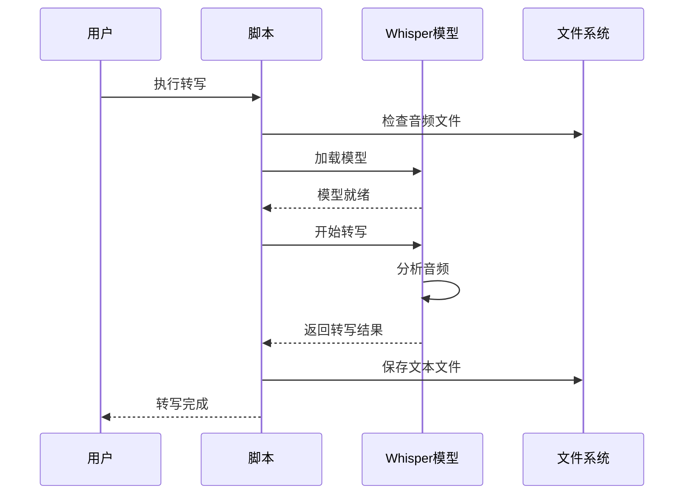

**图表来源**
- [transcribe.py:21-62](file://transcribe.py#L21-L62)

**章节来源**
- [transcribe.py:21-62](file://transcribe.py#L21-L62)
- [requirements.txt:2](file://requirements.txt#L2)

### 多模态分析模块

多模态分析模块是整个系统的核心，负责整合视觉和听觉信息，生成结构化的营销分析结果。

#### Prompt工程设计

系统采用精心设计的Prompt模板，包含七个关键分析维度：

1. **主色调和风格** - 色彩心理学应用
2. **老师信息** - 人物特征识别
3. **课程名称** - 标识信息提取
4. **痛点** - 用户需求洞察
5. **卖点** - 产品价值主张
6. **利益点** - 用户收益承诺
7. **辅助说明** - 决策影响因素

#### 分析流程

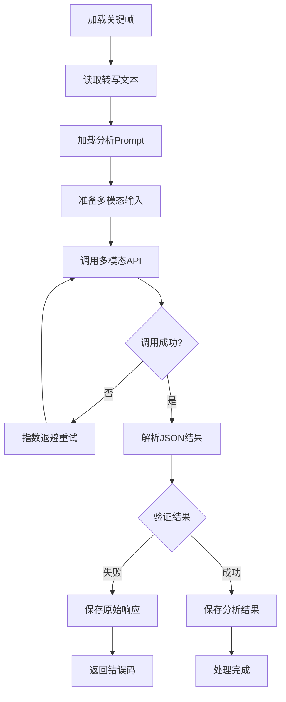

**图表来源**
- [analyze.py:76-126](file://analyze.py#L76-L126)
- [analyze.py:128-172](file://analyze.py#L128-L172)

#### JSON解析机制

系统实现了健壮的JSON解析机制，支持多种输出格式：

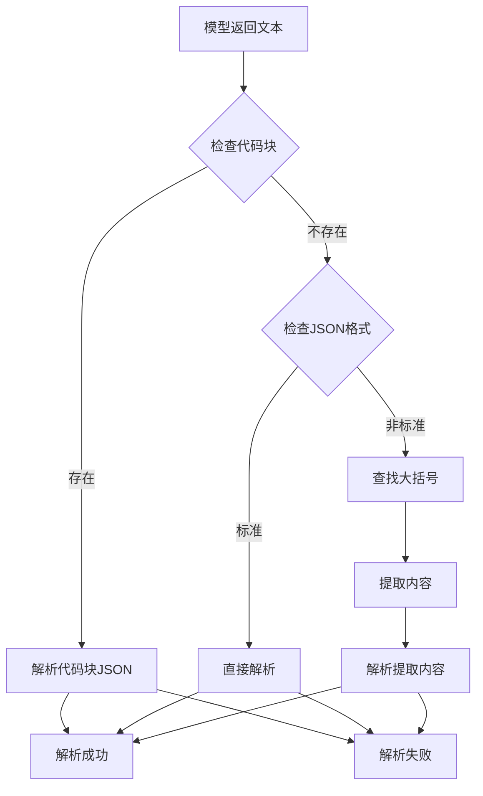

**图表来源**
- [analyze.py:53-74](file://analyze.py#L53-L74)

**章节来源**
- [analyze.py:33-172](file://analyze.py#L33-L172)
- [prompts/analyze_prompt.md:1-111](file://prompts/analyze_prompt.md#L1-L111)

### 方案生成模块

方案生成模块将多模态分析结果转换为可执行的落地页设计方案，并提供HTML渲染功能。

#### HTML渲染机制

系统提供了双重渲染机制：

1. **Markdown渲染** - 使用python-markdown库进行标准渲染
2. **降级渲染** - 自实现的简单渲染器作为后备方案

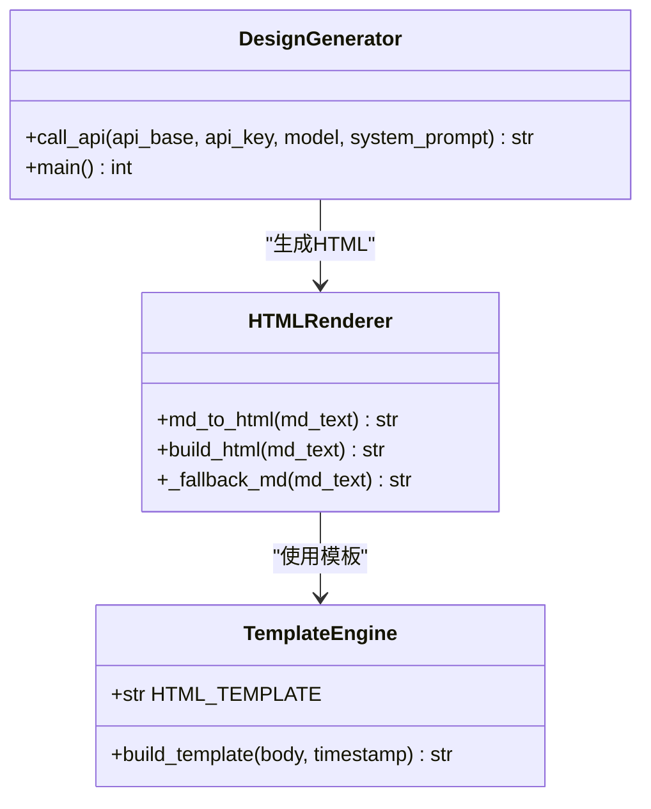

**图表来源**
- [generate.py:73-321](file://generate.py#L73-L321)

#### 输出格式定制

系统支持两种输出格式：

1. **Markdown格式** - 便于版本控制和编辑
2. **HTML格式** - 完整的可独立浏览页面，包含内联CSS样式

HTML模板采用了现代化的设计语言，支持响应式布局和主题色彩系统。

**章节来源**
- [generate.py:38-372](file://generate.py#L38-L372)

## 数据流分析

### 模块间交互流程

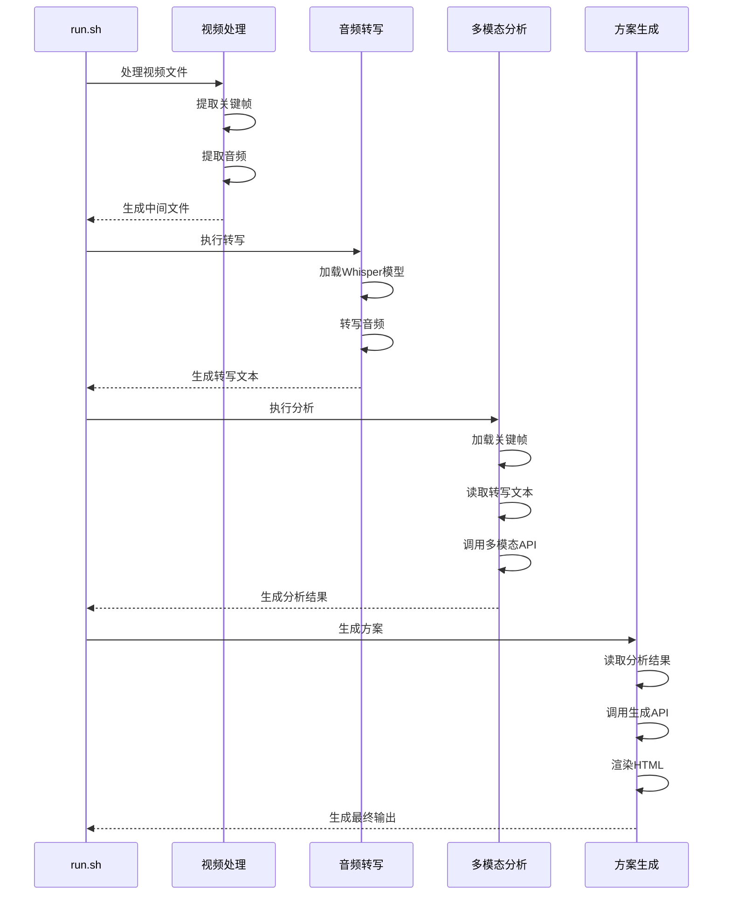

**图表来源**
- [run.sh:72-128](file://run.sh#L72-L128)
- [generate.py:325-372](file://generate.py#L325-L372)

### 数据结构流转

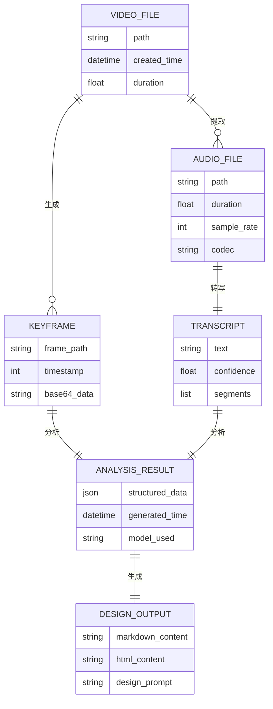

**图表来源**
- [run.sh:72-128](file://run.sh#L72-L128)
- [generate.py:25-28](file://generate.py#L25-L28)

## 配置管理

### 环境变量配置

系统采用灵活的配置管理机制，支持多种配置方式：

| 配置项 | 类型 | 默认值 | 描述 |
|--------|------|--------|------|
| API_BASE_URL | 字符串 | 必填 | API基础URL |
| API_KEY | 字符串 | 必填 | 认证密钥 |
| MODEL_NAME | 字符串 | 必填 | 模型名称 |
| WHISPER_MODEL | 字符串 | small | Whisper模型大小 |
| GENERATE_API_BASE_URL | 字符串 | 与API_BASE_URL相同 | 生成API基础URL |
| GENERATE_API_KEY | 字符串 | 与API_KEY相同 | 生成API密钥 |
| GENERATE_MODEL_NAME | 字符串 | 与MODEL_NAME相同 | 生成模型名称 |

### 配置加载机制

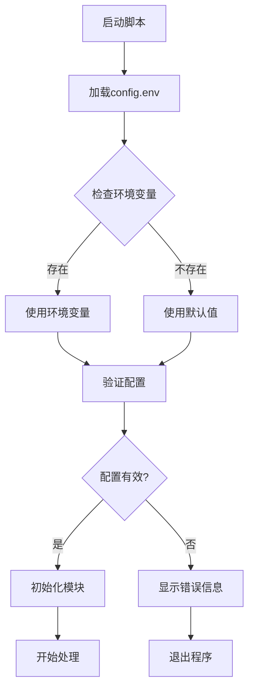

**图表来源**
- [run.sh:42-52](file://run.sh#L42-L52)
- [config.env:1-13](file://config.env#L1-L13)

**章节来源**
- [config.env:1-13](file://config.env#L1-L13)
- [run.sh:42-52](file://run.sh#L42-L52)

## 错误处理与调试

### 错误分类与处理策略

系统实现了多层次的错误处理机制：

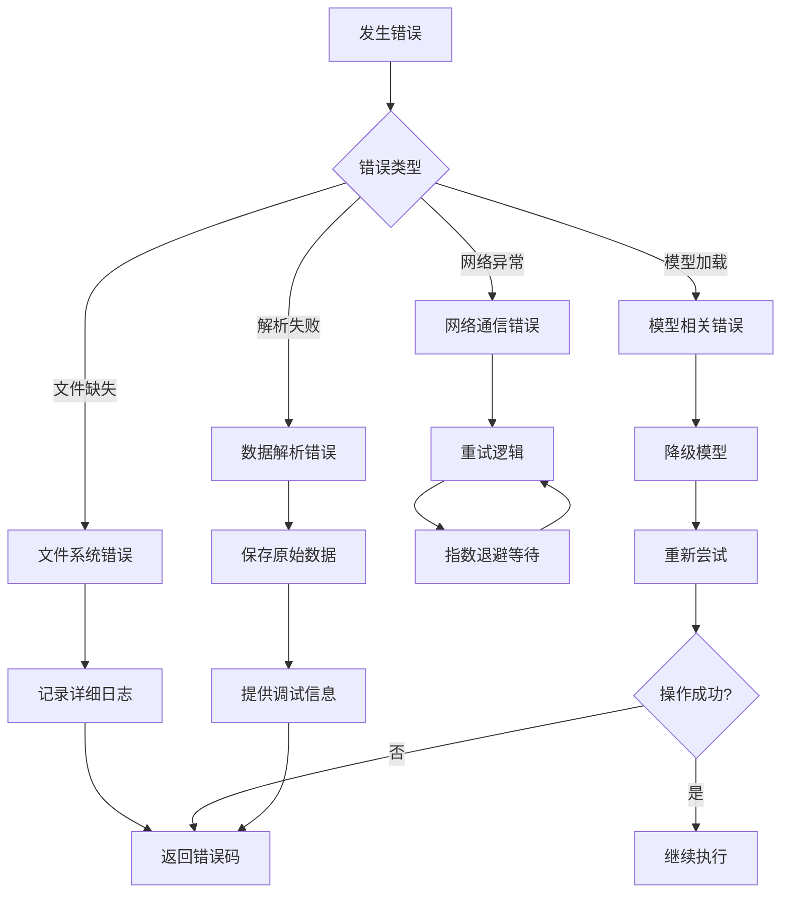

### 调试工具与诊断

系统提供了丰富的调试功能：

1. **原始数据保存** - 当JSON解析失败时自动保存原始API响应
2. **详细日志输出** - 每个步骤都提供详细的进度信息
3. **错误码系统** - 不同类型的错误对应不同的退出码
4. **性能监控** - 关键步骤的时间统计

**章节来源**
- [analyze.py:155-163](file://analyze.py#L155-L163)
- [run.sh:130-138](file://run.sh#L130-L138)

## 性能优化建议

### 并行处理优化

当前系统采用串行处理模式，可以考虑以下优化：

1. **音频转写并发** - 对于多个视频文件，可以并行执行转写
2. **API调用缓存** - 缓存常用的分析结果
3. **内存管理** - 大文件处理时的内存优化

### 模型选择策略

根据不同的需求场景选择合适的Whisper模型：

- **快速原型**: tiny/base - 最快但精度较低
- **平衡选择**: small - 推荐的默认选项
- **高精度需求**: medium/large - 最准确但速度较慢

### 网络优化

对于多模态API调用：

1. **连接池复用** - 复用HTTP连接减少开销
2. **批量处理** - 将多个请求合并处理
3. **超时配置** - 合理设置超时时间避免长时间阻塞

## 最佳实践指南

### Prompt工程最佳实践

1. **明确角色定位** - 清晰定义AI助手的专业领域
2. **结构化输出** - 使用严格的JSON格式约束
3. **上下文完整性** - 提供足够的背景信息
4. **边界条件处理** - 考虑各种异常情况

### 数据质量保证

1. **关键帧质量** - 确保采样时间点的代表性
2. **音频质量** - 适当的采样率和编码格式
3. **转写准确性** - 选择合适的Whisper模型大小
4. **结果验证** - 建立人工审核机制

### 系统稳定性

1. **错误恢复** - 实现完善的错误处理和恢复机制
2. **资源管理** - 合理的内存和磁盘空间管理
3. **监控告警** - 关键指标的实时监控
4. **版本控制** - Prompt和配置的版本管理

## 故障排除

### 常见问题与解决方案

| 问题类型 | 症状 | 可能原因 | 解决方案 |
|----------|------|----------|----------|
| 依赖缺失 | ImportError | 缺少必要的Python包 | 运行pip install -r requirements.txt |
| ffmpeg错误 | 命令不存在 | ffmpeg未安装 | 安装ffmpeg并添加到PATH |
| API认证失败 | 401/403错误 | API密钥无效 | 检查API_KEY配置 |
| 模型加载失败 | OOM/加载错误 | 内存不足或模型损坏 | 降低模型大小或清理缓存 |
| JSON解析失败 | JSONDecodeError | API返回格式异常 | 检查原始响应并调整Prompt |

### 调试步骤

1. **检查依赖** - 确认所有依赖包正确安装
2. **验证配置** - 检查环境变量和配置文件
3. **查看日志** - 分析详细的错误信息
4. **测试单模块** - 独立运行各个模块进行调试
5. **检查中间文件** - 验证每个步骤的输出

**章节来源**
- [requirements.txt:1-4](file://requirements.txt#L1-L4)
- [run.sh:54-62](file://run.sh#L54-L62)

## 总结

这个视频分析流水线系统展现了现代AI应用开发的最佳实践：

1. **模块化设计** - 清晰的职责分离和接口定义
2. **健壮性保证** - 完善的错误处理和恢复机制
3. **可扩展性** - 灵活的配置管理和插件化架构
4. **用户体验** - 多种输出格式和直观的调试工具

系统通过精心设计的Prompt工程和多模态分析，能够从视频内容中提取有价值的营销信息，并将其转化为可执行的设计方案。这种端到端的自动化流程大大提高了内容创作的效率和一致性。

未来可以考虑的功能增强包括：批量处理支持、云端部署选项、结果可视化工具、以及更高级的分析算法集成。