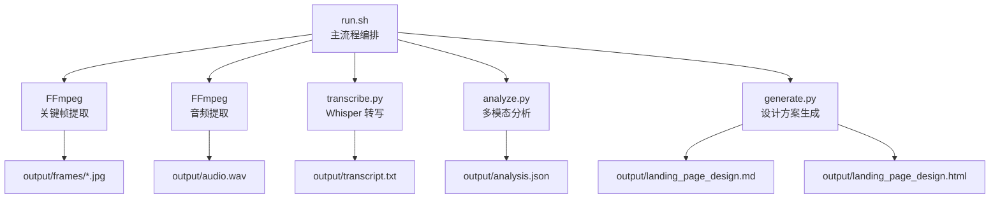
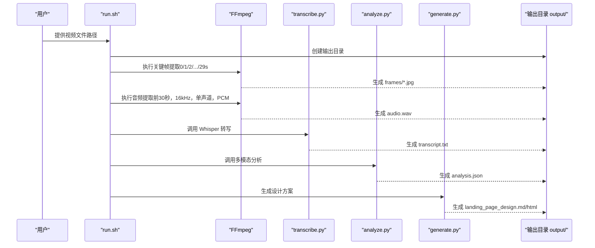
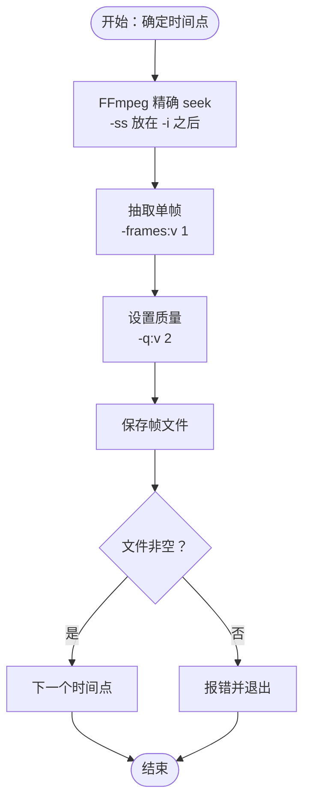
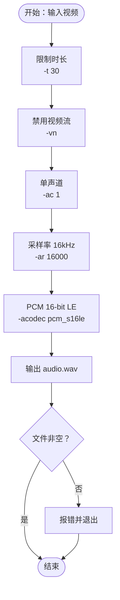
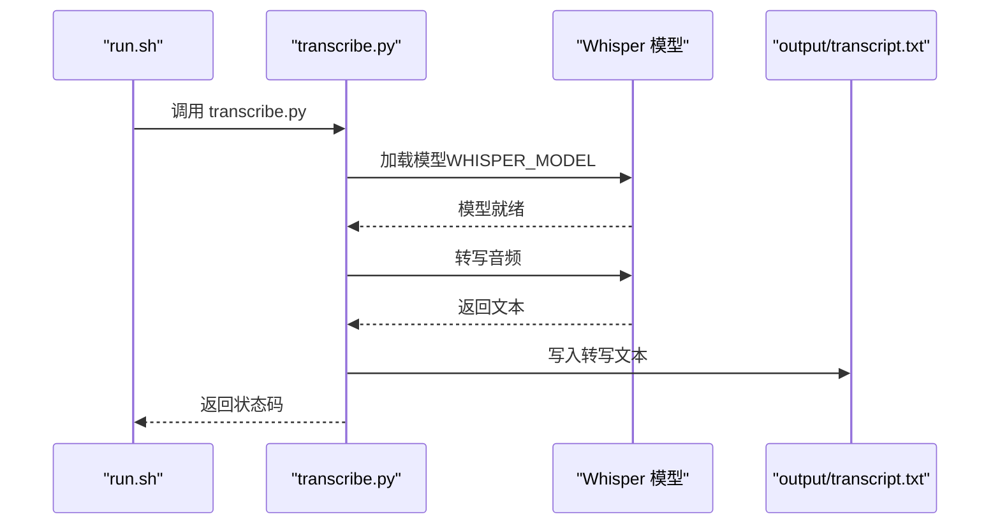
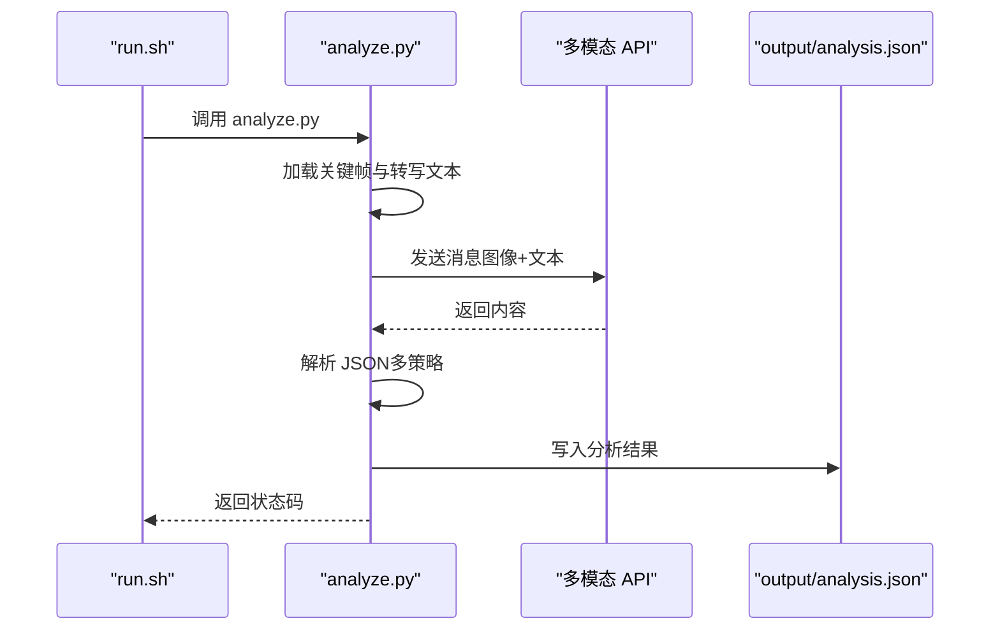
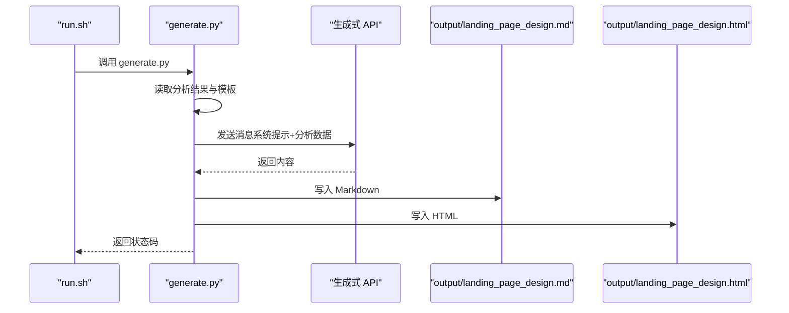
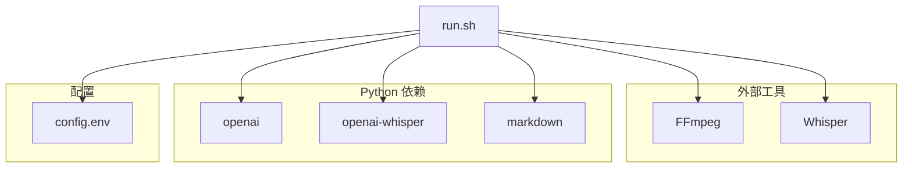

# 视频处理模块

<cite>
**本文引用的文件**
- [run.sh](file://run.sh)
- [analyze.py](file://analyze.py)
- [generate.py](file://generate.py)
- [transcribe.py](file://transcribe.py)
- [config.env](file://config.env)
- [requirements.txt](file://requirements.txt)
- [prompts/analyze_prompt.md](file://prompts/analyze_prompt.md)
- [prompts/generate_prompt.md](file://prompts/generate_prompt.md)
</cite>

## 更新摘要
**变更内容**
- 视频采样时长从15秒扩展到30秒，关键帧提取频率从每3秒一帧调整为每1秒一帧
- 音频提取范围从前15秒扩大到前30秒
- 多模态分析提示词从"前15秒"更新为"前30秒"
- HTML模板中的"前15秒"提示更新为"前30秒"
- 关键帧提取时间点从0/3/6/9/12秒扩展到0/1/2/3/.../29秒
- 配置文件中MAX_API_FRAMES从5调整为10

## 目录
1. [简介](#简介)
2. [项目结构](#项目结构)
3. [核心组件](#核心组件)
4. [架构总览](#架构总览)
5. [详细组件分析](#详细组件分析)
6. [依赖关系分析](#依赖关系分析)
7. [性能考量](#性能考量)
8. [故障排查指南](#故障排查指南)
9. [结论](#结论)
10. [附录](#附录)

## 简介
本项目是一个端到端的视频处理与落地页设计方案生成流水线，围绕"视频分析 → 口播转写 → 多模态结构化分析 → 落地页设计方案生成"的链路展开。其中，视频处理的关键环节包括：
- 关键帧提取：在指定时间点（0/1/2/3/.../29 秒）截取高质量静态图像，用于后续多模态分析，显著提升时序分辨率。
- 音频提取：截取视频前 30 秒音频，统一采样率与声道，便于本地 Whisper 转写。
- 音频转写：使用 openai-whisper 对音频进行本地语音识别，输出文本。
- 多模态分析：将关键帧与转写文本送入多模态模型，生成结构化分析结果。
- 方案生成：将分析结果注入模板，生成 Markdown 与 HTML 落地页设计方案。

本技术文档聚焦于视频处理模块的实现原理与最佳实践，包括 FFmpeg 精确 seek 技术、时间戳计算、帧质量控制、音频提取流程（采样率、声道、格式）、错误处理与输出管理，并提供 FFmpeg 命令示例与性能优化建议。

## 项目结构
该仓库采用脚本驱动的流水线组织方式，核心文件如下：
- run.sh：主流程编排，负责调用 FFmpeg 截帧与音频提取、运行 Python 脚本完成转写与分析、最终生成设计方案。
- analyze.py：读取关键帧与转写文本，调用多模态 API，解析并保存结构化分析结果。
- transcribe.py：加载 Whisper 模型，对音频进行本地转写，输出文本。
- generate.py：读取分析结果，注入模板，生成 Markdown 与 HTML。
- config.env：API 与 Whisper 模型配置。
- requirements.txt：Python 依赖清单。
- prompts/*：系统提示词模板，分别用于多模态分析与设计方案生成。

**图表来源**
- [run.sh:108-128](file://run.sh#L108-L128)
- [transcribe.py:22-66](file://transcribe.py#L22-L66)
- [analyze.py:47-83](file://analyze.py#L47-L83)
- [generate.py:663-756](file://generate.py#L663-L756)

**章节来源**
- [run.sh:1-197](file://run.sh#L1-L197)
- [config.env:1-22](file://config.env#L1-L22)
- [requirements.txt:1-6](file://requirements.txt#L1-L6)

## 核心组件
- FFmpeg 关键帧提取：在固定时间点截取单帧，保证质量与稳定性。
- FFmpeg 音频提取：截取前 30 秒音频，统一采样率与声道，输出标准 PCM。
- Whisper 本地转写：加载模型，执行转写，输出文本。
- 多模态分析：读取关键帧与转写文本，调用外部多模态 API，解析 JSON 并落盘。
- 方案生成：读取分析结果，注入模板，生成 Markdown 与 HTML。

**章节来源**
- [run.sh:108-145](file://run.sh#L108-L145)
- [transcribe.py:22-66](file://transcribe.py#L22-L66)
- [analyze.py:138-211](file://analyze.py#L138-L211)
- [generate.py:58-92](file://generate.py#L58-L92)

## 架构总览
下图展示了从视频输入到最终输出的完整数据流与控制流。

**图表来源**
- [run.sh:108-173](file://run.sh#L108-L173)
- [transcribe.py:22-66](file://transcribe.py#L22-L66)
- [analyze.py:213-288](file://analyze.py#L213-L288)
- [generate.py:663-756](file://generate.py#L663-L756)

## 详细组件分析

### 关键帧提取算法与 FFmpeg 精确 seek
- **时间点规划**：在 0、1、2、3、...、29 秒三十个时间点截取关键帧，形成更密集的时间序列样本，显著提升多模态分析的时序分辨率。
- **FFmpeg 精确 seek 技术**：
  - 将 -ss 放置于 -i 之后，以实现基于解码器的精确定位，避免扫描导致的误差累积。
  - 结合 -frames:v 1 仅抽取一帧，减少冗余处理。
  - 使用 -q:v 2 控制 JPEG 编码质量，兼顾体积与清晰度。
- **时间戳计算**：
  - 由于采用 -ss 在输入前定位，时间戳即为指定的绝对秒数。
  - 若需要更严格的帧类型控制（I/P/B），可在命令中增加 -force_key_frames 或 -g 参数，但当前脚本以 -frames:v 1 保证每点仅取一帧。
- **帧质量控制**：
  - 通过 -q:v 2 设置 JPEG 质量；若对 PNG 需要更高保真，可改为 -c:v png。
  - 若目标是 OCR 或细粒度视觉分析，建议降低压缩或使用无损格式。
- **错误处理**：
  - 检查输出文件是否非空，非空则继续，否则终止流程并返回错误码。

**图表来源**
- [run.sh:100-106](file://run.sh#L100-L106)

**章节来源**
- [run.sh:100-128](file://run.sh#L100-L128)

### 音频提取流程：采样率、声道与格式
- **目标**：提取视频前 30 秒音频，统一为 16kHz、单声道、PCM 格式，便于 Whisper 转写。
- **FFmpeg 参数要点**：
  - -t 30：限定时长为 30 秒。
  - -vn：禁用视频流，仅处理音频。
  - -ac 1：强制单声道，降低复杂度与存储。
  - -ar 16000：统一采样率为 16kHz，满足 Whisper 推荐输入。
  - -acodec pcm_s16le：输出 16-bit PCM，兼容性好且无压缩开销。
- **错误处理**：
  - 检查输出音频文件是否非空，非空则继续，否则终止流程并返回错误码。

**图表来源**
- [run.sh:132-135](file://run.sh#L132-L135)

**章节来源**
- [run.sh:132-145](file://run.sh#L132-L145)

### Whisper 本地转写
- **模型加载**：根据环境变量 WHISPER_MODEL 选择模型大小（默认 small）。
- **转写执行**：对 output/audio.wav 进行转写，输出文本。
- **输出管理**：将文本写入 output/transcript.txt，并记录文本长度。
- **错误处理**：捕获模型加载失败、转写异常等情况，返回相应错误码。

**图表来源**
- [run.sh:147-153](file://run.sh#L147-L153)
- [transcribe.py:22-66](file://transcribe.py#L22-L66)

**章节来源**
- [transcribe.py:22-66](file://transcribe.py#L22-L66)

### 多模态分析与 JSON 解析
- **输入准备**：读取 output/frames/ 下的 30 张关键帧（frame_00.jpg ~ frame_29.jpg），并读取 output/transcript.txt。
- **API 调用**：构造包含图像与文本的消息，调用多模态 API，支持指数退避重试。
- **JSON 解析**：提供多种鲁棒解析策略，优先匹配代码块，其次尝试截取首尾大括号，最后尝试直接解析。
- **输出管理**：将解析后的 JSON 写入 output/analysis.json。

**图表来源**
- [run.sh:155-161](file://run.sh#L155-L161)
- [analyze.py:213-288](file://analyze.py#L213-L288)

**章节来源**
- [analyze.py:47-83](file://analyze.py#L47-L83)
- [analyze.py:138-211](file://analyze.py#L138-L211)
- [analyze.py:213-288](file://analyze.py#L213-L288)

### 方案生成：Markdown 与 HTML
- **输入准备**：读取 output/analysis.json 与 prompts/generate_prompt.md。
- **API 调用**：将分析结果注入模板，调用生成式 API，支持指数退避重试。
- **输出管理**：生成 Markdown 与 HTML 文件，HTML 内嵌样式，独立可打开。

**图表来源**
- [run.sh:163-173](file://run.sh#L163-L173)
- [generate.py:663-756](file://generate.py#L663-L756)

**章节来源**
- [generate.py:663-756](file://generate.py#L663-L756)

## 依赖关系分析
- **外部工具**：FFmpeg（关键帧与音频提取）、Whisper（本地转写）、OpenAI 客户端（多模态与生成式 API）。
- **Python 依赖**：openai、openai-whisper、markdown。
- **环境变量**：API 基础地址、密钥、模型名、Whisper 模型大小；可选的生成式 API 覆盖项。
- **配置文件**：config.env 提供默认配置，run.sh 在存在时自动加载。

**图表来源**
- [run.sh:64-72](file://run.sh#L64-L72)
- [requirements.txt:1-6](file://requirements.txt#L1-L6)
- [config.env:1-22](file://config.env#L1-L22)

**章节来源**
- [requirements.txt:1-6](file://requirements.txt#L1-L6)
- [config.env:1-22](file://config.env#L1-L22)
- [run.sh:64-72](file://run.sh#L64-L72)

## 性能考量
- **关键帧提取**
  - 使用 -ss 放在 -i 之后进行精确 seek，避免扫描误差。
  - -frames:v 1 确保每点仅抽取一帧，减少 I/O 与处理时间。
  - -q:v 2 平衡质量与体积；如需更高保真，可考虑 -c:v png。
  - **更新**：关键帧提取频率从每3秒一帧调整为每1秒一帧，从15帧扩展到30帧，显著提升分析精度但增加处理时间。
- **音频提取**
  - -t 30 限制时长，从15秒扩展到30秒，减少后续处理成本。
  - -ac 1 与 -ar 16000 降低模型输入复杂度与内存占用。
  - -acodec pcm_s16le 无压缩，提升兼容性与稳定性。
- **转写与分析**
  - Whisper 模型大小直接影响速度与精度，可根据硬件条件调整（如使用 base 或 tiny）。
  - 多模态与生成式 API 调用采用指数退避重试，提高稳定性。
  - **更新**：配置文件中MAX_API_FRAMES从5调整为10，以适应30帧的输入规模。
- **I/O 与并发**
  - 当前脚本为顺序执行，若资源充足，可考虑并行处理不同时间点的关键帧或音频转写，但需注意磁盘与内存压力。

## 故障排查指南
- **FFmpeg 未安装或不可用**
  - 现象：脚本报错提示未找到 ffmpeg。
  - 处理：安装 FFmpeg 并确保在 PATH 中。
  - 参考
    - [run.sh:65-68](file://run.sh#L65-L68)
- **视频文件不存在**
  - 现象：脚本报错提示视频文件不存在。
  - 处理：确认传入路径正确且文件存在。
  - 参考
    - [run.sh:33-37](file://run.sh#L33-L37)
- **关键帧提取失败**
  - 现象：某帧文件为空。
  - 处理：检查 FFmpeg 命令参数与输入视频格式；必要时调整 -ss 位置或增加 -force_key_frames。
  - 参考
    - [run.sh:100-106](file://run.sh#L100-L106)
- **音频提取失败**
  - 现象：音频文件为空。
  - 处理：确认视频包含音频轨道；检查 -vn、-ac、-ar、-acodec 参数。
  - 参考
    - [run.sh:132-135](file://run.sh#L132-L135)
- **Whisper 未安装或模型加载失败**
  - 现象：提示未安装 openai-whisper 或加载模型失败。
  - 处理：安装依赖并确认模型文件可用。
  - 参考
    - [transcribe.py:31-42](file://transcribe.py#L31-L42)
- **多模态分析 JSON 解析失败**
  - 现象：分析结果为空或 JSON 解析异常。
  - 处理：查看 output/analysis_raw.txt，修正提示词或模型输出格式。
  - 参考
    - [analyze.py:267-279](file://analyze.py#L267-L279)
- **生成式 API 失败**
  - 现象：生成 HTML/Mardown 失败。
  - 处理：检查 API 基础地址、密钥与模型名；查看日志并重试。
  - 参考
    - [generate.py:717-719](file://generate.py#L717-L719)

**章节来源**
- [run.sh:33-37](file://run.sh#L33-L37)
- [run.sh:65-68](file://run.sh#L65-L68)
- [run.sh:100-106](file://run.sh#L100-L106)
- [run.sh:132-135](file://run.sh#L132-L135)
- [transcribe.py:31-42](file://transcribe.py#L31-L42)
- [analyze.py:267-279](file://analyze.py#L267-L279)
- [generate.py:717-719](file://generate.py#L717-L719)

## 结论
本视频处理模块通过 FFmpeg 精确 seek 与标准化音频提取，结合 Whisper 本地转写与多模态分析，最终生成可直接落地的落地页 Hero 设计方案。其关键优势在于：
- 稳定的截帧与音频提取流程，具备完善的错误检测与恢复机制。
- 明确的参数规范（时间点、采样率、声道、编码格式），便于复现与扩展。
- 以脚本编排为核心，易于集成到 CI/CD 或批处理系统中。

**更新**：本次重大更新将视频采样时长从15秒扩展到30秒，关键帧提取频率从每3秒一帧调整为每1秒一帧，从15帧扩展到30帧，显著提升了分析精度和内容完整性，为后续的多模态分析和设计方案生成提供了更丰富的素材基础。

## 附录

### FFmpeg 命令示例与参数说明
- **关键帧提取（0/1/2/.../29 秒）**
  - 命令要点：-ss 放在 -i 之后实现精确 seek；-frames:v 1 仅抽一帧；-q:v 2 控制质量。
  - 参考
    - [run.sh:100-106](file://run.sh#L100-L106)
- **音频提取（前 30 秒，16kHz，单声道，PCM）**
  - 命令要点：-t 30 限制时长；-vn 禁用视频；-ac 1 单声道；-ar 16000 采样率；-acodec pcm_s16le PCM。
  - 参考
    - [run.sh:132-135](file://run.sh#L132-L135)

### 环境变量与配置
- **API 配置**
  - API_BASE_URL、API_KEY、MODEL_NAME（多模态分析与生成式 API）
  - 可选覆盖：GENERATE_API_BASE_URL、GENERATE_API_KEY、GENERATE_MODEL_NAME
  - 参考
    - [config.env:1-9](file://config.env#L1-L9)
    - [generate.py:666-668](file://generate.py#L666-L668)
- **Whisper 配置**
  - WHISPER_MODEL：模型大小（默认 small）
  - 参考
    - [config.env:11-12](file://config.env#L11-L12)
    - [transcribe.py:27](file://transcribe.py#L27)
- **多模态分析配置**
  - MAX_API_FRAMES：发送给 API 的最大帧数（默认10，适应30帧输入）
  - 参考
    - [config.env:14-16](file://config.env#L14-L16)

### 提示词模板
- **多模态分析提示词**：定义结构化输出字段与 JSON 格式约束，现已更新为分析"前30秒"内容。
  - 参考
    - [prompts/analyze_prompt.md:7-9](file://prompts/analyze_prompt.md#L7-L9)
- **方案生成提示词**：定义设计方案的结构与输出要求。
  - 参考
    - [prompts/generate_prompt.md:1-163](file://prompts/generate_prompt.md#L1-L163)