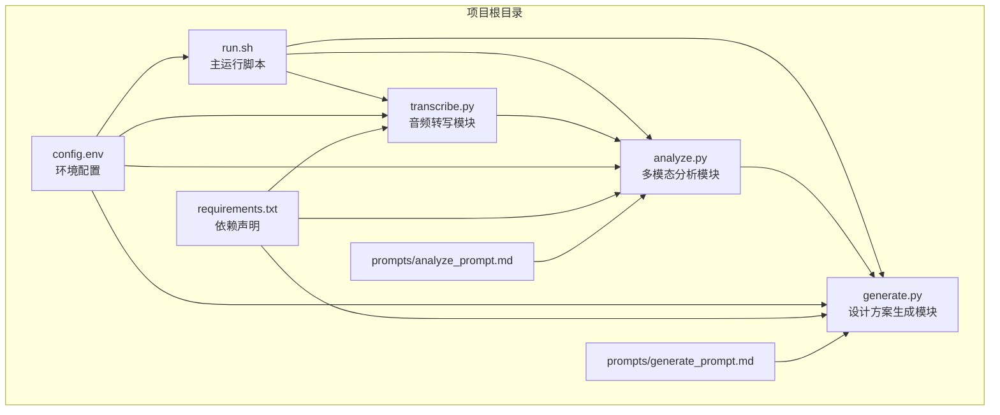
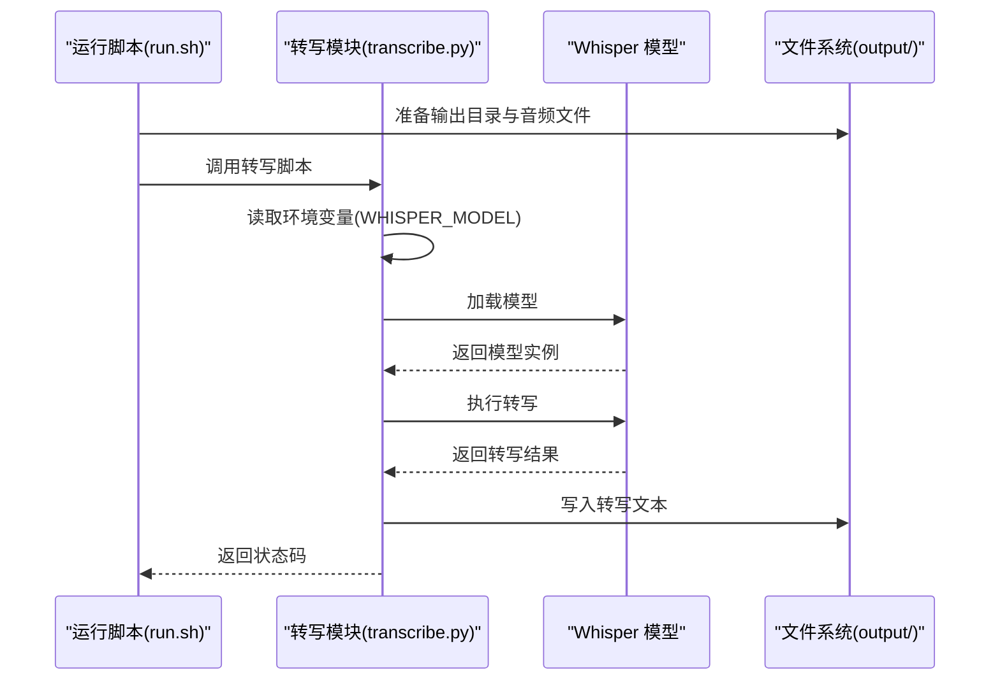
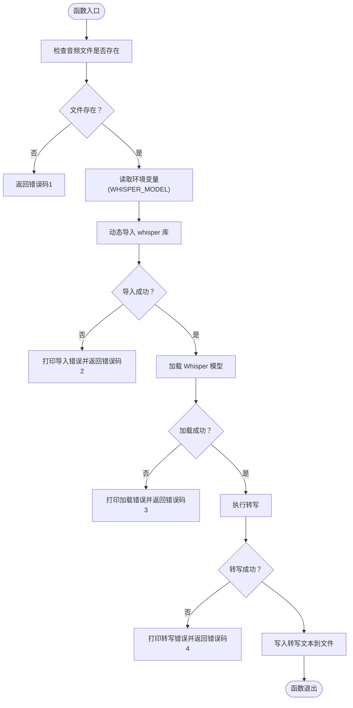
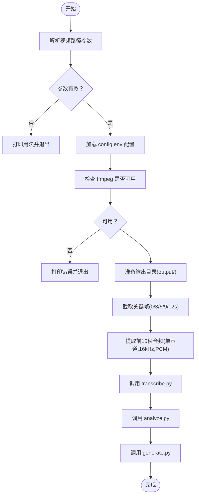
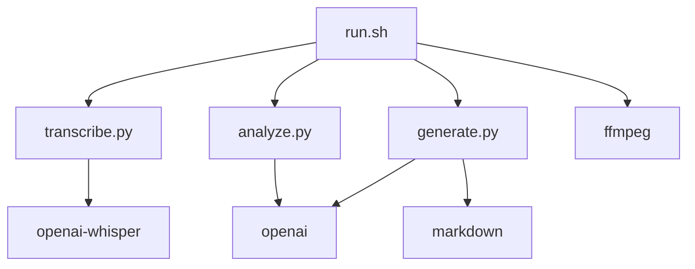

# 音频转写模块

<cite>
**本文档引用的文件**
- [transcribe.py](file://transcribe.py)
- [run.sh](file://run.sh)
- [config.env](file://config.env)
- [requirements.txt](file://requirements.txt)
- [analyze.py](file://analyze.py)
- [generate.py](file://generate.py)
- [prompts/analyze_prompt.md](file://prompts/analyze_prompt.md)
- [prompts/generate_prompt.md](file://prompts/generate_prompt.md)
</cite>

## 目录
1. [简介](#简介)
2. [项目结构](#项目结构)
3. [核心组件](#核心组件)
4. [架构总览](#架构总览)
5. [详细组件分析](#详细组件分析)
6. [依赖关系分析](#依赖关系分析)
7. [性能考虑](#性能考虑)
8. [故障排除指南](#故障排除指南)
9. [结论](#结论)
10. [附录](#附录)

## 简介
本项目是一个端到端的音频转写与落地页设计方案生成流水线，其中音频转写模块负责将视频前15秒的音频转写为文本。该模块基于 Whisper 模型，采用本地推理的方式进行语音识别，并将结果保存为文本文件供后续多模态分析与设计方案生成使用。模块支持通过环境变量配置 Whisper 模型大小，并对模型加载、推理过程中的异常进行健壮处理。

## 项目结构
该项目采用脚本驱动的流水线结构，音频转写模块位于顶层脚本中，配合运行脚本、配置文件与依赖声明共同构成完整的处理链路。

图表来源
- [run.sh:1-138](file://run.sh#L1-L138)
- [transcribe.py:1-67](file://transcribe.py#L1-L67)
- [analyze.py:1-177](file://analyze.py#L1-L177)
- [generate.py:1-377](file://generate.py#L1-L377)
- [config.env:1-13](file://config.env#L1-L13)
- [requirements.txt:1-4](file://requirements.txt#L1-L4)

章节来源
- [run.sh:1-138](file://run.sh#L1-L138)
- [config.env:1-13](file://config.env#L1-L13)
- [requirements.txt:1-4](file://requirements.txt#L1-L4)

## 核心组件
- 音频转写模块（transcribe.py）：负责加载 Whisper 模型、执行转写并将结果保存为文本文件。
- 运行脚本（run.sh）：协调关键帧提取、音频提取、转写、分析与生成的完整流程。
- 配置文件（config.env）：集中管理 API 基础地址、密钥、模型名称以及 Whisper 模型大小等环境变量。
- 依赖声明（requirements.txt）：声明 openai、openai-whisper、markdown 等依赖。
- 多模态分析模块（analyze.py）：读取转写文本与关键帧，调用多模态 API 并输出结构化分析结果。
- 设计方案生成模块（generate.py）：读取分析结果，生成 Markdown 与 HTML 格式的落地页设计方案。
- 提示词模板（prompts/analyze_prompt.md、prompts/generate_prompt.md）：为分析与生成阶段提供结构化的系统提示。

章节来源
- [transcribe.py:1-67](file://transcribe.py#L1-L67)
- [run.sh:1-138](file://run.sh#L1-L138)
- [config.env:1-13](file://config.env#L1-L13)
- [requirements.txt:1-4](file://requirements.txt#L1-L4)
- [analyze.py:1-177](file://analyze.py#L1-L177)
- [generate.py:1-377](file://generate.py#L1-L377)
- [prompts/analyze_prompt.md:1-111](file://prompts/analyze_prompt.md#L1-L111)
- [prompts/generate_prompt.md:1-69](file://prompts/generate_prompt.md#L1-L69)

## 架构总览
音频转写模块在整个流水线中处于中间层，上游由运行脚本负责准备音频与关键帧，下游由分析与生成模块消费转写结果。模块内部通过环境变量控制模型大小，使用 Whisper 的本地推理能力进行转写，并将结果持久化到输出目录。

图表来源
- [run.sh:102-108](file://run.sh#L102-L108)
- [transcribe.py:21-62](file://transcribe.py#L21-L62)

## 详细组件分析

### 音频转写模块（transcribe.py）
- 功能概述
  - 检查音频文件是否存在，若不存在则返回错误码。
  - 从环境变量读取 Whisper 模型大小，默认为 small。
  - 动态导入 whisper 库并加载模型，捕获导入与加载异常。
  - 调用模型进行转写，记录耗时并处理转写异常。
  - 将转写文本写入 output/transcript.txt，并输出统计信息。
- 关键实现点
  - 模型加载：通过环境变量控制模型大小，支持 small 等不同规模。
  - 推理参数：当前实现使用默认参数（如 verbose=False），未显式设置温度、语言等。
  - 结果处理：仅保存文本字段，未包含时间戳等元信息。
  - 错误处理：对导入失败、加载失败、转写失败分别给出明确的错误码与提示。
- 性能与精度建议
  - 模型选择：small 在速度与精度间取得平衡；large/medium 可提升精度但增加耗时。
  - 推理参数：可考虑设置语言、是否启用翻译、beam_size 等参数以优化精度。
  - 后处理：可扩展为保留时间戳、标点符号、段落分隔等，便于后续分析。

图表来源
- [transcribe.py:21-62](file://transcribe.py#L21-L62)

章节来源
- [transcribe.py:1-67](file://transcribe.py#L1-L67)

### 运行脚本（run.sh）
- 功能概述
  - 读取视频路径并校验存在性。
  - 加载 config.env 配置，若缺失则提示通过环境变量提供。
  - 使用 ffmpeg 截取关键帧（0/3/6/9/12 秒）与提取前 15 秒音频（单声道、16kHz、PCM 编码）。
  - 调用 transcribe.py 执行本地转写。
  - 依次调用 analyze.py 与 generate.py 完成多模态分析与设计方案生成。
- 关键实现点
  - 依赖检查：确保 ffmpeg 与 python3 可用。
  - 输出目录准备：自动创建 output 与 output/frames。
  - 音频预处理：固定采样率与声道数，保证后续转写质量。
  - 流程控制：对每一步的输出文件进行存在性检查，确保流程完整性。

图表来源
- [run.sh:30-138](file://run.sh#L30-L138)

章节来源
- [run.sh:1-138](file://run.sh#L1-L138)

### 配置文件（config.env）
- 功能概述
  - 统一管理多模态分析与生成阶段所需的 API 基础地址、密钥与模型名称。
  - 提供 Whisper 模型大小的配置项，便于在不同硬件条件下选择合适的模型规模。
- 关键实现点
  - API 配置：API_BASE_URL、API_KEY、MODEL_NAME。
  - 生成阶段可覆盖：GENERATE_API_BASE_URL、GENERATE_API_KEY、GENERATE_MODEL_NAME。
  - Whisper 配置：WHISPER_MODEL。

章节来源
- [config.env:1-13](file://config.env#L1-L13)

### 依赖声明（requirements.txt）
- 功能概述
  - 声明项目所需依赖：openai、openai-whisper、markdown。
- 关键实现点
  - openai-whisper：提供 Whisper 模型加载与转写能力。
  - openai：用于多模态分析与生成阶段的 API 调用。
  - markdown：用于生成阶段的 Markdown 渲染。

章节来源
- [requirements.txt:1-4](file://requirements.txt#L1-L4)

### 多模态分析模块（analyze.py）
- 功能概述
  - 读取关键帧（base64）与转写文本，构造多模态消息。
  - 调用多模态 API，解析返回的 JSON 结果并保存为结构化分析文件。
- 关键实现点
  - 关键帧加载：校验帧目录与文件存在性，统一编码为 base64。
  - JSON 解析：优先匹配代码块中的 JSON，其次尝试通用代码块，最后尝试截取大括号范围。
  - 重试机制：最多重试三次，指数退避等待。

章节来源
- [analyze.py:1-177](file://analyze.py#L1-L177)

### 设计方案生成模块（generate.py）
- 功能概述
  - 读取分析结果与提示词模板，调用生成 API，输出 Markdown 与 HTML 方案。
- 关键实现点
  - API 调用：支持覆盖生成阶段的 API 配置。
  - HTML 渲染：优先使用 markdown 库，失败时回退到简易渲染器。
  - 重试机制：最多重试三次，指数退避等待。

章节来源
- [generate.py:1-377](file://generate.py#L1-L377)

## 依赖关系分析
- 组件耦合
  - transcribe.py 与 Whisper 模型强耦合，通过环境变量控制模型大小。
  - run.sh 与 transcribe.py、analyze.py、generate.py 之间为顺序调用关系。
  - analyze.py 与 generate.py 通过中间产物（analysis.json）间接耦合。
- 外部依赖
  - ffmpeg：用于关键帧截取与音频提取。
  - openai/openai-whisper/markdown：用于多模态分析、转写与渲染。
- 潜在问题
  - 若 Whisper 模型下载失败或磁盘空间不足，可能导致转写失败。
  - 若 ffmpeg 未正确安装或权限不足，关键帧与音频提取会失败。

图表来源
- [run.sh:102-120](file://run.sh#L102-L120)
- [transcribe.py:30-40](file://transcribe.py#L30-L40)
- [analyze.py:76-125](file://analyze.py#L76-L125)
- [generate.py:38-68](file://generate.py#L38-L68)
- [requirements.txt:1-4](file://requirements.txt#L1-L4)

章节来源
- [run.sh:102-120](file://run.sh#L102-L120)
- [transcribe.py:30-40](file://transcribe.py#L30-L40)
- [analyze.py:76-125](file://analyze.py#L76-L125)
- [generate.py:38-68](file://generate.py#L38-L68)
- [requirements.txt:1-4](file://requirements.txt#L1-L4)

## 性能考虑
- 模型选择
  - small：适合快速转写与资源受限场景，精度与速度平衡良好。
  - medium/large：在需要更高精度时使用，但会显著增加推理时间与内存占用。
- 推理参数优化
  - 当前实现未显式设置语言、beam_size、temperature 等参数。可根据目标语言与场景调整以提升精度。
- 预处理优化
  - 音频预处理已固定采样率与声道，确保一致性。可进一步考虑降噪与静音裁剪以提升转写质量。
- 后处理优化
  - 当前仅保存文本。建议扩展为保存带时间戳的转写结果，便于后续分析与可视化。

## 故障排除指南
- 依赖缺失
  - 未安装 openai-whisper：根据提示执行依赖安装命令。
  - 未安装 ffmpeg：根据提示安装 ffmpeg 并确保在 PATH 中。
- 环境变量缺失
  - 缺少 API 配置或 Whisper 模型大小：检查 config.env 或通过环境变量传入。
- 文件不存在
  - 音频文件或关键帧不存在：确认 run.sh 的输入视频路径与输出目录权限。
- 转写失败
  - 模型加载失败：检查模型大小与磁盘空间，确保网络可访问模型下载源。
  - 转写异常：检查音频质量与预处理参数，必要时调整模型或推理参数。
- 多模态分析失败
  - JSON 解析失败：模块会保存原始返回以便排查，检查 API 返回格式与配置。
- 生成失败
  - Markdown 渲染失败：模块会回退到简易渲染器，检查输入文本与模板。

章节来源
- [transcribe.py:31-40](file://transcribe.py#L31-L40)
- [run.sh:54-62](file://run.sh#L54-L62)
- [config.env:1-13](file://config.env#L1-L13)
- [analyze.py:158-163](file://analyze.py#L158-L163)
- [generate.py:81-82](file://generate.py#L81-L82)

## 结论
音频转写模块通过简洁的接口与健壮的错误处理，实现了 Whisper 模型的本地转写与结果持久化。结合运行脚本的音频预处理与多模态分析、生成模块，形成了从视频到落地页设计方案的完整流水线。建议在生产环境中根据硬件条件选择合适的模型规模，并根据业务需求扩展推理参数与后处理逻辑以提升转写精度与后续分析质量。

## 附录
- 使用模式
  - 安装依赖：执行依赖安装命令。
  - 设置配置：在 config.env 中配置 API 与 Whisper 模型大小。
  - 运行流水线：执行运行脚本并传入视频路径。
- 代码示例路径
  - 模型加载与转写：[transcribe.py:36-50](file://transcribe.py#L36-L50)
  - 音频预处理（ffmpeg 命令）：[run.sh:91-100](file://run.sh#L91-L100)
  - 关键帧截取（ffmpeg 命令）：[run.sh:72-89](file://run.sh#L72-L89)
  - 多模态分析调用：[analyze.py:110-115](file://analyze.py#L110-L115)
  - 设计方案生成调用：[generate.py:54-58](file://generate.py#L54-L58)