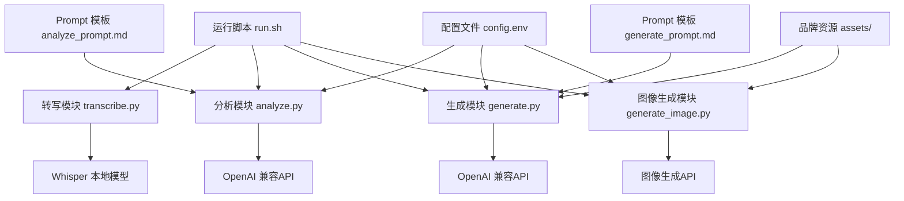
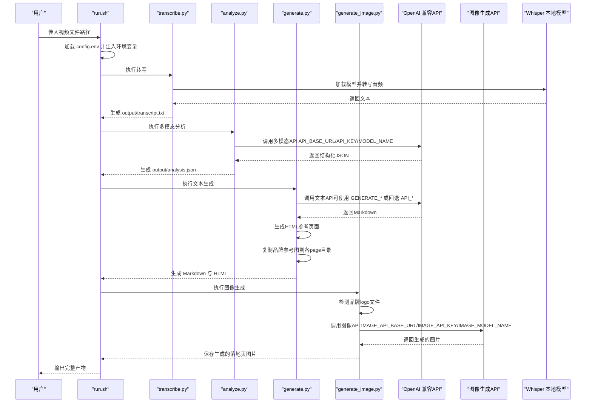
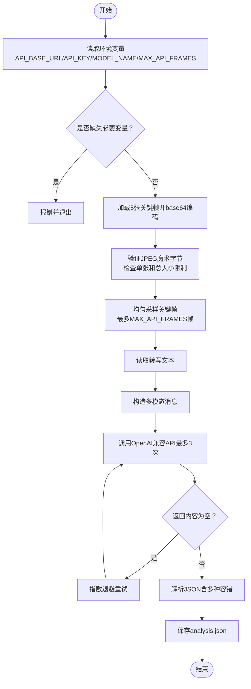
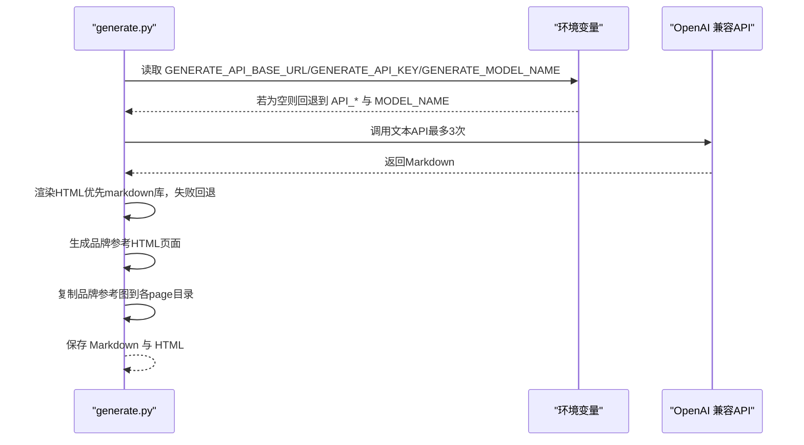
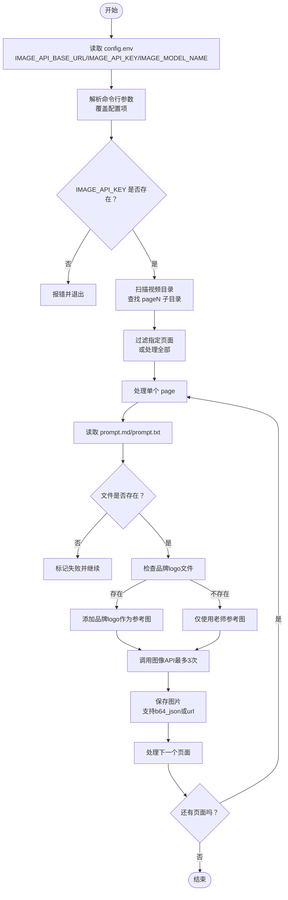
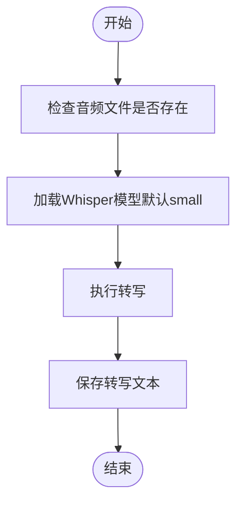
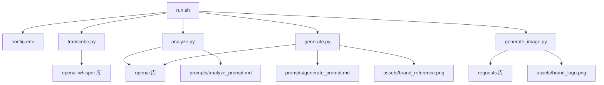

# API配置

<cite>
**本文引用的文件**
- [config.env.example](file://config.env.example)
- [config.env](file://config.env)
- [run.sh](file://run.sh)
- [requirements.txt](file://requirements.txt)
- [analyze.py](file://analyze.py)
- [generate.py](file://generate.py)
- [generate_image.py](file://generate_image.py)
- [transcribe.py](file://transcribe.py)
- [prompts/analyze_prompt.md](file://prompts/analyze_prompt.md)
- [prompts/generate_prompt.md](file://prompts/generate_prompt.md)
</cite>

## 更新摘要
**变更内容**
- 新增品牌logo引用系统，支持品牌标识参考图和品牌logo文件
- 扩展多参考图像支持，增强图像生成的参考素材能力
- 新增向后兼容的prompt文件支持，兼容prompt.txt格式
- 更新API配置包括品牌logo路径常量(BRAND_LOGO_PATH)和多图像处理能力

## 目录
1. [简介](#简介)
2. [项目结构](#项目结构)
3. [核心组件](#核心组件)
4. [架构总览](#架构总览)
5. [详细组件分析](#详细组件分析)
6. [依赖关系分析](#依赖关系分析)
7. [性能考虑](#性能考虑)
8. [故障排查指南](#故障排查指南)
9. [结论](#结论)
10. [附录](#附录)

## 简介
本文件面向需要在本项目中配置和使用API的用户，系统性说明config.env中的API相关配置项，以及这些配置在多模态分析、文本生成与图像生成三个阶段中的作用与设置方法。文档同时提供OpenAI兼容API及其他第三方服务的配置要点、安全最佳实践、重试与错误处理策略、性能优化建议与监控指标建议，帮助您在不同API提供商之间进行选择与迁移。

**更新** 本版本新增了品牌logo引用系统和多参考图像支持，扩展了项目功能的完整性和实用性。

## 项目结构
项目采用"脚本驱动 + 环境变量 + Prompt模板"的分层设计，现已扩展为包含多模态分析、文本生成、图像生成和品牌logo引用的完整工作流程：
- 运行入口：bash脚本负责参数校验、环境变量加载、关键帧与音频提取、调用Python模块。
- Python模块：分别负责转写、多模态分析、文本生成和图像生成。
- 配置文件：集中存放API基础URL、密钥、模型名等。
- Prompt模板：定义系统提示词，指导模型输出结构化结果。
- 品牌资源：assets目录下的品牌logo和品牌参考图，为图像生成提供品牌一致性保障。

**图表来源**
- [run.sh:42-52](file://run.sh#L42-L52)
- [transcribe.py:21-62](file://transcribe.py#L21-L62)
- [analyze.py:76-125](file://analyze.py#L76-L125)
- [generate.py:38-68](file://generate.py#L38-L68)
- [generate_image.py:130-167](file://generate_image.py#L130-L167)
- [config.env:1-22](file://config.env#L1-L22)
- [prompts/analyze_prompt.md:1-153](file://prompts/analyze_prompt.md#L1-L153)
- [prompts/generate_prompt.md:1-130](file://prompts/generate_prompt.md#L1-L130)

**章节来源**
- [run.sh:1-197](file://run.sh#L1-L197)
- [config.env:1-22](file://config.env#L1-L22)

## 核心组件
本节聚焦于API配置项及其在各模块中的使用方式与注意事项。

- API_BASE_URL
  - 作用：指定多模态分析阶段OpenAI兼容API的基础访问地址（通常以/v1结尾）。
  - 设置位置：config.env中"多模态分析 API 配置"段落；也可在运行时通过环境变量覆盖。
  - 使用范围：多模态分析阶段读取该值。
  - 注意事项：确保末尾斜杠与版本号符合目标服务端要求。

- API_KEY
  - 作用：多模态分析阶段API密钥，用于鉴权。
  - 设置位置：config.env中"多模态分析 API 配置"段落；也可在运行时通过环境变量覆盖。
  - 使用范围：多模态分析阶段读取该值。
  - 安全建议：避免硬编码在代码中；优先通过config.env与环境变量注入；在CI/CD中使用机密变量。

- MODEL_NAME
  - 作用：指定多模态分析阶段调用的模型名称。
  - 设置位置：config.env中"多模态分析 API 配置"段落；也可在运行时通过环境变量覆盖。
  - 使用范围：多模态分析阶段读取该值。
  - 注意事项：不同服务提供商的模型命名差异较大，需与实际可用模型一致。

- GENERATE_*（可选）
  - 作用：为"文本生成"阶段提供独立的API基础URL、密钥与模型名，便于与"多模态分析"阶段分离。
  - 设置位置：config.env中"落地页生成 API 配置（可选）"段落。
  - 使用逻辑：生成模块会优先读取GENERATE_*，否则回退到API_*。

- IMAGE_API_BASE_URL
  - 作用：指定图像生成API的基础访问地址，支持/images/edits端点。
  - 设置位置：config.env中"生图 API 配置"段落；也可在运行时通过命令行参数覆盖。
  - 使用范围：图像生成阶段读取该值。
  - 注意事项：确保端点支持multipart/form-data上传和/images/edits接口。

- IMAGE_API_KEY
  - 作用：图像生成API密钥，用于鉴权。
  - 设置位置：config.env中"生图 API 配置"段落；也可在运行时通过命令行参数覆盖。
  - 使用范围：图像生成阶段读取该值。
  - 安全建议：避免硬编码在代码中；优先通过config.env与环境变量注入。

- IMAGE_MODEL_NAME
  - 作用：指定图像生成阶段调用的模型名称（如gpt-image-2）。
  - 设置位置：config.env中"生图 API 配置"段落；也可在运行时通过命令行参数覆盖。
  - 使用范围：图像生成阶段读取该值。
  - 注意事项：不同服务提供商的模型命名差异较大，需与实际可用模型一致。

- WHISPER_MODEL
  - 作用：本地Whisper模型大小（如small、medium等），用于音频转写。
  - 设置位置：config.env中"Whisper 模型配置"段落。
  - 使用范围：仅在转写阶段生效。

- MAX_API_FRAMES
  - 作用：控制发送给多模态分析API的最大帧数，防止token过多或API图片数量限制。
  - 设置位置：config.env中"多模态分析：发送给 API 的最大帧数"段落。
  - 使用范围：多模态分析阶段，用于均匀采样关键帧。
  - 默认值：5（可在config.env中修改）

- BRAND_LOGO_PATH
  - 作用：品牌logo文件路径常量，用于图像生成阶段的品牌一致性保障。
  - 设置位置：generate_image.py中定义，指向assets/brand_logo.png。
  - 使用范围：图像生成阶段自动检测并添加品牌logo作为参考图。
  - 注意事项：文件必须存在且为PNG格式，确保品牌栏样式的一致性。

- TEACHER_REF_PATH
  - 作用：老师参考图路径常量，用于图像生成阶段的老师形象参考。
  - 设置位置：generate.py中定义，指向ANALYSE_DIR/teacher_ref.jpg。
  - 使用范围：文本生成阶段生成变体素材时复制到各page目录。
  - 注意事项：文件必须存在，建议为高质量人像照片。

- BRAND_REFERENCE_SRC
  - 作用：品牌参考图源文件路径，用于HTML参考页面的展示。
  - 设置位置：generate.py中定义，指向assets/brand_reference.png。
  - 使用范围：生成HTML参考页面时展示品牌栏样式。
  - 注意事项：文件必须存在，用于指导AI生成正确的品牌栏样式。

**更新** 新增了品牌logo引用系统相关配置项，包括BRAND_LOGO_PATH、TEACHER_REF_PATH和BRAND_REFERENCE_SRC，扩展了项目的品牌一致性保障能力。

**章节来源**
- [config.env:1-22](file://config.env#L1-L22)
- [analyze.py:225-236](file://analyze.py#L225-L236)
- [generate.py:622-628](file://generate.py#L622-L628)
- [generate_image.py:34-36](file://generate_image.py#L34-L36)
- [transcribe.py:27](file://transcribe.py#L27)
- [generate.py:46](file://generate.py#L46)

## 架构总览
下图展示了从视频到最终生成落地页设计方案的整体流程，包括新增的品牌logo引用系统和多参考图像支持，以及API配置在其中的位置与流向。

**图表来源**
- [run.sh:42-52](file://run.sh#L42-L52)
- [transcribe.py:21-62](file://transcribe.py#L21-L62)
- [analyze.py:76-125](file://analyze.py#L76-L125)
- [generate.py:38-68](file://generate.py#L38-L68)
- [generate_image.py:130-167](file://generate_image.py#L130-L167)
- [config.env:1-22](file://config.env#L1-L22)

## 详细组件分析

### 多模态分析模块（analyze.py）
- 功能概述
  - 读取关键帧图片（base64）与转写文本，构造多模态消息，调用OpenAI兼容API，解析并保存结构化结果。
- 关键配置项
  - API_BASE_URL、API_KEY、MODEL_NAME：从环境变量读取，用于构建客户端与发起请求。
  - MAX_API_FRAMES：控制发送给API的最大帧数，默认5帧，可通过环境变量覆盖。
  - 重试机制：最多3次，指数退避（2^attempt-1秒）。
  - 温度参数：0.3，偏向确定性输出。
- 错误处理
  - 缺少必要环境变量时直接报错退出。
  - API返回空内容时抛出异常并记录原始返回以便排障。
  - JSON解析失败时保存原始响应到analysis_raw.txt。
  - 增强的图像验证：检查JPEG魔术字节、单张大小和总大小限制。
  - 帧采样优化：当帧数超过限制时进行均匀采样，确保首尾帧被保留。

**更新** 增强了错误处理和验证机制，包括图像文件验证、帧采样优化和更详细的错误报告。

**图表来源**
- [analyze.py:211-272](file://analyze.py#L211-L272)
- [analyze.py:76-125](file://analyze.py#L76-L125)
- [analyze.py:53-73](file://analyze.py#L53-L73)

**章节来源**
- [analyze.py:211-272](file://analyze.py#L211-L272)
- [analyze.py:76-125](file://analyze.py#L76-L125)
- [prompts/analyze_prompt.md:1-153](file://prompts/analyze_prompt.md#L1-L153)

### 文本生成模块（generate.py）
- 功能概述
  - 读取分析结果，替换prompt模板中的占位符，调用OpenAI兼容API生成Markdown，并生成HTML。
- 关键配置项
  - 优先读取GENERATE_*（若存在），否则回退到API_*。
  - 重试机制：最多3次，指数退避。
  - 温度参数：0.6，偏向创造性输出。
  - 品牌参考图：自动生成HTML参考页面，展示品牌栏样式。
  - 向后兼容：支持prompt.md和prompt.txt两种文件格式。
- 错误处理
  - 缺少必要环境变量时直接报错退出。
  - HTML渲染优先使用markdown库，失败则回退到简易渲染器。
  - 增强的变体提取和素材分发机制。
  - 品牌参考图缺失时发出警告并继续处理。

**更新** 改进了HTML渲染的回退策略，增强了变体提取和素材分发功能，新增品牌参考图支持和向后兼容的prompt文件处理。

**图表来源**
- [generate.py:619-712](file://generate.py#L619-L712)
- [generate.py:38-68](file://generate.py#L38-L68)
- [generate.py:420-513](file://generate.py#L420-L513)
- [generate.py:570-614](file://generate.py#L570-L614)

**章节来源**
- [generate.py:619-712](file://generate.py#L619-L712)
- [prompts/generate_prompt.md:1-130](file://prompts/generate_prompt.md#L1-L130)
- [generate.py:420-513](file://generate.py#L420-L513)
- [generate.py:570-614](file://generate.py#L570-L614)

### 图像生成模块（generate_image.py）
- 功能概述
  - 读取生图Prompt和参考图，调用图像生成API生成落地页图片，支持多页面批量处理。
- 关键配置项
  - IMAGE_API_BASE_URL、IMAGE_API_KEY、IMAGE_MODEL_NAME：从环境变量读取，用于构建客户端与发起请求。
  - 支持命令行参数覆盖：--url、--key、--model、--size。
  - 默认尺寸：1024x1792（竖版1080x1920）。
  - 重试机制：最多3次，指数退避（2^attempt-1秒）。
  - 超时设置：600秒，适应图像生成较长耗时。
  - 品牌logo支持：自动检测assets/brand_logo.png并作为参考图。
  - 多参考图像：支持多张参考图（包括品牌logo和老师参考图）。
- 错误处理
  - 缺少必要环境变量时直接报错退出。
  - API响应格式兼容：支持b64_json和url两种返回格式。
  - 图片保存：自动处理base64解码和URL下载。
  - 页面过滤：支持指定页面编号列表处理。
  - 品牌logo缺失：仅使用老师参考图继续处理。

**更新** 新增了完整的图像生成API配置支持，包括独立的generate_image.py脚本、品牌logo引用系统、多参考图像支持和增强的错误处理机制。

**图表来源**
- [generate_image.py:311-393](file://generate_image.py#L311-L393)
- [generate_image.py:203-258](file://generate_image.py#L203-L258)
- [generate_image.py:130-167](file://generate_image.py#L130-L167)
- [generate_image.py:244-250](file://generate_image.py#L244-L250)

**章节来源**
- [generate_image.py:1-398](file://generate_image.py#L1-L398)

### 本地转写模块（transcribe.py）
- 功能概述
  - 使用openai-whisper加载指定模型，对音频进行转写，输出文本。
- 关键配置项
  - WHISPER_MODEL：默认small，可在环境变量中覆盖。
- 错误处理
  - 未安装whisper库或模型加载失败时给出明确提示。
  - 增强的模型加载进度显示和错误报告。

**更新** 改进了模型加载的错误处理和用户反馈机制。

**图表来源**
- [transcribe.py:22-66](file://transcribe.py#L22-L66)

**章节来源**
- [transcribe.py:22-66](file://transcribe.py#L22-L66)

## 依赖关系分析
- 运行脚本（run.sh）
  - 负责加载config.env并注入环境变量，随后依次执行转写、分析、生成三个步骤。
  - 对外部工具（ffmpeg、python3）进行依赖检查。
- Python模块
  - analyze.py与generate.py均依赖openai库，通过API_BASE_URL与API_KEY初始化客户端。
  - generate_image.py依赖requests库，通过IMAGE_API_BASE_URL与IMAGE_API_KEY初始化客户端。
  - transcribe.py依赖openai-whisper库，通过WHISPER_MODEL控制模型大小。
- Prompt模板
  - analyze_prompt.md与generate_prompt.md分别作为系统提示词，决定模型输出结构与内容。
- 品牌资源
  - generate.py与generate_image.py共享assets目录下的品牌资源文件。
  - generate.py生成品牌参考HTML页面，generate_image.py使用品牌logo文件。

**更新** 依赖管理更加严格，新增了对图像生成API的requests库依赖和品牌资源的共享机制。

**图表来源**
- [run.sh:42-52](file://run.sh#L42-L52)
- [requirements.txt:1-5](file://requirements.txt#L1-L5)
- [prompts/analyze_prompt.md:1-153](file://prompts/analyze_prompt.md#L1-L153)
- [prompts/generate_prompt.md:1-130](file://prompts/generate_prompt.md#L1-L130)

**章节来源**
- [run.sh:42-52](file://run.sh#L42-L52)
- [requirements.txt:1-5](file://requirements.txt#L1-L5)

## 性能考虑
- 模型选择
  - 多模态分析阶段温度较低（0.3），适合稳定输出；生成阶段温度较高（0.6），利于创意表达。
  - 图像生成阶段使用专门的图像模型（如gpt-image-2），适合高质量图片生成。
  - 不同服务提供商的模型命名与能力差异较大，建议根据需求选择合适模型。
- 重试与退避
  - 三阶段均实现最多3次重试，指数退避，有助于缓解瞬时抖动。
  - 图像生成阶段设置较长超时时间（600秒），适应图片生成较长耗时。
- 本地转写
  - Whisper模型越大，准确率越高但推理时间越长；可根据资源与质量需求选择small/medium等。
- I/O与中间文件
  - 关键帧、音频、转写文本、分析结果、生成文件与图像文件均在output目录下，建议定期清理以节省空间。
- 网络与并发
  - 本项目为串行流程，不涉及并发调用；如需扩展，建议在API侧增加限流与幂等控制。
- 帧采样优化
  - 通过MAX_API_FRAMES配置控制发送给多模态分析API的帧数，避免token过多和API限制。
- 图像验证
  - 增强的JPEG文件验证和大小检查，提高API调用成功率。
- 图像生成优化
  - 支持批量页面处理，可指定页面范围减少处理时间。
  - 默认尺寸1024x1792，平衡质量和生成速度。
  - 多参考图像支持，提升生成质量的一致性。
- 品牌一致性优化
  - 品牌logo自动检测和引用，确保生成图片的品牌栏样式一致性。
  - 品牌参考HTML页面辅助设计师理解品牌规范。

**更新** 新增了图像生成阶段的性能优化建议，包括超时设置、批量处理、尺寸优化和品牌一致性保障。

## 故障排查指南
- 缺少必要环境变量
  - 现象：模块直接报错并退出。
  - 排查：确认config.env中API_BASE_URL、API_KEY、MODEL_NAME、IMAGE_API_BASE_URL、IMAGE_API_KEY、IMAGE_MODEL_NAME均已正确设置；或在运行环境中显式导出。
  - 参考
    - [analyze.py:215-218](file://analyze.py#L215-L218)
    - [generate.py:625-628](file://generate.py#L625-L628)
    - [generate_image.py:333-335](file://generate_image.py#L333-L335)

- API返回内容为空
  - 现象：抛出异常并记录原始返回，便于定位问题。
  - 排查：检查模型名是否正确、服务端是否返回空内容、网络连通性。
  - 参考
    - [analyze.py:200-202](file://analyze.py#L200-L202)
    - [generate.py:82-84](file://generate.py#L82-L84)
    - [generate_image.py:159-162](file://generate_image.py#L159-L162)

- JSON解析失败
  - 现象：保存原始返回到analysis_raw.txt，便于人工核对。
  - 排查：检查模型输出格式是否符合预期，必要时调整prompt。
  - 参考
    - [analyze.py:254-263](file://analyze.py#L254-L263)

- 未安装依赖库
  - 现象：转写、分析或图像生成阶段报错，提示未安装openai/openai-whisper/requests。
  - 排查：执行requirements.txt安装依赖。
  - 参考
    - [requirements.txt:1-5](file://requirements.txt#L1-L5)
    - [transcribe.py:33-36](file://transcribe.py#L33-L36)
    - [analyze.py:139-140](file://analyze.py#L139-L140)
    - [generate_image.py:23](file://generate_image.py#L23)

- 生成HTML失败
  - 现象：生成Markdown成功但HTML失败，模块发出警告并继续。
  - 排查：检查markdown库可用性或依赖版本。
  - 参考
    - [generate.py:698-700](file://generate.py#L698-L700)

- 本地转写失败
  - 现象：模型加载失败或转写过程异常。
  - 排查：确认WHISPER_MODEL可用、磁盘空间充足、音频文件有效。
  - 参考
    - [transcribe.py:40-42](file://transcribe.py#L40-L42)

- 帧文件验证失败
  - 现象：关键帧可能不是有效的JPEG文件或大小超过限制。
  - 排查：检查帧文件完整性，确保JPEG格式正确且大小适中。
  - 参考
    - [analyze.py:62-78](file://analyze.py#L62-L78)

- 帧采样配置问题
  - 现象：发送给API的帧数不符合预期。
  - 排查：检查MAX_API_FRAMES配置，确保数值合理且大于0。
  - 参考
    - [analyze.py:227-236](file://analyze.py#L227-L236)

- 图像生成API调用失败
  - 现象：图像生成阶段报错，API返回非200状态码或响应格式错误。
  - 排查：检查IMAGE_API_BASE_URL是否正确、IMAGE_API_KEY是否有效、模型名是否匹配、参考图是否存在且为JPEG格式。
  - 参考
    - [generate_image.py:159-162](file://generate_image.py#L159-L162)
    - [generate_image.py:221-226](file://generate_image.py#L221-L226)

- 图片保存失败
  - 现象：API调用成功但图片保存失败。
  - 排查：检查输出目录权限、磁盘空间、响应格式是否为b64_json或url。
  - 参考
    - [generate_image.py:251-255](file://generate_image.py#L251-L255)

- 品牌logo文件缺失
  - 现象：图像生成时仅使用老师参考图，品牌栏样式可能不一致。
  - 排查：确认assets/brand_logo.png存在且为PNG格式，检查文件权限。
  - 参考
    - [generate_image.py:244-250](file://generate_image.py#L244-L250)

- 品牌参考图复制失败
  - 现象：文本生成阶段复制品牌参考图到各page目录失败。
  - 排查：检查assets/brand_reference.png存在性、磁盘空间、目标目录权限。
  - 参考
    - [generate.py:601-607](file://generate.py#L601-L607)

- 向后兼容的prompt文件处理
  - 现象：文本生成阶段无法找到prompt.md文件。
  - 排查：确认存在prompt.md或prompt.txt文件，检查文件编码和格式。
  - 参考
    - [generate.py:587-590](file://generate.py#L587-L590)

**更新** 新增了品牌logo文件缺失、品牌参考图复制失败和向后兼容的prompt文件处理等故障排查指南。

## 结论
本项目的API配置围绕"环境变量 + Prompt模板"的模式展开，通过config.env集中管理API基础URL、密钥与模型名，并在运行脚本中统一注入。多模态分析、文本生成和图像生成三个阶段均采用OpenAI兼容API，具备完善的重试与错误处理机制。本地转写使用Whisper模型，支持灵活的模型规模选择。**更新** 新版本新增了完整的图像生成API配置支持、品牌logo引用系统和多参考图像支持，显著扩展了项目的实用性和完整性。新增的品牌一致性保障机制确保生成图片的品牌栏样式统一，多参考图像支持提升了生成质量。建议在生产环境中遵循安全最佳实践，合理选择API提供商与模型，并结合监控指标持续优化性能与稳定性。

## 附录

### API配置项一览表
- API_BASE_URL
  - 类型：字符串
  - 必填：是
  - 默认值：无
  - 用途：多模态分析阶段OpenAI兼容API基础URL
  - 参考
    - [config.env:2](file://config.env#L2)
    - [analyze.py:212](file://analyze.py#L212)

- API_KEY
  - 类型：字符串
  - 必填：是
  - 默认值：无
  - 用途：多模态分析阶段API鉴权密钥
  - 参考
    - [config.env:3](file://config.env#L3)
    - [analyze.py:213](file://analyze.py#L213)

- MODEL_NAME
  - 类型：字符串
  - 必填：是
  - 默认值：无
  - 用途：多模态分析阶段调用的模型名称
  - 参考
    - [config.env:4](file://config.env#L4)
    - [analyze.py:214](file://analyze.py#L214)

- GENERATE_API_BASE_URL（可选）
  - 类型：字符串
  - 必填：否
  - 默认值：无
  - 用途：为文本生成阶段提供独立API基础URL
  - 参考
    - [config.env:7-9](file://config.env#L7-L9)
    - [generate.py:622](file://generate.py#L622)

- GENERATE_API_KEY（可选）
  - 类型：字符串
  - 必填：否
  - 默认值：无
  - 用途：为文本生成阶段提供独立API密钥
  - 参考
    - [config.env:7-9](file://config.env#L7-L9)
    - [generate.py:623](file://generate.py#L623)

- GENERATE_MODEL_NAME（可选）
  - 类型：字符串
  - 必填：否
  - 默认值：无
  - 用途：为文本生成阶段提供独立模型名
  - 参考
    - [config.env:7-9](file://config.env#L7-L9)
    - [generate.py:624](file://generate.py#L624)

- IMAGE_API_BASE_URL
  - 类型：字符串
  - 必填：是
  - 默认值：https://api-slb.packyapi.com/v1/images/edits
  - 用途：图像生成API基础URL，支持/images/edits端点
  - 参考
    - [config.env:19](file://config.env#L19)
    - [generate_image.py:34](file://generate_image.py#L34)

- IMAGE_API_KEY
  - 类型：字符串
  - 必填：是
  - 默认值：无
  - 用途：图像生成API鉴权密钥
  - 参考
    - [config.env:20](file://config.env#L20)
    - [generate_image.py:35](file://generate_image.py#L35)

- IMAGE_MODEL_NAME
  - 类型：字符串
  - 必填：是
  - 默认值：gpt-image-2
  - 用途：图像生成阶段调用的模型名称
  - 参考
    - [config.env:21](file://config.env#L21)
    - [generate_image.py:36](file://generate_image.py#L36)

- WHISPER_MODEL
  - 类型：字符串
  - 必填：否
  - 默认值：small
  - 用途：本地Whisper模型大小
  - 参考
    - [config.env:12](file://config.env#L12)
    - [transcribe.py:27](file://transcribe.py#L27)

- MAX_API_FRAMES
  - 类型：整数
  - 必填：否
  - 默认值：5
  - 用途：控制发送给多模态分析API的最大帧数
  - 参考
    - [config.env:16](file://config.env#L16)
    - [analyze.py:227](file://analyze.py#L227)

- BRAND_LOGO_PATH
  - 类型：字符串（路径）
  - 必填：否
  - 默认值：assets/brand_logo.png
  - 用途：品牌logo文件路径，用于图像生成阶段的品牌一致性保障
  - 参考
    - [generate_image.py:28](file://generate_image.py#L28)

- TEACHER_REF_PATH
  - 类型：字符串（路径）
  - 必填：否
  - 默认值：ANALYSE_DIR/teacher_ref.jpg
  - 用途：老师参考图路径，用于图像生成阶段的老师形象参考
  - 参考
    - [generate.py:46](file://generate.py#L46)

- BRAND_REFERENCE_SRC
  - 类型：字符串（路径）
  - 必填：否
  - 默认值：assets/brand_reference.png
  - 用途：品牌参考图源文件路径，用于HTML参考页面展示
  - 参考
    - [generate.py:46](file://generate.py#L46)

**更新** 新增了品牌logo引用系统相关配置项，包括BRAND_LOGO_PATH、TEACHER_REF_PATH和BRAND_REFERENCE_SRC，扩展了项目的品牌一致性保障能力。

### OpenAI兼容API与其他第三方服务配置要点
- 基础URL与版本
  - 多数兼容服务会在基础URL后附加版本号（如/v1），请确保config.env中的API_BASE_URL与服务端一致。
  - 图像生成API需支持/images/edits端点和multipart/form-data上传。
- 模型名称
  - 不同服务提供商的模型命名差异较大，务必与服务端可用模型一致。
  - 多模态分析使用文本模型（如gpt-5.5），图像生成使用专门的图像模型（如gpt-image-2）。
- 认证方式
  - 多数兼容服务仍使用API-Key认证；请确保API_KEY正确且未过期。
- 速率限制与配额
  - 建议在调用前评估服务端速率限制与配额，必要时在应用侧增加限流与排队策略。
- 代理与网络
  - 如需通过代理访问，请确保代理配置正确，避免DNS污染或网络超时。
- 图像生成特殊要求
  - 确保API支持/images/edits端点和multipart/form-data格式。
  - 支持b64_json和url两种响应格式。
  - 提供适当的超时设置以适应较长的生成时间。
  - 支持多参考图像上传，提升生成质量一致性。

### 付费API与免费API选择建议
- 付费API
  - 优点：稳定性高、并发能力强、模型更新快、技术支持完善。
  - 适用场景：生产环境、对质量与稳定性要求高的任务。
- 免费API
  - 优点：成本低、易于试用。
  - 适用场景：开发测试、小规模验证。
- 建议
  - 在开发阶段可使用免费API快速验证流程；进入生产前切换至付费服务并开启监控与告警。
- 图像生成API选择
  - 图像生成API通常比文本API更昂贵，建议根据预算选择合适的提供商。
  - 考虑API的生成速度、质量、并发限制等因素。
  - 优先选择支持多参考图像和品牌一致性保障的API服务。

### API密钥安全管理最佳实践
- 使用环境变量
  - 通过config.env与运行脚本注入，避免硬编码在代码中。
- CI/CD机密
  - 在CI/CD流水线中使用机密变量存储API_KEY，避免日志泄露。
- 最小权限原则
  - 为不同阶段（分析/生成/图像生成）配置独立的API密钥与模型，降低风险面。
- 定期轮换
  - 建议定期更换API_KEY，防止长期暴露带来的风险。
- 日志脱敏
  - 避免在日志中打印API_KEY；如需调试，使用脱敏后的部分字符。
- 多租户隔离
  - 为多用户或多项目配置独立的API密钥，便于审计和控制成本。

### API超时设置、重试机制与错误处理配置
- 超时设置
  - 多模态分析API：默认无显式超时设置。
  - 文本生成API：默认无显式超时设置。
  - 图像生成API：设置600秒超时，适应较长的生成时间。
- 重试机制
  - 三阶段均实现最多3次重试，指数退避（2^attempt-1秒）。
- 错误处理
  - 缺少必要变量、返回空内容、JSON解析失败、依赖库缺失、API调用失败等均有明确报错与回退策略。
  - 品牌logo缺失时发出警告并继续处理。
  - 品牌参考图复制失败时发出警告并继续处理。
- 建议
  - 在API侧增加幂等标识与重试窗口，避免重复消费；在应用侧记录重试次数与延迟，便于监控。
- 图像生成特殊处理
  - 支持b64_json和url两种响应格式的兼容处理。
  - 自动处理base64解码和URL下载。
  - 多参考图像支持，提升生成质量一致性。

**更新** 增强了错误处理和验证机制，提供了更详细的错误报告和故障排查指南，新增了图像生成API的特殊处理机制和品牌一致性保障。

**章节来源**
- [analyze.py:190-208](file://analyze.py#L190-L208)
- [generate.py:72-90](file://generate.py#L72-L90)
- [generate_image.py:39-41](file://generate_image.py#L39-L41)

### API性能优化建议与监控指标
- 性能优化建议
  - 选择合适的模型：在质量与速度间平衡，必要时启用量化或混合精度。
  - 缓存中间结果：对分析结果与转写文本进行缓存，减少重复计算。
  - 并发与限流：在API侧设置合理的并发与限流，避免突发流量冲击。
  - 帧采样优化：合理设置MAX_API_FRAMES，平衡质量和性能。
  - 图像验证：利用JPEG魔术字节检查和大小限制，提高API调用成功率。
  - 批量处理：图像生成支持批量页面处理，可指定页面范围减少处理时间。
  - 尺寸优化：合理设置图像尺寸，在质量和速度间取得平衡。
  - 品牌一致性优化：利用品牌logo自动检测和引用，确保生成图片的品牌栏样式统一。
  - 多参考图像：合理使用多张参考图提升生成质量的一致性。
- 监控指标建议
  - 响应时间：平均响应时间、P95/P99延迟。
  - 成功率：API调用成功率、重试次数分布。
  - 错误类型：空响应、解析失败、依赖缺失、API调用失败等分类统计。
  - 资源使用：CPU/内存占用、I/O吞吐量。
  - 成本：按调用次数与Token数统计费用。
  - 帧处理：关键帧数量、采样效率、图像验证成功率。
  - 图像生成：生成时间、成功率、失败原因分类、成本统计。
  - 品牌一致性：品牌logo引用成功率、品牌栏样式一致性评分。
  - 并发监控：同时进行的API调用数量、队列长度、等待时间。

**更新** 新增了图像生成阶段的性能优化建议和监控指标，包括生成时间、成功率、成本统计和品牌一致性保障等。