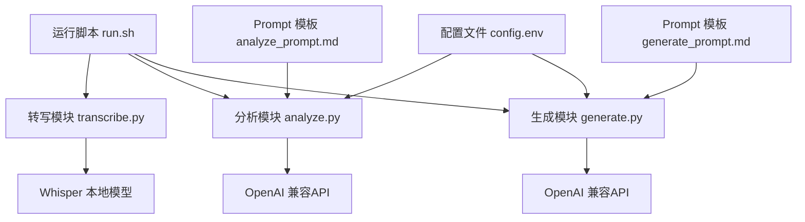
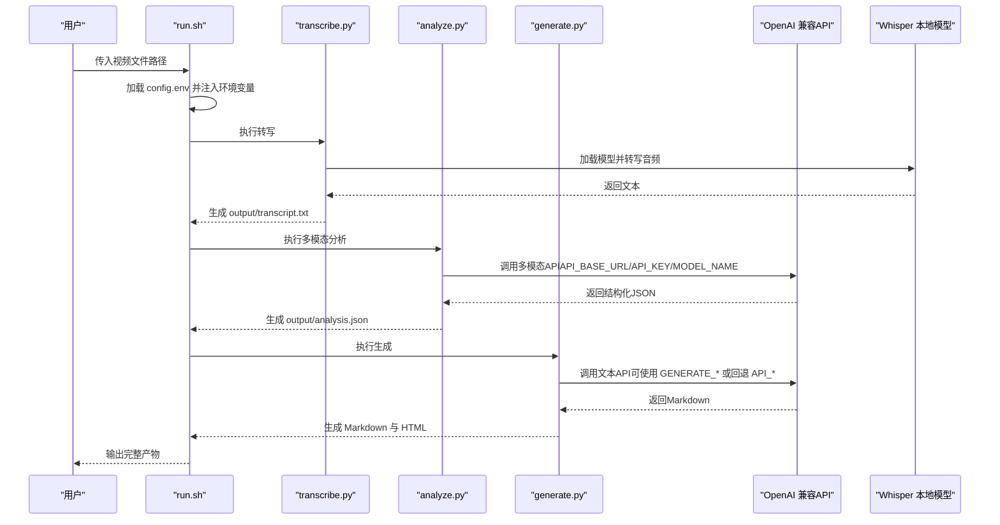
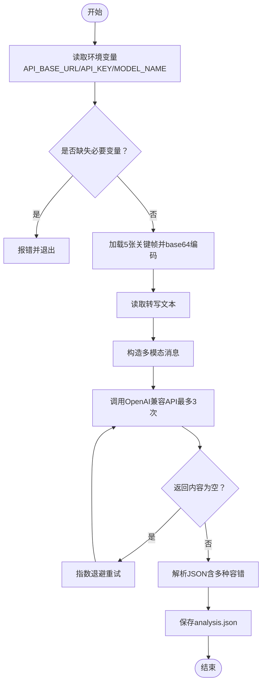
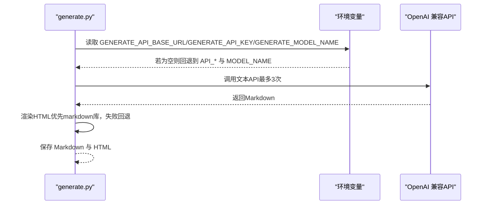
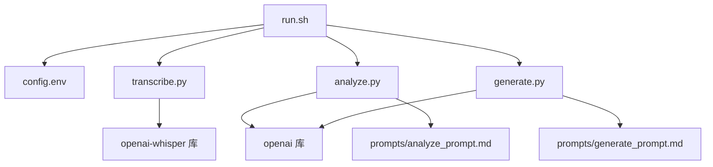

# API配置

<cite>
**本文引用的文件**
- [config.env](file://config.env)
- [run.sh](file://run.sh)
- [requirements.txt](file://requirements.txt)
- [analyze.py](file://analyze.py)
- [generate.py](file://generate.py)
- [transcribe.py](file://transcribe.py)
- [prompts/analyze_prompt.md](file://prompts/analyze_prompt.md)
- [prompts/generate_prompt.md](file://prompts/generate_prompt.md)
</cite>

## 目录
1. [简介](#简介)
2. [项目结构](#项目结构)
3. [核心组件](#核心组件)
4. [架构总览](#架构总览)
5. [详细组件分析](#详细组件分析)
6. [依赖关系分析](#依赖关系分析)
7. [性能考虑](#性能考虑)
8. [故障排查指南](#故障排查指南)
9. [结论](#结论)
10. [附录](#附录)

## 简介
本文件面向需要在本项目中配置和使用API的用户，系统性说明config.env中的API相关配置项，以及这些配置在多模态分析、文本生成与本地转写三个阶段中的作用与设置方法。文档同时提供OpenAI兼容API及其他第三方服务的配置要点、安全最佳实践、重试与错误处理策略、性能优化建议与监控指标建议，帮助您在不同API提供商之间进行选择与迁移。

## 项目结构
项目采用“脚本驱动 + 环境变量 + Prompt模板”的分层设计：
- 运行入口：bash脚本负责参数校验、环境变量加载、关键帧与音频提取、调用Python模块。
- Python模块：分别负责转写、多模态分析、文本生成。
- 配置文件：集中存放API基础URL、密钥、模型名等。
- Prompt模板：定义系统提示词，指导模型输出结构化结果。

图表来源
- [run.sh:42-52](file://run.sh#L42-L52)
- [transcribe.py:21-62](file://transcribe.py#L21-L62)
- [analyze.py:76-125](file://analyze.py#L76-L125)
- [generate.py:38-68](file://generate.py#L38-L68)
- [config.env:1-13](file://config.env#L1-L13)
- [prompts/analyze_prompt.md:1-111](file://prompts/analyze_prompt.md#L1-L111)
- [prompts/generate_prompt.md:1-69](file://prompts/generate_prompt.md#L1-L69)

章节来源
- [run.sh:1-138](file://run.sh#L1-L138)
- [config.env:1-13](file://config.env#L1-L13)

## 核心组件
本节聚焦于API配置项及其在各模块中的使用方式与注意事项。

- API_BASE_URL
  - 作用：指定OpenAI兼容API的基础访问地址（通常以/v1结尾）。
  - 设置位置：config.env中“多模态分析 API 配置”段落；也可在运行时通过环境变量覆盖。
  - 使用范围：多模态分析与落地页生成两个阶段均会读取该值。
  - 注意事项：确保末尾斜杠与版本号符合目标服务端要求；若使用“落地页生成专用配置”，可单独覆盖。

- API_KEY
  - 作用：API密钥，用于鉴权。
  - 设置位置：config.env中“多模态分析 API 配置”段落；也可在运行时通过环境变量覆盖。
  - 使用范围：多模态分析与落地页生成两个阶段均会读取该值。
  - 安全建议：避免硬编码在代码中；优先通过config.env与环境变量注入；在CI/CD中使用机密变量。

- MODEL_NAME
  - 作用：指定调用的模型名称（例如多模态模型或文本模型）。
  - 设置位置：config.env中“多模态分析 API 配置”段落；也可在运行时通过环境变量覆盖。
  - 使用范围：多模态分析与落地页生成两个阶段均会读取该值。
  - 注意事项：不同服务提供商的模型命名差异较大，需与实际可用模型一致。

- GENERATE_*（可选）
  - 作用：为“落地页生成”阶段提供独立的API基础URL、密钥与模型名，便于与“多模态分析”阶段分离。
  - 设置位置：config.env中“落地页生成 API 配置（可选）”段落。
  - 使用逻辑：生成模块会优先读取GENERATE_*，否则回退到API_*。

- WHISPER_MODEL
  - 作用：本地Whisper模型大小（如small、medium等），用于音频转写。
  - 设置位置：config.env中“Whisper 模型配置”段落。
  - 使用范围：仅在转写阶段生效。

章节来源
- [config.env:1-13](file://config.env#L1-L13)
- [analyze.py:129-131](file://analyze.py#L129-L131)
- [generate.py:326-328](file://generate.py#L326-L328)
- [transcribe.py:26](file://transcribe.py#L26)

## 架构总览
下图展示了从视频到最终生成落地页设计方案的整体流程，以及API配置在其中的位置与流向。

图表来源
- [run.sh:42-52](file://run.sh#L42-L52)
- [transcribe.py:21-62](file://transcribe.py#L21-L62)
- [analyze.py:76-125](file://analyze.py#L76-L125)
- [generate.py:38-68](file://generate.py#L38-L68)
- [config.env:1-13](file://config.env#L1-L13)

## 详细组件分析

### 多模态分析模块（analyze.py）
- 功能概述
  - 读取关键帧图片（base64）与转写文本，构造多模态消息，调用OpenAI兼容API，解析并保存结构化结果。
- 关键配置项
  - API_BASE_URL、API_KEY、MODEL_NAME：从环境变量读取，用于构建客户端与发起请求。
  - 重试机制：最多3次，指数退避（2^attempt-1秒）。
  - 温度参数：0.3，偏向确定性输出。
- 错误处理
  - 缺少必要环境变量时直接报错退出。
  - API返回空内容时抛出异常并记录原始返回以便排障。
  - JSON解析失败时保存原始响应到analysis_raw.txt。

图表来源
- [analyze.py:128-172](file://analyze.py#L128-L172)
- [analyze.py:76-125](file://analyze.py#L76-L125)
- [analyze.py:53-73](file://analyze.py#L53-L73)

章节来源
- [analyze.py:128-172](file://analyze.py#L128-L172)
- [analyze.py:76-125](file://analyze.py#L76-L125)
- [prompts/analyze_prompt.md:1-111](file://prompts/analyze_prompt.md#L1-L111)

### 落地页生成模块（generate.py）
- 功能概述
  - 读取分析结果，替换prompt模板中的占位符，调用OpenAI兼容API生成Markdown，并生成HTML。
- 关键配置项
  - 优先读取GENERATE_*（若存在），否则回退到API_*。
  - 重试机制：最多3次，指数退避。
  - 温度参数：0.6，偏向创造性输出。
- 错误处理
  - 缺少必要环境变量时直接报错退出。
  - HTML渲染优先使用markdown库，失败则回退到简易渲染器。

图表来源
- [generate.py:325-372](file://generate.py#L325-L372)
- [generate.py:38-68](file://generate.py#L38-L68)

章节来源
- [generate.py:325-372](file://generate.py#L325-L372)
- [prompts/generate_prompt.md:1-69](file://prompts/generate_prompt.md#L1-L69)

### 本地转写模块（transcribe.py）
- 功能概述
  - 使用openai-whisper加载指定模型，对音频进行转写，输出文本。
- 关键配置项
  - WHISPER_MODEL：默认small，可在环境变量中覆盖。
- 错误处理
  - 未安装whisper库或模型加载失败时给出明确提示。

图表来源
- [transcribe.py:21-62](file://transcribe.py#L21-L62)

章节来源
- [transcribe.py:21-62](file://transcribe.py#L21-L62)

## 依赖关系分析
- 运行脚本（run.sh）
  - 负责加载config.env并注入环境变量，随后依次执行转写、分析、生成三个步骤。
  - 对外部工具（ffmpeg、python3）进行依赖检查。
- Python模块
  - analyze.py与generate.py均依赖openai库，通过API_BASE_URL与API_KEY初始化客户端。
  - transcribe.py依赖openai-whisper库，通过WHISPER_MODEL控制模型大小。
- Prompt模板
  - analyze_prompt.md与generate_prompt.md分别作为系统提示词，决定模型输出结构与内容。

图表来源
- [run.sh:42-52](file://run.sh#L42-L52)
- [requirements.txt:1-4](file://requirements.txt#L1-L4)
- [prompts/analyze_prompt.md:1-111](file://prompts/analyze_prompt.md#L1-L111)
- [prompts/generate_prompt.md:1-69](file://prompts/generate_prompt.md#L1-L69)

章节来源
- [run.sh:42-52](file://run.sh#L42-L52)
- [requirements.txt:1-4](file://requirements.txt#L1-L4)

## 性能考虑
- 模型选择
  - 多模态分析阶段温度较低（0.3），适合稳定输出；生成阶段温度较高（0.6），利于创意表达。
  - 不同服务提供商的模型命名与能力差异较大，建议根据需求选择合适模型。
- 重试与退避
  - 两阶段均实现最多3次重试，指数退避，有助于缓解瞬时抖动。
- 本地转写
  - Whisper模型越大，准确率越高但推理时间越长；可根据资源与质量需求选择small/medium等。
- I/O与中间文件
  - 关键帧、音频、转写文本、分析结果与生成文件均在output目录下，建议定期清理以节省空间。
- 网络与并发
  - 本项目为串行流程，不涉及并发调用；如需扩展，建议在API侧增加限流与幂等控制。

[本节为通用建议，无需特定文件引用]

## 故障排查指南
- 缺少必要环境变量
  - 现象：模块直接报错并退出。
  - 排查：确认config.env中API_BASE_URL、API_KEY、MODEL_NAME均已正确设置；或在运行环境中显式导出。
  - 参考
    - [analyze.py:129-135](file://analyze.py#L129-L135)
    - [generate.py:326-332](file://generate.py#L326-L332)

- API返回内容为空
  - 现象：抛出异常并记录原始返回，便于定位问题。
  - 排查：检查模型名是否正确、服务端是否返回空内容、网络连通性。
  - 参考
    - [analyze.py:117-118](file://analyze.py#L117-L118)
    - [generate.py:60-61](file://generate.py#L60-L61)

- JSON解析失败
  - 现象：保存原始返回到analysis_raw.txt，便于人工核对。
  - 排查：检查模型输出格式是否符合预期，必要时调整prompt。
  - 参考
    - [analyze.py:155-163](file://analyze.py#L155-L163)

- 未安装依赖库
  - 现象：转写或分析阶段报错，提示未安装openai/openai-whisper。
  - 排查：执行requirements.txt安装依赖。
  - 参考
    - [requirements.txt:1-4](file://requirements.txt#L1-L4)
    - [transcribe.py:29-34](file://transcribe.py#L29-L34)
    - [analyze.py:78-80](file://analyze.py#L78-L80)

- 生成HTML失败
  - 现象：生成Markdown成功但HTML失败，模块发出警告并继续。
  - 排查：检查markdown库可用性或依赖版本。
  - 参考
    - [generate.py:363-370](file://generate.py#L363-L370)

- 本地转写失败
  - 现象：模型加载失败或转写过程异常。
  - 排查：确认WHISPER_MODEL可用、磁盘空间充足、音频文件有效。
  - 参考
    - [transcribe.py:37-50](file://transcribe.py#L37-L50)

## 结论
本项目的API配置围绕“环境变量 + Prompt模板”的模式展开，通过config.env集中管理API基础URL、密钥与模型名，并在运行脚本中统一注入。多模态分析与文本生成阶段均采用OpenAI兼容API，具备完善的重试与错误处理机制。本地转写使用Whisper模型，支持灵活的模型规模选择。建议在生产环境中遵循安全最佳实践，合理选择API提供商与模型，并结合监控指标持续优化性能与稳定性。

[本节为总结性内容，无需特定文件引用]

## 附录

### API配置项一览表
- API_BASE_URL
  - 类型：字符串
  - 必填：是
  - 默认值：无
  - 用途：OpenAI兼容API基础URL
  - 参考
    - [config.env:2](file://config.env#L2)
    - [analyze.py:129](file://analyze.py#L129)
    - [generate.py:326](file://generate.py#L326)

- API_KEY
  - 类型：字符串
  - 必填：是
  - 默认值：无
  - 用途：API鉴权密钥
  - 参考
    - [config.env:3](file://config.env#L3)
    - [analyze.py:130](file://analyze.py#L130)
    - [generate.py:327](file://generate.py#L327)

- MODEL_NAME
  - 类型：字符串
  - 必填：是
  - 默认值：无
  - 用途：调用的模型名称
  - 参考
    - [config.env:4](file://config.env#L4)
    - [analyze.py:131](file://analyze.py#L131)
    - [generate.py:328](file://generate.py#L328)

- GENERATE_API_BASE_URL（可选）
  - 类型：字符串
  - 必填：否
  - 默认值：无
  - 用途：为生成阶段提供独立API基础URL
  - 参考
    - [config.env:7-9](file://config.env#L7-L9)
    - [generate.py:326](file://generate.py#L326)

- GENERATE_API_KEY（可选）
  - 类型：字符串
  - 必填：否
  - 默认值：无
  - 用途：为生成阶段提供独立API密钥
  - 参考
    - [config.env:7-9](file://config.env#L7-L9)
    - [generate.py:327](file://generate.py#L327)

- GENERATE_MODEL_NAME（可选）
  - 类型：字符串
  - 必填：否
  - 默认值：无
  - 用途：为生成阶段提供独立模型名
  - 参考
    - [config.env:7-9](file://config.env#L7-L9)
    - [generate.py:328](file://generate.py#L328)

- WHISPER_MODEL
  - 类型：字符串
  - 必填：否
  - 默认值：small
  - 用途：本地Whisper模型大小
  - 参考
    - [config.env:12](file://config.env#L12)
    - [transcribe.py:26](file://transcribe.py#L26)

### OpenAI兼容API与其他第三方服务配置要点
- 基础URL与版本
  - 多数兼容服务会在基础URL后附加版本号（如/v1），请确保config.env中的API_BASE_URL与服务端一致。
- 模型名称
  - 不同服务提供商的模型命名差异较大，务必与服务端可用模型一致。
- 认证方式
  - 多数兼容服务仍使用API-Key认证；请确保API_KEY正确且未过期。
- 速率限制与配额
  - 建议在调用前评估服务端速率限制与配额，必要时在应用侧增加限流与排队策略。
- 代理与网络
  - 如需通过代理访问，请确保代理配置正确，避免DNS污染或网络超时。

[本节为通用建议，无需特定文件引用]

### 付费API与免费API选择建议
- 付费API
  - 优点：稳定性高、并发能力强、模型更新快、技术支持完善。
  - 适用场景：生产环境、对质量与稳定性要求高的任务。
- 免费API
  - 优点：成本低、易于试用。
  - 适用场景：开发测试、小规模验证。
- 建议
  - 在开发阶段可使用免费API快速验证流程；进入生产前切换至付费服务并开启监控与告警。

[本节为通用建议，无需特定文件引用]

### API密钥安全管理最佳实践
- 使用环境变量
  - 通过config.env与运行脚本注入，避免硬编码在代码中。
- CI/CD机密
  - 在CI/CD流水线中使用机密变量存储API_KEY，避免日志泄露。
- 最小权限原则
  - 为不同阶段（分析/生成）配置独立的API密钥与模型，降低风险面。
- 定期轮换
  - 建议定期更换API_KEY，防止长期暴露带来的风险。
- 日志脱敏
  - 避免在日志中打印API_KEY；如需调试，使用脱敏后的部分字符。

[本节为通用建议，无需特定文件引用]

### API超时设置、重试机制与错误处理配置
- 超时设置
  - 当前实现未显式设置HTTP超时；如需增强稳定性，可在客户端初始化时配置超时参数。
- 重试机制
  - 两阶段均实现最多3次重试，指数退避（2^attempt-1秒）。
- 错误处理
  - 缺少必要变量、返回空内容、JSON解析失败、依赖库缺失等均有明确报错与回退策略。
- 建议
  - 在API侧增加幂等标识与重试窗口，避免重复消费；在应用侧记录重试次数与延迟，便于监控。

章节来源
- [analyze.py:108-125](file://analyze.py#L108-L125)
- [generate.py:51-68](file://generate.py#L51-L68)

### API性能优化建议与监控指标
- 性能优化建议
  - 选择合适的模型：在质量与速度间平衡，必要时启用量化或混合精度。
  - 缓存中间结果：对分析结果与转写文本进行缓存，减少重复计算。
  - 并发与限流：在API侧设置合理的并发与限流，避免突发流量冲击。
- 监控指标建议
  - 响应时间：平均响应时间、P95/P99延迟。
  - 成功率：API调用成功率、重试次数分布。
  - 错误类型：空响应、解析失败、依赖缺失等分类统计。
  - 资源使用：CPU/内存占用、I/O吞吐量。
  - 成本：按调用次数与Token数统计费用。

[本节为通用建议，无需特定文件引用]