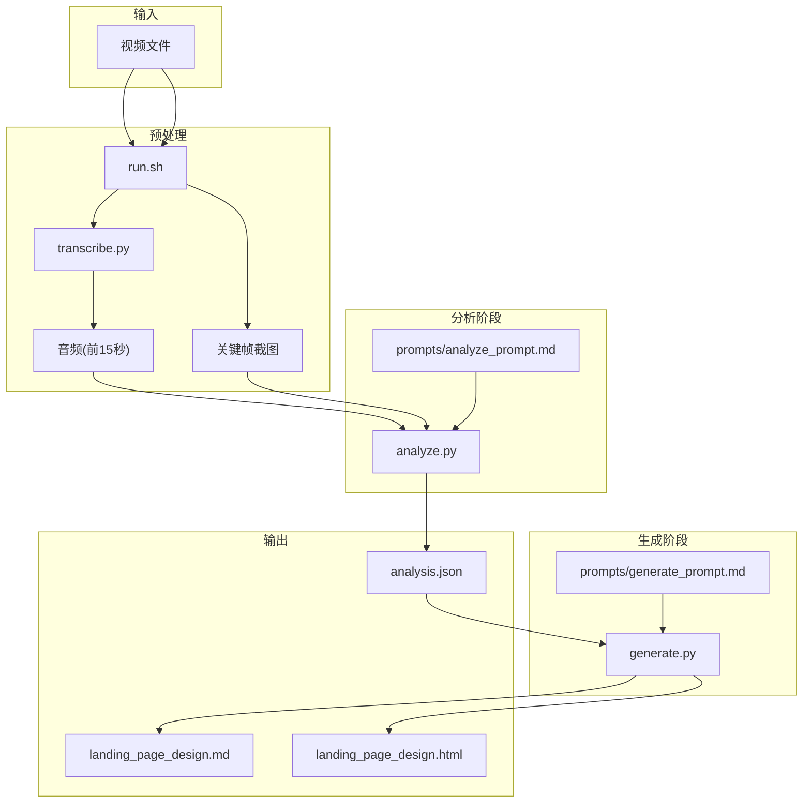
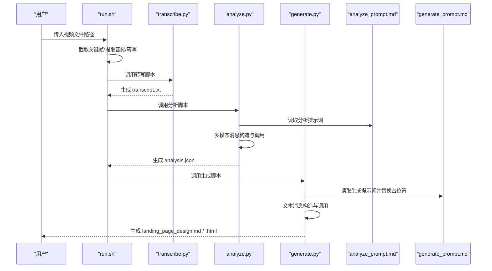
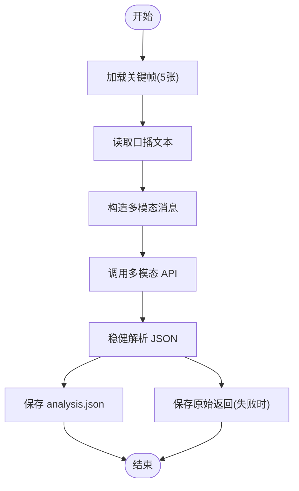
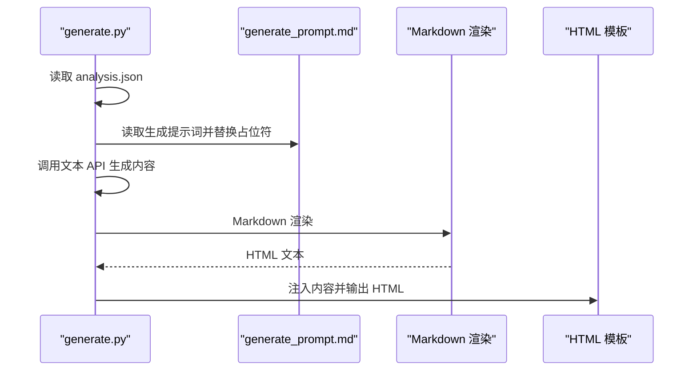
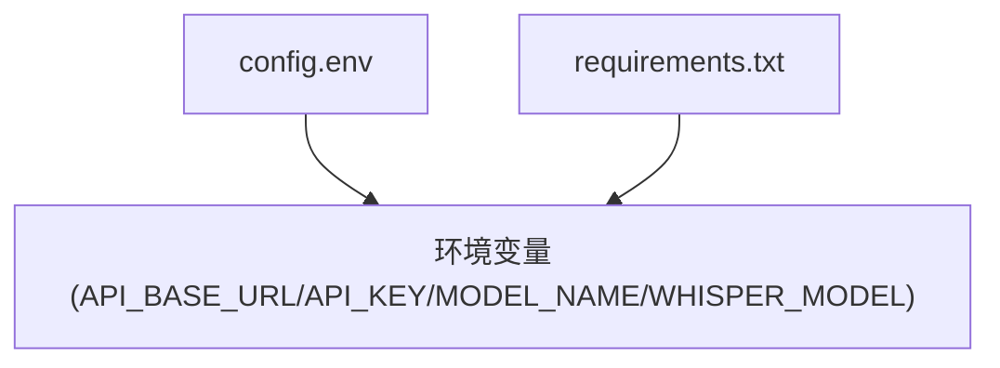

# Prompt定制

<cite>
**本文引用的文件**
- [prompts/analyze_prompt.md](file://prompts/analyze_prompt.md)
- [prompts/generate_prompt.md](file://prompts/generate_prompt.md)
- [analyze.py](file://analyze.py)
- [generate.py](file://generate.py)
- [transcribe.py](file://transcribe.py)
- [run.sh](file://run.sh)
- [requirements.txt](file://requirements.txt)
- [config.env](file://config.env)
</cite>

## 目录
1. [简介](#简介)
2. [项目结构](#项目结构)
3. [核心组件](#核心组件)
4. [架构总览](#架构总览)
5. [详细组件分析](#详细组件分析)
6. [依赖分析](#依赖分析)
7. [性能考虑](#性能考虑)
8. [故障排除指南](#故障排除指南)
9. [结论](#结论)
10. [附录](#附录)

## 简介
本指南围绕“广告视频到落地页 Hero 区域”的自动化工作流，系统讲解如何定制与优化分析与生成阶段的提示词模板。通过对 analyze_prompt.md 与 generate_prompt.md 的逐段解读，结合 analyze.py、generate.py、transcribe.py 的实现细节，帮助读者掌握：
- 如何拆解提示词的结构与作用（角色、任务、维度、输出格式等）
- 如何针对不同行业与风格进行提示词工程（科技产品、教育培训、电商营销等）
- 如何平衡分析深度与生成质量，并进行可控的温度调节
- 如何开展 Prompt 测试与迭代（A/B 测试、效果评估）
- 常见问题与故障排除技巧

## 项目结构
该仓库采用“脚本驱动 + 模板化提示词”的分层设计：
- prompts/analyze_prompt.md：定义多模态分析的系统提示词，指导模型从视频关键帧与口播中抽取结构化信息
- prompts/generate_prompt.md：定义生成落地页 Hero 方案的系统提示词，指导模型将分析结果转化为可落地的设计方案与主视觉 Prompt
- analyze.py：负责读取关键帧与口播文本，调用多模态 API，解析并保存结构化分析结果
- generate.py：负责读取分析结果，替换生成提示词中的占位符，调用纯文本 API 生成设计方案与 HTML
- transcribe.py：使用 Whisper 对前 15 秒音频进行本地转写，生成口播文本
- run.sh：统一编排整个流程（截帧、音频提取、转写、分析、生成）
- config.env：集中管理 API 基础地址、密钥、模型名等配置
- requirements.txt：运行所需的 Python 依赖

图表来源
- [run.sh:72-128](file://run.sh#L72-L128)
- [transcribe.py:21-62](file://transcribe.py#L21-L62)
- [analyze.py:128-172](file://analyze.py#L128-L172)
- [generate.py:325-372](file://generate.py#L325-L372)

章节来源
- [run.sh:1-138](file://run.sh#L1-L138)
- [config.env:1-13](file://config.env#L1-L13)

## 核心组件
- 分析提示词模板（analyze_prompt.md）
  - 角色与任务：明确“资深广告创意分析师”的职责边界，限定输入为“视频前15秒的关键帧与口播”
  - 分析维度：主色调与风格、教师信息、课程名称、痛点、卖点、利益点、辅助说明
  - 输出格式：严格的 JSON 结构，便于程序解析与后续生成阶段复用
- 生成提示词模板（generate_prompt.md）
  - 角色与任务：明确“资深落地页设计师与转化率优化专家”的职责，将分析结果转化为可落地的 Hero 设计方案
  - 输入数据：analysis_json（来自分析阶段）
  - 输出要求：设计思路、页面结构、具体文案、生图 Prompt
- 分析脚本（analyze.py）
  - 读取关键帧与口播文本，构造多模态消息，调用兼容 OpenAI 的多模态 API，解析并保存 JSON
  - 包含稳健的 JSON 提取逻辑与重试机制
- 生成脚本（generate.py）
  - 读取 analysis.json，替换生成提示词中的占位符，调用纯文本 API 生成 Markdown 与 HTML
  - 内置 HTML 渲染与回退方案，保证输出可用
- 转写脚本（transcribe.py）
  - 使用 Whisper 对前 15 秒音频进行本地转写，生成可被分析阶段使用的文本
- 运行脚本（run.sh）
  - 统一编排：截帧、提取音频、转写、分析、生成，并输出关键产物

章节来源
- [prompts/analyze_prompt.md:1-111](file://prompts/analyze_prompt.md#L1-L111)
- [prompts/generate_prompt.md:1-69](file://prompts/generate_prompt.md#L1-L69)
- [analyze.py:128-172](file://analyze.py#L128-L172)
- [generate.py:325-372](file://generate.py#L325-L372)
- [transcribe.py:21-62](file://transcribe.py#L21-L62)
- [run.sh:72-128](file://run.sh#L72-L128)

## 架构总览
该系统以“提示词模板 + 脚本编排”为核心，形成“输入视频 → 多模态分析 → 结构化结果 → 设计方案生成 → 可视化输出”的闭环。提示词模板是“知识与约束”的载体，脚本负责“数据准备、调用 API、解析与持久化”。

图表来源
- [run.sh:72-128](file://run.sh#L72-L128)
- [transcribe.py:21-62](file://transcribe.py#L21-L62)
- [analyze.py:128-172](file://analyze.py#L128-L172)
- [generate.py:325-372](file://generate.py#L325-L372)

## 详细组件分析

### 分析提示词模板（analyze_prompt.md）详解
- 角色与任务
  - 明确“资深广告创意分析师”的职责，限定输入范围（前15秒关键帧与口播），避免模型过度发散
- 分析维度
  - 主色调与风格：强调主辅色与风格关键词，便于后续生成阶段保持视觉一致性
  - 教师信息：姓名、头衔、形象特征、着装描述；标注信息来源（视觉/音频/两者）
  - 课程名称：正式名称与变体，标注来源
  - 痛点：具体场景与原因，强调画面感与可感知性
  - 卖点：核心教学内容与差异化优势
  - 利益点：学习后的具体积极变化，避免空泛承诺
  - 辅助说明：学习门槛、方式、服务保障、赠品、限时优惠等，标注来源与证据
- 输出格式
  - 严格 JSON，字段与嵌套结构清晰，便于程序解析与后续生成阶段直接消费

提示词工程要点
- 上下文构建：将关键帧与口播文本组合为多模态输入，确保模型同时参考视觉与听觉线索
- 角色设定：以“资深分析师”身份约束输出的专业性与结构性
- 输出格式控制：通过严格的 JSON 结构与代码块包裹，降低解析歧义
- 信息来源标注：为后续生成阶段提供可信度与证据定位

章节来源
- [prompts/analyze_prompt.md:1-111](file://prompts/analyze_prompt.md#L1-L111)

### 生成提示词模板（generate_prompt.md）详解
- 角色与任务
  - “资深落地页设计师与转化率优化专家”，强调从广告到落地页的转化目标
- 输入数据
  - analysis_json：来自分析阶段的结构化结果
- 输出要求
  - 设计思路：整体视觉方向、设计调性、信息层级策略
  - 页面结构：从上到下的区块划分与呈现建议
  - 具体文案：每个区块可直接使用的文案内容
  - 生图 Prompt：面向图像生成的英文 Prompt，包含配色、风格、尺寸建议

提示词工程要点
- 信息复用：直接基于分析结果的字段生成文案，减少二次加工误差
- 结构化输出：通过分节与编号，确保生成内容层次清晰、易于落地
- 可执行性：生图 Prompt 明确风格、尺寸与用途，便于后续视觉制作

章节来源
- [prompts/generate_prompt.md:1-69](file://prompts/generate_prompt.md#L1-L69)

### 分析脚本（analyze.py）流程与提示词交互
- 数据准备
  - 读取 output/frames 下的 5 张关键帧并编码为 base64
  - 读取 output/transcript.txt 作为口播文本
- 提示词注入
  - 读取 prompts/analyze_prompt.md 作为 system prompt
- 多模态调用
  - 构造包含 5 张图片与文本的消息，调用兼容 OpenAI 的多模态 API
  - 设置较低温度以提升稳定性与结构化程度
- 结果解析与持久化
  - 提供稳健的 JSON 提取逻辑（优先匹配代码块，其次尝试截取首尾大括号，最后回退解析）
  - 失败时保存原始返回，便于调试

图表来源
- [analyze.py:33-126](file://analyze.py#L33-L126)

章节来源
- [analyze.py:33-126](file://analyze.py#L33-L126)

### 生成脚本（generate.py）流程与提示词交互
- 数据准备
  - 读取 output/analysis.json
  - 读取 prompts/generate_prompt.md 并将占位符 analysis_json 替换为实际 JSON 字符串
- 文本调用
  - 调用兼容 OpenAI 的纯文本 API，设置适中温度以平衡创造性与一致性
- 输出生成
  - 生成 Markdown 文档与 HTML（含内联 CSS，独立可打开）

图表来源
- [generate.py:325-372](file://generate.py#L325-L372)

章节来源
- [generate.py:325-372](file://generate.py#L325-L372)

### 转写脚本（transcribe.py）与 Whisper 集成
- 依赖 Whisper 模型进行本地转写，支持通过环境变量选择模型大小
- 将结果保存为 output/transcript.txt，供分析阶段使用

章节来源
- [transcribe.py:21-62](file://transcribe.py#L21-L62)

### 运行脚本（run.sh）编排
- 统一入口：接收视频路径，加载配置，检查依赖
- 步骤编排：截帧 → 提取音频 → 转写 → 分析 → 生成
- 产物输出：关键帧、音频、转写文本、分析结果、设计方案（Markdown 与 HTML）

章节来源
- [run.sh:72-128](file://run.sh#L72-L128)

## 依赖分析
- 外部依赖
  - openai：调用兼容 OpenAI 的多模态与文本 API
  - openai-whisper：本地语音转写
  - markdown：Markdown 渲染（可选，提供回退方案）
- 环境变量
  - API_BASE_URL、API_KEY、MODEL_NAME：分析与生成阶段的基础配置
  - GENERATE_API_BASE_URL/GENERATE_API_KEY/GENERATE_MODEL_NAME：可选覆盖生成阶段配置
  - WHISPER_MODEL：Whisper 模型大小
- 配置文件
  - config.env：集中管理 API 配置与 Whisper 模型参数

图表来源
- [config.env:1-13](file://config.env#L1-L13)
- [requirements.txt:1-4](file://requirements.txt#L1-L4)

章节来源
- [config.env:1-13](file://config.env#L1-L13)
- [requirements.txt:1-4](file://requirements.txt#L1-L4)

## 性能考虑
- 温度调节
  - 分析阶段使用较低温度，提升结构化与稳定性
  - 生成阶段使用适中温度，兼顾创造性与一致性
- 重试机制
  - 分析与生成脚本均内置指数回退重试，提高鲁棒性
- I/O 与缓存
  - 关键帧与口播文本一次性读取，避免重复 I/O
  - 失败时保存原始返回，便于快速定位问题
- 渲染回退
  - 生成 HTML 时若依赖不可用，提供简易渲染器，保证输出可用

章节来源
- [analyze.py:108-125](file://analyze.py#L108-L125)
- [generate.py:50-68](file://generate.py#L50-L68)
- [generate.py:74-138](file://generate.py#L74-L138)

## 故障排除指南
- 缺少环境变量
  - 分析与生成阶段均会检查 API 基础地址、密钥与模型名，缺失时报错并退出
- 关键帧或转写文件缺失
  - 分析阶段会检查关键帧目录与转写文件是否存在
  - 生成阶段会检查分析结果文件是否存在
- API 调用失败
  - 分析与生成阶段均提供重试与指数回退；失败时打印错误并等待一段时间后重试
- JSON 解析失败
  - 分析阶段提供稳健解析逻辑；失败时保存原始返回，便于人工校验
- Whisper 未安装或模型加载失败
  - 转写阶段会提示安装依赖与加载模型失败的原因

章节来源
- [analyze.py:128-172](file://analyze.py#L128-L172)
- [generate.py:325-372](file://generate.py#L325-L372)
- [transcribe.py:21-62](file://transcribe.py#L21-L62)

## 结论
本工作流通过“模板化提示词 + 脚本编排”的方式，实现了从广告视频到落地页 Hero 区域的自动化生产。提示词模板是知识与约束的载体，脚本负责数据准备、调用 API 与结果持久化。通过合理设计分析与生成阶段的提示词，可以有效提升结构化信息抽取的准确性与设计方案的可执行性。建议在实际应用中持续进行 A/B 测试与效果评估，逐步优化提示词与参数，以满足不同行业与风格的需求。

## 附录

### 提示词工程最佳实践
- 上下文构建
  - 在分析阶段，将关键帧与口播文本组合为多模态输入，确保模型同时参考视觉与听觉线索
  - 在生成阶段，将 analysis.json 直接注入提示词，减少二次加工误差
- 角色设定
  - 使用“资深分析师/设计师/优化专家”等角色，约束输出的专业性与结构性
- 输出格式控制
  - 分析阶段使用严格的 JSON 结构与代码块包裹，降低解析歧义
  - 生成阶段使用分节与编号，确保内容层次清晰
- 信息来源标注
  - 在分析阶段为每条信息标注来源（视觉/音频/两者），并在生成阶段优先复用“两者”项
- 温度与重试
  - 分析阶段使用较低温度，生成阶段使用适中温度
  - 为 API 调用配置重试与指数回退，提高鲁棒性

### 不同行业与风格的提示词模板示例（思路与结构）
- 科技产品
  - 角色：技术洞察专家
  - 任务：从视频中提取技术参数、功能亮点、用户体验与竞品差异
  - 输出：技术规格、功能矩阵、用户痛点、差异化优势、限时活动
- 教育培训
  - 角色：教育产品顾问
  - 任务：从视频中提取课程体系、师资背景、学习路径与学习成果
  - 输出：课程大纲、教师介绍、学习方式、证书/结业承诺、优惠信息
- 电商营销
  - 角色：电商运营专家
  - 任务：从视频中提取商品卖点、价格策略、促销活动与用户评价
  - 输出：主标题、副标题、价格信息、限时折扣、赠品清单、购买引导

### 如何根据需求调整分析深度与生成质量
- 分析深度
  - 增加维度：如加入“品牌调性”“目标人群画像”等
  - 细化字段：对痛点与卖点增加“具体场景/方法论”等子字段
- 生成质量
  - 提升温度：在生成阶段适度提升温度以增强创造性
  - 扩展输出：增加“竞品对比”“FAQ”“风险提示”等模块
- 控制成本
  - 降低温度与减少维度，缩短生成时间与成本

### Prompt 测试与迭代方法
- A/B 测试
  - 对比不同角色设定、任务描述与输出格式，记录生成内容的质量与一致性
- 效果评估
  - 人工抽样评估：从生成内容中抽取样本，评估是否符合设计意图与可执行性
  - 自动化指标：统计 JSON 结构完整性、字段覆盖率、文案可读性评分
- 迭代路径
  - 基于评估结果优化提示词结构与约束，逐步收敛到稳定版本

### 常见问题与解决方案
- JSON 解析失败
  - 现象：生成阶段无法解析 analysis.json
  - 解决：检查分析阶段是否成功保存 analysis.json；查看原始返回文件；确认提示词输出格式是否严格遵循 JSON
- API 调用失败
  - 现象：多模态或文本 API 调用报错
  - 解决：检查 API 基础地址、密钥与模型名；启用重试；查看网络与速率限制
- Whisper 未安装
  - 现象：转写阶段报错
  - 解决：安装 requirements.txt 中的依赖；确认模型大小参数正确
- 生成 HTML 失败
  - 现象：HTML 输出异常
  - 解决：检查 Markdown 渲染依赖；回退到简易渲染器；确认输出目录权限