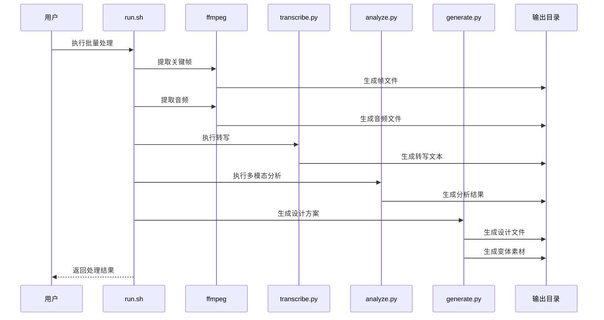
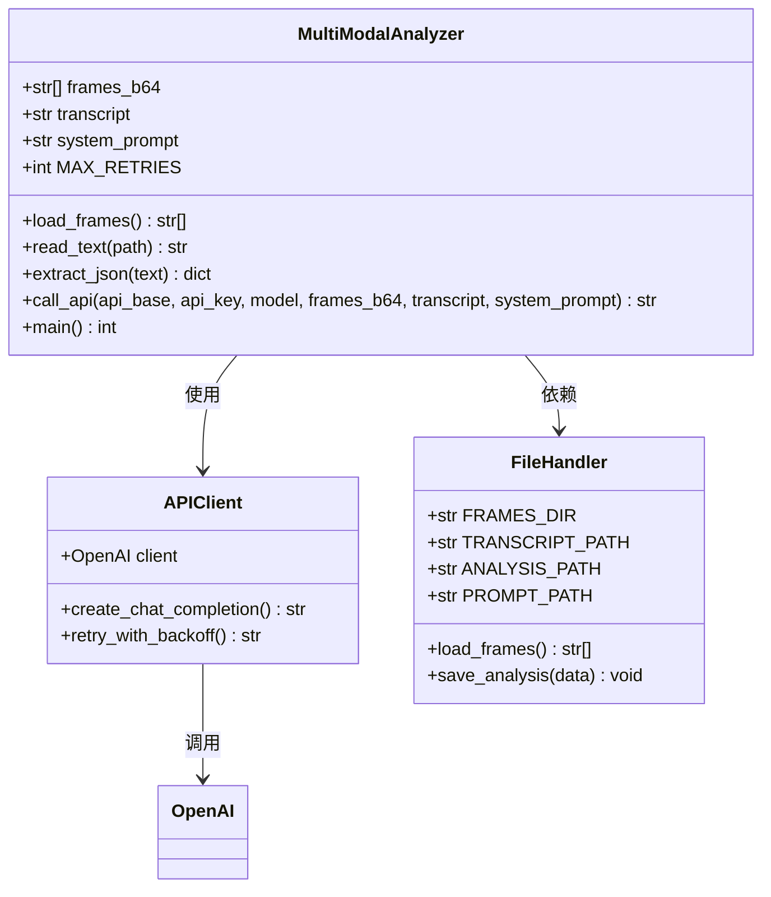
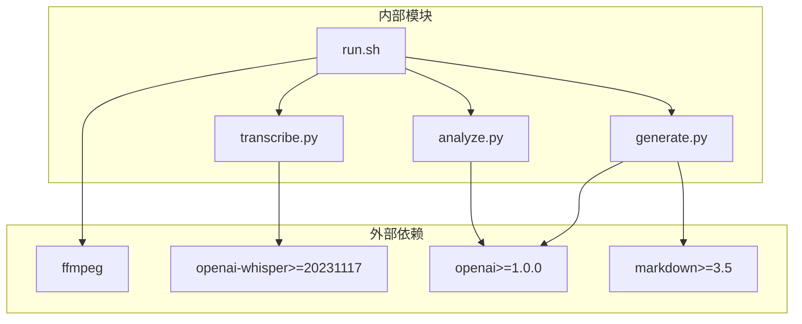

# 批量处理

<cite>
**本文档引用的文件**
- [run.sh](file://run.sh)
- [config.env](file://config.env)
- [requirements.txt](file://requirements.txt)
- [analyze.py](file://analyze.py)
- [generate.py](file://generate.py)
- [transcribe.py](file://transcribe.py)
- [assets/categories/{category}/analyze_prompt.md](file://assets/categories/{category}/analyze_prompt.md)
- [assets/categories/{category}/generate_prompt.md](file://assets/categories/{category}/generate_prompt.md)
</cite>

## 目录
1. [简介](#简介)
2. [项目结构](#项目结构)
3. [核心组件](#核心组件)
4. [架构概览](#架构概览)
5. [详细组件分析](#详细组件分析)
6. [批量处理策略](#批量处理策略)
7. [智能去重与颜色约束系统](#智能去重与颜色约束系统)
8. [依赖分析](#依赖分析)
9. [性能考虑](#性能考虑)
10. [故障排除指南](#故障排除指南)
11. [结论](#结论)

## 简介

这是一个完整的视频分析和落地页设计方案生成系统，支持批量处理多个视频文件。该系统通过 Bash 脚本协调多个 Python 组件，实现从视频关键帧提取、音频转写、多模态分析到最终设计方案生成的完整工作流。

**更新** 新增智能去重机制和颜色约束系统，支持 batch=1 和 batch=2 两种处理模式，自动颜色关键词提取和变体比较算法。

系统采用模块化设计，每个处理步骤都有明确的职责分工：
- **run.sh**: 批量处理协调器，负责参数验证、依赖检查和步骤编排
- **transcribe.py**: 本地 Whisper 模型进行语音转写
- **analyze.py**: 多模态分析，结合图像和文本信息生成结构化分析结果
- **generate.py**: 基于分析结果生成落地页设计方案，支持智能去重和颜色约束

## 项目结构

```mermaid
graph TB
subgraph "项目根目录"
RUN[run.sh]
CONFIG[config.env]
REQ[requirements.txt]
subgraph "Python 脚本"
TRANSCRIBE[transcribe.py]
ANALYZE[analyze.py]
GENERATE[generate.py]
end
subgraph "提示词模板"
ANALYZE_PROMPT[assets/categories/{category}/analyze_prompt.md]
GENERATE_PROMPT[assets/categories/{category}/generate_prompt.md]
end
subgraph "输出目录"
OUTPUT[output/]
FRAMES[frames/]
AUDIO[audio.wav]
TRANSCRIPT[transcript.txt]
ANALYSIS[analysis.json]
DESIGN_MD[landing_page_design.md]
DESIGN_HTML[landing_page_design.html]
DESIGN_REFER[design_refer/]
end
end
RUN --> TRANSCRIBE
RUN --> ANALYZE
RUN --> GENERATE
ANALYZE --> ANALYZE_PROMPT
GENERATE --> GENERATE_PROMPT
TRANSCRIBE --> AUDIO
ANALYZE --> FRAMES
ANALYZE --> TRANSCRIPT
ANALYZE --> ANALYSIS
GENERATE --> DESIGN_MD
GENERATE --> DESIGN_HTML
GENERATE --> DESIGN_REFER
```

**图表来源**
- [run.sh:1-197](file://run.sh#L1-L197)
- [config.env:1-22](file://config.env#L1-L22)
- [requirements.txt:1-4](file://requirements.txt#L1-L4)

**章节来源**
- [run.sh:1-197](file://run.sh#L1-L197)
- [config.env:1-22](file://config.env#L1-L22)
- [requirements.txt:1-4](file://requirements.txt#L1-L4)

## 核心组件

### run.sh 批量处理脚本

run.sh 是整个系统的协调器，实现了完整的批处理工作流：

**主要功能特性：**
- **参数验证**: 检查视频文件路径和必需参数
- **配置加载**: 自动加载环境配置文件
- **依赖检查**: 验证 ffmpeg 和 Python 环境
- **步骤编排**: 有序执行五个处理阶段
- **错误处理**: 每个步骤都有完善的错误检测和恢复机制

**处理流程：**
1. 关键帧提取（30张，0-29秒每秒一帧）
2. 音频提取（前30秒）
3. Whisper 本地转写
4. 多模态分析
5. 落地页设计方案生成

**章节来源**
- [run.sh:1-197](file://run.sh#L1-L197)

### transcribe.py 语音转写组件

基于 Whisper 模型的本地语音转写服务：

**核心能力：**
- 支持多种 Whisper 模型大小（small、medium、large等）
- 自动模型加载和缓存
- 高效的音频处理管道
- 完整的错误处理和日志记录

**配置选项：**
- `WHISPER_MODEL`: 指定 Whisper 模型大小
- 自动检测音频文件存在性

**章节来源**
- [transcribe.py:1-67](file://transcribe.py#L1-L67)

### analyze.py 多模态分析组件

结合视觉和文本信息的智能分析引擎：

**分析维度：**
- 主色调和风格提取
- 老师信息识别
- 课程名称提取
- 痛点、卖点、利益点分析
- 辅助信息提取

**技术特点：**
- OpenAI 兼容 API 集成
- 多重 JSON 解析策略
- 指数退避重试机制
- 结构化输出格式

**章节来源**
- [analyze.py:1-309](file://analyze.py#L1-L309)

### generate.py 设计方案生成组件

将分析结果转换为可执行的落地页设计方案：

**新增功能特性：**
- **智能去重机制**: 支持 batch=2 模式，自动读取已有变体进行去重
- **颜色约束系统**: 自动提取颜色关键词，确保变体间颜色差异化
- **批量处理支持**: `--batch` 参数支持 batch=1 和 batch=2 两种模式
- **变体比较算法**: 基于颜色关键词和变体摘要实现智能去重

**输出能力：**
- Markdown 格式的详细设计方案
- 独立可运行的 HTML 页面
- 内嵌 CSS 样式表
- 实时生成时间戳

**模板系统：**
- 基于分析结果动态填充
- 支持复杂的页面结构设计
- 完整的样式和布局规范

**章节来源**
- [generate.py:1-975](file://generate.py#L1-L975)

## 架构概览



**图表来源**
- [run.sh:108-166](file://run.sh#L108-L166)
- [transcribe.py:147-153](file://transcribe.py#L147-L153)
- [analyze.py:241-301](file://analyze.py#L241-L301)
- [generate.py:812-970](file://generate.py#L812-L970)

## 详细组件分析

### run.sh 循环处理逻辑

run.sh 实现了一个精心设计的五阶段处理流程，每个阶段都有明确的目标和质量保证机制。

**关键处理步骤：**

1. **参数验证阶段**
   - 检查命令行参数数量
   - 验证视频文件存在性和可访问性
   - 提供详细的错误信息和使用示例

2. **配置加载阶段**
   - 自动检测并加载 config.env 文件
   - 支持环境变量覆盖
   - 提供配置文件缺失的警告信息

3. **依赖检查阶段**
   - 验证 ffmpeg 是否正确安装
   - 检查 Python3 环境
   - 提供详细的安装指导

4. **关键帧提取循环**
   ```bash
   TIMES=(0 1 2 3 4 5 6 7 8 9 10 11 12 13 14 15 16 17 18 19 20 21 22 23 24 25 26 27 28 29)
   for i in "${!TIMES[@]}"; do
     # 精确时间戳提取
     ffmpeg -ss "$T" -i "$VIDEO" -frames:v 1 -q:v 2 "$OUT_FRAME"
   done
   ```

5. **音频提取阶段**
   - 提取前30秒音频片段
   - 设置采样率和声道配置
   - 确保音频质量满足转写需求

6. **转写和分析阶段**
   - 调用 Whisper 模型进行语音识别
   - 执行多模态分析
   - 生成最终设计方案

**章节来源**
- [run.sh:27-197](file://run.sh#L27-L197)

### generate.py 类结构分析



**图表来源**
- [analyze.py:52-301](file://analyze.py#L52-L301)
- [analyze.py:241-301](file://analyze.py#L241-L301)

**章节来源**
- [analyze.py:1-309](file://analyze.py#L1-L309)

### generate.py HTML 渲染系统

generate.py 实现了完整的 HTML 渲染管道，支持两种渲染模式：

**主要渲染模式：**

1. **Markdown 插件渲染**（推荐）
   - 使用 python-markdown 库
   - 支持 fenced_code、tables、toc 等扩展
   - 高度兼容标准 Markdown

2. **降级渲染器**（保底方案）
   - 内置正则表达式解析
   - 支持基本的标题、列表、代码块
   - 确保在缺少依赖时仍能正常工作

**章节来源**
- [generate.py:163-235](file://generate.py#L163-L235)

## 批量处理策略

### 并行处理实现

虽然当前脚本是顺序执行的，但可以轻松扩展为并行处理模式：

**并行策略选项：**

1. **进程池并行**
   ```bash
   # 使用 xargs 并行处理多个视频
   find . -name "*.mp4" | xargs -P 4 -I {} ./run.sh {}
   ```

2. **队列管理系统**
   - 使用 Redis 或 RabbitMQ 管理处理队列
   - Worker 进程从队列中获取任务
   - 支持动态扩缩容

3. **容器化并行处理**
   - Docker 容器隔离
   - Kubernetes 集群调度
   - 自动故障恢复

### 队列管理最佳实践

**队列设计原则：**
- **优先级队列**: 重要视频优先处理
- **重试机制**: 失败任务自动重试
- **超时控制**: 防止任务无限期占用资源
- **监控指标**: 实时跟踪队列状态

**队列实现要点：**
- 使用消息队列确保任务持久化
- 实现心跳检测防止僵尸任务
- 支持任务取消和暂停
- 提供进度查询接口

### 错误恢复机制

系统实现了多层次的错误处理和恢复机制：

**错误分类和处理：**

1. **I/O 错误**（级别1-3）
   - 文件不存在或权限不足
   - 自动重试和错误报告
   - 退出码区分不同类型错误

2. **API 错误**（级别4-7）
   - 多模态分析和生成 API 调用失败
   - 指数退避重试机制
   - 最终失败时提供详细诊断信息

3. **业务逻辑错误**（级别8-9）
   - 数据格式不正确
   - 配置参数缺失
   - 详细的错误定位和修复建议

**章节来源**
- [run.sh:64-197](file://run.sh#L64-L197)
- [analyze.py:143-238](file://analyze.py#L143-L238)
- [generate.py:124-158](file://generate.py#L124-L158)

## 智能去重与颜色约束系统

### 批量处理模式

**新增功能** 系统现在支持两种批量处理模式：

1. **batch=1 模式**（默认）
   - 生成 page1-pageN 变体
   - 不进行去重检查
   - 适用于单轮生成

2. **batch=2 模式**
   - 读取已有 page1-pageN 作为去重参考
   - 输出到下一批 page
   - 适用于多轮迭代生成

**使用方法：**
```bash
# batch=1 模式（默认）
python3 generate.py

# batch=2 模式
python3 generate.py --batch 2
```

### 智能去重机制

**新增功能** 系统实现了智能去重算法：

1. **去重摘要构建**
   - 自动读取 `design_refer/page1-pageN/style.txt`
   - 提取变体风格名称和颜色关键词
   - 生成去重摘要文本

2. **颜色关键词提取**
   - 支持中英文颜色关键词
   - 自动检测颜色相关词汇
   - 限制提取数量避免冗余

3. **变体比较算法**
   - 基于颜色关键词进行相似度比较
   - 检查风格名称和布局结构差异
   - 确保新变体与已有变体完全不同

**章节来源**
- [generate.py:737-808](file://generate.py#L737-L808)
- [generate.py:812-970](file://generate.py#L812-L970)

### 颜色约束系统

**新增功能** 系统实现了完整的颜色约束机制：

1. **颜色关键词库**
   - 支持中文颜色词汇：暖金、暖橙、金色、红色、蓝、绿、粉、紫等
   - 支持英文颜色词汇：gold、red、orange、blue、green、pink、purple等
   - 覆盖暖色、冷色、中性色等多种色调

2. **自动颜色检测**
   - 遍历变体摘要文本
   - 检测颜色相关关键词
   - 去重并限制数量

3. **颜色约束注入**
   - 将颜色约束信息注入到生成提示词
   - 确保新变体在颜色维度上与已有变体不同
   - 支持颜色多样性的差异化实现

**章节来源**
- [generate.py:739-762](file://generate.py#L739-L762)
- [generate.py:765-808](file://generate.py#L765-L808)

### 处理队列配置

**队列配置选项：**

1. **基础配置**
   - 队列名称和连接参数
   - 最大并发任务数
   - 任务超时时间

2. **重试配置**
   - 最大重试次数
   - 退避间隔策略
   - 失败通知机制

3. **监控配置**
   - 进度报告频率
   - 性能指标收集
   - 健康检查间隔

## 依赖分析



**图表来源**
- [requirements.txt:1-4](file://requirements.txt#L1-L4)
- [run.sh:64-72](file://run.sh#L64-L72)

**章节来源**
- [requirements.txt:1-4](file://requirements.txt#L1-L4)
- [run.sh:64-72](file://run.sh#L64-L72)

## 性能考虑

### 内存使用优化

**关键优化点：**

1. **分块处理**
   - 音频文件按30秒分块处理
   - 图像文件按需加载和释放
   - 避免一次性加载大量数据

2. **缓存策略**
   - Whisper 模型只加载一次
   - 分析结果缓存避免重复计算
   - 临时文件及时清理

3. **资源管理**
   - 显式关闭文件句柄
   - 及时释放图像内存
   - 控制并发任务数量

### CPU 占用优化

**优化策略：**

1. **异步处理**
   - 使用非阻塞 I/O
   - 多线程处理独立任务
   - GPU 加速（如可用）

2. **算法优化**
   - 选择合适的 Whisper 模型
   - 优化 ffmpeg 编解码参数
   - 减少不必要的数据转换

3. **负载均衡**
   - 动态调整并发度
   - 任务优先级排序
   - 资源使用监控

### I/O 优化技巧

**存储和网络优化：**

1. **文件系统优化**
   - 使用 SSD 存储临时文件
   - 合理的文件命名和组织
   - 批量文件操作减少系统调用

2. **网络传输优化**
   - API 请求合并
   - 连接池复用
   - 压缩传输数据

3. **缓存策略**
   - 本地缓存常用数据
   - CDN 加速静态资源
   - 预加载机制

## 故障排除指南

### 常见问题诊断

**环境配置问题：**
- 检查 ffmpeg 是否正确安装
- 验证 Python 依赖是否完整
- 确认 API 密钥配置正确

**处理流程问题：**
- 查看每个步骤的错误输出
- 检查中间文件是否生成
- 验证文件权限和路径

**性能问题：**
- 监控系统资源使用情况
- 分析处理时间瓶颈
- 调整并发参数

### 日志记录策略

**日志级别划分：**

1. **调试信息**（详细的技术细节）
2. **运行信息**（处理进度和状态）
3. **警告信息**（潜在问题但不影响继续）
4. **错误信息**（严重问题需要人工干预）

**日志输出位置：**
- 标准输出：实时进度信息
- 标准错误：错误和警告信息
- 文件日志：详细处理记录

**章节来源**
- [run.sh:27-62](file://run.sh#L27-L62)
- [analyze.py:143-238](file://analyze.py#L143-L238)
- [generate.py:124-158](file://generate.py#L124-L158)

## 结论

这个批量处理系统提供了完整的视频分析和设计方案生成解决方案。通过模块化的架构设计和完善的错误处理机制，系统能够稳定地处理各种规模的视频处理任务。

**主要优势：**
- **模块化设计**: 每个组件职责明确，易于维护和扩展
- **健壮性**: 完善的错误处理和恢复机制
- **可扩展性**: 支持并行处理和集群化部署
- **智能化**: 新增智能去重机制和颜色约束系统
- **易用性**: 简单的命令行接口和清晰的配置选项

**新增功能亮点：**
- **智能去重**: 基于颜色关键词和变体摘要的自动去重
- **颜色约束**: 支持中英文颜色词汇的自动检测和约束
- **批量模式**: 支持 batch=1 和 batch=2 两种处理模式
- **变体比较**: 智能算法确保变体间的差异化

**部署建议：**
- 对于小规模处理：单机部署即可满足需求
- 对于中等规模：使用容器化部署，支持水平扩展
- 对于大规模处理：采用集群化架构，实现任务分片和负载均衡

通过合理的资源配置和监控机制，该系统可以高效地处理大量的视频分析任务，为企业提供可靠的自动化解决方案。