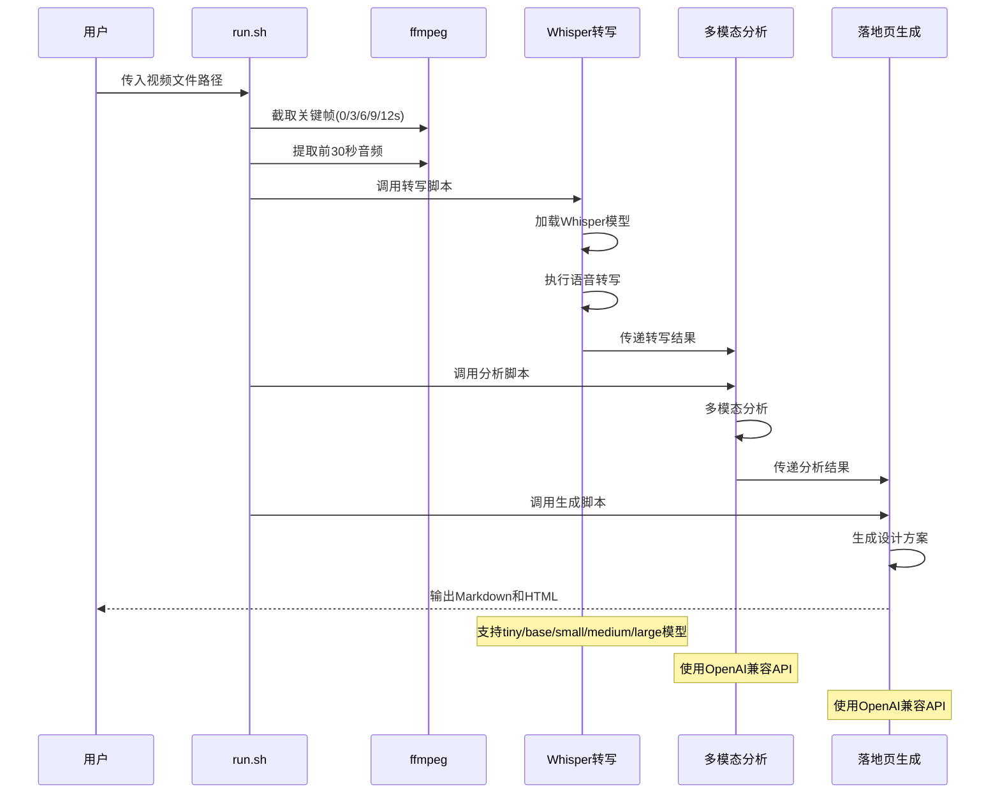
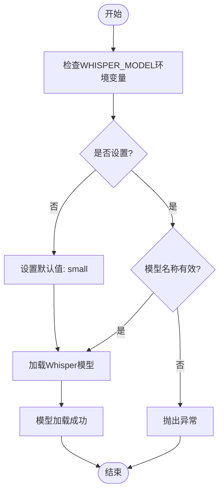
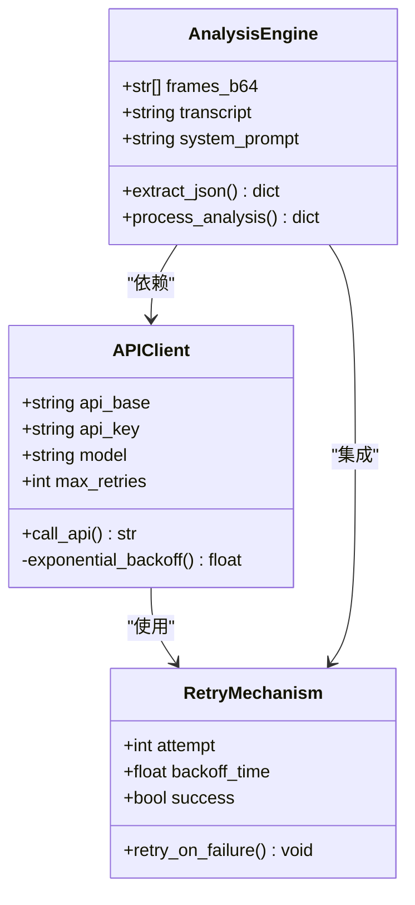
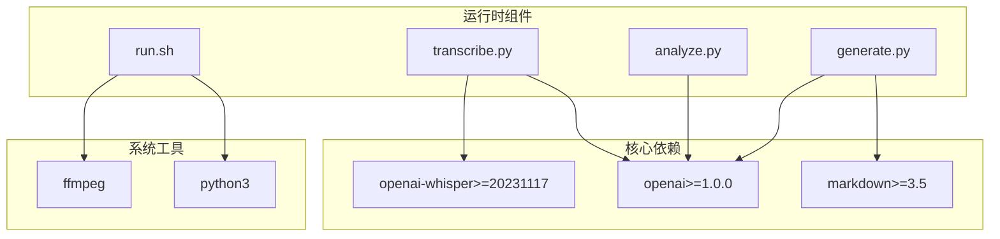
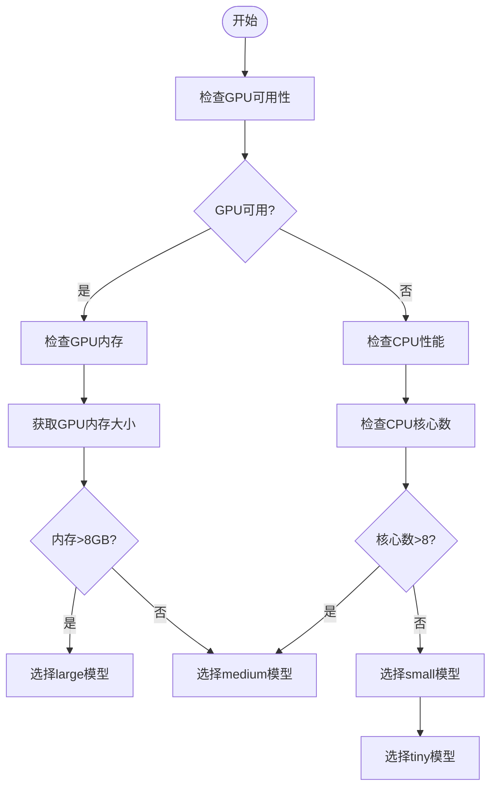
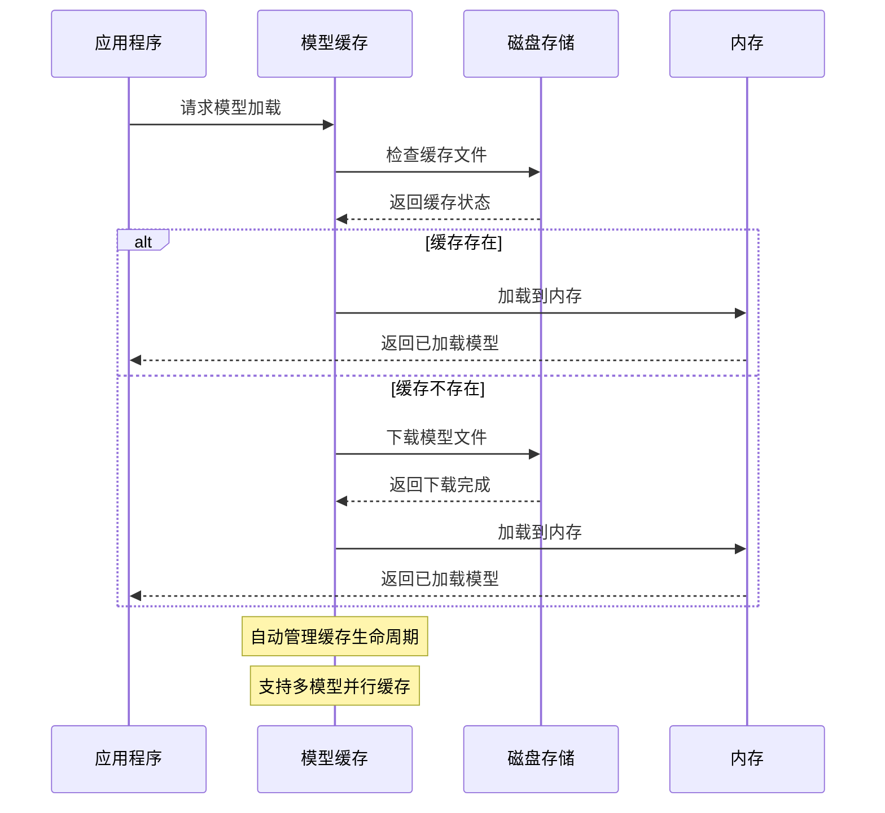
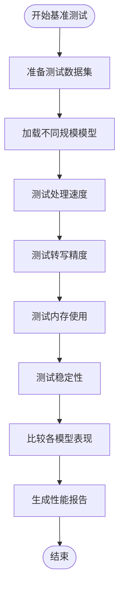
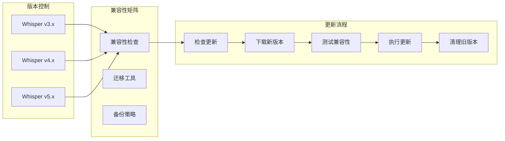
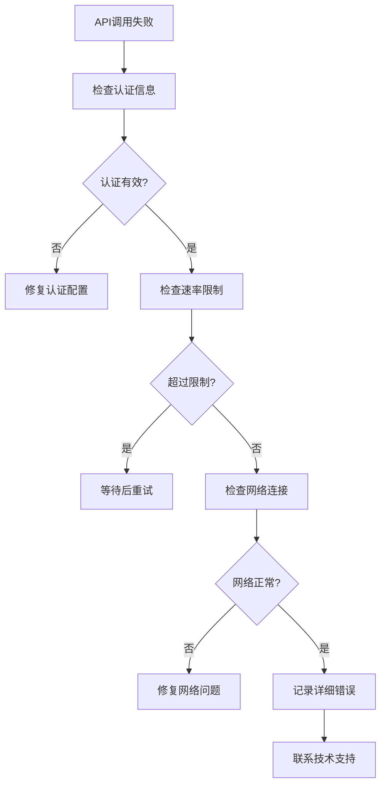

# 模型优化

<cite>
**本文引用的文件**
- [transcribe.py](file://transcribe.py)
- [analyze.py](file://analyze.py)
- [generate.py](file://generate.py)
- [run.sh](file://run.sh)
- [config.env](file://config.env)
- [requirements.txt](file://requirements.txt)
- [assets/categories/{category}/analyze_prompt.md](file://assets/categories/{category}/analyze_prompt.md)
- [assets/categories/{category}/generate_prompt.md](file://assets/categories/{category}/generate_prompt.md)
</cite>

## 目录
1. [简介](#简介)
2. [项目结构](#项目结构)
3. [核心组件](#核心组件)
4. [架构概览](#架构概览)
5. [详细组件分析](#详细组件分析)
6. [依赖关系分析](#依赖关系分析)
7. [性能优化策略](#性能优化策略)
8. [故障排除指南](#故障排除指南)
9. [结论](#结论)

## 简介

本指南专注于基于Whisper模型和其他AI模型的性能优化配置。该代码库提供了一个完整的视频分析工作流，从视频关键帧提取、语音转写到多模态分析和落地页设计方案生成。本文档将详细说明如何调整Whisper模型和其他AI模型的参数以获得最佳性能，包括模型选择策略、硬件资源配置、缓存机制和性能测试方法。

## 项目结构

该项目采用模块化设计，包含五个主要组件：

```mermaid
graph TB
subgraph "核心工作流"
RUN[run.sh] --> TRANS[transcribe.py]
RUN --> ANALYZE[analyze.py]
RUN --> GEN[generate.py]
end
subgraph "配置管理"
ENV[config.env]
REQ[requirements.txt]
end
subgraph "提示模板"
ANA_PROMPT[assets/categories/{category}/analyze_prompt.md]
GEN_PROMPT[assets/categories/{category}/generate_prompt.md]
end
subgraph "输出文件"
FRAMES[output/frames/]
AUDIO[output/audio.wav]
TRANSCRIPT[output/transcript.txt]
ANALYSIS[output/analysis.json]
DESIGN[output/landing_page_design.md]
HTML[output/landing_page_design.html]
end
TRANS --> FRAMES
TRANS --> AUDIO
TRANS --> TRANSCRIPT
ANALYZE --> ANALYSIS
GEN --> DESIGN
GEN --> HTML
```

**图表来源**
- [run.sh:1-138](file://run.sh#L1-L138)
- [transcribe.py:1-67](file://transcribe.py#L1-L67)
- [analyze.py:1-177](file://analyze.py#L1-L177)
- [generate.py:1-377](file://generate.py#L1-L377)

**章节来源**
- [run.sh:1-138](file://run.sh#L1-L138)
- [config.env:1-13](file://config.env#L1-L13)

## 核心组件

### Whisper语音转写组件

transcribe.py是整个工作流的核心，负责使用OpenAI Whisper进行语音转写：

- **模型加载**：支持多种Whisper模型大小（tiny、base、small、medium、large）
- **音频处理**：自动提取视频前30秒音频并转换为16kHz单声道格式
- **转写执行**：调用whisper.transcribe()进行语音识别
- **结果保存**：将转写文本保存到transcript.txt

### 多模态分析组件

analyze.py负责结合视觉信息和语音转写结果进行深度分析：

- **关键帧处理**：读取5张关键帧（0s/3s/6s/9s/12s）
- **系统提示**：使用专门的分析提示模板
- **API调用**：通过OpenAI兼容接口进行多模态分析
- **JSON解析**：稳健地从模型响应中提取结构化数据

### 落地页生成组件

generate.py基于分析结果生成落地页设计方案：

- **提示模板替换**：将分析JSON注入到生成提示模板中
- **API调用**：调用生成式AI API创建设计方案
- **格式输出**：同时生成Markdown和HTML两种格式
- **HTML渲染**：内置Markdown到HTML的转换功能

**章节来源**
- [transcribe.py:1-67](file://transcribe.py#L1-L67)
- [analyze.py:1-177](file://analyze.py#L1-L177)
- [generate.py:1-377](file://generate.py#L1-L377)

## 架构概览

整个系统采用流水线架构，每个组件都有明确的职责分工：



**图表来源**
- [run.sh:72-120](file://run.sh#L72-L120)
- [transcribe.py:26-50](file://transcribe.py#L26-L50)
- [analyze.py:76-125](file://analyze.py#L76-L125)
- [generate.py:38-68](file://generate.py#L38-L68)

## 详细组件分析

### Whisper模型配置详解

#### 模型大小对比表

| 模型大小 | 参数数量 | 推理速度 | 精度表现 | 内存占用 | 适用场景 |
|---------|----------|----------|----------|----------|----------|
| tiny | ~39M | 最快 | 中等 | 最低 | 快速草稿、实时演示 |
| base | ~74M | 快 | 良好 | 低 | 一般质量需求 |
| small | ~244M | 中等 | 优秀 | 中等 | 标准生产环境 |
| medium | ~769M | 慢 | 非常好 | 高 | 高精度要求 |
| large | ~1540M | 很慢 | 最佳 | 很高 | 研究用途、最高精度 |

#### 模型加载策略



**图表来源**
- [transcribe.py:26-41](file://transcribe.py#L26-L41)

#### 性能监控

转录脚本包含了详细的性能监控机制：

- **加载时间统计**：记录模型加载耗时
- **转写时间统计**：记录音频转写耗时
- **结果验证**：检查转写结果是否为空

**章节来源**
- [transcribe.py:26-62](file://transcribe.py#L26-L62)

### 多模态分析优化

#### API调用优化策略



**图表来源**
- [analyze.py:76-125](file://analyze.py#L76-L125)
- [analyze.py:53-73](file://analyze.py#L53-L73)

#### JSON解析增强

分析组件实现了健壮的JSON解析机制：

- **代码块检测**：优先匹配```json格式
- **通用代码块**：支持```格式的回退
- **手动截取**：通过查找{}字符进行最后尝试
- **错误处理**：保存原始响应便于调试

**章节来源**
- [analyze.py:53-73](file://analyze.py#L53-L73)
- [analyze.py:108-125](file://analyze.py#L108-L125)

### 落地页生成优化

#### 温度参数调优

| 温度值 | 创造性 | 稳定性 | 适用场景 |
|--------|--------|--------|----------|
| 0.0-0.2 | 最稳定 | 最高 | 结构化数据、技术文档 |
| 0.3-0.5 | 低创造性 | 中等 | 标准设计方案 |
| 0.6-0.8 | 中等创造性 | 低 | 创意内容生成 |
| 0.9-1.0 | 高创造性 | 最低 | 艺术创作 |

#### HTML渲染优化

生成组件提供了双重渲染策略：

- **首选方案**：使用python-markdown库进行高质量渲染
- **备用方案**：内置简单渲染器确保最低限度的功能
- **样式内联**：生成独立可运行的HTML文件

**章节来源**
- [generate.py:38-68](file://generate.py#L38-L68)
- [generate.py:73-138](file://generate.py#L73-L138)

## 依赖关系分析

### Python包依赖



**图表来源**
- [requirements.txt:1-4](file://requirements.txt#L1-L4)
- [run.sh:54-62](file://run.sh#L54-L62)

### 环境变量配置

| 环境变量 | 类型 | 默认值 | 描述 |
|----------|------|--------|------|
| API_BASE_URL | 必需 | - | AI API基础URL |
| API_KEY | 必需 | - | API访问密钥 |
| MODEL_NAME | 必需 | - | 主要AI模型名称 |
| WHISPER_MODEL | 可选 | small | Whisper模型大小 |
| GENERATE_API_BASE_URL | 可选 | 使用API_BASE_URL | 生成API基础URL |
| GENERATE_API_KEY | 可选 | 使用API_KEY | 生成API密钥 |
| GENERATE_MODEL_NAME | 可选 | 使用MODEL_NAME | 生成模型名称 |

**章节来源**
- [config.env:1-13](file://config.env#L1-L13)
- [analyze.py:129-135](file://analyze.py#L129-L135)
- [generate.py:325-332](file://generate.py#L325-L332)

## 性能优化策略

### 模型选择策略

#### 基于硬件资源的模型选择



#### 不同视频质量的处理策略

| 视频质量 | 处理建议 | 模型选择 | 速度权重 |
|----------|----------|----------|----------|
| 低质量 | 降噪处理 | small | 1.0 |
| 标准质量 | 直接处理 | small-medium | 0.7 |
| 高质量 | 增强处理 | medium-large | 0.5 |
| 极高质量 | 降采样处理 | large | 0.3 |

### 缓存机制和预加载策略

#### Whisper模型缓存



#### API响应缓存

分析和生成组件都实现了智能缓存机制：

- **重试机制**：最多3次重试，指数退避
- **超时控制**：避免长时间阻塞
- **错误恢复**：失败时自动清理资源

### 性能测试和基准测试

#### 测试指标定义

| 指标类型 | 测量方法 | 目标值 |
|----------|----------|--------|
| 模型加载时间 | 从导入到可用 | <30秒 |
| 转写速度 | 字符/秒 | >10 char/s |
| API响应时间 | 请求到响应 | <5秒 |
| 内存使用 | RSS峰值 | <2GB |
| 稳定性 | 成功率 | >95% |

#### 基准测试流程



### 版本管理和更新策略

#### 模型版本管理



#### 环境隔离策略

- **虚拟环境**：为不同版本创建独立Python环境
- **容器化**：使用Docker确保环境一致性
- **依赖锁定**：固定第三方库版本

**章节来源**
- [requirements.txt:1-4](file://requirements.txt#L1-L4)
- [run.sh:54-62](file://run.sh#L54-L62)

## 故障排除指南

### 常见问题诊断

#### Whisper模型相关问题

| 问题症状 | 可能原因 | 解决方案 |
|----------|----------|----------|
| 模型加载失败 | 网络连接问题 | 检查网络，重试下载 |
| 内存不足 | 模型过大 | 选择较小模型 |
| 处理速度慢 | 硬件性能不足 | 优化硬件配置 |
| 转写不准确 | 模型选择不当 | 选择更高精度模型 |

#### API调用相关问题



#### 性能问题诊断

- **内存泄漏**：定期重启进程，监控RSS使用
- **I/O瓶颈**：优化文件读写，使用SSD存储
- **网络延迟**：使用CDN，就近部署API服务

**章节来源**
- [transcribe.py:31-40](file://transcribe.py#L31-L40)
- [analyze.py:120-125](file://analyze.py#L120-L125)
- [generate.py:63-68](file://generate.py#L63-L68)

### 环境优化建议

#### 云服务环境

- **GPU实例**：选择支持CUDA的GPU实例
- **存储优化**：使用SSD存储，启用压缩
- **网络优化**：使用专用网络连接，减少延迟
- **自动扩展**：配置负载均衡和自动扩缩容

#### 本地部署环境

- **硬件配置**：至少16GB内存，推荐32GB+
- **存储配置**：使用NVMe SSD，预留充足空间
- **网络配置**：稳定的网络连接，考虑带宽限制
- **散热设计**：良好的散热系统，避免过热降频

#### 边缘计算环境

- **资源限制**：选择轻量级模型（tiny/base）
- **功耗控制**：优化电源管理，延长电池寿命
- **网络适应**：支持离线模式，缓存常用数据
- **安全考虑**：数据加密，访问控制

## 结论

本指南提供了基于该代码库的完整模型优化配置方案。通过合理选择Whisper模型大小、优化硬件资源配置、实施有效的缓存策略和性能监控机制，可以在保证质量的前提下最大化处理效率。

关键优化要点包括：
- 根据硬件资源选择合适的模型规模
- 实施多层缓存和预加载策略
- 建立完善的性能监控和基准测试体系
- 制定标准化的版本管理和更新流程
- 在不同环境中采用针对性的优化策略

通过遵循这些最佳实践，可以显著提升系统的整体性能和可靠性，为用户提供更好的体验。