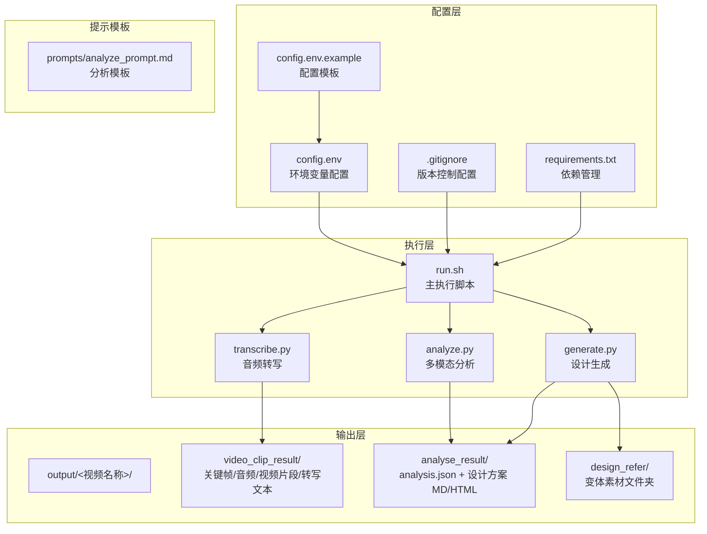
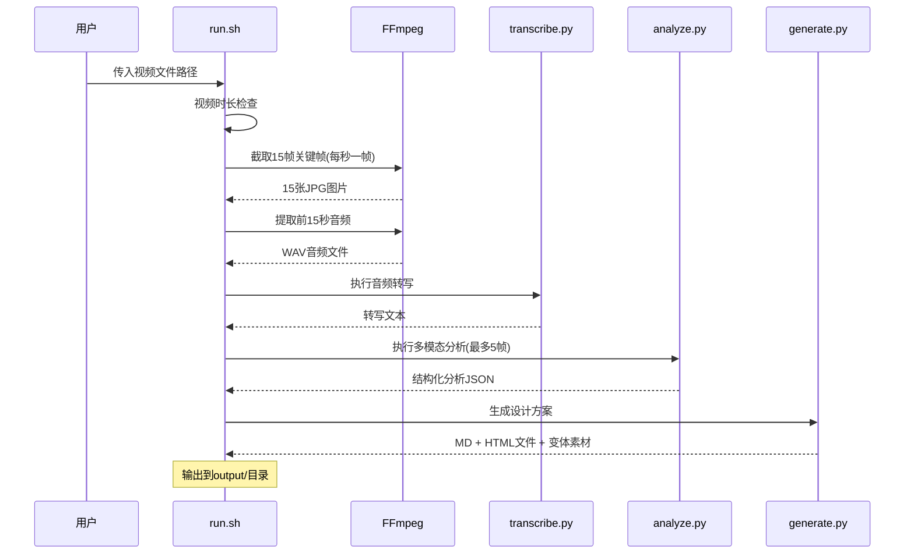
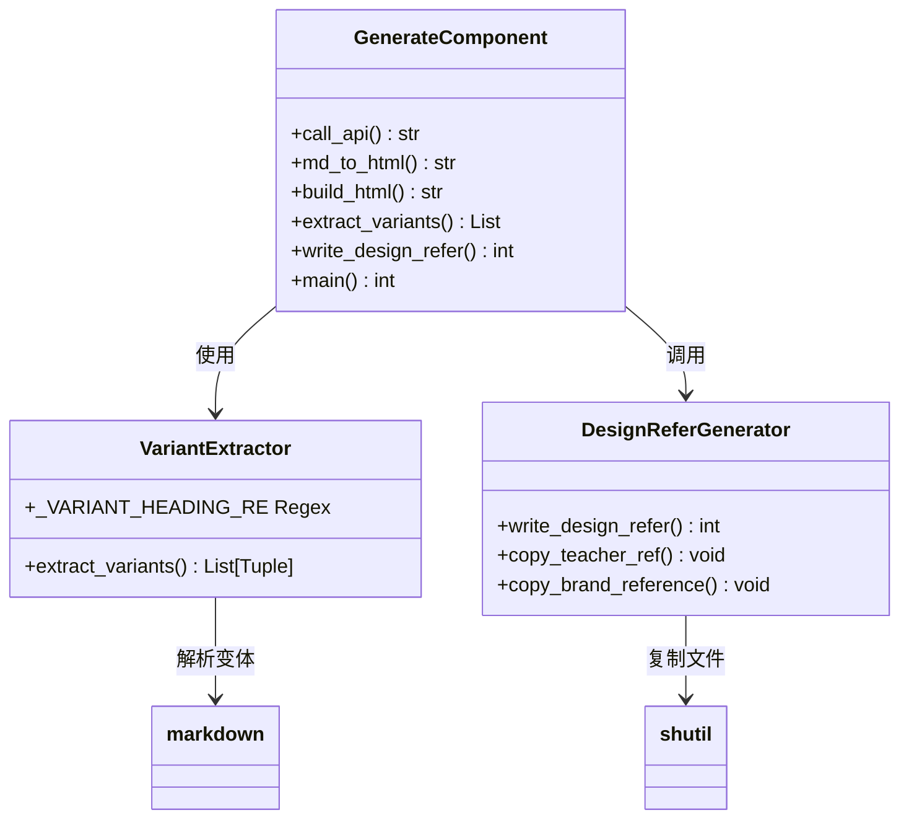
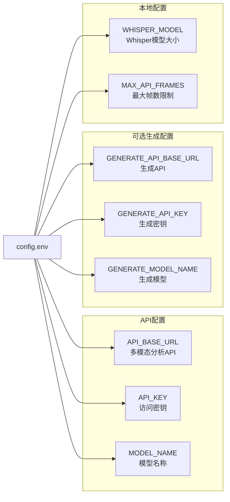
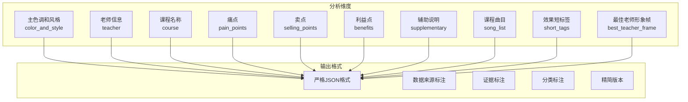
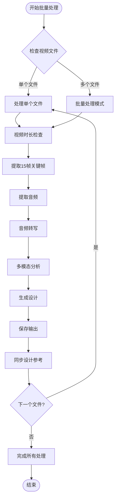
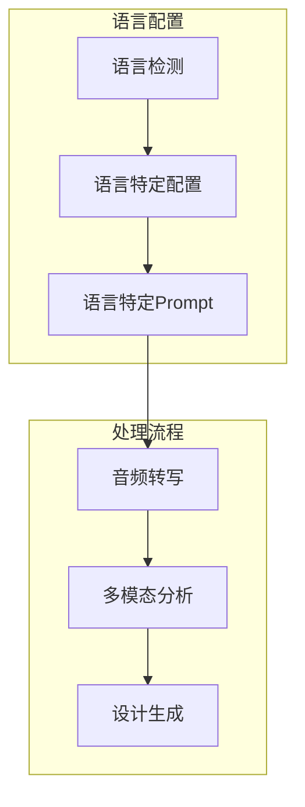
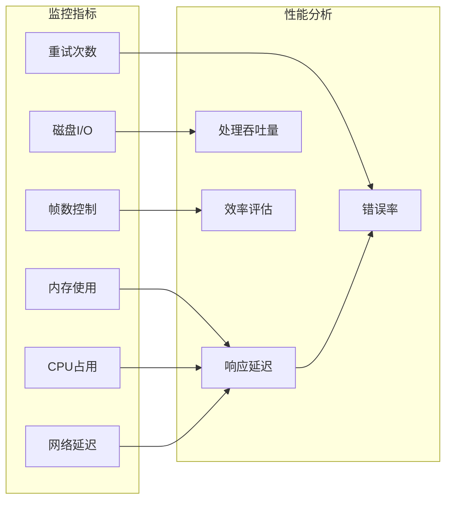

# 配置和定制

<cite>
**本文档引用的文件**
- [config.env.example](file://config.env.example)
- [.gitignore](file://.gitignore)
- [config.env](file://config.env)
- [run.sh](file://run.sh)
- [analyze.py](file://analyze.py)
- [generate.py](file://generate.py)
- [transcribe.py](file://transcribe.py)
- [prompts/analyze_prompt.md](file://prompts/analyze_prompt.md)
- [requirements.txt](file://requirements.txt)
</cite>

## 更新摘要
**变更内容**
- 新增config.env.example配置模板，提供标准配置示例
- 新增.gitignore版本控制配置，规范版本控制文件管理
- run.sh脚本重大增强：新增视频时长检查、重试机制、输出目录结构优化
- analyze.py脚本重大增强：新增帧数采样、统一采样算法、JSON解析增强
- generate.py脚本重大增强：新增变体提取、设计参考生成、HTML渲染优化
- transcribe.py脚本重大增强：新增模型加载优化、错误处理改进

## 目录
1. [简介](#简介)
2. [项目结构](#项目结构)
3. [核心组件](#核心组件)
4. [架构概览](#架构概览)
5. [详细组件分析](#详细组件分析)
6. [配置详解](#配置详解)
7. [Prompt模板定制](#prompt模板定制)
8. [批量处理策略](#批量处理策略)
9. [性能优化建议](#性能优化建议)
10. [扩展开发指南](#扩展开发指南)
11. [使用场景配置示例](#使用场景配置示例)
12. [故障排除指南](#故障排除指南)
13. [结论](#结论)

## 简介

这是一个基于多模态AI的视频内容分析和落地页设计自动化工具。该系统能够自动分析视频广告的前15秒内容，提取关键信息并生成专业的落地页Hero区域设计方案。系统支持多种配置选项、可定制的Prompt模板，以及灵活的批量处理能力。

**更新** 新增了完整的配置模板系统和版本控制支持，提供更完善的开发体验。

## 项目结构

项目采用模块化设计，包含以下核心组件：



**图表来源**
- [run.sh:74-88](file://run.sh#L74-L88)
- [config.env.example:1-16](file://config.env.example#L1-L16)
- [.gitignore:1-7](file://.gitignore#L1-L7)

**章节来源**
- [run.sh:74-88](file://run.sh#L74-L88)
- [config.env.example:1-16](file://config.env.example#L1-L16)
- [.gitignore:1-7](file://.gitignore#L1-L7)

## 核心组件

系统包含四个核心Python脚本，每个都有特定的功能职责：

### 分析组件 (analyze.py)
负责多模态分析，结合关键帧图片和音频转写文本，调用AI模型提取结构化信息。**更新** 新增帧数采样功能，支持动态控制发送给API的帧数。

### 生成组件 (generate.py)  
基于分析结果生成完整的落地页Hero设计方案，包括设计思路、页面结构、文案内容和生图Prompt。**更新** 新增变体提取和设计参考生成功能。

### 转录组件 (transcribe.py)
使用Whisper模型进行本地音频转写，支持多种模型大小配置。**更新** 新增模型加载优化和错误处理改进。

### 执行脚本 (run.sh)
协调整个工作流程，处理视频文件的预处理、关键帧提取、音频处理和结果生成。**更新** 新增视频时长检查、重试机制和输出目录结构优化。

**章节来源**
- [analyze.py:84-104](file://analyze.py#L84-L104)
- [generate.py:518-568](file://generate.py#L518-L568)
- [transcribe.py:22-66](file://transcribe.py#L22-L66)
- [run.sh:93-128](file://run.sh#L93-L128)

## 架构概览

系统采用流水线式架构，每个阶段都产生中间产物供后续阶段使用：



**图表来源**
- [run.sh:108-162](file://run.sh#L108-L162)
- [analyze.py:225-237](file://analyze.py#L225-L237)

## 详细组件分析

### 分析组件深度解析

分析组件实现了robust的错误处理和重试机制，**更新** 新增帧数采样功能：

```mermaid
flowchart TD
Start([开始分析]) --> LoadFrames[加载关键帧]
LoadFrames --> CheckTranscript{检查转写文件}
CheckTranscript --> |存在| LoadPrompt[加载分析模板]
CheckTranscript --> |不存在| Error1[错误: 缺少转写文件]
LoadPrompt --> FrameSampling[帧数采样(最多MAX_API_FRAMES)]
FrameSampling --> CallAPI[调用多模态API]
CallAPI --> Retry{重试机制}
Retry --> |成功| ParseJSON[解析JSON响应]
Retry --> |失败| RetryAttempt{重试次数}
RetryAttempt --> |<3次| Backoff[指数退避等待]
RetryAttempt --> |≥3次| Error2[错误: API调用失败]
ParseJSON --> SaveResult[保存分析结果]
SaveResult --> End([完成])
Error1 --> End
Error2 --> End
```

**图表来源**
- [analyze.py:211-273](file://analyze.py#L211-L273)

### 生成组件深度解析

生成组件提供了灵活的HTML渲染机制，**更新** 新增变体提取和设计参考生成：



**图表来源**
- [generate.py:518-615](file://generate.py#L518-L615)

**章节来源**
- [analyze.py:211-273](file://analyze.py#L211-L273)
- [generate.py:518-615](file://generate.py#L518-L615)

## 配置详解

### 环境变量配置

系统通过config.env文件集中管理所有配置选项，**更新** 新增config.env.example配置模板：

| 配置项 | 类型 | 默认值 | 描述 |
|--------|------|--------|------|
| API_BASE_URL | 字符串 | 必填 | 多模态分析API的基础URL |
| API_KEY | 字符串 | 必填 | API访问密钥 |
| MODEL_NAME | 字符串 | 必填 | 多模态分析模型名称 |
| GENERATE_API_BASE_URL | 字符串 | 可选 | 设计生成API的基础URL |
| GENERATE_API_KEY | 字符串 | 可选 | 设计生成API密钥 |
| GENERATE_MODEL_NAME | 字符串 | 可选 | 设计生成模型名称 |
| WHISPER_MODEL | 字符串 | small | Whisper语音转写模型大小 |
| MAX_API_FRAMES | 整数 | 5 | 发送给API的最大帧数 |

### 配置文件结构



**图表来源**
- [config.env:1-17](file://config.env#L1-L17)

**章节来源**
- [config.env:1-17](file://config.env#L1-L17)
- [config.env.example:1-16](file://config.env.example#L1-L16)

## Prompt模板定制

### 分析Prompt模板结构

分析模板定义了完整的分析框架，**更新** 增强了输出格式的规范性：



**图表来源**
- [prompts/analyze_prompt.md:15-153](file://prompts/analyze_prompt.md#L15-L153)

**章节来源**
- [prompts/analyze_prompt.md:1-153](file://prompts/analyze_prompt.md#L1-L153)

## 批量处理策略

### 批量执行流程

系统支持对多个视频文件进行批量处理，**更新** 新增视频时长检查和重试机制：



### 批量处理最佳实践

1. **文件组织**: 将待处理的视频文件放在同一目录下
2. **资源管理**: 确保有足够的磁盘空间存储中间文件
3. **并发控制**: 根据系统资源合理控制同时处理的文件数量
4. **错误恢复**: 对于失败的任务，检查日志并重新运行
5. **版本控制**: 使用.gitignore避免不必要的文件提交

**章节来源**
- [run.sh:28-48](file://run.sh#L28-L48)
- [run.sh:175-189](file://run.sh#L175-L189)

## 性能优化建议

### 系统资源优化

| 优化方面 | 建议配置 | 预期效果 |
|----------|----------|----------|
| Whisper模型 | small/medium/large | small: 460MB, medium: 1.5GB, large: 5GB |
| API温度参数 | 分析: 0.3, 生成: 0.6 | 平衡创造性与稳定性 |
| 关键帧质量 | q:v 2 | 保持高质量同时控制文件大小 |
| 重试机制 | MAX_RETRIES = 3 | 提高成功率，避免无限重试 |
| 帧数采样 | MAX_API_FRAMES = 5 | 控制token使用，提高API效率 |

### 内存和存储优化

1. **临时文件清理**: 定期清理output目录中的临时文件
2. **模型缓存**: Whisper模型加载后会在内存中缓存
3. **并发限制**: 控制同时运行的进程数量
4. **版本控制**: 使用.gitignore避免提交大型模型文件

### 网络性能优化

1. **连接复用**: 使用支持HTTP/2的API服务
2. **超时设置**: 合理设置API请求超时时间
3. **断线重连**: 实现智能的网络异常处理
4. **重试策略**: 指数退避重试机制

## 扩展开发指南

### 新增API服务支持

要支持新的API服务，需要修改以下组件：

1. **API客户端封装**: 在analyze.py和generate.py中添加新API的调用逻辑
2. **配置项扩展**: 在config.env中添加相应的配置项
3. **错误处理**: 实现针对新API的错误处理和重试机制
4. **Prompt定制**: 更新Prompts模板以适配新API的能力

### 自定义分析维度

扩展分析模板以支持新的分析维度：

1. **更新分析模板**: 在prompts/analyze_prompt.md中添加新的分析维度
2. **数据结构扩展**: 修改analyze.py中的数据提取和验证逻辑
3. **输出格式调整**: 更新JSON输出格式以包含新字段
4. **测试验证**: 确保新维度的输出格式符合预期

### 新增输出格式

系统当前支持Markdown和HTML两种输出格式。要添加新的输出格式：

1. **模板引擎**: 实现新的模板渲染器
2. **样式支持**: 添加相应的CSS样式或内联样式
3. **文件生成**: 在generate.py中添加新的文件生成逻辑
4. **变体支持**: 确保变体提取功能支持新格式

### 版本控制最佳实践

1. **配置文件管理**: 使用config.env.example提供配置模板
2. **敏感信息保护**: 在.gitignore中排除config.env
3. **依赖管理**: 使用requirements.txt管理Python依赖
4. **临时文件清理**: 排除output/目录和__pycache__目录

**章节来源**
- [analyze.py:211-273](file://analyze.py#L211-L273)
- [generate.py:518-615](file://generate.py#L518-L615)
- [.gitignore:1-7](file://.gitignore#L1-L7)

## 使用场景配置示例

### 不同分辨率视频配置

| 分辨率 | 关键帧数量 | 建议配置 | 性能考虑 |
|--------|------------|----------|----------|
| 720p | 15帧 | MAX_API_FRAMES=5 | 最佳平衡点 |
| 1080p | 15帧 | MAX_API_FRAMES=5 | 可能需要更强的GPU |
| 4K | 15帧 | MAX_API_FRAMES=3-5 | 需要更多内存和存储 |

### 多语言内容处理



### 特殊行业需求

#### 教育行业
- **分析重点**: 教师形象、课程内容、学习成果
- **设计要素**: 专业感、可信度、学习氛围
- **Prompt定制**: 强调教育专业性和学习效果

#### 健康医疗行业
- **分析重点**: 医疗专业性、安全保证、治疗效果
- **设计要素**: 信任感、专业性、安全性
- **Prompt定制**: 强调医疗专业性和安全保障

#### 金融理财行业
- **分析重点**: 收益预期、风险控制、专业顾问
- **设计要素**: 稳健性、专业性、安全性
- **Prompt定制**: 强调收益稳定性和专业服务

## 故障排除指南

### 常见问题及解决方案

| 问题类型 | 症状 | 可能原因 | 解决方案 |
|----------|------|----------|----------|
| API调用失败 | 网络错误或认证失败 | 网络连接问题或配置错误 | 检查网络连接和API配置 |
| Whisper模型加载失败 | 内存不足或模型损坏 | 内存不足或模型文件损坏 | 释放内存或重新下载模型 |
| 关键帧提取失败 | FFmpeg错误或视频损坏 | FFmpeg未安装或视频格式不支持 | 安装FFmpeg或转换视频格式 |
| JSON解析失败 | 分析结果格式错误 | API返回格式不符合预期 | 检查API版本兼容性 |
| 帧数过多 | API调用失败或超时 | 超过API限制的帧数 | 调整MAX_API_FRAMES配置 |

### 调试技巧

1. **查看原始响应**: 分析组件会保存原始API响应到analysis_raw.txt
2. **分步调试**: 逐个执行脚本组件以定位问题
3. **日志分析**: 仔细查看详细的错误日志信息
4. **配置验证**: 确保所有必需的环境变量都已正确设置
5. **版本控制**: 使用.gitignore避免提交配置文件

### 性能监控



**章节来源**
- [analyze.py:254-263](file://analyze.py#L254-L263)
- [run.sh:93-98](file://run.sh#L93-L98)

## 结论

本配置和定制指南提供了使用该多模态视频分析系统的完整指导。通过合理配置环境变量、定制Prompt模板、优化性能参数，以及遵循最佳实践，用户可以高效地生成高质量的落地页Hero设计方案。

**更新** 新增的配置模板系统和版本控制支持大大提升了开发体验和项目维护性。系统的主要优势包括：

- **完善的配置管理**: 通过config.env和config.env.example提供标准配置模板
- **强大的扩展性**: 支持自定义分析维度和输出格式
- **智能的性能优化**: 帧数采样、重试机制、内存管理
- **高效的批处理**: 支持多视频文件的批量处理和版本控制
- **完善的错误处理**: 提供详细的错误信息和恢复机制
- **现代化的开发体验**: 版本控制集成、依赖管理、配置模板

建议用户根据具体业务需求调整配置参数，并定期更新Prompt模板以适应不断变化的市场需求。使用.gitignore确保项目结构的整洁，利用config.env.example快速启动新项目。