# 配置和定制

<cite>
**本文档引用的文件**
- [config.env.example](file://config.env.example)
- [.gitignore](file://.gitignore)
- [config.env](file://config.env)
- [run.sh](file://run.sh)
- [analyze.py](file://analyze.py)
- [generate.py](file://generate.py)
- [generate_image.py](file://generate_image.py)
- [transcribe.py](file://transcribe.py)
- [category_config.py](file://category_config.py)
- [prompts/analyze_prompt.md](file://prompts/analyze_prompt.md)
- [prompts/generate_prompt.md](file://prompts/generate_prompt.md)
- [assets/fallback_points.md](file://assets/fallback_points.md)
- [assets/categories/nutrition/config.json](file://assets/categories/nutrition/config.json)
- [assets/categories/singing/config.json](file://assets/categories/singing/config.json)
- [assets/categories/nutrition/examples/](file://assets/categories/nutrition/examples/)
- [assets/categories/singing/examples/](file://assets/categories/singing/examples/)
- [assets/categories/nutrition/fallback_points.md](file://assets/categories/nutrition/fallback_points.md)
- [assets/categories/singing/fallback_points.md](file://assets/categories/singing/fallback_points.md)
- [prompts/categories/nutrition/generate_prompt.md](file://prompts/categories/nutrition/generate_prompt.md)
- [prompts/categories/singing/generate_prompt.md](file://prompts/categories/singing/generate_prompt.md)
- [requirements.txt](file://requirements.txt)
</cite>

## 更新摘要
**变更内容**
- 新增多类别配置系统，支持singing和nutrition两类配置
- 添加category_config.py模块，实现动态品类配置加载
- 新增营养健康类别的专用配置和Prompt模板
- 扩展批量处理策略，支持基于品类的变体数量配置
- 增强动态变体计算功能，支持不同品类的变体数量差异
- 新增品类特定的参考图片和示例资源

## 目录
1. [简介](#简介)
2. [项目结构](#项目结构)
3. [核心组件](#核心组件)
4. [架构概览](#架构概览)
5. [详细组件分析](#详细组件分析)
6. [配置详解](#配置详解)
7. [多类别配置系统](#多类别配置系统)
8. [视觉预处理配置](#视觉预处理配置)
9. [参考图片系统](#参考图片系统)
10. [保底内容系统](#保底内容系统)
11. [图像生成配置](#图像生成配置)
12. [Prompt模板定制](#prompt模板定制)
13. [批量处理策略](#批量处理策略)
14. [性能优化建议](#性能优化建议)
15. [扩展开发指南](#扩展开发指南)
16. [使用场景配置示例](#使用场景配置示例)
17. [故障排除指南](#故障排除指南)
18. [结论](#结论)

## 简介

这是一个基于多模态AI的视频内容分析和落地页设计自动化工具。该系统能够自动分析视频广告的前15秒内容，提取关键信息并生成专业的落地页Hero区域设计方案。系统支持多种配置选项、可定制的Prompt模板，以及灵活的批量处理能力。

**更新** 新增了完整的多类别配置系统，包括singing（唱歌）和nutrition（营养健康）两大类别的专用配置。系统现在支持基于品类的动态变体计算、品类特定的Prompt模板、以及专门的参考图片和示例资源。**新增** 批量处理功能支持基于品类的变体数量配置，不同品类可以有不同的变体生成策略。

## 项目结构

项目采用模块化设计，包含以下核心组件：

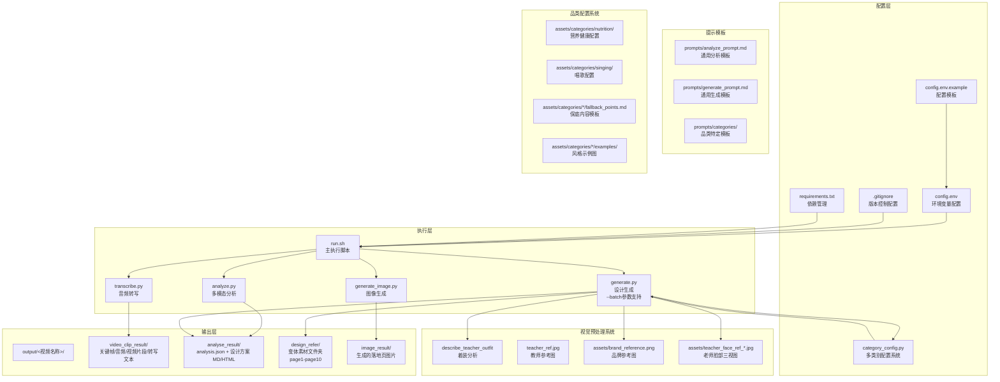

**图表来源**
- [run.sh:74-88](file://run.sh#L74-L88)
- [config.env.example:1-21](file://config.env.example#L1-L21)
- [.gitignore:1-7](file://.gitignore#L1-L7)
- [category_config.py:1-120](file://category_config.py#L1-L120)

**章节来源**
- [run.sh:74-88](file://run.sh#L74-L88)
- [config.env.example:1-21](file://config.env.example#L1-L21)
- [.gitignore:1-7](file://.gitignore#L1-L7)
- [category_config.py:1-120](file://category_config.py#L1-L120)

## 核心组件

系统包含七个核心Python脚本，每个都有特定的功能职责：

### 分析组件 (analyze.py)
负责多模态分析，结合关键帧图片和音频转写文本，调用AI模型提取结构化信息。**更新** 新增帧数采样功能和保底内容系统集成，**新增** 支持营养健康类别的食谱参考帧提取。

### 生成组件 (generate.py)  
基于分析结果生成完整的落地页Hero设计方案，包括设计思路、页面结构、文案内容和生图Prompt。**更新** 新增视觉预处理系统集成，支持教师着装分析和多维度的参考图管理，**新增** 支持--batch参数，实现批量处理模式，**新增** 集成多类别配置系统，支持动态变体计算。

### 图像生成组件 (generate_image.py)
基于设计变体和教师参考图，调用图像生成API生成最终的落地页图片。**更新** 支持多参考图的批量处理，包括老师参考图、脸部三视图和品牌logo。

### 多类别配置组件 (category_config.py)
**新增** 提供多类别配置管理功能，支持从环境变量加载品类配置，包含默认配置和外部配置文件支持。**新增** 实现动态变体计算和品类特定的配置参数。

### 视觉预处理组件 (generate.py)
新增独立的视觉预处理功能，专门负责教师图像的视觉分析和约束。**新增** 提供教师着装描述、面部特征分析和视觉一致性检查。

### 转录组件 (transcribe.py)
使用Whisper模型进行本地音频转写，支持多种模型大小配置。**更新** 新增模型加载优化和错误处理改进。

### 执行脚本 (run.sh)
协调整个工作流程，处理视频文件的预处理、关键帧提取、音频处理和结果生成。**更新** 新增视频时长检查、重试机制和输出目录结构优化。

**章节来源**
- [analyze.py:84-104](file://analyze.py#L84-L104)
- [generate.py:518-568](file://generate.py#L518-L568)
- [generate_image.py:1-398](file://generate_image.py#L1-L398)
- [category_config.py:1-120](file://category_config.py#L1-L120)
- [transcribe.py:22-66](file://transcribe.py#L22-L66)
- [run.sh:93-128](file://run.sh#L93-L128)

## 架构概览

系统采用流水线式架构，每个阶段都产生中间产物供后续阶段使用：

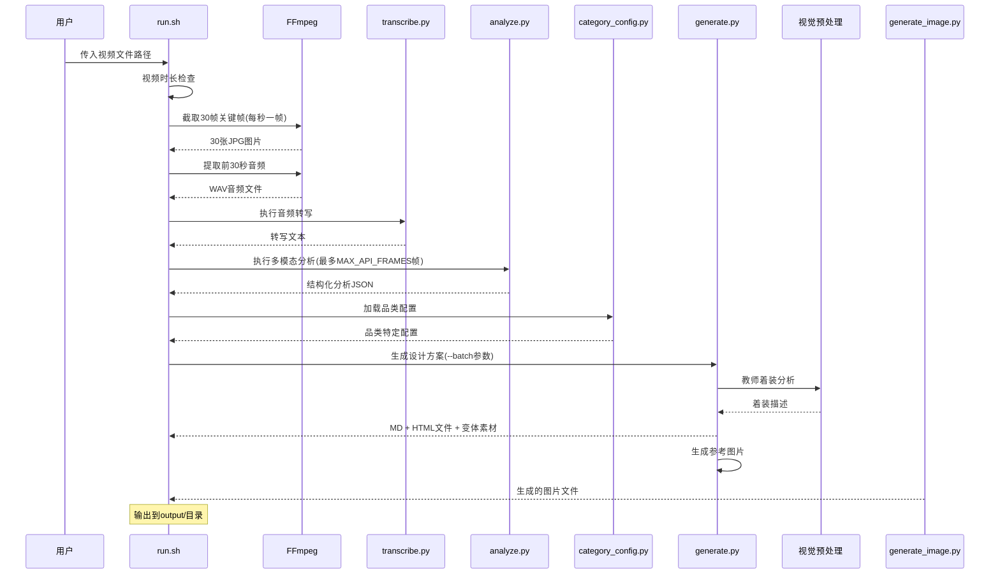

**图表来源**
- [run.sh:108-162](file://run.sh#L108-L162)
- [analyze.py:225-237](file://analyze.py#L225-L237)
- [category_config.py:1-120](file://category_config.py#L1-L120)

## 详细组件分析

### 分析组件深度解析

分析组件实现了robust的错误处理和重试机制，**更新** 新增帧数采样功能和保底内容系统集成，**新增** 支持营养健康类别的食谱参考帧提取：

```mermaid
flowchart TD
Start([开始分析]) --> LoadFrames[加载关键帧]
LoadFrames --> CheckTranscript{检查转写文件}
CheckTranscript --> |存在| LoadPrompt[加载分析模板]
CheckTranscript --> |不存在| Error1[错误: 缺少转写文件]
LoadPrompt --> LoadFallbackPoints[加载保底内容模板]
LoadFallbackPoints --> CheckCategory{检查品类}
CheckCategory --> |nutrition| ExtractRecipeFrames[提取食谱参考帧]
CheckCategory --> |其他| FrameSampling[帧数采样(最多MAX_API_FRAMES)]
ExtractRecipeFrames --> FrameSampling
FrameSampling --> CallAPI[调用多模态API]
CallAPI --> Retry{重试机制}
Retry --> |成功| ParseJSON[解析JSON响应]
Retry --> |失败| RetryAttempt{重试次数}
RetryAttempt --> |<3次| Backoff[指数退避等待]
RetryAttempt --> |≥3次| Error2[错误: API调用失败]
ParseJSON --> SaveResult[保存分析结果]
SaveResult --> End([完成])
Error1 --> End
Error2 --> End
```

**图表来源**
- [analyze.py:211-273](file://analyze.py#L211-L273)
- [analyze.py:365-375](file://analyze.py#L365-L375)

### 生成组件深度解析

生成组件提供了灵活的HTML渲染机制，**更新** 新增视觉预处理系统集成和保底内容模板，**新增** 支持--batch参数的批量处理模式，**新增** 集成多类别配置系统：

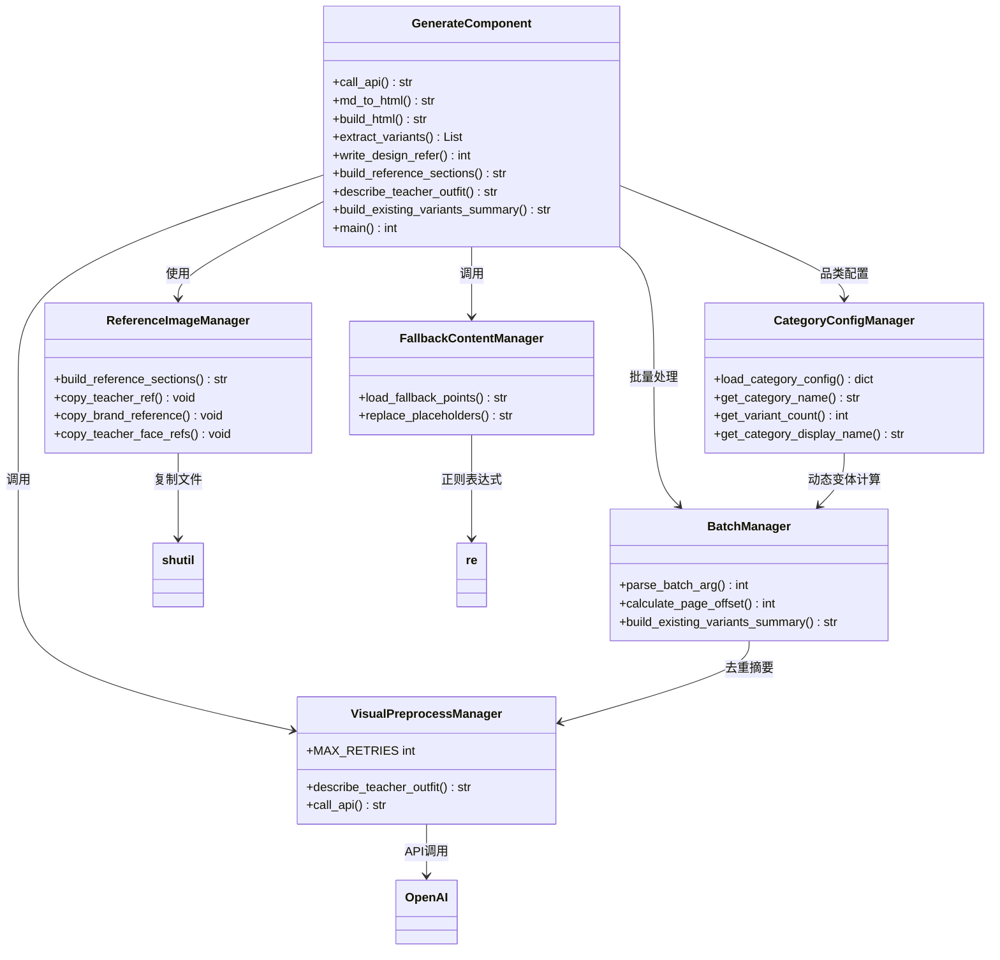

**图表来源**
- [generate.py:518-615](file://generate.py#L518-L615)
- [category_config.py:1-120](file://category_config.py#L1-L120)

### 多类别配置组件深度解析

**新增** 多类别配置系统提供了完整的品类管理功能：

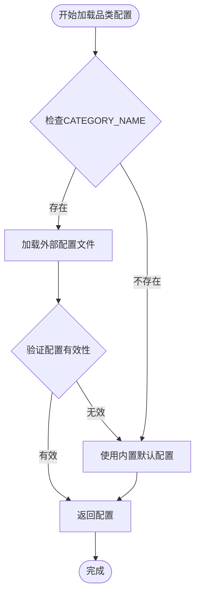

**图表来源**
- [category_config.py:1-120](file://category_config.py#L1-L120)

### 图像生成组件深度解析

图像生成组件实现了独立的图片生成流程，**更新** 支持多参考图的批量处理：

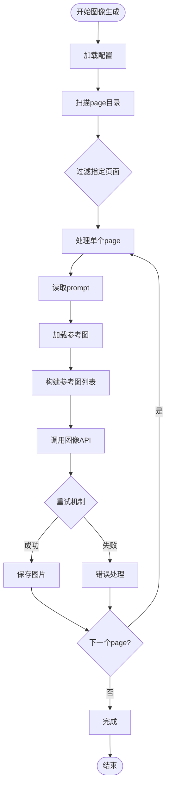

**图表来源**
- [generate_image.py:203-259](file://generate_image.py#L203-L259)

**章节来源**
- [analyze.py:211-273](file://analyze.py#L211-L273)
- [generate.py:518-615](file://generate.py#L518-L615)
- [category_config.py:1-120](file://category_config.py#L1-L120)
- [generate_image.py:203-259](file://generate_image.py#L203-L259)

## 配置详解

### 环境变量配置

系统通过config.env文件集中管理所有配置选项，**更新** 新增config.env.example配置模板和视觉预处理API配置，**新增** 添加品类配置相关环境变量：

| 配置项 | 类型 | 默认值 | 描述 |
|--------|------|--------|------|
| API_BASE_URL | 字符串 | 必填 | 多模态分析API的基础URL |
| API_KEY | 字符串 | 必填 | API访问密钥 |
| MODEL_NAME | 字符串 | 必填 | 多模态分析模型名称 |
| ANALYSE_API_BASE_URL | 字符串 | 可选 | 视觉预处理API的基础URL |
| ANALYSE_API_KEY | 字符串 | 可选 | 视觉预处理API密钥 |
| ANALYSE_MODEL_NAME | 字符串 | 可选 | 视觉预处理模型名称 |
| GENERATE_API_BASE_URL | 字符串 | 可选 | 设计生成API的基础URL |
| GENERATE_API_KEY | 字符串 | 可选 | 设计生成API密钥 |
| GENERATE_MODEL_NAME | 字符串 | 可选 | 设计生成模型名称 |
| CATEGORY_NAME | 字符串 | singing | 当前使用的品类（singing/nutrition） |
| WHISPER_MODEL | 字符串 | small | Whisper语音转写模型大小 |
| MAX_API_FRAMES | 整数 | 5 | 发送给API的最大帧数 |
| IMAGE_API_BASE_URL | 字符串 | 必填 | 图像生成API的基础URL |
| IMAGE_API_KEY | 字符串 | 必填 | 图像生成API密钥 |
| IMAGE_MODEL_NAME | 字符串 | gpt-image-2 | 图像生成模型名称 |

### 配置文件结构

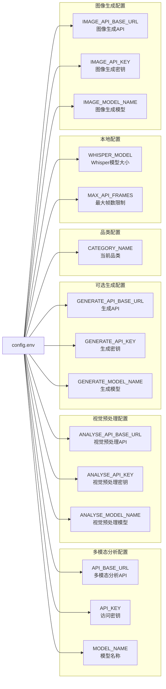

**图表来源**
- [config.env:1-22](file://config.env#L1-L22)

**章节来源**
- [config.env:1-22](file://config.env#L1-L22)
- [config.env.example:1-21](file://config.env.example#L1-L21)

## 多类别配置系统

### 多类别配置架构

**新增** 多类别配置系统提供了完整的品类管理功能，支持动态配置加载和变体计算：

```mermaid
graph TB
subgraph "品类配置系统"
CategoryConfig[category_config.py<br/>配置管理器]
LoadCategoryConfig[load_category_config<br/>配置加载函数]
GetCategoryName[get_category_name<br/>品类标识获取]
End
subgraph "内置默认配置"
SingingConfig[singing配置<br/>默认配置]
NutritionConfig[nutrition配置<br/>默认配置]
end
subgraph "外部配置文件"
ExternalConfig[assets/categories/*/config.json<br/>外部配置文件]
FallbackPoints[assets/categories/*/fallback_points.md<br/>保底内容模板]
Examples[assets/categories/*/examples/<br/>风格示例图]
end
subgraph "生成组件集成"
GenerateMain[generate.py<br/>主流程]
DynamicVariant[动态变体计算]
PageOffset[页面偏移计算]
end
CategoryConfig --> LoadCategoryConfig
CategoryConfig --> GetCategoryName
LoadCategoryConfig --> SingingConfig
LoadCategoryConfig --> NutritionConfig
LoadCategoryConfig --> ExternalConfig
ExternalConfig --> DynamicVariant
DynamicVariant --> PageOffset
GenerateMain --> CategoryConfig
GenerateMain --> DynamicVariant
GenerateMain --> PageOffset
```

**图表来源**
- [category_config.py:1-120](file://category_config.py#L1-L120)
- [generate.py:845-895](file://generate.py#L845-L895)

### 品类配置详解

系统支持两种内置品类配置：

#### 唱歌品类配置 (singing)
| 配置项 | 值 | 描述 |
|--------|-----|------|
| display_name | 唱歌 | 品类显示名称 |
| description | 中老年唱歌教学课程，强调音乐表达、歌曲演唱、呼吸技巧等 | 品类描述 |
| applicable_inspirations | A, B, C, D, E, F, G, H, I, J, K | 适用的创意灵感编号 |
| title_pool | ["兴趣岛唱歌训练营首席讲师", "身体唱歌法创始人"] | 职称头衔池 |
| content_list_name | 课程曲目 | 内容列表名称 |
| content_list_description | 具体歌曲名称（如《送别》《鸿雁》等） | 内容描述 |
| decoration_elements | 音符♪、麦克风图标、舞台光效、金色光晕 | 装饰元素 |

#### 营养健康品类配置 (nutrition)
| 配置项 | 值 | 描述 |
|--------|-----|------|
| display_name | 健康营养 | 品类显示名称 |
| description | 中老年健康营养教学课程，强调营养知识、食疗方案、健康管理等 | 品类描述 |
| applicable_inspirations | A, C, D, E, F, G, I, J | 适用的创意灵感编号 |
| title_pool | ["注册营养师", "健康管理师", "食疗养生专家"] | 职称头衔池 |
| content_list_name | 课程内容 | 内容列表名称 |
| content_list_description | 具体食物/营养知识点等 | 内容描述 |
| decoration_elements | 蔬果图标🥦🍎、健康心形❤️、绿叶元素、阳光光晕 | 装饰元素 |

### 外部配置文件支持

**新增** 系统支持从assets/categories/目录加载外部配置文件：

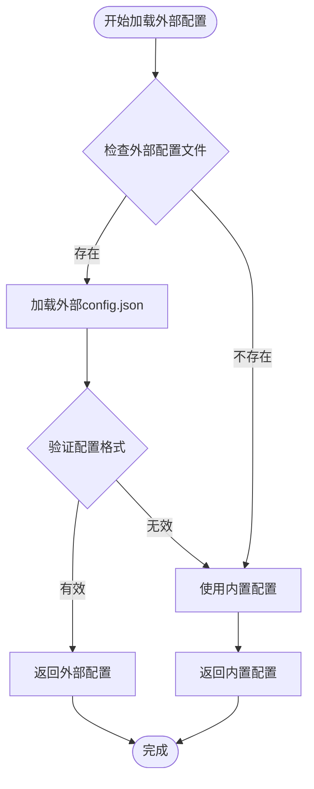

**图表来源**
- [category_config.py:1-120](file://category_config.py#L1-L120)

### 动态变体计算

**新增** 基于品类的动态变体计算功能：

```mermaid
flowchart TD
Start([开始变体计算]) --> LoadCategoryConfig[加载品类配置]
LoadCategoryConfig --> CheckVariantCount{检查variant_count}
CheckVariantCount --> |存在| UseConfigCount[使用配置的变体数量]
CheckVariantCount --> |不存在| UseDefaultCount[使用默认变体数量(5)]
UseConfigCount --> CalculateOffset[计算页面偏移]
UseDefaultCount --> CalculateOffset
CalculateOffset --> ApplyBatchMode{应用批量模式}
ApplyBatchMode --> |batch=1| SetPageRange1[设置page1-page5]
ApplyBatchMode --> |batch=2| SetPageRange2[设置page6-page10]
SetPageRange1 --> End([完成])
SetPageRange2 --> End
```

**图表来源**
- [generate.py:845-895](file://generate.py#L845-L895)

**章节来源**
- [category_config.py:1-120](file://category_config.py#L1-L120)
- [generate.py:845-895](file://generate.py#L845-L895)

## 视觉预处理配置

### 视觉预处理架构

视觉预处理系统提供了独立的教师图像分析功能，支持着装描述和视觉一致性检查：

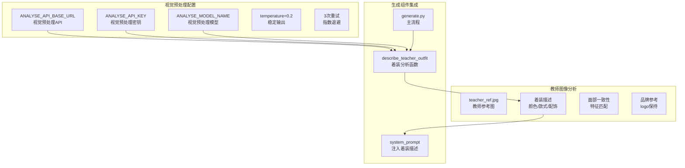

**图表来源**
- [generate.py:59-120](file://generate.py#L59-L120)
- [generate.py:779-800](file://generate.py#L779-L800)

### 视觉预处理配置详解

| 配置项 | 类型 | 默认值 | 描述 |
|--------|------|--------|------|
| ANALYSE_API_BASE_URL | 字符串 | 可选 | 视觉预处理API的基础URL |
| ANALYSE_API_KEY | 字符串 | 可选 | 视觉预处理API访问密钥 |
| ANALYSE_MODEL_NAME | 字符串 | 可选 | 视觉预处理模型名称 |
| temperature | 浮点数 | 0.2 | 控制输出稳定性，0.2确保着装描述准确 |
| MAX_RETRIES | 整数 | 3 | 视觉预处理API最大重试次数 |
| BACKOFF_FACTOR | 浮点数 | 2^attempt | 指数退避等待时间 |

### 视觉预处理流程

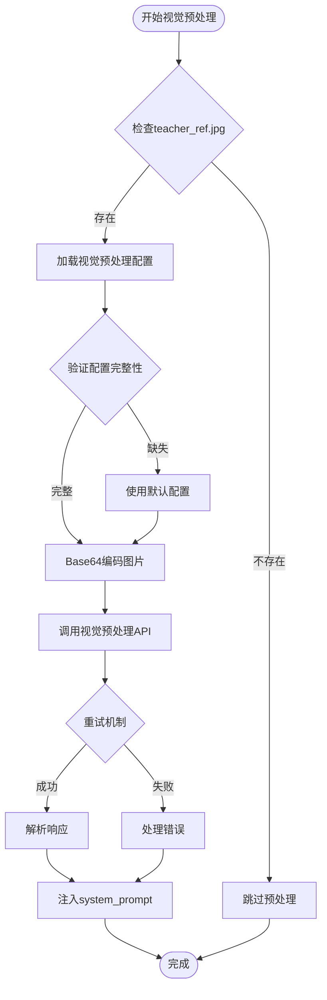

**图表来源**
- [generate.py:779-800](file://generate.py#L779-L800)

**章节来源**
- [generate.py:59-120](file://generate.py#L59-L120)
- [generate.py:779-800](file://generate.py#L779-L800)

## 参考图片系统

### 参考图片管理架构

系统提供了完整的参考图片管理系统，支持多维度的视觉参考和品类特定的资源：

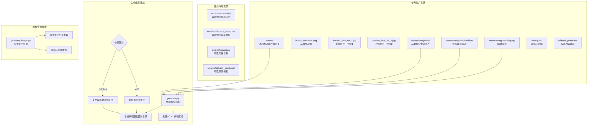

**图表来源**
- [generate.py:445-545](file://generate.py#L445-L545)
- [generate.py:950-965](file://generate.py#L950-L965)
- [generate_image.py:270-287](file://generate_image.py#L270-L287)

### 参考图片类型和用途

| 参考图片类型 | 文件名 | 用途 | 生成方式 | 品类特定 |
|-------------|--------|------|----------|----------|
| 品牌参考图 | brand_reference.png | 品牌标识栏参考 | 从assets目录复制 | 否 |
| 老师脸部三视图1 | teacher_face_ref_1.jpg | 面部特征一致性参考 | 从assets目录复制 | 否 |
| 老师脸部三视图2 | teacher_face_ref_2.jpg | 面部特征一致性参考 | 从assets目录复制 | 否 |
| 风格示例图 | examples/*.jpg | 整体视觉风格参考 | 可选使用 | 是 |
| 保底内容模板 | fallback_points.md | 默认痛点/卖点模板 | 自动生成 | 是 |
| 营养健康品牌参考 | nutrition/brand_reference.png | 营养健康品牌参考 | 从品类目录复制 | 是 |
| 营养健康示例图 | nutrition/examples/*.jpg | 营养健康风格参考 | 品类特定示例 | 是 |
| 唱歌品牌参考 | singing/brand_reference.png | 唱歌品牌参考 | 从品类目录复制 | 是 |
| 唱歌示例图 | singing/examples/*.jpg | 唱歌风格参考 | 品类特定示例 | 是 |

### 参考图片生成流程

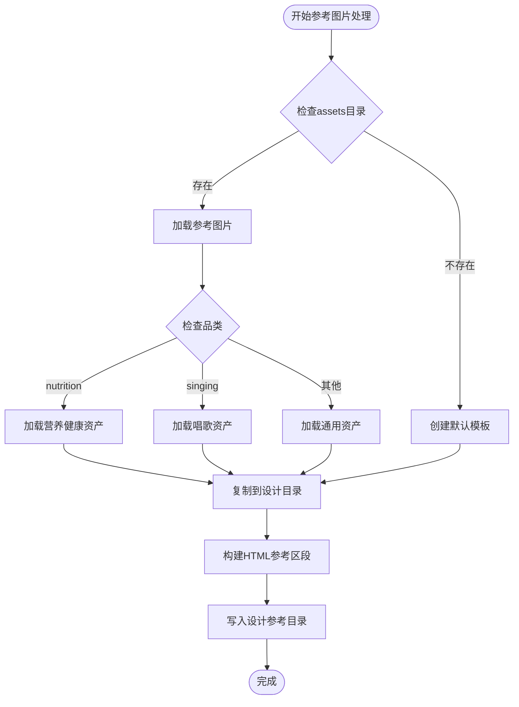

**图表来源**
- [generate.py:602-658](file://generate.py#L602-L658)
- [generate.py:950-965](file://generate.py#L950-L965)

**章节来源**
- [generate.py:445-545](file://generate.py#L445-L545)
- [generate.py:602-658](file://generate.py#L602-L658)
- [generate.py:950-965](file://generate.py#L950-L965)
- [generate_image.py:270-287](file://generate_image.py#L270-L287)

## 保底内容系统

### 保底内容架构

保底内容系统提供了默认的内容模板，确保在缺乏具体分析数据时仍能生成有效的设计方案：

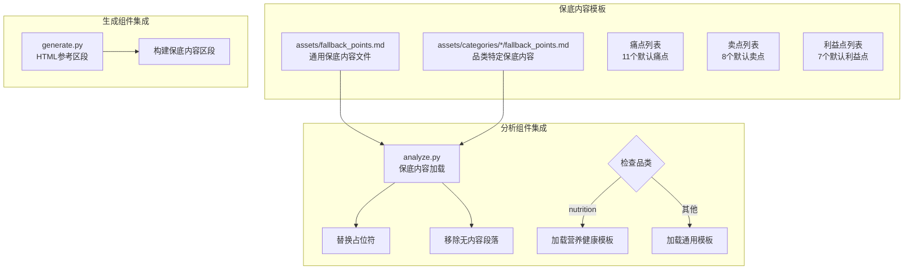

**图表来源**
- [assets/fallback_points.md:1-32](file://assets/fallback_points.md#L1-L32)
- [assets/categories/nutrition/fallback_points.md](file://assets/categories/nutrition/fallback_points.md)
- [assets/categories/singing/fallback_points.md](file://assets/categories/singing/fallback_points.md)
- [analyze.py:251-263](file://analyze.py#L251-L263)

### 保底内容模板结构

保底内容系统包含三个核心部分：

#### 通用痛点列表（11个默认痛点）
- 大白嗓、高音上不去、扯嗓子
- 气息不稳、唱歌费力、伤嗓子
- 怯于开唱、不知从何学起、线下上课不方便
- 自学没人带练、效果存疑

#### 通用卖点列表（8个默认卖点）
- 名师亲授、0基础、为中老年制定
- 课程可回放、随时随地能学、专业助教
- 社群陪学、科学发声

#### 通用利益点列表（7个默认利益点）
- 告别大白嗓、气息稳、高音稳
- 掌握科学发声、唱歌不费嗓、自信开唱
- 退休圆歌唱梦

### 品类特定保底内容

#### 营养健康品类保底内容
- **痛点**: 营养不良、消化问题、慢性病管理
- **卖点**: 科学营养、个性化食疗、健康管理
- **利益**: 健康改善、精力提升、生活质量提高

#### 唱歌品类保底内容
- **痛点**: 发声困难、气息控制、歌曲表现力
- **卖点**: 专业指导、循序渐进、效果可见
- **利益**: 声音改善、自信提升、艺术享受

### 保底内容集成流程

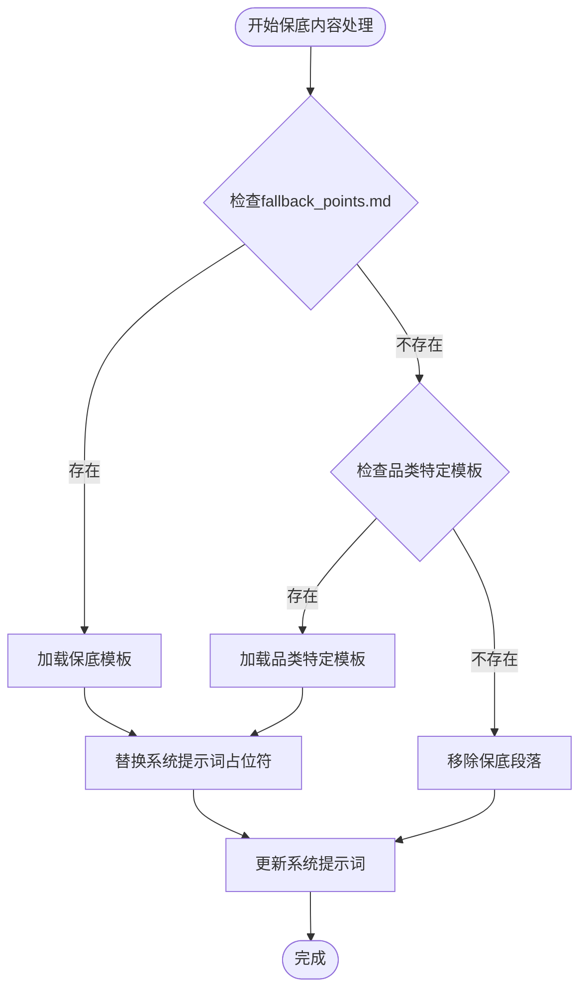

**图表来源**
- [analyze.py:251-263](file://analyze.py#L251-L263)

**章节来源**
- [assets/fallback_points.md:1-32](file://assets/fallback_points.md#L1-L32)
- [assets/categories/nutrition/fallback_points.md](file://assets/categories/nutrition/fallback_points.md)
- [assets/categories/singing/fallback_points.md](file://assets/categories/singing/fallback_points.md)
- [analyze.py:251-263](file://analyze.py#L251-L263)

## 图像生成配置

### 图像生成API配置详解

图像生成功能提供了独立的配置体系，专门用于控制图片生成过程：

| 配置项 | 类型 | 默认值 | 描述 |
|--------|------|--------|------|
| IMAGE_API_BASE_URL | 字符串 | https://api-slb.packyapi.com/v1/images/edits | 图像编辑API端点 |
| IMAGE_API_KEY | 字符串 | 必填 | 图像生成API访问密钥 |
| IMAGE_MODEL_NAME | 字符串 | gpt-image-2 | 图像生成模型名称 |
| DEFAULT_SIZE | 字符串 | 1024x1536 | 默认图片尺寸 |
| MAX_RETRIES | 整数 | 3 | 最大重试次数 |
| REQUEST_TIMEOUT | 整数 | 600 | 请求超时时间（秒） |
| OUTPUT_TARGET_WIDTH | 整数 | 750 | 输出图片目标宽度 |
| OUTPUT_MAX_HEIGHT | 整数 | 1200 | 输出图片最大高度 |

### 多参考图处理流程

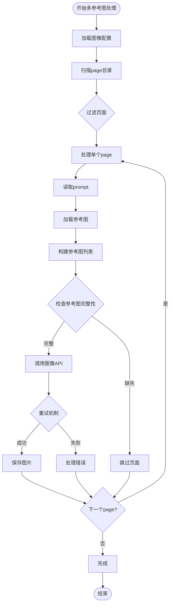

**图表来源**
- [generate_image.py:311-393](file://generate_image.py#L311-L393)

**章节来源**
- [generate_image.py:130-259](file://generate_image.py#L130-L259)
- [generate_image.py:311-393](file://generate_image.py#L311-L393)

## Prompt模板定制

### 分析Prompt模板结构

分析模板定义了完整的分析框架，**更新** 增强了输出格式的规范性：

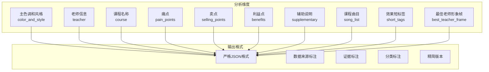

**图表来源**
- [prompts/analyze_prompt.md:15-153](file://prompts/analyze_prompt.md#L15-L153)

### 生成Prompt模板增强

生成模板包含了新的视觉预处理约束、保底内容系统和多类别配置：

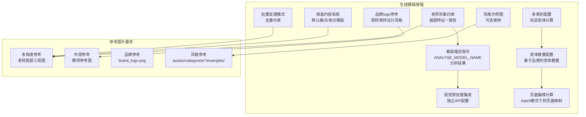

**图表来源**
- [prompts/generate_prompt.md:53-56](file://prompts/generate_prompt.md#L53-L56)
- [prompts/generate_prompt.md:131-136](file://prompts/generate_prompt.md#L131-L136)
- [generate.py:886-895](file://generate.py#L886-L895)

### 品类特定Prompt模板

**新增** 不同品类使用不同的Prompt模板：

#### 营养健康品类Prompt模板
- **主题**: 健康营养、科学食疗、健康管理
- **关键词**: 营养、健康、食疗、养生、科学
- **视觉元素**: 蔬果、绿叶、健康心形、阳光
- **目标用户**: 50-70岁中老年人群

#### 唱歌品类Prompt模板
- **主题**: 音乐表达、歌曲演唱、呼吸技巧
- **关键词**: 唱歌、音乐、发声、表演、艺术
- **视觉元素**: 音符、麦克风、舞台光效、金色
- **目标用户**: 中老年音乐爱好者

**章节来源**
- [prompts/analyze_prompt.md:1-153](file://prompts/analyze_prompt.md#L1-L153)
- [prompts/generate_prompt.md:53-56](file://prompts/generate_prompt.md#L53-L56)
- [prompts/generate_prompt.md:131-136](file://prompts/generate_prompt.md#L131-L136)
- [generate.py:886-895](file://generate.py#L886-L895)

## 批量处理策略

### 批量执行流程

系统支持对多个视频文件进行批量处理，**更新** 新增视频时长检查和重试机制，**新增** 支持--batch参数的批量处理模式，**新增** 集成多类别配置系统：

```mermaid
flowchart TD
Start([开始批量处理]) --> CheckFiles{检查视频文件}
CheckFiles --> |单个文件| ProcessSingle[处理单个文件]
CheckFiles --> |多个文件| ProcessBatch[批量处理模式]
ProcessSingle --> VideoCheck[视频时长检查]
ProcessBatch --> VideoCheck
VideoCheck --> ExtractFrames[提取30帧关键帧]
ExtractFrames --> ExtractAudio[提取音频]
ExtractAudio --> Transcribe[音频转写]
Transcribe --> Analyze[多模态分析]
Analyze --> LoadCategoryConfig[加载品类配置]
LoadCategoryConfig --> Generate[生成设计(--batch参数)]
Generate --> VisualPreprocess[视觉预处理]
VisualPreprocess --> GenerateRef[生成参考图片]
GenerateRef --> GenerateImage[生成图片]
GenerateImage --> SaveOutput[保存输出]
SaveOutput --> SyncRefer[同步设计参考]
SyncRefer --> NextFile{下一个文件?}
NextFile --> |是| ProcessSingle
NextFile --> |否| Complete[完成所有处理]
Complete --> End([结束])
```

### 批量处理模式详解

系统支持两种批量处理模式，通过--batch参数控制，**更新** 集成多类别配置系统：

#### batch=1 模式（默认）
- **功能**：首次生成page1-page5的设计方案
- **特点**：不进行去重检查，直接生成5套不同的设计方案
- **输出**：生成design_refer/page1到page5目录
- **适用场景**：首次生成落地页设计方案，探索多种创意方向

#### batch=2 模式
- **功能**：基于已有page1-5方案进行去重生成page6-page10
- **特点**：读取现有5套方案，确保新方案在风格、配色、布局三个维度完全不同
- **输出**：生成design_refer/page6到page10目录
- **适用场景**：需要大量设计方案进行A/B测试或对比分析

### 动态变体计算

**新增** 基于品类的动态变体计算功能：

```mermaid
flowchart TD
Start([开始变体计算]) --> LoadCategoryConfig[加载品类配置]
LoadCategoryConfig --> CheckVariantCount{检查variant_count配置}
CheckVariantCount --> |存在| UseConfigCount[使用配置的变体数量]
CheckVariantCount --> |不存在| UseDefaultCount[使用默认变体数量(5)]
UseConfigCount --> CalculateOffset[计算页面偏移]
UseDefaultCount --> CalculateOffset
CalculateOffset --> ApplyBatchMode{应用批量模式}
ApplyBatchMode --> |batch=1| SetPageRange1[设置page1-page5]
ApplyBatchMode --> |batch=2| SetPageRange2[设置page6-page10]
SetPageRange1 --> End([完成])
SetPageRange2 --> End
```

### 批量处理最佳实践

1. **文件组织**: 将待处理的视频文件放在同一目录下
2. **资源管理**: 确保有足够的磁盘空间存储中间文件
3. **并发控制**: 根据系统资源合理控制同时处理的文件数量
4. **错误恢复**: 对于失败的任务，检查日志并重新运行
5. **版本控制**: 使用.gitignore避免不必要的文件提交
6. **批量模式选择**：
   - 首次生成：使用默认batch=1模式
   - A/B测试：先用batch=1生成基础方案，再用batch=2生成去重方案
7. **去重策略**：batch=2模式会自动检查已有方案的风格名称、配色方案、布局结构
8. **文件命名**：batch>1时输出文件会自动添加_batchX后缀避免覆盖
9. **品类配置**：根据目标品类调整variant_count配置以优化变体数量
10. **动态计算**：系统会根据品类配置自动计算页面偏移和变体范围

**章节来源**
- [run.sh:28-48](file://run.sh#L28-L48)
- [run.sh:175-189](file://run.sh#L175-L189)
- [generate.py:815-825](file://generate.py#L815-L825)
- [generate.py:850-863](file://generate.py#L850-L863)
- [generate.py:886-895](file://generate.py#L886-L895)

## 性能优化建议

### 系统资源优化

| 优化方面 | 建议配置 | 预期效果 |
|----------|----------|----------|
| Whisper模型 | small/medium/large | small: 460MB, medium: 1.5GB, large: 5GB |
| API温度参数 | 分析: 0.3, 生成: 0.6, 图像: 0.7 | 平衡创造性与稳定性 |
| 关键帧质量 | q:v 2 | 保持高质量同时控制文件大小 |
| 重试机制 | MAX_RETRIES = 3 | 提高成功率，避免无限重试 |
| 帧数采样 | MAX_API_FRAMES = 5 | 控制token使用，提高API效率 |
| 图像生成超时 | REQUEST_TIMEOUT = 600 | 充分处理复杂的图像生成任务 |
| 参考图片缓存 | assets目录预加载 | 减少重复IO操作 |
| 视觉预处理温度 | temperature=0.2 | 确保着装描述准确稳定 |
| 批量处理优化 | batch=1生成基础方案，batch=2进行去重 | 提高方案质量和效率 |
| 品类配置缓存 | category_config.py缓存配置 | 减少重复加载开销 |
| 动态变体计算 | 预计算页面偏移 | 提高批量处理效率 |

### 内存和存储优化

1. **临时文件清理**: 定期清理output目录中的临时文件
2. **模型缓存**: Whisper模型加载后会在内存中缓存
3. **并发限制**: 控制同时运行的进程数量
4. **版本控制**: 使用.gitignore避免提交大型模型文件
5. **参考图片管理**: 合理组织assets目录，避免冗余文件
6. **批量处理缓存**: batch=2模式会缓存已有方案信息，避免重复读取
7. **品类配置缓存**: category_config.py会缓存已加载的配置，避免重复读取

### 网络性能优化

1. **连接复用**: 使用支持HTTP/2的API服务
2. **超时设置**: 合理设置API请求超时时间
3. **断线重连**: 实现智能的网络异常处理
4. **重试策略**: 指数退避重试机制

## 扩展开发指南

### 新增API服务支持

要支持新的API服务，需要修改以下组件：

1. **API客户端封装**: 在analyze.py、generate.py和generate_image.py中添加新API的调用逻辑
2. **配置项扩展**: 在config.env中添加相应的配置项
3. **错误处理**: 实现针对新API的错误处理和重试机制
4. **Prompt定制**: 更新Prompts模板以适配新API的能力

### 自定义分析维度

扩展分析模板以支持新的分析维度：

1. **更新分析模板**: 在prompts/analyze_prompt.md中添加新的分析维度
2. **数据结构扩展**: 修改analyze.py中的数据提取和验证逻辑
3. **输出格式调整**: 更新JSON输出格式以包含新字段
4. **测试验证**: 确保新维度的输出格式符合预期

### 新增输出格式

系统当前支持Markdown和HTML两种输出格式。要添加新的输出格式：

1. **模板引擎**: 实现新的模板渲染器
2. **样式支持**: 添加相应的CSS样式或内联样式
3. **文件生成**: 在generate.py中添加新的文件生成逻辑
4. **变体支持**: 确保变体提取功能支持新格式

### 多类别配置系统扩展

**新增** 要扩展多类别配置系统以支持新的品类：

1. **新增品类配置**: 在assets/categories/目录下创建新品类的config.json文件
2. **配置项扩展**: 在category_config.py中添加新品类的默认配置
3. **Prompt模板**: 在prompts/categories/目录下添加新品类的Prompt模板
4. **参考图片**: 在assets/categories/目录下添加新品类的参考图片和示例
5. **保底内容**: 添加新品类的保底内容模板文件

### 视觉预处理系统扩展

要扩展视觉预处理系统以支持新的视觉分析需求：

1. **新增预处理类型**: 在generate.py中添加新的视觉分析函数
2. **配置项扩展**: 在config.env中添加相应的视觉预处理配置
3. **API集成**: 更新describe_teacher_outfit函数以支持新的分析维度
4. **Prompt集成**: 更新生成模板以包含新的视觉约束

### 参考图片系统扩展

要扩展参考图片系统以支持新的视觉元素：

1. **新增参考类型**: 在assets/categories/目录下添加新的参考图片
2. **生成组件集成**: 更新generate.py以支持新的参考图片类型
3. **图像生成集成**: 更新generate_image.py以处理新的参考图片组合
4. **模板更新**: 更新prompts/generate_prompt.md以包含新的参考要求

### 批量处理系统扩展

要扩展批量处理系统以支持更多处理模式：

1. **新增batch模式**: 在generate.py中添加新的批量处理逻辑
2. **配置项扩展**: 在config.env中添加相应的批量处理配置
3. **去重算法**: 实现更复杂的去重策略和算法
4. **输出管理**: 更新文件命名和输出目录结构

### 版本控制最佳实践

1. **配置文件管理**: 使用config.env.example提供配置模板
2. **敏感信息保护**: 在.gitignore中排除config.env
3. **依赖管理**: 使用requirements.txt管理Python依赖
4. **临时文件清理**: 排除output/目录和__pycache__目录
5. **参考图片管理**: 在.gitignore中排除大型图片文件
6. **批量处理文件**: 在.gitignore中排除批量处理生成的中间文件
7. **品类配置文件**: 在.gitignore中排除assets/categories/*/config.json文件

**章节来源**
- [analyze.py:211-273](file://analyze.py#L211-L273)
- [generate.py:518-615](file://generate.py#L518-L615)
- [generate_image.py:203-259](file://generate_image.py#L203-L259)
- [category_config.py:1-120](file://category_config.py#L1-L120)
- [.gitignore:1-7](file://.gitignore#L1-L7)

## 使用场景配置示例

### 不同分辨率视频配置

| 分辨率 | 关键帧数量 | 建议配置 | 性能考虑 |
|--------|------------|----------|----------|
| 720p | 30帧 | MAX_API_FRAMES=5 | 最佳平衡点 |
| 1080p | 30帧 | MAX_API_FRAMES=5 | 可能需要更强的GPU |
| 4K | 30帧 | MAX_API_FRAMES=3-5 | 需要更多内存和存储 |

### 多语言内容处理

```mermaid
graph TB
subgraph "语言配置"
LangDetect[语言检测]
LangConfig[语言特定配置]
LangPrompt[语言特定Prompt]
end
subgraph "处理流程"
Transcribe[音频转写]
Analyze[多模态分析]
Generate[设计生成]
VisualPreprocess[视觉预处理]
GenerateImage[图像生成]
end
LangDetect --> LangConfig
LangConfig --> LangPrompt
LangPrompt --> Transcribe
Transcribe --> Analyze
Analyze --> Generate
Generate --> VisualPreprocess
VisualPreprocess --> GenerateImage
```

### 特殊行业需求

#### 教育行业
- **分析重点**: 教师形象、课程内容、学习成果
- **设计要素**: 专业感、可信度、学习氛围
- **Prompt定制**: 强调教育专业性和学习效果
- **图像生成**: 使用教育相关的视觉元素和色彩搭配
- **参考图片**: 使用专业的教师参考图和教学场景图片
- **视觉预处理**: 确保教师着装符合教育机构的专业要求
- **批量处理**: 使用batch=1生成多样化方案，使用batch=2进行去重优化

#### 健康医疗行业
- **分析重点**: 医疗专业性、安全保证、治疗效果
- **设计要素**: 信任感、专业性、安全性
- **Prompt定制**: 强调医疗专业性和安全保障
- **图像生成**: 采用医疗相关的蓝色系和专业元素
- **参考图片**: 使用医疗相关的图标和色彩方案
- **视觉预处理**: 确保医护人员形象符合医疗行业的专业标准
- **批量处理**: 先用batch=1探索方案，再用batch=2确保差异化

#### 金融理财行业
- **分析重点**: 收益预期、风险控制、专业顾问
- **设计要素**: 稳健性、专业性、安全性
- **Prompt定制**: 强调收益稳定性和专业服务
- **图像生成**: 使用金色、深蓝色等代表财富和稳定的色彩
- **参考图片**: 使用金融相关的图标和图表元素
- **视觉预处理**: 确保金融从业者形象体现专业和可靠
- **批量处理**: 使用batch=1生成基础方案，使用batch=2进行A/B测试

### 品类特定配置示例

#### 营养健康品类配置
- **目标用户**: 50-70岁中老年人群
- **变体数量**: 5套基础方案 + 5套去重方案 = 10套总方案
- **装饰元素**: 蔬果图标🥦🍎、健康心形❤️、绿叶元素、阳光光晕
- **内容列表名称**: 课程内容
- **内容描述**: 具体食物/营养知识点等
- **适用创意**: A, C, D, E, F, G, I, J

#### 唱歌品类配置
- **目标用户**: 中老年音乐爱好者
- **变体数量**: 5套基础方案 + 5套去重方案 = 10套总方案
- **装饰元素**: 音符♪、麦克风图标、舞台光效、金色光晕
- **内容列表名称**: 课程曲目
- **内容描述**: 具体歌曲名称（如《送别》《鸿雁》等）
- **适用创意**: A, B, C, D, E, F, G, H, I, J, K

### 批量处理使用场景

#### 创意探索阶段
- **使用batch=1**：生成5套完全不同的设计方案
- **目的**：探索各种创意方向和视觉风格
- **输出**：design_refer/page1-page5
- **特点**：无去重约束，鼓励创新

#### 方案对比阶段
- **使用batch=2**：基于已有方案生成去重的新方案
- **目的**：确保新方案在风格、配色、布局上完全不同
- **输出**：design_refer/page6-page10
- **特点**：严格去重约束，保证差异化

#### A/B测试阶段
- **使用策略**：batch=1生成基础方案，batch=2生成对比方案
- **目的**：进行市场测试和用户反馈收集
- **输出**：两套完全不同的方案集合
- **特点**：便于统计分析和效果对比

#### 多品类批量处理
- **使用策略**：为不同品类分别设置变体数量
- **目的**：根据不同品类的特点优化方案数量
- **输出**：各品类独立的变体集合
- **特点**：支持精细化的批量处理策略

## 故障排除指南

### 常见问题及解决方案

| 问题类型 | 症状 | 可能原因 | 解决方案 |
|----------|------|----------|----------|
| API调用失败 | 网络错误或认证失败 | 网络连接问题或配置错误 | 检查网络连接和API配置 |
| Whisper模型加载失败 | 内存不足或模型损坏 | 内存不足或模型文件损坏 | 释放内存或重新下载模型 |
| 关键帧提取失败 | FFmpeg错误或视频损坏 | FFmpeg未安装或视频格式不支持 | 安装FFmpeg或转换视频格式 |
| JSON解析失败 | 分析结果格式错误 | API返回格式不符合预期 | 检查API版本兼容性 |
| 帧数过多 | API调用失败或超时 | 超过API限制的帧数 | 调整MAX_API_FRAMES配置 |
| 图像生成失败 | API响应错误或超时 | 网络问题或API限制 | 检查网络连接和API配额 |
| 图片保存失败 | 文件权限或磁盘空间不足 | 权限不足或磁盘空间不够 | 检查文件权限和磁盘空间 |
| 参考图片缺失 | 生成的图片不完整 | 参考图片文件不存在 | 检查assets目录中的参考图片 |
| 保底内容失效 | 分析结果缺少默认内容 | fallback_points.md文件缺失 | 创建或修复保底内容模板 |
| 视觉预处理失败 | 着装描述为空或错误 | ANALYSE_API配置错误 | 检查ANALYSE_*配置项 |
| 视觉预处理超时 | API响应超时 | 网络延迟或API性能问题 | 增加超时时间或更换API |
| 批量处理失败 | batch参数无效或输出混乱 | batch参数设置错误 | 检查--batch参数值和输出目录 |
| 去重失败 | batch=2模式无法生成新方案 | 无已有方案或去重过于严格 | 检查design_refer目录和去重算法 |
| 品类配置失败 | CATEGORY_NAME配置错误 | 环境变量设置错误 | 检查CATEGORY_NAME配置 |
| 外部配置文件加载失败 | 外部config.json格式错误 | JSON格式不正确 | 检查config.json格式 |
| 动态变体计算错误 | 变体数量计算不正确 | 配置文件缺失或格式错误 | 检查品类配置文件 |
| 页面偏移计算错误 | 批量处理页面映射错误 | batch参数或变体数量配置错误 | 检查batch和variant_count配置 |

### 调试技巧

1. **查看原始响应**: 分析组件会保存原始API响应到analysis_raw.txt
2. **分步调试**: 逐个执行脚本组件以定位问题
3. **日志分析**: 仔细查看详细的错误日志信息
4. **配置验证**: 确保所有必需的环境变量都已正确设置
5. **版本控制**: 使用.gitignore避免提交配置文件
6. **参考图片检查**: 验证assets目录中的参考图片完整性
7. **视觉预处理测试**: 单独测试describe_teacher_outfit函数
8. **批量模式测试**: 分别测试batch=1和batch=2模式
9. **去重算法验证**: 检查去重摘要生成和比较逻辑
10. **品类配置测试**: 验证category_config.py的配置加载功能
11. **动态变体测试**: 测试不同品类的变体数量计算
12. **页面偏移测试**: 验证批量处理的页面映射逻辑

### 性能监控

```mermaid
graph LR
subgraph "监控指标"
Memory[内存使用]
CPU[CPU占用]
Network[网络延迟]
Disk[磁盘I/O]
Frames[帧数控制]
Retries[重试次数]
ImageTimeout[图像生成超时]
RefImages[参考图片数量]
FallbackContent[保底内容状态]
VisualPreprocess[视觉预处理状态]
AnalyseAPI[分析API状态]
GenerateAPI[生成API状态]
ImageAPI[图像API状态]
BatchMode[批量处理模式]
BatchOffset[页面偏移计算]
ExistingSummary[去重摘要长度]
CategoryConfig[品类配置状态]
VariantCount[变体数量计算]
PageOffset[页面偏移验证]
end
subgraph "性能分析"
Latency[响应延迟]
Throughput[处理吞吐量]
ErrorRate[错误率]
Efficiency[效率评估]
ImageLatency[图像生成延迟]
RefProcessing[参考图片处理]
VisualAnalysis[视觉分析处理]
BatchProcessing[批量处理分析]
CategoryAnalysis[品类配置分析]
VariantCalculation[变体计算分析]
end
Memory --> Latency
CPU --> Latency
Network --> Latency
Disk --> Throughput
Frames --> Efficiency
Retries --> ErrorRate
ImageTimeout --> ImageLatency
RefImages --> RefProcessing
FallbackContent --> RefProcessing
VisualPreprocess --> VisualAnalysis
AnalyseAPI --> VisualAnalysis
GenerateAPI --> Latency
ImageAPI --> ImageLatency
BatchMode --> BatchProcessing
BatchOffset --> BatchProcessing
ExistingSummary --> BatchProcessing
CategoryConfig --> CategoryAnalysis
VariantCount --> VariantCalculation
PageOffset --> VariantCalculation
Latency --> ErrorRate
```

**章节来源**
- [analyze.py:254-263](file://analyze.py#L254-L263)
- [run.sh:93-98](file://run.sh#L93-L98)
- [generate.py:815-825](file://generate.py#L815-L825)
- [category_config.py:1-120](file://category_config.py#L1-L120)

## 结论

本配置和定制指南提供了使用该多模态视频分析系统的完整指导。通过合理配置环境变量、定制Prompt模板、优化性能参数，以及遵循最佳实践，用户可以高效地生成高质量的落地页Hero设计方案。

**更新** 新增的多类别配置系统、视觉预处理系统、参考图片系统、保底内容系统、增强的教师图像约束配置和**新增的批量处理功能**大大提升了系统的专业性和可靠性。系统的主要优势包括：

- **完善的配置管理**: 通过config.env和config.env.example提供标准配置模板
- **强大的多类别配置系统**: 支持singing和nutrition两类配置，可扩展至更多品类
- **智能的动态变体计算**: 基于品类的变体数量配置和页面偏移计算
- **强大的视觉预处理系统**: 支持独立的视觉分析API，提供准确的教师着装描述
- **完善的参考图片系统**: 支持多维度的视觉参考，包括老师脸部三视图、品牌logo和品类特定示例
- **智能的保底内容系统**: 提供默认的痛点、卖点和利益点模板，支持品类特定内容
- **严格的教师图像约束**: 明确的面部特征一致性和着装要求，确保视觉一致性
- **强大的扩展性**: 支持自定义分析维度和输出格式，支持新品类快速接入
- **智能的性能优化**: 帧数采样、重试机制、内存管理、品类配置缓存
- **高效的批处理**: 支持多视频文件的批量处理和版本控制，**新增** batch=1和batch=2两种模式
- **完善的错误处理**: 提供详细的错误信息和恢复机制
- **现代化的开发体验**: 版本控制集成、依赖管理、配置模板、品类配置文件
- **独立的图像生成功能**: 支持高质量落地页图片的自动生成
- **智能化的批量处理**: **新增** 基于去重算法的批量生成模式，支持创意探索和方案对比
- **动态配置加载**: **新增** 支持从环境变量和外部文件动态加载配置
- **品类特定优化**: **新增** 不同品类支持不同的变体数量和设计策略

**新增** 多类别配置系统为用户提供了更灵活的工作流程：

- **品类配置管理**: 通过CATEGORY_NAME环境变量选择目标品类
- **动态变体计算**: 不同品类可以配置不同的变体数量
- **品类特定Prompt**: 每个品类使用专门的Prompt模板和视觉元素
- **专用参考资源**: 每个品类拥有独立的参考图片和示例资源
- **保底内容定制**: 每个品类支持独立的保底内容模板
- **页面偏移计算**: 自动计算不同品类的页面映射关系

建议用户根据具体业务需求调整配置参数，并定期更新Prompt模板以适应不断变化的市场需求。使用.gitignore确保项目结构的整洁，利用config.env.example快速启动新项目。多类别配置系统和保底内容系统为落地页制作提供了更加完整的解决方案，用户可以根据需要调整图像生成的参数和样式要求。教师图像约束配置确保了生成图片的专业性和视觉一致性，特别适用于需要严格视觉规范的商业应用场景。批量处理功能为大规模内容生产提供了高效的技术支撑，用户可以通过合理的batch模式组合实现创意探索和方案优化的双重目标。动态变体计算功能使得不同品类可以按照自身特点优化方案数量，提高内容生产的效率和质量。