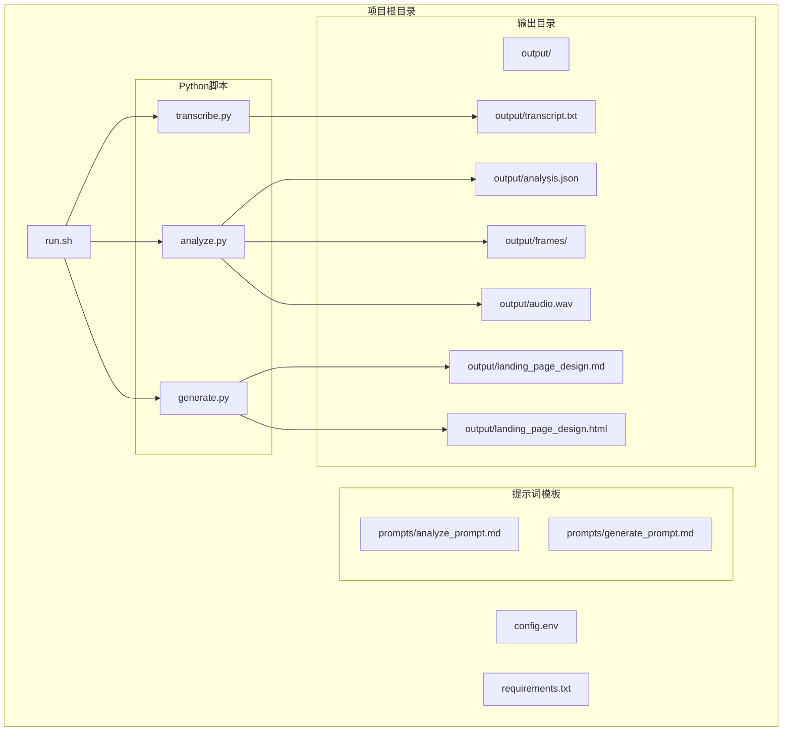
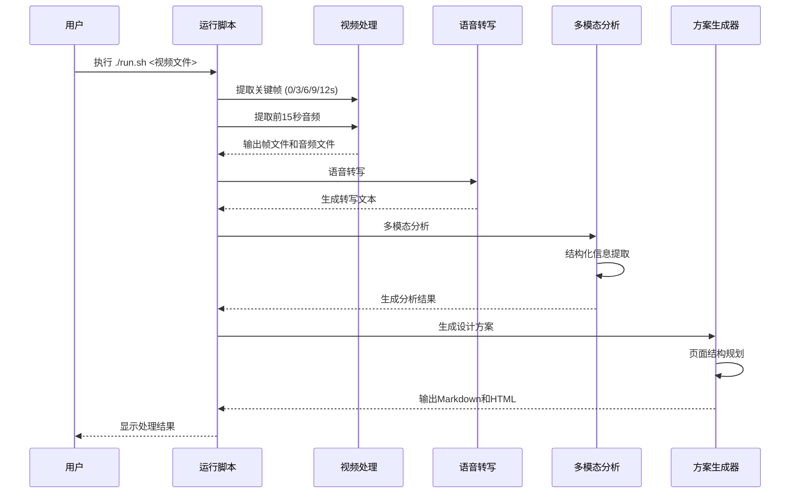
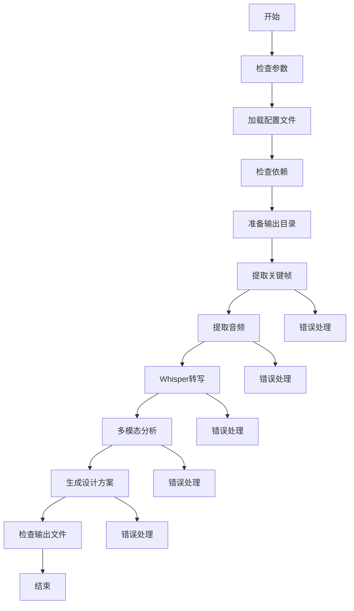
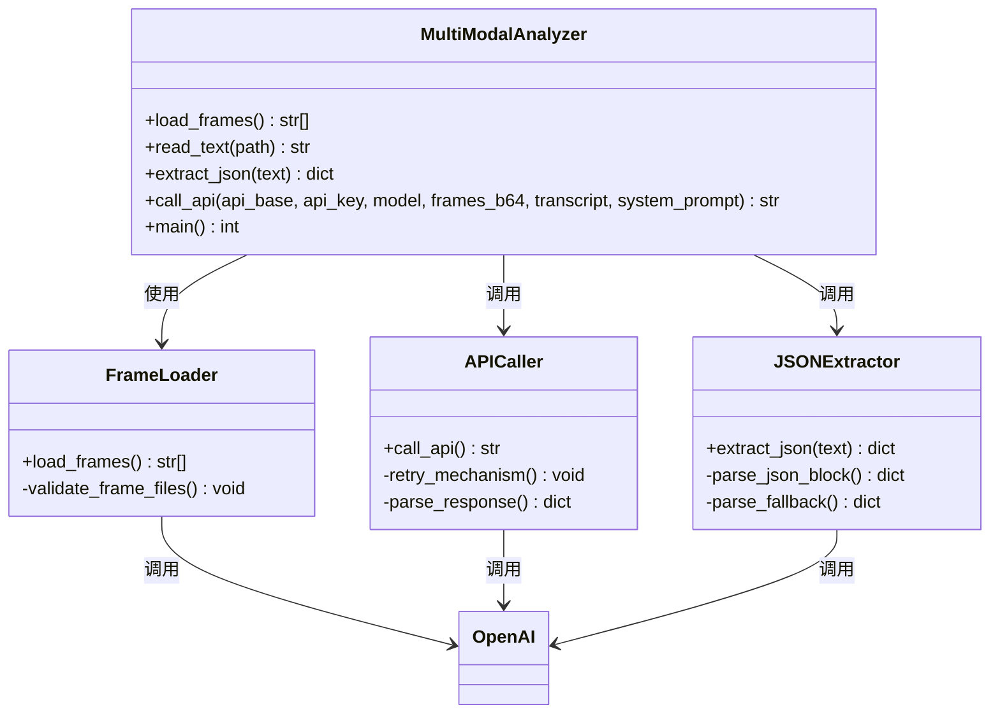
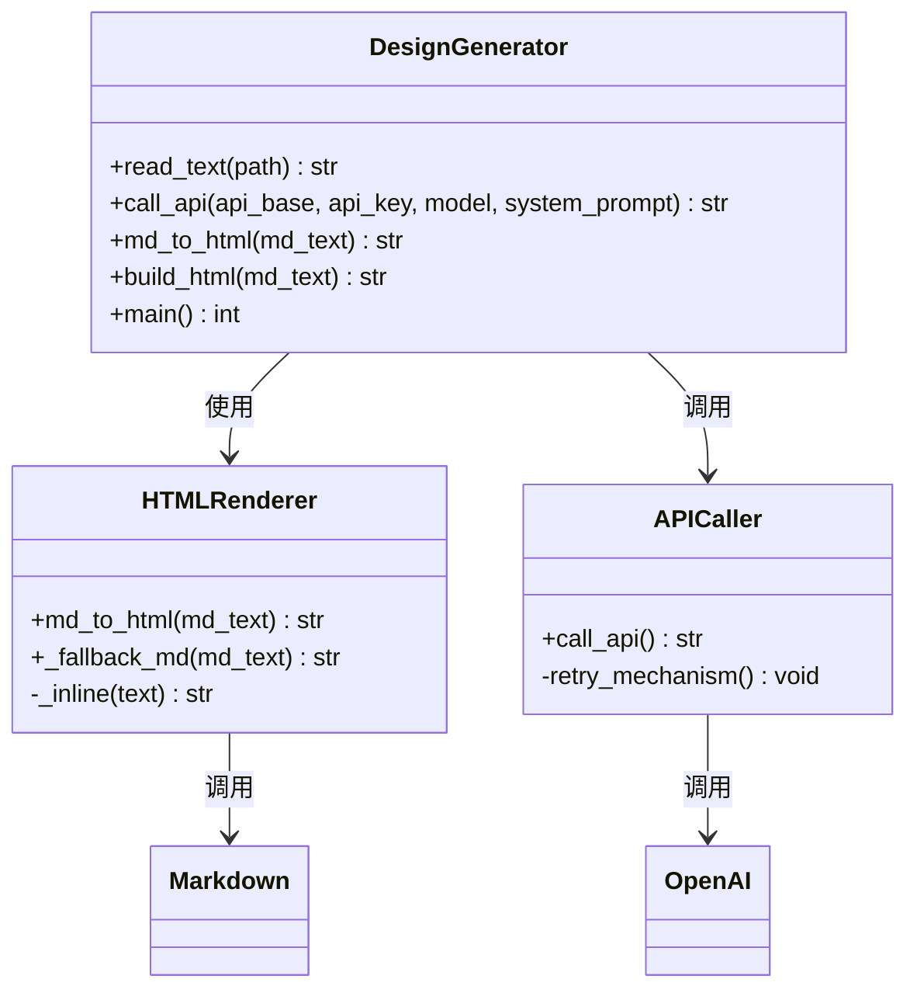
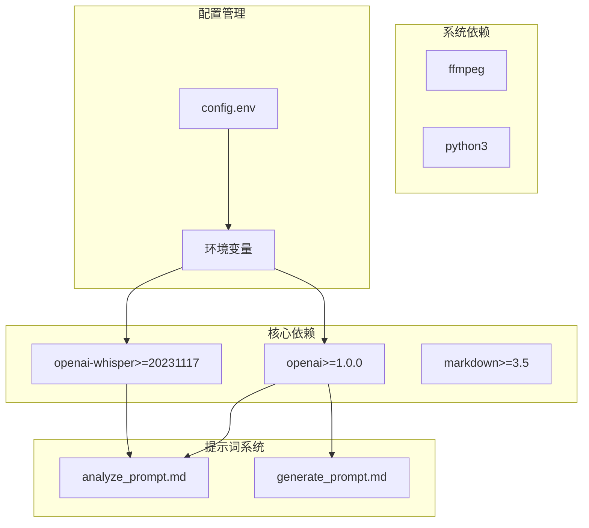

# 项目概述

<cite>
**本文档引用的文件**
- [run.sh](file://run.sh)
- [analyze.py](file://analyze.py)
- [generate.py](file://generate.py)
- [transcribe.py](file://transcribe.py)
- [prompts/analyze_prompt.md](file://prompts/analyze_prompt.md)
- [prompts/generate_prompt.md](file://prompts/generate_prompt.md)
- [requirements.txt](file://requirements.txt)
- [config.env](file://config.env)
</cite>

## 目录
1. [简介](#简介)
2. [项目结构](#项目结构)
3. [核心组件](#核心组件)
4. [架构概览](#架构概览)
5. [详细组件分析](#详细组件分析)
6. [依赖分析](#依赖分析)
7. [性能考虑](#性能考虑)
8. [故障排除指南](#故障排除指南)
9. [结论](#结论)

## 简介

这是一个基于视频分析驱动的落地页Hero区域设计方案生成工具。该项目旨在自动化处理视频广告素材，将其转换为高质量的落地页Hero区域设计方案，包括视觉设计、文案内容和页面结构规划。

该工具通过多模态分析技术，结合计算机视觉和自然语言处理能力，从视频广告中提取关键信息，包括主色调、教师形象、课程信息、用户痛点、产品卖点和利益承诺等要素，然后生成完整的落地页Hero区域设计方案。

## 项目结构

项目采用模块化设计，包含以下核心组件：

**图表来源**
- [run.sh:1-138](file://run.sh#L1-L138)
- [analyze.py:1-177](file://analyze.py#L1-L177)
- [generate.py:1-377](file://generate.py#L1-L377)
- [transcribe.py:1-67](file://transcribe.py#L1-L67)

**章节来源**
- [run.sh:1-138](file://run.sh#L1-L138)
- [config.env:1-13](file://config.env#L1-L13)

## 核心组件

### 1. 视频处理管道 (Video Processing Pipeline)

项目的核心是完整的视频处理管道，从视频文件开始，经过多个处理阶段生成最终的设计方案：

- **关键帧提取**: 从视频中提取0秒、3秒、6秒、9秒、12秒共5张关键帧
- **音频提取**: 提取视频前15秒的音频用于转写分析
- **语音转写**: 使用Whisper模型进行本地语音识别
- **多模态分析**: 结合视觉和音频信息进行结构化分析
- **设计方案生成**: 基于分析结果生成完整的Hero区域设计方案

### 2. 多模态分析引擎

该组件负责从视频素材中提取结构化信息，包括：
- 视觉风格和色彩分析
- 教师形象特征提取
- 课程信息识别
- 用户痛点识别
- 产品卖点分析
- 利益承诺提取

### 3. 设计方案生成器

基于多模态分析结果，生成完整的落地页Hero区域设计方案，包括：
- 设计思路和视觉方向
- 页面结构规划
- 具体文案内容
- 主视觉生成Prompt

**章节来源**
- [run.sh:72-128](file://run.sh#L72-L128)
- [analyze.py:33-177](file://analyze.py#L33-L177)
- [generate.py:325-377](file://generate.py#L325-L377)

## 架构概览

项目采用分层架构设计，每个组件都有明确的职责分工：

**图表来源**
- [run.sh:72-128](file://run.sh#L72-L128)
- [transcribe.py:21-67](file://transcribe.py#L21-L67)
- [analyze.py:128-177](file://analyze.py#L128-L177)
- [generate.py:325-377](file://generate.py#L325-L377)

## 详细组件分析

### 运行脚本 (run.sh)

运行脚本是整个系统的入口点，负责协调各个组件的工作流程：

**图表来源**
- [run.sh:30-138](file://run.sh#L30-L138)

**章节来源**
- [run.sh:1-138](file://run.sh#L1-L138)

### 多模态分析组件 (analyze.py)

该组件负责从视频素材中提取结构化信息：

**图表来源**
- [analyze.py:33-177](file://analyze.py#L33-L177)

**章节来源**
- [analyze.py:1-177](file://analyze.py#L1-L177)

### 方案生成组件 (generate.py)

该组件基于分析结果生成完整的Hero区域设计方案：

**图表来源**
- [generate.py:33-377](file://generate.py#L33-L377)

**章节来源**
- [generate.py:1-377](file://generate.py#L1-L377)

### 语音转写组件 (transcribe.py)

使用Whisper模型进行本地语音识别：

**章节来源**
- [transcribe.py:1-67](file://transcribe.py#L1-L67)

## 依赖分析

项目的技术栈选择体现了对性能、可靠性和易用性的平衡考虑：

**图表来源**
- [requirements.txt:1-4](file://requirements.txt#L1-L4)
- [config.env:1-13](file://config.env#L1-L13)

### 技术栈选择原因

1. **OpenAI SDK**: 提供标准化的API接口，支持多种模型和兼容性
2. **Whisper**: 优秀的开源语音识别模型，支持多语言本地部署
3. **Markdown**: 标准化的文档格式，便于生成HTML和维护
4. **FFmpeg**: 业界标准的多媒体处理工具，功能强大且稳定
5. **Bash脚本**: 简洁高效的系统集成方案

**章节来源**
- [requirements.txt:1-4](file://requirements.txt#L1-L4)
- [run.sh:54-62](file://run.sh#L54-L62)

## 性能考虑

### 并发处理策略

项目采用流水线式的处理模式，避免不必要的并发，确保资源使用效率：

- **顺序处理**: 关键帧提取、音频提取、转写、分析、生成按顺序执行
- **重试机制**: 每个API调用都具备指数退避重试机制
- **内存管理**: 逐帧处理，避免大文件内存占用

### 缓存和中间结果

- **中间文件**: 所有处理步骤的结果都保存为文件，便于调试和重用
- **错误恢复**: 每个步骤都有详细的错误检查和恢复机制

## 故障排除指南

### 常见问题及解决方案

1. **依赖缺失**
   - 确保安装了ffmpeg和python3
   - 执行 `pip install -r requirements.txt`

2. **API配置错误**
   - 检查config.env中的API配置
   - 验证API密钥的有效性

3. **文件权限问题**
   - 确保输出目录具有写入权限
   - 检查视频文件的读取权限

4. **内存不足**
   - 减少Whisper模型大小
   - 降低视频分辨率

**章节来源**
- [run.sh:54-62](file://run.sh#L54-L62)
- [config.env:1-13](file://config.env#L1-L13)

## 结论

这个视频分析驱动的落地页Hero区域设计方案生成工具展现了现代AI应用的最佳实践。通过精心设计的多模态分析流程，项目成功地将复杂的视频内容转换为结构化的设计指导，为营销团队提供了高效的设计工具。

项目的主要优势包括：
- **自动化程度高**: 从视频到设计方案的完整自动化流程
- **结构化输出**: 清晰的JSON格式分析结果和Markdown设计方案
- **可扩展性强**: 模块化设计便于功能扩展和定制
- **易于使用**: 简单的命令行接口和详细的错误提示

对于初学者，该项目提供了一个很好的AI应用开发范例；对于有经验的开发者，其架构设计和实现细节都具有很高的参考价值。